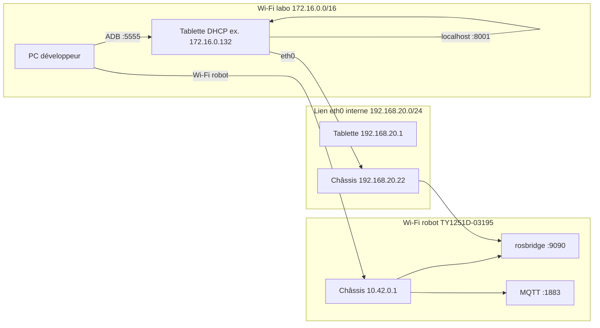
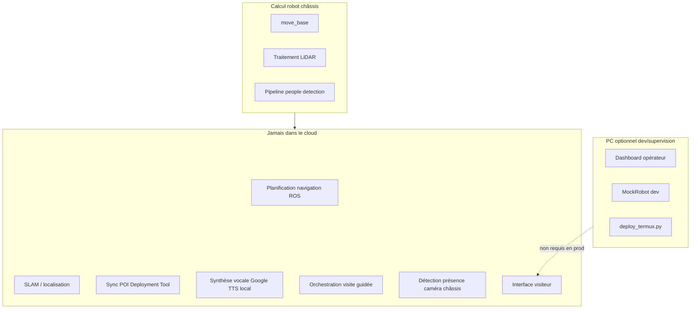
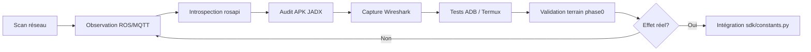

# Architecture logicielle CYBEL

> **Projet** : plateforme de commande et d'interaction pour robot de service CIOT **TY1251D-03195**  
> **Version document** : juin 2026 · branche `feature/face-presence`  
> **Public** : rapport de stage, contribution scientifique, maintenance technique

---

## Sommaire

1. [Vue d'ensemble](#1-vue-densemble)
2. [Architecture générale](#2-architecture-générale)
3. [Composants et responsabilités](#3-composants-et-responsabilités)
4. [Technologies et dépendances](#4-technologies-et-dépendances)
5. [Communications réseau](#5-communications-réseau)
6. [Edge computing — répartition des traitements](#6-edge-computing--répartition-des-traitements)
7. [Scénarios de communication](#7-scénarios-de-communication)
8. [Analyse du SDK](#8-analyse-du-sdk)
9. [Méthodologie de rétro-ingénierie](#9-méthodologie-de-rétro-ingénierie)
10. [Références](#10-références)

---

## 1. Vue d'ensemble

CYBEL remplace l'écosystème logiciel fermé du constructeur par une **stack ouverte** en trois couches :

| Couche | Rôle |
|--------|------|
| **Présentation** | Interfaces web (opérateur, kiosque visiteur) + APK Android natives |
| **Application** | API REST + WebSocket (FastAPI ou Starlette lite) |
| **Domaine / intégration** | SDK Python (`RealRobot` / `MockRobot`) + persistance JSON |

**Principe architectural** : aucune dépendance au cloud. Toute la chaîne critique (navigation, TTS, visite guidée, sync POI) s'exécute en **edge** sur le PC de développement, la tablette Termux, ou le réseau local robot.

**Deux déploiements backend** :

| Instance | Hôte | Port | Stack | Usage |
|----------|------|------|-------|-------|
| **Backend PC** | PC / serveur local | **8000** | FastAPI + pydantic | Développement, supervision opérateur |
| **Backend embarqué** | Tablette Termux | **8000** ou **8001** | Starlette (`cybel_lite.py`) | Kiosque autonome sans PC |

---

## 2. Architecture générale

### 2.1 Diagramme logique (couches)

```mermaid
flowchart TB
    subgraph presentation [Couche présentation]
        FE_OP[frontend/ opérateur :5173]
        FE_KIOSK[frontend-kiosk/ visiteur /kiosk]
        APK_K[CybelVisitorKiosk WebView]
        APK_TTS[CybelTTSBridge]
    end

    subgraph application [Couche application]
        FAST[FastAPI backend/main.py :8000]
        LITE[Starlette cybel_lite.py :8000/8001]
        WS[/ws/telemetry]
    end

    subgraph domain [Couche domaine SDK]
        RS[RobotService]
        RR[RealRobot]
        MR[MockRobot]
        RB[RosbridgeClient]
        SPEECH[RobotSpeech]
        TOUR[TourEngine / lab_tour]
        POI[poi_sync / marker_utils]
        MQTT_SDK[MqttClient]
        PERSIST[persistence JSON]
    end

    subgraph edge_robot [Edge — châssis robot]
        ROSB[rosbridge WebSocket :9090]
        ROS[ROS Noetic nodes]
        MQTT_B[Mosquitto :1883]
    end

    subgraph edge_android [Edge — tête Android]
        TERMUX[Termux Python]
        WV[WebView Chrome 49]
        TTS_ENGINE[Google TTS]
    end

    FE_OP -->|HTTP REST + WS| FAST
    FE_KIOSK -->|HTTP REST + WS| FAST
    FE_KIOSK -->|HTTP REST + WS| LITE
    APK_K --> WV
    WV --> LITE
    FAST --> WS
    LITE --> WS
    FAST --> RS
    RS --> RR
    RS --> MR
    RR --> RB
    RR --> SPEECH
    RR --> MQTT_SDK
    RB --> ROSB
    ROSB --> ROS
    MQTT_SDK --> MQTT_B
    LITE --> ROSB
    LITE --> SPEECH
    SPEECH -->|am broadcast| APK_TTS
    SPEECH -->|ADB Wi-Fi| APK_TTS
    APK_TTS --> TTS_ENGINE
    TERMUX --> LITE
```

### 2.2 Diagramme physique (réseau)



### 2.3 Topologie matérielle du robot

Le robot CIOT TY1251D est un système **dual-processeur** :

| Sous-système | OS | Rôle |
|--------------|-----|------|
| **Châssis** | Linux + ROS | SLAM, planification, moteurs, capteurs, rosbridge, MQTT |
| **Tête (upper body)** | Android 7.1 (RK3399) | Écran tactile, caméras, haut-parleurs, apps constructeur + CYBEL |

CYBEL n'accède **jamais** au shell du châssis : uniquement **rosbridge** (JSON/WebSocket) et **MQTT** (observation).

---

## 3. Composants et responsabilités

### 3.1 Backend (`backend/`)

| Composant | Fichier | Responsabilité |
|-----------|---------|----------------|
| **Point d'entrée** | `main.py` | Lifespan : connexion robot, pont MQTT, santé ADB TTS (90 s), montage `/kiosk/` |
| **RobotService** | `services/robot_service.py` | Façade unique : choisit `MockRobot` ou `RealRobot`, délègue toutes les opérations |
| **TourService** | `services/tour_service.py` | Orchestration visite guidée (`TourEngine`) |
| **ReceptionService** | `services/reception_service.py` | Destinations kiosque, actions d'accueil |
| **MqttBridgeService** | `services/mqtt_bridge_service.py` | Écoute passive broker → événements WebSocket `mqtt` |
| **ChargeService** | `services/charge_service.py` | Retour pile automatique (batterie faible) |
| **PersistenceService** | `services/persistence_service.py` | Wrapper `data/*.json` (POI, tour, config, historique) |
| **PoiBootstrap** | `services/poi_bootstrap.py` | Sync POI ROS au démarrage visite (PC) |
| **VisitorService** | `services/visitor_service.py` | Matching embeddings visiteurs (reconnaissance faciale) |
| **WebSocket manager** | `websocket/manager.py` | Broadcast clients `{type, ...payload}` |
| **Routers** | `routers/*.py` | Endpoints REST par domaine (voir §5.3) |

### 3.2 SDK (`sdk/`)

| Module | Responsabilité |
|--------|----------------|
| `real_robot.py` | Implémentation robot physique via rosbridge |
| `mock_robot.py` | Simulation locale (dev sans matériel) |
| `rosbridge.py` | Client WebSocket asyncio (subscribe, publish, call_service) |
| `speech.py` | `RobotSpeech` — chaîne TTS multi-canal |
| `constants.py` | Topics/services ROS, MQTT, labels nav_status |
| `ros_ops.py` | Chaînes de fallback (POI, localisation, annulation) |
| `lab_tour.py` | Modèle parcours + `TourEngine` séquentiel |
| `tour_navigation.py` | Prérequis nav, ghost nav, arrivée par proximité |
| `poi_sync.py` / `marker_utils.py` | Sync POI Deployment Tool → `points.json` |
| `visitor_utils.py` | Similarité cosinus + seuil pour reconnaissance faciale (sans pydantic) |
| `persistence.py` | Lecture/écriture JSON typée (Pydantic `Point`) |
| `mqtt_client.py` | Client paho-mqtt passif |
| `models.py` | Modèles de domaine Pydantic |
| `people_utils.py` | Parsing `/detected_people_array` |

### 3.3 Frontend opérateur (`frontend/`)

| Fichier | Responsabilité |
|---------|----------------|
| `src/app.ts` | Routeur pages, état global |
| `src/api.ts` | Client REST vers `/api/*` |
| `src/telemetry.ts` | WebSocket `/ws/telemetry` (carte, LiDAR, people, MQTT) |
| `src/components/` | Carte SLAM, joystick, contrôles, statut |
| `src/pages/` | Dashboard, paramètres, édition tour |

### 3.4 Frontend kiosque (`frontend-kiosk/`)

| Fichier | Responsabilité |
|---------|----------------|
| `src/app.ts` | Machine à états visiteur (veille → accueil → tour → destinations) |
| `src/api.ts` | REST kiosque (tour, reception, speech, config) |
| `src/telemetry.ts` | WS status, speech, tour, people (présence) |
| Build IIFE | Compatibilité WebView Android 7.1 (Chrome 49) |

### 3.5 Backend embarqué (`scripts/termux/cybel_lite.py`)

Backend **sans FastAPI/pydantic** (Termux ne compile pas `pydantic-core` sur certaines configs).

| Fonction | Détail |
|----------|--------|
| Static `/kiosk/` | Sert `frontend-kiosk/dist` |
| API REST | Sous-ensemble du backend PC (tour, reception, navigation, speech, robot) |
| ROS direct | WebSocket vers rosbridge (pas via SDK pydantic — chargement modules à la demande) |
| TTS local | `am broadcast` → `CybelTTSBridge` (pas ADB distant) |
| WS broadcast | Boucle 1,5 s : status, speech, tour, people |
| Sync POI | `sync_poi_from_ros_map()` à l'ouverture kiosque / démarrage visite |

### 3.6 Applications Android (`android/`)

| APK | Package | Responsabilité |
|-----|---------|----------------|
| **CybelVisitorKiosk** | `com.cybel.visitorkiosk` | WebView plein écran → `:8000/kiosk/`, démarre Termux backend |
| **CybelVisitorKioskTest** | `com.cybel.visitorkiosk.test` | Variante POI laboV2 → `:8001`, label « CYBEL Accueil » |
| **CybelTTSBridge** | `com.cybel.ttsbridge` | Receiver `SPEAK` → moteur Google TTS natif |
| **CybelFaceBridge** | `com.cybel.facebridge` | Headless (aucune Activity) : Camera2 → détection → embedding TFLite (FaceNet) → `POST /api/visitors/identify`. Validé de bout en bout sur device réel (enrôlement + identification continue) — voir [FACE_PRESENCE.md](FACE_PRESENCE.md) |

### 3.7 Données (`data/`)

| Fichier | Contenu |
|---------|---------|
| `points.json` | Cache POI synchronisé depuis ROS (source de vérité = Deployment Tool) |
| `lab_tour.json` | Parcours visite guidée (10 arrêts laboV2) |
| `kiosk_config.json` / `.poi.json` | Branding, veille, présence, destinations favorites |
| `hestim_knowledge_base.json` | FAQ visiteur |
| `navigation_events.json` | Historique navigations |
| `visitors.json` | Annuaire visiteurs enrôlés (nom, embedding, consentement — jamais d'image) |

---

## 4. Technologies et dépendances

### 4.1 Stack technique

| Couche | Technologie | Version / remarque |
|--------|-------------|-------------------|
| Backend PC | Python 3.11+, FastAPI, uvicorn | `backend/requirements.txt` |
| Backend Termux | Python 3.x, Starlette, uvicorn | `scripts/termux/requirements-lite.txt` |
| SDK | asyncio, websockets, httpx, paho-mqtt, pydantic | Partagé PC ; lite évite pydantic top-level |
| Frontend | TypeScript, Vite 8 | Ports dev 5173 (opérateur), 5174 (kiosque) |
| Kiosque prod | Bundle IIFE + `@vitejs/plugin-legacy` | Chrome 49 / WebView Android 7.1 |
| Robot | ROS + rosbridge_suite | WebSocket JSON port 9090 |
| Broker | Mosquitto (embarqué châssis) | MQTT 3.1.1 port 1883 |
| Android | Java 8, WebView, Termux RUN_COMMAND | API 24–25 |
| Persistance | Fichiers JSON | Pas de PostgreSQL en prod tablette |

### 4.2 Dépendances Python (backend PC)

```
fastapi>=0.115.0
uvicorn[standard]>=0.32.0
websockets>=13.0
pydantic>=2.9.0
pydantic-settings>=2.6.0
httpx>=0.27.0
paho-mqtt>=2.1.0
```

### 4.3 Dépendances Termux lite

```
uvicorn==0.32.1
starlette==0.41.3
websockets==14.1
```

### 4.4 Variables d'environnement clés (`backend/.env`)

| Variable | Défaut | Rôle |
|----------|--------|------|
| `ROBOT_HOST` | `10.42.0.1` | IP rosbridge (PC sur Wi-Fi robot) |
| `ROBOT_WS_PORT` | `9090` | Port rosbridge |
| `ROBOT_MOCK` | `true` | Active `MockRobot` |
| `SPEECH_ADB_SERIAL` | — | `IP:5555` pour TTS via ADB |
| `SPEECH_LOCAL_BROADCAST` | `false` | TTS local tablette (Termux) |
| `MQTT_ENABLED` | `true` | Pont MQTT passif |
| `MQTT_HOST` | `""` | Fallback `robot_host` |
| `BACKEND_PORT` | `8000` | Port HTTP API |
| `CYBEL_KIOSK_BACKEND_URL` | — | URL tablette pour halt tour depuis PC |

Embarqué (`scripts/termux/cybel.env`) : `ROBOT_HOST=192.168.20.22` (eth0 interne).

---

## 5. Communications réseau

### 5.1 Tableau synthétique

| Protocole | Qui → Qui | Quand | Pourquoi | Port | Fréquence |
|-----------|-----------|-------|----------|------|-----------|
| **ROSBridge WS** | SDK / cybel_lite → châssis | Connexion permanente | Commande + télémétrie robot | **9090** | Pose ~5 Hz*, status ~2 Hz*, LiDAR ~10 Hz* |
| **MQTT** | Backend → broker châssis | Si `mqtt_enabled` | Odométrie passive `test_mul` | **1883** | Événementiel (~2 Hz observé) |
| **HTTP REST** | Frontend → backend | Actions utilisateur | API métier | **8000/8001** | À la demande |
| **WebSocket** | Frontend → backend | Session UI ouverte | Push télémétrie UI | **8000/8001** `/ws/telemetry` | 1,5 s (lite) + événementiel (PC) |
| **ADB TCP** | PC → tablette | TTS depuis PC | Broadcast `CybelTTSBridge` | **5555** | Par commande vocale |
| **Intent broadcast** | Termux / cybel_lite → Android | TTS embarqué | `am broadcast` local | — | Par commande vocale |
| **SSH/SFTP** | PC → Termux | Déploiement | `deploy_termux.py` | **8022** | Occasionnel |
| **HTTP static** | WebView → Termux | Affichage kiosque | `/kiosk/*` | **8000/8001** | Chargement + assets |

\* Throttle rosbridge (`throttle_rate` en ms) : pose 200 → ~5 Hz max ; status/navi 500 → ~2 Hz ; LiDAR 100 → ~10 Hz.

### 5.2 ROSBridge (canal principal)

**Protocole** : rosbridge v2 — messages JSON sur WebSocket.

```json
{"op": "subscribe", "topic": "/robot_pose", "throttle_rate": 200}
{"op": "publish", "topic": "/cmd_vel_mux/input/teleop", "msg": {...}}
{"op": "call_service", "service": "/tag_manager/navi", "args": {...}}
```

| Émetteur | Récepteur | Topics / services clés |
|----------|-----------|------------------------|
| Châssis ROS | CYBEL | `/robot_pose`, `/robot_status`, `/navi_status`, `/scan_filter`, `/detected_people_array`, `/map` |
| CYBEL | Châssis ROS | `/cmd_vel_mux/input/teleop`, `/navi_goal`, `/move_base/cancel` |
| CYBEL | Châssis ROS | `/tag_manager/navi` (nav POI), `/global_locate`, `/marker_manager/get_markers_details`, `/start_recharge` |

**IP selon contexte** :

| Client | IP rosbridge | Raison |
|--------|--------------|--------|
| PC (Wi-Fi robot) | `10.42.0.1:9090` | Point d'accès robot |
| Termux (tablette) | `192.168.20.22:9090` | Lien eth0 interne tête ↔ châssis |

**Important** : le mouvement et la navigation **ne passent pas par MQTT** — uniquement rosbridge.

### 5.3 REST API (endpoints principaux)

Préfixe commun : `/api`

| Domaine | Exemples | Producteur | Consommateur |
|---------|----------|------------|--------------|
| Robot | `GET /robot/status`, `POST /robot/move` | RobotService | Opérateur |
| Navigation | `GET /navigation/points`, `POST /navigation/goto` | RobotService + persistence | Opérateur, kiosque |
| Tour | `POST /tour/start`, `GET /tour/status` | TourService / cybel_lite | Kiosque |
| Reception | `GET /reception/destinations`, `POST /reception/go` | ReceptionService | Kiosque |
| Speech | `POST /speech/say` | RobotSpeech | Kiosque, opérateur |
| Kiosk | `GET /kiosk/config` | persistence | Kiosque |
| Map | `GET /map/current` | RealRobot | Opérateur |
| Charge | `POST /charge/go-home` | RealRobot | Opérateur, kiosque |
| Diagnostics | `GET /diagnostics/snapshot` | Agrégation | Opérateur |
| Visitors | `POST /visitors/identify`, `POST /visitors/enroll`, `GET /visitors` | VisitorService | CybelFaceBridge, opérateur |

### 5.4 WebSocket télémétrie

**Endpoint** : `WS /ws/telemetry`

**Format message** :

```json
{"type": "pose", "x": 1.2, "y": 3.4, "theta": 0.5}
{"type": "status", "battery": 78, "nav_status": 601, ...}
{"type": "lidar", "points": [...]}
{"type": "people", "people": [...]}
{"type": "speech", "text": "...", "speaking": true}
{"type": "tour", "state": "running", "phase": "navigating", ...}
{"type": "mqtt", "topic": "test_mul", "x": ..., "speed": ...}
{"type": "event", "message": "Robot reconnecté"}
```

| Producteur | Consommateur | Déclenchement |
|------------|--------------|---------------|
| RealRobot callbacks | ws_manager → frontends | Chaque message ROS traité |
| cybel_lite boucle | Kiosque WebView | Toutes les **1,5 s** + événements |
| MqttBridgeService | Opérateur | Chaque message MQTT |

### 5.5 MQTT (observation passive)

| Paramètre | Valeur |
|-----------|--------|
| Broker | Châssis `10.42.0.1:1883` (sans auth) |
| Topic principal | `test_mul` |
| Payload | `TY1251D-03195,X,Y,Z,vitesse` (odométrie) |
| Client CYBEL | `sdk/mqtt_client.py` (paho-mqtt, thread → queue asyncio) |
| Usage commande | **Aucun** — config broker via ROS service `/config_mqtt_server` uniquement |

### 5.6 ADB (Android Debug Bridge)

| Scénario | Commande | Qui → Qui |
|----------|----------|-----------|
| TTS depuis PC | `adb -s IP:5555 shell am broadcast -n com.cybel.ttsbridge/.SpeakReceiver -a com.cybel.ttsbridge.SPEAK --es text '...'` | PC → tablette |
| TTS embarqué | `am broadcast ...` (sans ADB) | Termux/cybel_lite → Android local |
| Déploiement | `adb push`, `adb install` | PC → tablette |
| Découverte apps | `adb shell dumpsys window`, `adb shell pm list packages` | PC → tablette (reverse engineering) |

**Santé ADB** : boucle toutes les **90 s** dans `backend/main.py` (`ensure_adb_tts()`).

### 5.7 Termux

| Mécanisme | Rôle |
|-----------|------|
| **RUN_COMMAND** | APK kiosque lance `ensure_cybel_backend.sh` sans interaction |
| **SSH :8022** | Déploiement `deploy_termux.py` (SFTP tarball) |
| **uvicorn** | Serve HTTP `0.0.0.0:8000` ou `:8001` |
| **Fichiers URL** | `/sdcard/Download/cybel_kiosk_url.txt` pour IP wlan0 |

### 5.8 Android (couches natives)

| Couche | Protocole vers CYBEL |
|--------|---------------------|
| **WebView** | HTTP + WS vers localhost ou IP wlan0 Termux |
| **CybelTTSBridge** | Intent broadcast (pas HTTP) |
| **BackendStarter** | Termux RUN_COMMAND → shell scripts |
| **Apps constructeur** | ROS interne (non utilisé par CYBEL directement) |

---

## 6. Edge computing — répartition des traitements

### 6.1 Principe

CYBEL est un système **100 % edge** pour les fonctions critiques : aucun cloud, aucune API externe obligatoire en production tablette.



### 6.2 Matrice traitement × emplacement

| Traitement | Robot châssis | Backend (PC/Termux) | Tablette Android | Navigateur (WebView) |
|------------|---------------|---------------------|------------------|----------------------|
| SLAM / path planning | ✅ ROS | — | — | — |
| Fusion LiDAR | ✅ ROS | Parse JSON (`lidar_utils`) | — | Affichage canvas |
| Détection personnes | ✅ caméra + ROS | Parse + filtre proximité | — | Réveil veille, TTS trigger |
| Navigation POI | ✅ `/tag_manager/navi` | Envoi service + attente arrivée | — | Bouton destination |
| Sync POI | ✅ `marker_manager` | Merge → `points.json` | Stockage fichier | Grille destinations |
| Visite guidée (FSM) | ✅ déplacement | `TourEngine` séquence | — | Écrans running/completed |
| TTS | — | Orchestration texte | ✅ Google TTS engine | Choix langue / messages |
| API métier | — | ✅ FastAPI / Starlette | ✅ Termux héberge | fetch `/api/*` |
| Rendu UI | — | Sert static `/kiosk/` | ✅ WebView | DOM + CSS + JS |
| Persistance | — | ✅ JSON `data/` | ✅ `~/cybel-test/data` | — |
| MQTT odom | ✅ broker | Subscribe passif | — | Affichage opérateur |
| Mock / dev | — | ✅ MockRobot (PC) | — | — |

### 6.3 Pourquoi pas de cloud ?

| Contrainte | Implication |
|------------|-------------|
| Robot en réseau local fermé (Wi-Fi `TY1251D-*`) | Pas d'accès Internet garanti |
| Latence navigation &lt; 100 ms requise | rosbridge local obligatoire |
| Données caméra / LiDAR volumineuses | Traitement déjà on-board ROS |
| Exigence autonomie visiteur | Tablette doit fonctionner sans PC |
| Sécurité / RGPD visiteurs | Pas d'envoi vidéo vers serveur tiers |
| Termux sans toolchain Rust | Backend lite local, pas de SaaS |

**Ce qui pourrait utiliser le cloud (non implémenté)** : analytics visites, MAJ OTA APK, modèle reconnaissance faciale cloud — explicitement hors scope actuel.

---

## 7. Scénarios de communication

### 7.1 Téléopération joystick (opérateur)

```
Utilisateur (clavier/souris)
    ↓ événement UI
frontend/src/app.ts
    ↓ POST /api/robot/move  {linear_x, angular_z}
FastAPI routers/robot.py
    ↓
RobotService → RealRobot.move()
    ↓ publish JSON rosbridge
ws://ROBOT_HOST:9090
    ↓ /cmd_vel_mux/input/teleop
ROS cmd_vel_mux → moteurs

Retour :
/robot_pose (~5 Hz)
    ↓ rosbridge → RealRobot._on_ros_message
    ↓ callback telemetry
WebSocket /ws/telemetry  {type: "pose"}
    ↓
frontend telemetry.ts → carte / jauge
```

### 7.2 Navigation vers un POI (kiosque)

```
Visiteur (touch)
    ↓
frontend-kiosk app.ts
    ↓ POST /api/reception/go  {point_name, lang}
cybel_lite reception handler
    ↓ rosbridge call_service
/tag_manager/navi  {name: "CNC ROUTEUR"}
    ↓
ROS move_base → trajectoire

Pendant navigation :
/navi_status, /robot_pose
    ↓ cybel_lite fetch_robot_snapshot (WS ROS)
    ↓ boucle 1,5 s
WebSocket {type: "status"|"tour"}
    ↓
kiosque écran dest_running

Arrivée :
nav_status 603 OU proximité ≤ 0,45 m
    ↓
POST /api/speech/say (message arrivée)
    ↓ am broadcast
CybelTTSBridge → haut-parleur
```

### 7.3 Visite guidée complète

```
Visiteur → démarrer visite
    ↓ POST /api/tour/start?lang=fr
cybel_lite tour_start
    ↓ sync_poi_from_ros_map()  [ROS markers → points.json]
    ↓ prepare_for_tour()       [vérif nav_status, localisation]
    ↓ TourEngine.start()
    pour chaque arrêt :
        TTS intro/approach  → broadcast TTS
        navigate(stop)      → /tag_manager/navi
        wait_for_arrival    → proximité + nav_status
        TTS speech_fr       → broadcast
        dwell_seconds       → sleep
    ↓ outro TTS
WebSocket {type: "tour"} à chaque transition
```

### 7.4 Sync POI (ouverture kiosque)

```
WebView charge /kiosk/
    ↓ GET /api/reception/destinations
cybel_lite list_destinations
    ↓ sync_poi_from_ros_map()
    ↓ call_service /marker_manager/get_markers_details
ROS → liste marqueurs carte laboV2
    ↓ merge_point_dicts (remplace cache, élagage obsolètes)
    ↓ save points.json
    ↓ kiosk_destinations() filtre kiosk_visible
    ↓ JSON array destinations
frontend-kiosk → grille tactile
```

### 7.5 TTS depuis PC (développement)

```
POST /api/speech/say {text}
    ↓
RobotSpeech.speak()
    ↓ essai ROS topics/services (souvent vide)
    ↓ essai HTTP tête (ports 80,8080… — échec historique)
    ↓ ADB broadcast
adb -s 172.16.0.x:5555 shell am broadcast ...
    ↓
CybelTTSBridge.SpeakReceiver
    ↓
TextToSpeech.speak()
```

### 7.6 TTS embarqué (production tablette)

```
cybel_lite speak_local()
    ↓ subprocess: am broadcast -n com.cybel.ttsbridge/...
    ↓ (fallback su -c si permissions)
CybelTTSBridge → TTS
(Pas de ADB, pas de PC, pas de cloud)
```

### 7.7 Détection de présence (feature/face-presence)

```
Caméra châssis → pipeline ROS
    ↓ publish
/detected_people_array (~2 Hz throttle 500 ms)
    ↓ cybel_lite _people_listener_loop (WS ROS dédié)
    ↓ parse people_utils
WebSocket {type: "people", people: [{distance, ...}]}
    ↓
frontend-kiosk handlePresenceWelcome()
    si distance ≤ 3 m et écran veille :
        → tryGreetAndOfferTour()
```

`tryGreetAndOfferTour()` (`frontend-kiosk/src/app.ts`) est le **point d'entrée
unique** de l'accueil, partagé avec la reconnaissance faciale (§7.10) — cooldown
commun (`lastGreetAt`), pour ne saluer qu'une fois si les deux systèmes
détectent la même personne à quelques instants d'écart. Accueille (personnalisé
si visiteur identifié, générique sinon) puis enchaîne sur la proposition de
visite (`speakAndListen`, voir [VOICE_CHATBOT.md](VOICE_CHATBOT.md)).

### 7.8 Observation MQTT (opérateur)

```
Broker 10.42.0.1:1883
    ↓ publish test_mul
MqttClient (paho, thread)
    ↓ queue asyncio
MqttBridgeService
    ↓ on_telemetry("mqtt", payload)
WebSocket {type: "mqtt", x, y, speed}
    ↓
frontend opérateur (indicateur complémentaire)
```

### 7.9 Déploiement PC → tablette

```
PC: python scripts/deploy_termux.py --host IP --target test
    ↓ npm run build (frontend-kiosk)
    ↓ tarball: backend, sdk, data, dist, scripts/termux
    ↓ SFTP SSH port 8022
Termux: ~/cybel-test/
    ↓ start_cybel_test.sh
uvicorn cybel_lite :8001
    ↓ écrit cybel_kiosk_test_url.txt
APK WebView → http://wlan0:8001/kiosk/
```

### 7.10 Reconnaissance faciale (feature/face-presence, phase 2 — validée terrain 2026-07-17)

```
Caméra tablette (front) → CybelFaceBridge (Camera2 headless, sans preview)
    ↓ YUV_420_888 → NV21 → RGB565
    ↓ android.media.FaceDetector (crop visage)
    ↓ TFLite Interpreter → embedding (vecteur, jamais l'image) — FaceNet 160×160
    ↓ POST /api/visitors/identify {embedding, confidence}
VisitorService (backend PC ou cybel_lite)
    ↓ cosine_similarity vs data/visitors.json (seuil face_recognition_threshold)
    ↓ diffuse toujours WebSocket {type: "face_status", detected, matched, confidence}
    ↓ si match : WebSocket {type: "visitor", visitor, confidence}
frontend-kiosk (tryGreetAndOfferTour(), §7.7)
    → « Bonjour M./Mme X » + proposition de visite
```

`face_status` (diffusé à chaque frame où un visage est vu, correspondance ou
non) alimente le statut de détection en direct de l'onglet **Visiteurs**
(`frontend/`), sans jamais transmettre d'image.

**Enrôlement — deux voies** :

- **Local** (personnel sur site) : `scripts/termux/enroll_visitor.sh "Nom" "M."`
  → `am broadcast` → `EnrollReceiver` → fenêtre de 15 s → pipeline d'embedding
  → `POST /api/visitors/enroll` (refusé sans `consent: true`).
- **Distant** (opérateur PC, onglet Visiteurs) : `POST /api/visitors/enroll-trigger`
  → `backend/` relaie via `settings.kiosk_backend_url` → `cybel_lite.py`
  (même tablette que `CybelFaceBridge`) exécute le `am broadcast` localement —
  seul moyen d'atteindre l'app headless depuis un poste distant.

---

## 8. Analyse du SDK

### 8.1 Pattern architectural : Protocol, pas héritage

Le SDK n'utilise **pas** de classe base abstraite. L'interface commune est un **`typing.Protocol`** :

```python
# backend/services/robot_service.py
class RobotBackend(Protocol):
    async def start(self) -> None: ...
    async def move(self, linear_x: float, angular_z: float) -> None: ...
    async def navigate_to_point(self, point_name: str) -> bool: ...
    async def speak(self, text: str, interrupt: bool = True) -> dict: ...
    # ... ~30 méthodes
```

**`RobotService`** sélectionne l'implémentation au runtime :

```python
if settings.robot_mock:
    self._backend = MockRobot()
else:
    self._backend = RealRobot(host=..., ws_port=..., ...)
```

| Approche | Avantage scientifique / technique |
|----------|-----------------------------------|
| **Protocol (structural subtyping)** | Découplage backend / tests ; pas de hiérarchie rigide |
| **Deux implémentations parallèles** | Même contrat API pour simulation et terrain |
| **Callbacks télémétrie** | Pattern observer uniforme (`on_telemetry(event_type, payload)`) |

### 8.2 RealRobot — composition

```
RealRobot
├── RosbridgeClient          # WS ws://host:9090
├── RobotSpeech              # TTS multi-canal
├── RobotStatus, Pose, MapData, points[]  # état mutable
├── _telemetry_callbacks[]   # observers
└── tâches asyncio           # reconnect, navigation wait
```

**Responsabilités clés** :

| Méthode | Mécanisme ROS |
|---------|---------------|
| `move()` | publish `/cmd_vel_mux/input/teleop` |
| `navigate_to_point()` | call_service chaîne `/tag_manager/navi` → `/poi` |
| `navigate_to_coordinate()` | publish `/navi_goal` |
| `global_localization()` | call_service `/global_locate` → fallback |
| `go_home()` | publish `/charge_server/home_pose` + `/start_recharge` |
| `get_points()` | call_service `/marker_manager/get_markers_details` |
| `_subscribe_topics()` | pose, status, navi, lidar, people, map |

### 8.3 MockRobot — simulation

```
MockRobot
├── état in-memory (pose, status, points MOCK_POINTS)
├── RobotSpeech(mock=True)   # TTS simulé
├── generate_mock_map()      # carte occupancy grid fictive
├── mock_lidar_points()      # scan simulé
├── mock_detected_people()   # people simulés
└── _simulation_task         # boucle pose/status (~2 Hz)
```

**Parité API** : mêmes signatures async que `RealRobot` → tests et dev UI sans robot.

### 8.4 RosbridgeClient

| Capacité | Détail |
|----------|--------|
| Connexion | 3 retries, timeout 20 s, ping keepalive |
| subscribe | `throttle_rate` ms par topic |
| publish | advertise + publish (Twist, goals…) |
| call_service | attente réponse JSON |
| Reconnexion | automatique on disconnect |

### 8.5 RobotSpeech — chaîne de fallback

Ordre d'essai (documenté `sdk/speech.py`) :

1. Topics ROS (`SPEECH_PUBLISH_TOPICS`) — non confirmés sur TY1251D
2. Services ROS (`SPEECH_SERVICES`)
3. HTTP vers tête Android (ports multiples)
4. **ADB broadcast** → `CybelTTSBridge` (PC)
5. **Broadcast local** `am broadcast` (Termux)

### 8.6 Modèles Pydantic (`sdk/models.py`)

| Modèle | Usage |
|--------|-------|
| `Pose`, `RobotStatus` | Télémétrie |
| `Point`, `Coordinate` | POI / navigation |
| `MapData`, `MapMetadata` | Carte SLAM |
| `MoveCommand`, `NavigateCommand` | API REST |
| `SpeechStatus` | État TTS |
| `DetectedPerson` | Présence |
| `ReceptionAction` | Scénarios accueil |

### 8.7 Modules tour / POI

| Module | Pattern |
|--------|---------|
| `lab_tour.TourEngine` | Injection dépendances : `speak`, `navigate`, `stop_motion` callables |
| `tour_navigation` | Fonctions pures (testables sans ROS) — compat Termux lite |
| `poi_sync` | async fetch ROS + merge JSON |
| `marker_utils.merge_point_dicts` | Remplacement cache (pas fusion) |

### 8.8 Intérêt pour contribution scientifique

| Contribution | Description |
|--------------|-------------|
| **Dual backend pattern** | Même API domaine via FastAPI (riche) et Starlette lite (edge) |
| **Protocol-based robot abstraction** | Interchangeabilité mock/réel sans ORM robot |
| **Non-destructive reverse engineering** | Reconstruction protocole fermier → stack ouverte |
| **Hybrid navigation strategy** | Comparaison coordonnées brutes vs POI constructeur (S1 vs S3) |
| **Edge-first kiosk** | WebView + Termux + ROS local = autonomie visiteur sans cloud |
| **Multi-channel TTS resolution** | Chaîne de fallback documentée empiriquement |

---

## 9. Méthodologie de rétro-ingénierie

> Cette section décrit **comment le protocole a été découvert**, pas le développement CYBEL.

### 9.1 Principes directeurs

1. **Observer avant d'agir** — écoute passive avant toute commande.
2. **Vérifier l'effet réel** — une réponse rosbridge positive ≠ exécution moteur.
3. **Triangulation** — croiser réseau, ROS, APK décompilé, terrain.
4. **Non-destructif** — pas de flash, pas de root châssis, pas de modification firmware.

### 9.2 Phase 1 — Cartographie réseau

| Action | Outil | Résultat |
|--------|-------|----------|
| Connexion Wi-Fi robot | SSID `TY1251D-03195` | Segment `10.42.0.0/24` |
| Scan ports châssis | `nmap`, scripts `api_discover.py` | **9090** rosbridge, **1883** MQTT, 8082/8088 UI constructeur |
| Scan tête Android | ping, `adb shell ip addr` | `172.16.0.x` (wlan0), `192.168.20.1` (eth0) |
| Lien interne | ping `192.168.20.22` depuis Termux | rosbridge accessible depuis tablette sans Wi-Fi robot |

**Livrable** : schéma dual-IP documenté (`docs/ROBOT_CONNECTION.md`).

### 9.3 Phase 2 — Observation ROS (rosbridge + rosapi)

| Action | Script / outil | Objectif |
|--------|----------------|----------|
| Connexion WS | `scripts/introspect.py` | Handshake rosbridge |
| Types messages | `/rosapi/message_details` | Structures `poiRequest`, `cmdRequest` |
| Types services | `/rosapi/service_type` | Signatures `/poi`, `/change_location_mode` |
| Liste topics | `scripts/ros_explore.py`, `ros_explore2.py` | Inventaire `/robot_pose`, `/navi_status`… |
| Écoute passive | subscribe sans publish | Fréquences, formats JSON réels |

**Règle H4 projet** : publier téléop nulle → vérifier `/robot_pose` change.

### 9.4 Phase 3 — Observation MQTT

| Action | Script | Objectif |
|--------|--------|----------|
| Subscribe `test_mul` | `scripts/mqtt_listen.py` | Format odométrie |
| Subscribe `#` | `scripts/mqtt_listen_passive.py` | Inventaire topics (peu d'activité hors `test_mul`) |
| Corrélation | Comparer MQTT vs `/robot_pose` | MQTT = complément, pas commande |

**Conclusion documentée** : `docs/movement-audit/MQTT_COMMUNICATION.md` — **pas de contrôle mouvement via MQTT**.

### 9.5 Phase 4 — Analyse APK constructeur (JADX)

| Action | Source | Objectif |
|--------|--------|----------|
| Extraction APK | `adb pull` ou dossier `sentrymove/` | Code Java décompilé |
| Audit | `docs/cybel-conception/AUDIT_APK_CONSTRUCTEUR.md` | Topics, services, flux UI |
| Cross-référence | `MsgManager`, `SelfChassis`, `NavigationHelper` | Confirmer `/cmd_vel_mux/input/teleop`, `/tag_manager/navi` |
| Identification Deployment Tool | `adb shell dumpsys window` | Package `com.ciot.sentrymove` |

**Livrable** : parité Sentrymove vs CYBEL (`docs/movement-audit/ROS_COMMUNICATION.md`).

### 9.6 Phase 5 — Capture réseau (Wireshark)

| Action | Contexte | Objectif |
|--------|----------|----------|
| Capture Wi-Fi PC ↔ robot | Filtre TCP 9090, 1883 | Valider framing WebSocket rosbridge |
| Capture trafic MQTT | Broker 1883 | Confirmer payload `test_mul` |
| Non réalisé / limité | Châssis eth0 interne | Accès indirect via Termux seulement |

Wireshark utilisé en complément de scripts Python pour valider que rosbridge transporte du JSON texte WebSocket standard.

### 9.7 Phase 6 — ADB et sous-système Android

| Action | Commande / outil | Objectif |
|--------|------------------|----------|
| Lister packages | `adb shell pm list packages` | Apps robot (`welcomepatrol`, `sentrymove`, `ttsbridge`) |
| Intent TTS | broadcast `com.cybel.ttsbridge.SPEAK` | Canal parole fonctionnel |
| Sondes HTTP tête | `scripts/http_speech_explore.py` | Ports 80,8080,8888 — TTS HTTP absent |
| Termux | `scripts/termux_explore.py` | Faisabilité backend embarqué |
| Focus activité | `adb shell dumpsys window windows` | App foreground (Sentrymove vs kiosque) |

### 9.8 Phase 7 — Validation empirique

| Test | Script | Critère succès |
|------|--------|----------------|
| Smoke connectivité | `scripts/phase0_robot_check.py` | WS connect, pose &gt; 0 updates |
| Téléop nulle | phase0 `--teleop` | Pas de mouvement intempestif |
| Nav POI | `--nav-poi "CNC ROUTEUR"` | `nav_status` 602→603 ou proximité |
| TTS | `--tts` | Audio audible via bridge |
| Introspection POI | `scripts/poi_introspect.py` | Types service `/poi` |
| Sync markers | `scripts/sync_poi_from_robot.py` | `points.json` = Deployment Tool |

**Boucle validation** : commande → observation télémétrie → acceptation ou rejet hypothèse.

### 9.9 Synthèse méthodologique



---

## 10. Références

| Document | Contenu |
|----------|---------|
| [cybel-conception/01-architecture-cible.md](cybel-conception/01-architecture-cible.md) | Architecture cible |
| [cybel-conception/03-diagrammes.md](cybel-conception/03-diagrammes.md) | Diagrammes séquence |
| [cybel-conception/AUDIT_APK_CONSTRUCTEUR.md](cybel-conception/AUDIT_APK_CONSTRUCTEUR.md) | Audit APK |
| [movement-audit/ROS_COMMUNICATION.md](movement-audit/ROS_COMMUNICATION.md) | Parité ROS Sentrymove |
| [movement-audit/MQTT_COMMUNICATION.md](movement-audit/MQTT_COMMUNICATION.md) | MQTT ≠ mouvement |
| [ROBOT_CONNECTION.md](ROBOT_CONNECTION.md) | Topologie réseau |
| [TTS_BRIDGE.md](TTS_BRIDGE.md) | Investigation TTS |
| [SENTRYMOVE_POI_SYNC.md](SENTRYMOVE_POI_SYNC.md) | Sync POI |
| [labo/POI_LABOV2.md](labo/POI_LABOV2.md) | POI terrain laboV2 |
| [FACE_PRESENCE.md](FACE_PRESENCE.md) | Détection présence |
| [TERMUX_DEPLOY.md](TERMUX_DEPLOY.md) | Déploiement tablette |
| [PHASE0_DEMARRAGE.md](PHASE0_DEMARRAGE.md) | Smoke tests |

---

_Document généré pour le projet CYBEL — HESTIM — juin 2026._
