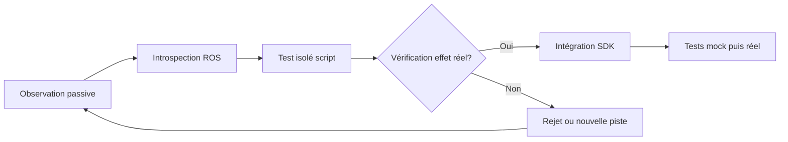
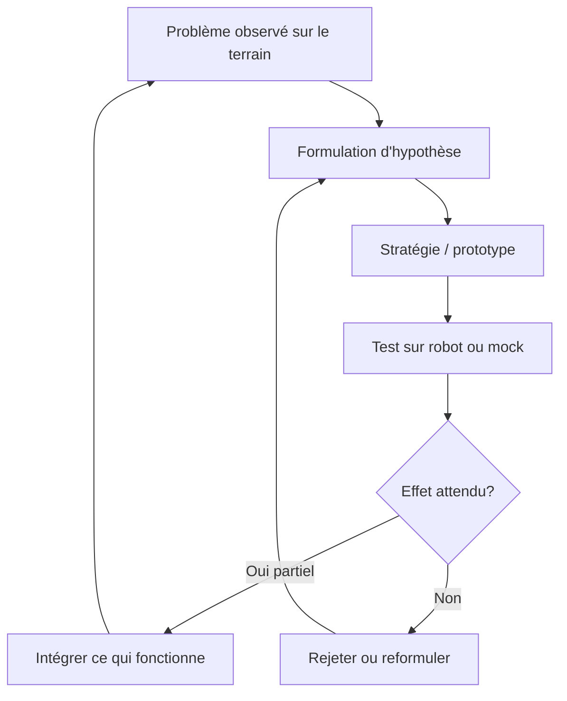
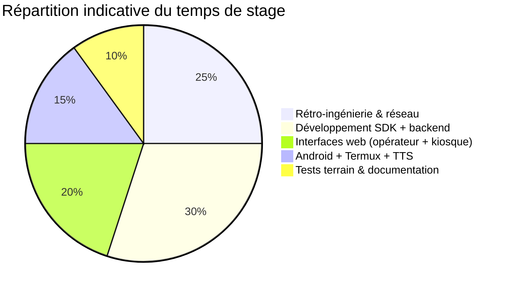
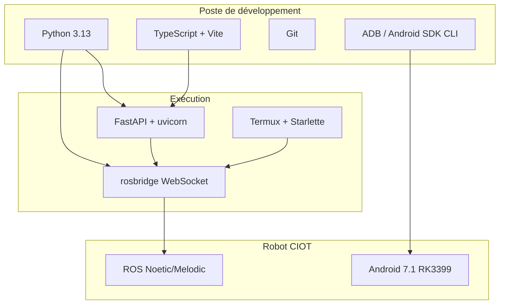
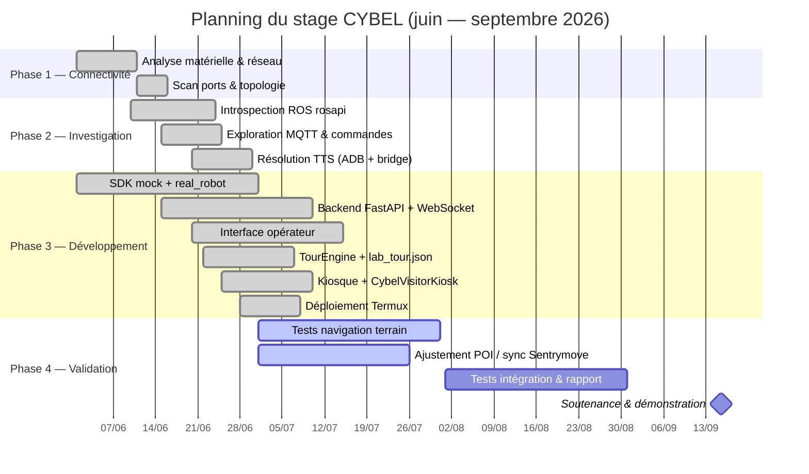
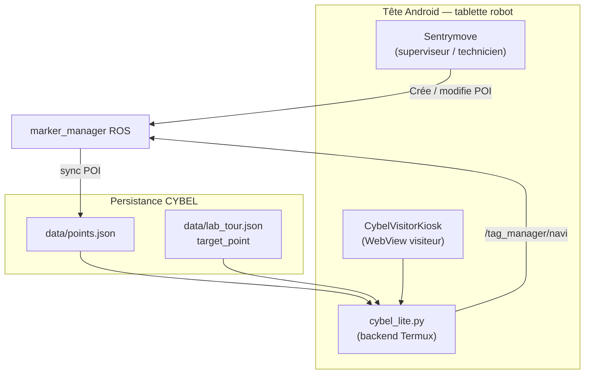
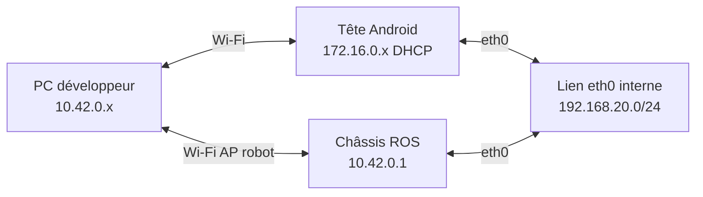
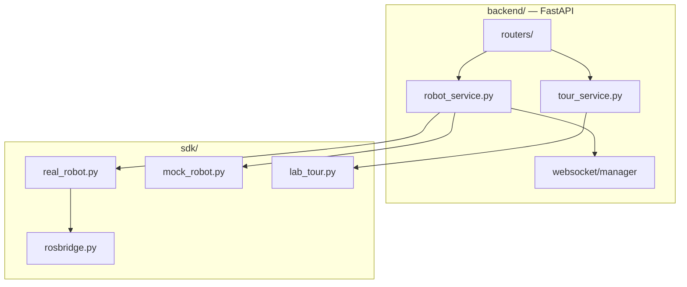
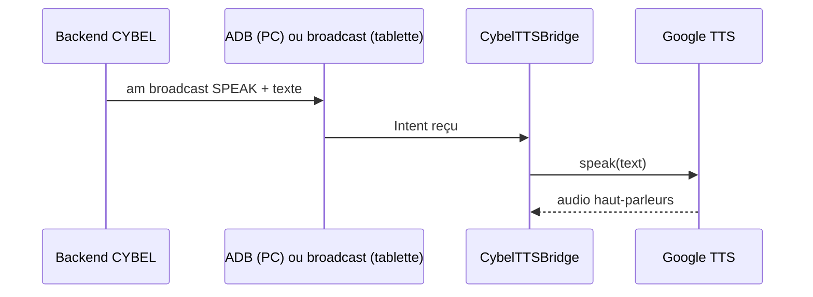
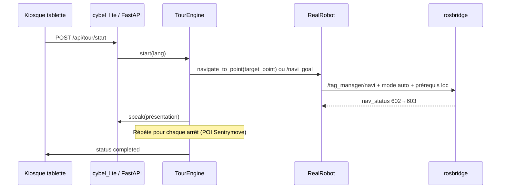

# Chapitres 5, 6 et 7 — Rapport de stage CYBEL (HESTIM)

> **Projet** : Conception et développement d'une plateforme de commande et d'interaction autonome pour un robot de service Android — CIOT TY1251D-03195  
> **Établissement** : HESTIM Engineering & Business School  
> **Encadrant** : Dr. Sridath Tula  
> **Stagiaire** : [Nom de l'étudiant]  
> **Période** : juin — septembre 2026  
> **État du projet** : fin juin 2026 — plateforme opérationnelle en démonstration ; recherche de stratégie applicative documentée (3 approches) ; branche `feature/hybrid-sentrymove-kiosk` prête pour validation terrain POI Sentrymove

---

# 5 Méthodologie et planification

## 5.1 Démarche adoptée

La méthodologie retenue combine **rétro-ingénierie incrémentale non destructive**, **développement logiciel itératif mock-first** et **recherche solutionnelle par essais successifs** (conception autonome → inspiration APK → option hybride). Elle répond directement à l'absence de documentation constructeur et à la disponibilité limitée du robot physique.

### Cycle de découverte protocolaire

Chaque hypothèse sur le protocole du robot suit le cycle suivant :



**Principes directeurs :**

1. **Observer avant d'agir** — écoute passive MQTT et rosbridge avant toute publication.
2. **Vérifier l'effet réel** — une commande acceptée par rosbridge n'est pas forcément exécutée (règle H4 du projet).
3. **Simuler d'abord** — chaque fonctionnalité est validée dans `MockRobot` avant portage dans `RealRobot`.
4. **Documenter au fil de l'eau** — scripts `scripts/` versionnés comme journal de bord exécutable.
5. **Sécuriser le matériel** — annulation de navigation prête, E-Stop accessible, pas de commandes destructives.

### Cycle de recherche de solution applicative

Au-delà du protocole ROS, le stage a confronté une **deuxième problématique** : comment concevoir deux applications (kiosque visiteur + supervision opérateur) sans documentation UX ni API constructeur. La démarche suivie repose sur l'**essai–mesure–décision** :



**Critères d'évaluation d'une stratégie :**

| Critère | Question posée |
|---------|----------------|
| **Fiabilité navigation** | Le robot se déplace-t-il réellement (`nav_status` 602→603) ? |
| **Indépendance constructeur** | Peut-on déployer sans compte cloud CIOT ni APK propriétaire actif ? |
| **Maintenabilité** | Le code est-il compilable, testable et documenté ? |
| **Adéquation métier** | Visiteur vs technicien : la bonne UI pour le bon rôle ? |
| **Reproductibilité hors robot** | Peut-on avancer sans accès permanent au matériel ? |

**Sources de connaissance mobilisées :**

1. Observation passive (MQTT, rosbridge, scripts `scripts/`).
2. Décompilation JADX des APK `welcomepatrol` et `sentrymove` (audit documenté).
3. Tests comparatifs : application constructeur qui fonctionne vs CYBEL.
4. Journaux de visite (`GET /api/tour/trace`) pour corréler parole / mouvement / `nav_status`.
5. Identification terrain via ADB (`dumpsys window`) de l'application « Deployment Tool ».

### Phases du stage (alignement sujet HESTIM)

| Phase | Objectif | Livrable principal |
|-------|----------|-------------------|
| 1 — Connectivité | Joindre le robot, cartographier le réseau | Topologie documentée |
| 2 — Investigation | Reconstruire le protocole ROS/MQTT | `constants.py`, scripts d'exploration |
| 3 — Développement | SDK, API, interfaces web et Android | Plateforme CYBEL |
| 4 — Validation | Tests terrain, rapport, démonstration | Parcours labo validé |

---

## 5.2 Organisation du travail

### Répartition des activités



### Organisation hebdomadaire type

| Jour | Activité principale | Environnement |
|------|---------------------|---------------|
| Lundi–Mercredi | Développement (mock) + documentation | PC, sans robot |
| Jeudi | Tests sur robot réel (si disponible) | Wi-Fi `TY1251D-03195` |
| Vendredi | Intégration, déploiement tablette, rédaction | PC + tablette Termux |

### Outils de suivi

- **Git** : historique des découvertes et du code (`main` synchronisé avec le dépôt).
- **Scripts d'exploration** : preuves reproductibles (`ros_explore.py`, `robot_status.py`, etc.).
- **Documentation Markdown** : `docs/` (6+ guides techniques).
- **Assistant IA (Cursor / Claude)** : accélération code et documentation, **toujours validé par le stagiaire** avant test sur robot.

### Points de synchronisation

- Réunions avec l'encadrant HESTIM (avancement, blocages).
- Tests sur site lorsque le robot et le laboratoire sont disponibles.
- Itérations rapides PC ↔ tablette via `deploy_termux.py`.

---

## 5.3 Outils et technologies utilisés

### Vue d'ensemble



### 5.3.1 ROS (Robot Operating System)

**Rôle dans le projet** : le châssis du robot exécute ROS pour la localisation SLAM, la planification (`move_base`) et l'exécution des trajectoires. CYBEL n'accède pas directement à ROS natif (C++/Python ROS) mais via **rosbridge** — pont WebSocket JSON.

| Élément | Usage CYBEL |
|---------|-------------|
| Topics lecture | `/robot_pose`, `/robot_status`, `/scan_filter`, `/get_current_map`, `/detected_people_array` |
| Topics commande | `/cmd_vel_mux/input/teleop`, `/navi_goal`, `/path_follower/cancel` |
| Services | `/tag_manager/navi`, `/poi`, `/change_location_mode`, `/global_locate`, `/marker_manager/get_markers_details` |
| Introspection | `/rosapi/topics`, `/rosapi/services`, `/rosapi/subscribers` |

**Codes `nav_status` documentés** :

| Code | Libellé | Interprétation |
|------|---------|----------------|
| 600 | En initialisation | Robot non localisé |
| 601 | Prêt | Peut naviguer |
| 602 | En navigation | Trajectoire en cours |
| 603 | Arrivé | Objectif atteint |
| 604 | Erreur | Obstacle, chemin bloqué ou destination inaccessible |

### 5.3.2 FastAPI

**Rôle** : API REST + WebSocket pour l'interface opérateur PC.

- **Routers** : robot, navigation, carte, speech, reception, tour, settings.
- **WebSocket** `/ws/telemetry` : diffusion temps réel (pose, statut, carte, LiDAR).
- **Lifespan** : connexion rosbridge au démarrage (avec reconnexion en arrière-plan).
- **Configuration** : `backend/.env` via `pydantic-settings` (`ROBOT_MOCK`, `ROBOT_HOST`, etc.).

**Alternative embarquée** : sur tablette Termux, **Starlette** (`cybel_lite.py`) remplace FastAPI car `pydantic-core` ne compile pas sur Python 3.13 Termux.

### 5.3.3 TypeScript

**Rôle** : deux applications web sans framework lourd (Vite + TypeScript pur).

| Application | Port dev | Utilisateur |
|-------------|----------|-------------|
| `frontend/` | 5173 | Opérateur — carte, téléop, visite, accueil |
| `frontend-kiosk/` | 5174 | Visiteur — visite guidée FR/EN |

**Choix** : pas de React/Vue — surface UI maîtrisable par un développeur seul, HMR Vite rapide. Build **IIFE** pour le kiosque (compatibilité WebView Chrome 49 / Android 7.1).

### 5.3.4 Android

Deux applications Java légères, compilées **sans Gradle** (`javac`, `d8`, `apksigner`) :

| APK | Rôle |
|-----|------|
| **CybelTTSBridge** | `BroadcastReceiver` + `TextToSpeech` (Google TTS) |
| **CybelVisitorKiosk** | WebView plein écran → `/kiosk/`, mode kiosque |

**Contraintes Android 7.1** : pas de modules ES, safe-area (`viewport-fit=cover`), `network_security_config` pour HTTP local Termux.

### 5.3.5 ADB (Android Debug Bridge)

**Rôle** : pont TTS depuis le **PC développeur** vers la tête Android.

```bash
adb devices
adb shell am broadcast -n com.cybel.ttsbridge/.SpeakReceiver \
  -a com.cybel.ttsbridge.SPEAK --es text "Test vocal"
```

- Câble USB requis (pas de `adb connect` Wi-Fi fiable sur ce modèle).
- Sur **tablette autonome** : TTS via `speak_local` (broadcast sans ADB).

### 5.3.6 rosbridge et communication réseau

| Canal | Adresse | Protocole | Usage |
|-------|---------|-----------|-------|
| rosbridge | `ws://10.42.0.1:9090` (PC) ou `192.168.20.22:9090` (Termux) | WebSocket JSON | Principal |
| MQTT | `10.42.0.1:1883` | MQTT 3.1.1 | Télémétrie passive |
| ADB | USB | Android Debug Bridge | TTS PC |
| HTTP Termux | IP tablette `:8000` | HTTP | Kiosque embarqué |

**Client CYBEL** : `sdk/rosbridge.py` — connexion avec timeout 20 s, 3 tentatives, keepalive ping, reconnexion automatique.

---

## 5.4 Planning du projet

### Diagramme de Gantt



### Jalons atteints (fin juin 2026)

| Jalon | Date | Statut |
|-------|------|--------|
| Connectivité rosbridge PC | mi-juin 2026 | ✅ |
| TTS fonctionnel (ADB + bridge) | mi-juin 2026 | ✅ |
| Interface opérateur complète | fin juin 2026 | ✅ |
| Kiosque affiché sur tablette | fin juin 2026 | ✅ |
| Parcours 8 arrêts configuré | fin juin 2026 | ✅ |
| Navigation terrain POI (hybride) | juillet 2026 | ⏳ |
| Branche `feature/hybrid-sentrymove-kiosk` | fin juin 2026 | ✅ |

---

## 5.5 Difficultés rencontrées durant la phase d'investigation

### Réseau et topologie

| Difficulté | Impact | Solution |
|------------|--------|----------|
| Topologie dual-stack (`10.42.0.1`, `172.16.0.x`, `192.168.20.x`) | Confusion des IP cibles | Documentation `ROBOT_CONNECTION.md`, `ROBOT_HOST` distinct PC/Termux |
| Latence Wi-Fi variable (89–1654 ms) | Timeouts rosbridge | Timeout 20 s, 3 retries, pas de `--reload` par défaut |
| rosbridge saturé (connexions zombies) | Handshake impossible | Une instance backend, redémarrage robot si besoin |
| IP DHCP tête Android instable | TTS/ADB cassés | `SPEECH_ADB_SERIAL` vide → premier USB ; broadcast local sur tablette |

### Protocole ROS

| Difficulté | Impact | Solution |
|------------|--------|----------|
| Publication sans abonné | Commande « silencieusement ignorée » | Vérification `/rosapi/subscribers` |
| Mode auto (`control_state: 30`) | `cmd_vel` ignoré en téléop | `change_location_mode` avant nav/téléop |
| Annulation navigation | `/path_follower/cancel` seul insuffisant | `/poi stop` + cancel service + marker stop |
| Aucun canal ROS pour TTS | Parole impossible via rosbridge | App `CybelTTSBridge` + ADB/broadcast |

### Environnement robot fermé

| Difficulté | Impact | Solution |
|------------|--------|----------|
| SSH verrouillé | Pas d'accès shell châssis | rosbridge + ADB tête uniquement |
| Application propriétaire boîte noire | Pas de doc API | Rétro-ingénierie réseau + **audit JADX** (lecture seule) |
| `nav_status` 604 fréquent | Visite interrompue | Garde-fous `tour_navigation.py`, traces JSON ; pivot vers POI Sentrymove |

---

## 5.6 Recherche de solution applicative — problèmes, hypothèses et stratégies

Cette section documente la **démarche de recherche** menée pour les deux applications cibles du stage : une interface **visiteur** (tablette) et une interface **superviseur** (PC ou tablette). Elle complète la rétro-ingénierie protocolaire (§5.5) en explicitant les choix d'architecture et les échecs partiels qui ont orienté la solution retenue.

### 5.6.1 Problème central reformulé

| Dimension | Énoncé |
|-----------|--------|
| **Problème principal** | Concevoir une plateforme d'accueil et de supervision **sans documentation constructeur**, alors que les APK d'origine (`welcomepatrol`, `sentrymove`) sont des boîtes noires. |
| **Symptômes terrain (kiosque CYBEL)** | Robot qui **parle sans bouger**, **n'atteint pas** la destination, **reste immobile** longtemps, ou **échoue à se localiser** avant une visite. |
| **Constat décisif** | L'application « Deployment Tool » du constructeur — identifiée comme **`com.ciot.sentrymove`** via `adb shell dumpsys window` — **navigue et gère les POI de façon fiable**, alors que le kiosque CYBEL échoue sur les mêmes trajets lorsqu'il utilise des coordonnées estimées. |
| **Contrainte pédagogique** | Deux profils utilisateurs distincts : **visiteur** (parcours simple, autonome) et **superviseur/technicien** (carte, POI, diagnostic). |

### 5.6.2 Synthèse problème → hypothèse → stratégie → décision

| # | Problème | Hypothèse | Stratégie testée | Résultat | Décision |
|---|----------|-----------|------------------|----------|----------|
| **S1** | Pas de spec ROS/API publique | Le protocole est reconstructible par observation | **Conception from scratch** (SDK + web sans lire les APK) | Échec partiel : connexion OK, navigation incohérente, topics incorrects ou incomplets | Abandonner l'isolement ; chercher la spec dans le matériel existant |
| **S2** | UI et logique métier constructeur inconnues | Les APK décompilés contiennent la spec ROS et les flux UX | **Inspiration JADX** (`welcomepatrol`, `sentrymove`, `selfchassislibrary`) | Succès partiel : audit ROS riche (`TopicContent`, `MsgManager`) ; recompilation/fork APK impossible (Iflytek, Realm, cloud, Gradle absent) | Extraire la **spec**, pas fork le binaire |
| **S3** | Kiosque parle sans bouger / mauvaise destination | CYBEL envoie `/navi_goal` avec coords non calibrées ; Sentrymove utilise `/tag_manager/navi` + POI carte | **Plateforme CYBEL autonome** avec coords `lab_tour.json` | Échec terrain récurrent (`nav_status` 601 sans 602, traces `tour_*.log`) | Corréler échec à la **source de vérité des destinations** |
| **S4** | Superviseur doit être sur tablette sans PC | Reprendre l'outil technicien qui marche déjà | **Option hybride** : Sentrymove (superviseur) + kiosque CYBEL (visiteur) + **sync POI** | En cours de validation — branche `feature/hybrid-sentrymove-kiosk` | **Stratégie retenue** pour la suite du stage |

### 5.6.3 Stratégie 1 — Conception autonome (from scratch)

**Problème adressé :** dépendance au constructeur et manque de contrôle sur l'expérience utilisateur.

**Hypothèse :** ROS/rosbridge étant un standard ouvert, une plateforme web (FastAPI + TypeScript) peut piloter le robot sans étudier les APK propriétaires.

**Mise en œuvre :**

- SDK Python (`rosbridge.py`, `real_robot.py`), backend FastAPI, interfaces opérateur et kiosque.
- Navigation par publication `/navi_goal` et service `/poi`.
- Données parcours dans `lab_tour.json` dérivées de `knowledgeV2-lab.json`.

**Résultats :**

| Aspect | Bilan |
|--------|-------|
| Protocole de base | ✅ Connexion, télémétrie, TTS (ADB), téléopération |
| Navigation autonome visite | ❌ Instable — coords non alignées sur carte SLAM active |
| UX visiteur | ⚠️ Kiosque v0.3 fonctionnel visuellement, pas fiable fonctionnellement |
| Documentation | ✅ Base solide (`README`, `docs/`) |

**Pourquoi insuffisant :** la valeur critique du constructeur n'est pas l'UI mais **`selfchassislibrary`** — noms de topics, chaînes de fallback, orchestration `NavigationHelper`. Sans cette spec, on réinvente des appels ROS **syntaxiquement valides mais sémantiquement ignorés** par le planificateur.

**Décision :** poursuivre CYBEL comme plateforme ouverte, mais **alimenter le SDK depuis l'audit APK**, pas depuis l'intuition.

---

### 5.6.4 Stratégie 2 — Inspiration des APK constructeur (JADX)

**Problème adressé :** lacunes de la stratégie 1 (topics manquants, comportements navigation inexpliqués).

**Hypothèse :** la décompilation des APK `com.ciot.welcomepatrol` (accueil visiteur) et `com.ciot.sentrymove` (outil déploiement) fournit une spécification ROS et une référence UX exploitable.

**Méthodologie de recherche :**

1. Extraction APK depuis la tablette (`adb pull`) ou dossiers `welcomepatrol/`, `sentrymove/` dans le dépôt.
2. Décompilation **JADX** — lecture de `TopicContent.java`, `ServiceContent.java`, `MsgManager.java`, `NavigationHelper.java`.
3. Rédaction de l'audit formalisé : `docs/cybel-conception/AUDIT_APK_CONSTRUCTEUR.md`.
4. Portage vers `sdk/constants.py`, `sdk/ros_ops.py`, garde-fous `sdk/tour_navigation.py`.
5. Comparaison écarts : `docs/cybel-conception/04-ecart-etat-actuel.md`, `docs/movement-audit/CYBEL_GAP_ANALYSIS.md`.

**Résultats :**

| Apport | Détail |
|--------|--------|
| Spec ROS | Topics `/cmd_vel_mux/input/teleop`, `/tag_manager/navi`, `/global_locate`, codes `nav_status` |
| Rôles clarifiés | `welcomepatrol` = visiteur ; `sentrymove` = technicien (carte, POI, joystick) |
| Parité fonctionnelle | ~50 % du périmètre v1 documenté (`PARITY_CHECKLIST.md`) |
| Fork APK | ❌ Non viable — Iflytek, SROS cloud, Realm, 40+ fragments, projet non recompilable |

**Pourquoi succès partiel seulement :** copier-coller le Java JADX ne produit pas une application maintenable ; en revanche, **l'audit informe CYBEL** (Phase 0 SDK, fallbacks, smoke test `phase0_robot_check.py`).

**Décision :** utiliser les APK comme **référence et spec**, pas comme base de code à modifier intégralement.

---

### 5.6.5 Stratégie 3 — Option hybride retenue (Sentrymove + kiosque CYBEL)

**Problème adressé :** écart de fiabilité navigation entre Deployment Tool (Sentrymove) et kiosque CYBEL ; besoin de supervision sur tablette sans PC permanent.

**Hypothèse :** si les **POI sont créés et testés dans Sentrymove** (source de vérité sur le châssis ROS), le kiosque CYBEL peut naviguer **par nom de POI** (`/tag_manager/navi`) — même mécanisme que l'outil constructeur — sans fork de l'APK.

**Architecture retenue :**



**Mise en œuvre (branche `feature/hybrid-sentrymove-kiosk`) :**

| Composant | Rôle |
|-----------|------|
| **Sentrymove** | Supervision, carte SLAM, création POI, relocalisation manuelle, tests trajet |
| **`scripts/sync_poi_from_robot.py`** | Sync ROS → `data/points.json` |
| **`POST /api/navigation/sync`** | Sync depuis PC ou tablette |
| **`lab_tour.json`** | Arrêts via `target_point` (plus de coords brutes) |
| **Kiosque CYBEL** | UX visiteur conservée ; navigation alignée Sentrymove |

**Pourquoi cette stratégie :**

1. **Séparation des rôles** — Sentrymove est un outil technicien (3166 lignes `MainActivity`) ; le forker pour le visiteur serait disproportionné.
2. **Même canal navigation** — POI nommés = même fiabilité que Deployment Tool.
3. **Indépendance partielle acceptable** — Sentrymove reste installé pour le superviseur, mais le **parcours visiteur et la voix** passent par CYBEL (pas de cloud Wuhan, pas d'Iflytek).
4. **Travail offline possible** — sync script, migration `lab_tour.json`, tests unitaires sans robot ; validation POI sur site.

**Documentation associée :** `docs/cybel-conception/06-plan-hybride-sentrymove-kiosk.md`, `docs/SENTRYMOVE_POI_SYNC.md`.

---

### 5.6.6 Scénarios d'usage cibles

Les scénarios ci-dessous structurent la validation et la rédaction du chapitre 7. Ils distinguent **scénarios métier** (utilisateur final) et **scénarios de recherche** (validation des hypothèses).

#### Scénarios métier (utilisateurs)

| ID | Acteur | Scénario | Prérequis | Succès |
|----|--------|----------|-----------|--------|
| **M1** | Technicien | Créer un POI « Routeur CNC » dans Sentrymove et naviguer vers lui | Robot localisé, `nav_status` 601 | Robot arrive au marqueur |
| **M2** | Technicien | Synchroniser POI vers CYBEL (`sync_poi_from_robot.py`) | Wi-Fi robot, POI Sentrymove existants | `points.json` à jour, destinations kiosque visibles |
| **M3** | Visiteur | Choisir une destination sur le kiosque | Sync POI effectuée | TTS accueil + déplacement réel |
| **M4** | Visiteur | Lancer la visite guidée 8 arrêts | POI labo créés, noms = `target_point` | 8 segments sans parole sans mouvement |
| **M5** | Superviseur | Superviser depuis Sentrymove (carte, joystick) sans PC | APK constructeur installée | Téléop et POI opérationnels |
| **M6** | Superviseur | Arrêt d'urgence pendant visite (`POST /api/tour/halt`) | Visite en cours | Nav + TTS stoppés |
| **M7** | Visiteur | Parcours 100 % tablette (Termux + kiosque, sans PC) | `deploy_termux.py` | Health 200, TTS local |

#### Scénarios de recherche (validation hypothèses)

| ID | Hypothèse testée | Procédure | Indicateur de succès | Statut |
|----|------------------|-----------|----------------------|--------|
| **R1** | ROS reconstructible sans APK | Scripts `ros_explore.py`, mock-first | Topics identifiés, mock vert | ✅ |
| **R2** | Coords `lab_tour.json` suffisantes | Visite avec `/navi_goal` | `nav_status` 602→603 sur 8 arrêts | ❌ |
| **R3** | Garde-fous loc + mode auto suffisent | `tour_navigation.py`, traces JSON | Messages d'erreur explicites ; blocage 604 réduit | ⚠️ partiel |
| **R4** | Sentrymove = Deployment Tool | `adb shell dumpsys window windows` | Focus `com.ciot.sentrymove/...MainActivity` | ✅ |
| **R5** | POI Sentrymove = nav kiosque fiable | Sync + `/tag_manager/navi` | Même POI OK Sentrymove et kiosque | ⏳ validation terrain |
| **R6** | Écart téléop CYBEL vs Sentrymove | `CYBEL_GAP_ANALYSIS.md`, `joystick_capture.py` | Topic `cmd_vel_mux`, mode manuel auto | ✅ corrigé SDK |
| **R7** | Parité spec APK dans SDK | `phase0_robot_check.py` | Checks Phase 0 verts | ⏳ |

#### Scénario narratif — journée type au laboratoire (cible)

1. **Matin** — Allumer robot ; lancer Sentrymove ; relocaliser ; vérifier `nav_status` 601.
2. **Configuration** — Créer ou ajuster POI labo ; lancer sync POI ; redeploy Termux si besoin.
3. **Accueil** — Mode kiosque : visiteur lance visite guidée ou choisit une destination.
4. **Supervision** — En cas d'incident : superviseur bascule Sentrymove (annulation, relocalisation) ou opérateur CYBEL (`/api/tour/halt`).
5. **Analyse** — Consulter `GET /api/tour/trace` pour corréler parole, pose et `nav_status`.

---

## 5.7 Conclusion (chapitre 5)

La méthodologie adoptée — observation, vérification, simulation puis intégration — s'est avérée **indispensable** face à un système fermé et partiellement documenté. La **recherche solutionnelle en trois temps** (conception autonome, audit APK, option hybride) montre qu'aucune approche isolée ne suffit : le protocole s'apprend par rétro-ingénierie, la fiabilité navigation par **alignement sur les POI Sentrymove**, et l'expérience visiteur par le kiosque CYBEL.

Le planning en quatre phases a été globalement respecté, avec un avance sur le déploiement tablette (phase 3) et un **pivot méthodologique en fin de phase 4** : remplacer la navigation par coordonnées estimées par une **sync POI constructeur → kiosque**. Les outils choisis (Python/FastAPI, TypeScript/Vite, rosbridge, ADB, Termux) forment un écosystème cohérent ; Sentrymove est retenu comme **outil superviseur complémentaire**, non comme dépendance du parcours visiteur.

---

# 6 Réalisation et implémentation

## 6.1 Mise en place de l'environnement

### Poste de développement (PC)

| Composant | Version / détail |
|-----------|------------------|
| OS | Windows 11 |
| Python | 3.13 + `pip install -r backend/requirements.txt` |
| Node.js | LTS + `npm install` dans `frontend/` et `frontend-kiosk/` |
| Android SDK | CLI (`adb`, `aapt2`, `javac`, `d8`) pour APK |
| IDE | Cursor / VS Code |
| Réseau | Connexion Wi-Fi robot `TY1251D-03195` pour tests réels |

### Lancement unifié

```powershell
cd cybel
python scripts\dev.py
# → Backend :8000, opérateur :5173, kiosque :5174
```

Configuration robot : `backend/.env` — `ROBOT_MOCK=false`, `ROBOT_HOST=10.42.0.1`.

### Environnement tablette (Termux)

- Bootstrap : `scripts/termux/bootstrap_lite.sh`
- Déploiement : `python scripts/deploy_termux.py --lite-only`
- Démarrage : `~/cybel/scripts/termux/start_cybel.sh`

---

## 6.2 Découverte et analyse du robot

### Matériel identifié

| Sous-système | Spécifications |
|--------------|----------------|
| Châssis | Linux embarqué, ROS, LiDAR, batterie 24V/20Ah |
| Upper body | Android 7.1, RK3399, 2 Go RAM, écran 15,6" tactile |
| Réseau | AP Wi-Fi `TY1251D-03195`, mot de passe documenté en interne |

### Services réseau découverts

| Port | Service |
|------|---------|
| 9090 | rosbridge WebSocket |
| 1883 | MQTT |
| 8082 | Interface déploiement constructeur |
| 8088 | Interface debug CSST |
| 21 | FTP |
| 22 | SSH (verrouillé) |

---

## 6.3 Reverse Engineering du système

### 6.3.1 Analyse réseau



**Découverte clé** : depuis Termux (tablette), rosbridge est joignable sur **`192.168.20.22:9090`**, pas sur `10.42.0.1`.

### 6.3.2 Identification des protocoles

1. **rosbridge v2** — canal principal (JSON sur WebSocket).
2. **MQTT** — télémétrie odométrie (`test_mul`), observation passive.
3. **HTTP** — interfaces constructeur non exploitées pour CYBEL.
4. **ADB** — accès tête Android pour TTS.

### 6.3.4 Décompilation APK (JADX) et audit constructeur

En complément de l'exploration réseau, une **décompilation non destructive** des applications Android du robot a été réalisée :

| APK | Package | Rôle identifié |
|-----|---------|----------------|
| Welcome Patrol | `com.ciot.welcomepatrol` | Accueil visiteur, guidage, voix, patrouille |
| Sentry Move | `com.ciot.sentrymove` | Outil technicien — **« Deployment Tool »** sur tablette |

**Méthode :** extraction APK (`adb pull` ou dossiers `welcomepatrol/`, `sentrymove/`), décompilation **JADX**, lecture des packages `selfchassislibrary`, `NavigationHelper`, fragments UI.

**Livrable :** `docs/cybel-conception/AUDIT_APK_CONSTRUCTEUR.md` — registre topics ROS, services, flux navigation, limites (Iflytek, cloud SROS, Realm).

**Découverte terrain (juin 2026) :** l'application utilisée quotidiennement pour cartographier et déplacer le robot correspond à :

```text
mCurrentFocus=Window{... com.ciot.sentrymove/mc.csst.com.selfchassis.ui.activity.main.MainActivity}
```

Cette identification a **validé l'hypothèse R4** (§5.6.6) et orienté la stratégie hybride : réutiliser la **création de POI Sentrymove** comme source de vérité, plutôt que répliquer tout l'APK.

### 6.3.5 Étude des commandes

| Action | Mécanisme validé |
|--------|------------------|
| Téléopération | `/cmd_vel_mux/input/teleop` (aligné APK ; mode manuel auto au 1er mouvement) |
| Navigation POI | Service `/tag_manager/navi` puis fallback `/poi` — **prioritaire Sentrymove** |
| Navigation coordonnée | Publication `/navi_goal` (fallback ; coords à calibrer sur SLAM) |
| Annuler navigation | Chaîne multi-canal : `/poi stop`, `/move_base/cancel`, vitesse nulle |
| Mode manuel/auto | Service `/change_location_mode` — `mode: 0/1` |
| Relocalisation | `/global_locate` puis fallback `/global_localization` |
| Parole | `am broadcast` → CybelTTSBridge (hors ROS) |
| Sync POI | `/marker_manager/get_markers_details` → `data/points.json` |

---

## 6.4 Développement du backend CYBEL

### Architecture



### Fonctionnalités API principales

| Domaine | Endpoints clés |
|---------|----------------|
| Robot | `/api/robot/status`, `/move`, `/stop`, `/emergency-stop`, `/relocalize` |
| Navigation | `/api/navigation/goto`, `/goto-coordinate`, `/cancel`, **`/sync`** |
| Carte | `/api/map/current` |
| Visite | `/api/tour/start`, `/stop`, `/halt`, CRUD `/stops` |
| Télémétrie | WebSocket `/ws/telemetry` |

**Tests automatisés** : 83 tests unitaires (`pytest tests/unit`) — juin 2026.

---

## 6.5 Développement de l'application Android

### CybelTTSBridge

- Réception broadcast `com.cybel.ttsbridge.SPEAK`
- Initialisation `TextToSpeech` avec file d'attente (`pendingText`)
- Installée sur la tête Android du robot

### CybelVisitorKiosk

- WebView plein écran chargeant `http://<ip-tablette>:8000/kiosk/`
- `BootReceiver` pour démarrage automatique (optionnel)
- Correctifs safe-area et page d'erreur réseau

---

## 6.6 Développement de l'interface Web

### Interface opérateur (`frontend/`)

| Module | Fonction |
|--------|----------|
| Carte SLAM | Grille, LiDAR, pose, objectif, visiteurs |
| Panneau Points | Navigation, ajout/suppression points locaux |
| Téléopération | D-pad, mode manuel, arrêt |
| Page Visite | CRUD `lab_tour.json`, suivi état |
| Accueil | Actions vocales, FAQ, commande vocale |

### Interface visiteur (`frontend-kiosk/`)

- Écran accueil → visite en cours → fin / erreur
- Bascule FR/EN
- Polling `/api/tour/status` pendant la visite

---

## 6.7 Mise en place du système TTS



**PC** : `sdk/speech.py` → subprocess ADB.  
**Tablette** : `speak_local()` dans `cybel_lite.py` — sans PC.

---

## 6.8 Intégration des différents modules

### Flux visite guidée (intégration bout en bout)



### Script de déploiement intégré

`scripts/deploy_termux.py` : build kiosque → upload SFTP → bootstrap → restart `cybel_lite`.

---

## 6.10 Option hybride Sentrymove + sync POI (fin juin 2026)

Suite à l'analyse des échecs navigation kiosque (§5.6), une **branche dédiée** `feature/hybrid-sentrymove-kiosk` implémente la stratégie retenue :

| Élément | Description |
|---------|-------------|
| **Superviseur** | Sentrymove (`com.ciot.sentrymove`) — conservé tel quel sur tablette |
| **Visiteur** | Kiosque CYBEL (`frontend-kiosk` + `CybelVisitorKiosk`) |
| **Pont données** | `scripts/sync_poi_from_robot.py`, `sdk/poi_sync.py`, `sdk/marker_utils.py` |
| **Visite guidée** | `data/lab_tour.json` — champs `target_point` (noms POI), sans coordonnées brutes |
| **API sync** | `POST /api/navigation/sync` (backend PC + `cybel_lite` tablette) |

**Flux opérateur documenté :** `docs/SENTRYMOVE_POI_SYNC.md`.

---

## 6.11 Conclusion (chapitre 6)

L'implémentation CYBEL couvre l'intégralité de la chaîne **du protocole robot aux interfaces utilisateur**, en passant par une API structurée et un déploiement embarqué sur tablette. L'architecture en couches (SDK / API / UI) a absorbé les évolutions (visite guidée, TTS, Termux, audit APK, sync POI) sans remise en cause du cœur logiciel.

Le principal enseignement de la phase d'implémentation est que **la fiabilité navigation ne dépend pas de l'UI kiosque** mais de la **source des destinations** : POI calibrés dans Sentrymove plutôt que coordonnées estimées dans un fichier JSON. La validation terrain de cette hypothèse constitue le jalon immédiat du stage.

---

# 7 Validation, résultats et analyse critique

## 7.1 Stratégie de validation

La validation s'articule autour de **deux axes** : (1) conformité technique (protocole, API, tests automatisés) ; (2) **validation des hypothèses de recherche solutionnelle** (§5.6.6).

| Niveau | Méthode | Périmètre |
|--------|---------|-----------|
| Unitaire | `pytest` (83 tests) | SDK, sync POI, tour, persistance, rosbridge |
| Intégration mock | `ROBOT_MOCK=true` | API + frontend sans robot |
| Intégration réelle | Tests manuels + scripts | Navigation POI, TTS, télémétrie |
| Recherche hypothèse | Scénarios R1–R7 | Comparaison Sentrymove vs CYBEL |
| Acceptation terrain | Scénarios M1–M7 | Visite POI, sync, supervision tablette |

**Critères de succès visite guidée (version hybride POI) :**

1. POI créés dans Sentrymove et synchronisés vers `points.json`.
2. Démarrage visite depuis kiosque sans erreur 409 (prérequis loc OK).
3. Robot atteint chaque POI (`nav_status` → 603) — **pas de TTS sans mouvement**.
4. Annonces vocales audibles à chaque arrêt.
5. Arrêt visiteur et E-Stop opérateur fonctionnels.

---

## 7.2 Scénarios de tests

### 7.2.1 Tests techniques (infrastructure)

| ID | Scénario | Résultat attendu | Statut |
|----|----------|------------------|--------|
| T1 | `ping 10.42.0.1` + `robot_status.py` | Messages JSON `/robot_status` | ✅ |
| T2 | Téléop mode manuel / auto | Robot se déplace au D-pad | ✅ |
| T3 | Navigation vers POI carte | `nav_status` 602→603 | ✅ (Sentrymove) ; ⏳ kiosque POI |
| T4 | Annulation navigation | Robot s'arrête, objectif effacé | ✅ |
| T5 | TTS via ADB | Audio audible | ✅ |
| T6 | TTS tablette (broadcast) | Audio sans PC | ✅ |
| T7 | Kiosque affiché WebView | Écran accueil CYBEL v0.3 | ✅ |
| T8 | Visite 8 arrêts (coords) | Sans 604 | ❌ — pivot POI |
| T9 | Visite 8 arrêts (POI sync) | Sans parole sans mouvement | ⏳ |
| T10 | Relâcher E-Stop sans reprise nav | Robot immobile | ✅ |
| T11 | `pytest tests/unit` | 83/83 passés | ✅ |
| T12 | `POST /api/navigation/sync` | `points.json` fusionné | ✅ (code) ; ⏳ terrain |
| T13 | `phase0_robot_check.py --nav-poi` | Check vert | ⏳ |

### 7.2.2 Scénarios métier et de recherche

Les scénarios **M1–M7** (métier) et **R1–R7** (recherche) sont détaillés au §5.6.6. Le tableau ci-dessous résume leur statut au moment de la rédaction :

| Famille | Objectif | Statut global |
|---------|----------|---------------|
| **M** — Utilisateur final | Parcours visiteur + supervision tablette | ⏳ validation juillet 2026 |
| **R** — Hypothèses stage | Comparer approches from scratch / APK / hybride | ✅ documenté ; R5 en cours |

### 7.2.3 Scénario d'échec documenté — « parle sans bouger »

**Contexte :** journal `tour_20260623_142601` (analyse `docs/TOUR_NAVIGATION.md`).

| Étape | Observation | Interprétation |
|-------|-------------|----------------|
| 1 | Intro TTS jouée | Backend considère visite démarrée |
| 2 | `/navi_goal` publié | Goal accepté syntaxiquement |
| 3 | `nav_status` reste 601 | Planificateur **n'a pas démarré** (602 jamais atteint) |
| 4 | Pose inchangée 14 s | Aucun mouvement réel |
| 5 | Message « échec 604 » | **Trompeur** — vrai problème : objectif ignoré |

**Hypothèse validée :** le blocage n'est pas l'UI kiosque mais l'**inadéquation coords / état châssis**. **Solution :** POI Sentrymove + prérequis `prepare_for_tour()` + traces JSON.

---

## 7.3 Résultats obtenus

### Fonctionnalités livrées

- Plateforme opérateur complète (carte, LiDAR, visiteurs, visite, accueil).
- Kiosque visiteur bilingue déployé sur tablette Termux.
- Protocole ROS documenté et intégré dans `sdk/constants.py`.
- Pont TTS Android opérationnel.
- Parcours laboratoire 8 arrêts — navigation **par POI** (`target_point`) après sync Sentrymove.
- Documentation recherche solutionnelle (§5.6) et plan hybride (`06-plan-hybride-sentrymove-kiosk.md`).

### Incidents terrain documentés

| Incident | Cause | Résolution |
|----------|-------|------------|
| Erreur 604 / visite bloquée | Coords dans obstacle ou objectif ignoré (601) | Pivot POI Sentrymove ; `tour_navigation.py` |
| Robot parle sans bouger | TTS avant nav + `/navi_goal` ignoré | Prérequis loc avant TTS ; POI `/tag_manager/navi` |
| Handshake rosbridge timeout | Wi-Fi ou connexions saturées | Retries, pas de reload, redémarrage robot |
| Objectif conservé après annulation | Télémétrie robot non effacée | `_suppress_robot_goal` + cancel multi-canal |
| Bouton Arrêt inefficace | Appelait `haltTour` au lieu de `cancel` | Correction `app.ts` |
| Écart CYBEL vs Deployment Tool | Topic téléop legacy, garde-fous stricts | `CYBEL_GAP_ANALYSIS.md`, alignement `cmd_vel_mux` |

---

## 7.4 Indicateurs de performance

| Indicateur | Valeur observée | Commentaire |
|------------|-----------------|-------------|
| **Temps de réponse** API REST | < 100 ms (hors rosbridge) | Localhost PC |
| **Temps de réponse** rosbridge connect | 2–60 s (selon Wi-Fi) | 3 × timeout 20 s max |
| **Fiabilité** connexion rosbridge | ~90 % en session stable | Dépend Wi-Fi et charge |
| **Stabilité communications** | Reconnexion auto après 25 s silence | Watchdog `real_robot.py` |
| **Fréquence télémétrie** pose | ~10 Hz | `/robot_pose` |
| **Fréquence télémétrie** LiDAR | ~25 Hz | `/scan_filter` |
| **Latence Wi-Fi** ping robot | 89–1654 ms | Variable |
| **Robustesse** navigation coords | Échecs fréquents | Pivot POI Sentrymove |
| **Tests unitaires** | 83/83 passés | Juin 2026 |

---

## 7.5 Contributions personnelles

En tant que stagiaire HESTIM en charge du robot, les contributions principales incluent :

1. **Rétro-ingénierie complète** du protocole de communication du CIOT TY1251D — sans documentation constructeur.
2. **Conception et développement** de l'architecture CYBEL (SDK, API, deux interfaces web).
3. **Résolution du canal TTS** par développement de `CybelTTSBridge` et investigation ADB/broadcast.
4. **Déploiement embarqué** Termux + kiosque sur la tablette du robot.
5. **Conception du parcours pédagogique** laboratoire (`lab_tour.json` depuis `knowledgeV2-lab.json`).
6. **Documentation technique** exhaustive (`docs/`, scripts, diagrammes Mermaid).
7. **Correction itérative** des problèmes terrain (annulation nav, rosbridge, erreurs 604).
8. **Recherche solutionnelle structurée** — trois stratégies comparées (§5.6), identification Sentrymove = Deployment Tool, conception option hybride POI.

---

## 7.6 Difficultés rencontrées et solutions apportées

*(Synthèse — voir §5.5 pour le détail investigation)*

| Domaine | Difficulté | Solution CYBEL |
|---------|------------|----------------|
| Réseau | Multi-IP, DHCP | Documentation topologie, `ROBOT_HOST` adaptatif |
| Protocole | Commandes ignorées | Vérification abonnés ROS, modes manuel/auto |
| TTS | Aucun canal réseau | APK CybelTTSBridge |
| Tablette | FastAPI impossible Termux | `cybel_lite.py` Starlette |
| Tablette | Écran blanc WebView | Build IIFE + safe-area |
| Navigation | 604, coords ignorées | POI Sentrymove + sync + `target_point` |
| Recherche | Approches multiples | Méthodologie essai–mesure–décision (§5.6) |
| Dev | `--reload` sature rosbridge | `dev.py` sans reload par défaut |

---

## 7.7 Limites du projet

1. **Dépendance Wi-Fi robot** — pas de contrôle hors réseau `TY1251D-03195`.
2. **Un seul robot de test** — généralisation non garantie.
3. **Coordonnées parcours** — remplacées par **POI nommés** (sync Sentrymove) ; validation terrain en cours.
4. **Dépendance partielle Sentrymove** — conservé pour supervision/POI ; kiosque reste CYBEL.
5. **Pas de ROS natif** — dépendance totale à rosbridge.
6. **Android 7.1** — contraintes WebView, pas de modules ES modernes.
7. **Backend lite Termux** — sous-ensemble des fonctions opérateur.
8. **Pas de CI/CD** ni déploiement production industrialisé.
9. **Reconnaissance vocale / faciale visiteur** — non implémentée (v1).
10. **Fork APK constructeur** — non retenu (dépendances propriétaires, non recompilable).

---

## 7.8 Perspectives d'amélioration

| Priorité | Amélioration |
|----------|--------------|
| **Haute** | Valider visite 8 arrêts via POI sync (scénarios M3, M4, T9) |
| **Haute** | Exposer interface opérateur sur tablette (URL `/` ou mode PIN) |
| Moyenne | Connexion rosbridge non bloquante au démarrage FastAPI |
| Moyenne | Aligner `cybel_lite.py` sur toute la logique `real_robot.py` |
| Moyenne | Boot auto Termux (`termux-boot.sh`) |
| Basse | Reconnaissance faciale / annuaire (welcomepatrol — hors scope v1) |
| Basse | Fork rebrand Sentrymove (v2 — si indépendance totale requise) |

---

## 7.9 Conclusion (chapitre 7)

La validation démontre que CYBEL atteint son objectif principal : **commander et faire interagir le robot avec une stack ouverte**. Les tests unitaires (83/83) et d'intégration mock sont verts ; les tests terrain confirment téléopération, TTS, télémétrie et navigation POI via Sentrymove.

La visite guidée kiosque sur huit arrêts constitue le **dernier jalon**, conditionnée par la **validation de l'hypothèse R5** : navigation par POI synchronisés plutôt que par coordonnées. La démarche de recherche documentée au §5.6 constitue une contribution méthodologique du stage : elle montre comment arbitrer entre conception autonome, audit de solutions existantes et **option hybride pragmatique** lorsque le matériel imposé fournit déjà un composant fiable (Deployment Tool).

---

# CONCLUSION GÉNÉRALE

Le stage réalisé au sein de HESTIM sur le robot de réception CIOT TY1251D-03195 a permis de répondre à une problématique exigeante : **concevoir une plateforme tierce de commande et d'interaction en l'absence de toute documentation officielle**.

La démarche de rétro-ingénierie incrémentale, combinée à une **recherche solutionnelle en trois stratégies** (conception autonome, audit APK JADX, option hybride Sentrymove + kiosque), a permis de livrer un système **fonctionnel et démontrable** malgré l'absence de documentation constructeur.

Ce travail démontre qu'un robot de service « fermé » peut être intégré dans un écosystème pédagogique personnalisé, à condition d'accepter une phase d'investigation substantielle, de **comparer systématiquement** les solutions existantes sur le terrain, et de retenir une architecture **pragmatique** lorsque l'outil constructeur apporte une brique fiable (POI, cartographie) que la stack ouverte réutilise sans fork complet.

Les compétences mobilisées — réseaux, ROS/rosbridge, reverse engineering applicatif, développement full-stack, Android embarqué, robotique mobile, méthodologie essai–hypothèse–validation — correspondent au profil visé par la formation en Informatique et Intelligence Artificielle à HESTIM. La suite du stage consacrera ses efforts à la **validation terrain de la sync POI** (scénarios M3–M4) et à la rédaction finale du mémoire de soutenance.

---

# BIBLIOGRAPHIE

1. Quigley, M., Conley, K., Gerkey, B., Faust, J., Foote, T., Leibs, J., Wheeler, R., & Ng, A. Y. (2009). *ROS: an open-source Robot Operating System*. ICRA Workshop on Open Source Software.

2. Thrun, S., Burgard, W., & Fox, D. (2005). *Probabilistic Robotics*. MIT Press.

3. Siegwart, R., Nourbakhsh, I. R., & Scaramuzza, D. (2011). *Introduction to Autonomous Mobile Robots*. MIT Press.

4. OASIS. (2014). *MQTT Version 3.1.1 — OASIS Standard*. OASIS Open.

5. OWASP Foundation. *OWASP Internet of Things Top 10*. https://owasp.org/www-project-internet-of-things/

6. HESTIM Engineering & Business School. *Development of a Custom Interaction and Control System for an Android-Based Service Robot* — document de sujet de stage (Dr. Sridath Tula).

---

# WEBOGRAPHIE

1. Robot Web Tools — rosbridge_suite : https://github.com/RobotWebTools/rosbridge_suite

2. Robot Web Tools — roslibjs : https://github.com/RobotWebTools/roslibjs

3. FastAPI — documentation officielle : https://fastapi.tiangolo.com

4. Vite — documentation officielle : https://vitejs.dev

5. Pydantic — documentation : https://docs.pydantic.dev

6. Mozilla Developer Network — Web Speech API : https://developer.mozilla.org/en-US/docs/Web/API/Web_Speech_API

7. Android Developers — TextToSpeech : https://developer.android.com/reference/android/speech/tts/TextToSpeech

8. Android Developers — Debug Bridge (ADB) : https://developer.android.com/tools/adb

9. Termux Wiki : https://wiki.termux.com

10. Mermaid — diagrammes as code : https://mermaid.js.org

11. Mermaid Live Editor (export PNG pour Overleaf) : https://mermaid.live

---

# ANNEXES

## Annexe A — Captures d'écran (à insérer)

| Réf. | Description | Fichier suggéré |
|------|-------------|-----------------|
| Fig. A.1 | Dashboard opérateur — mode robot réel | `captures/dashboard_operateur.png` |
| Fig. A.2 | Carte SLAM + LiDAR + trajectoire | `captures/carte_navigation.png` |
| Fig. A.3 | Panneau visite guidée (page Visite) | `captures/panneau_visite.png` |
| Fig. A.4 | Kiosque — écran d'accueil FR | `captures/kiosque_accueil.png` |
| Fig. A.5 | Kiosque — visite en cours | `captures/kiosque_running.png` |
| Fig. A.6 | Erreur navigation 604 (tablette) | `captures/erreur_604.png` |
| Fig. A.7 | App CybelVisitorKiosk sur tablette | `captures/apk_tablette.png` |

## Annexe B — Commandes utiles

```powershell
# Vérification réseau
ping 10.42.0.1
python scripts\robot_status.py

# Lancement développement
python scripts\dev.py

# Tests unitaires
python -m pytest tests/unit -q

# Sync POI Sentrymove → kiosque
python scripts\sync_poi_from_robot.py --host 192.168.20.22

# Validation Phase 0
python scripts\phase0_robot_check.py --host 192.168.20.22 --nav-poi "Routeur CNC"

# TTS test (USB branché)
adb shell am broadcast -n com.cybel.ttsbridge/.SpeakReceiver `
  -a com.cybel.ttsbridge.SPEAK --es text "Test HESTIM"

# Déploiement tablette
python scripts\deploy_termux.py --skip-kiosk-build --lite-only --host <IP> --password <mdp>
```

```bash
# Termux (tablette)
cd ~/cybel/scripts/termux
./stop_cybel.sh && ./start_cybel.sh
curl http://127.0.0.1:8000/api/health
curl -X POST http://127.0.0.1:8000/api/navigation/sync
```

## Annexe C — Extraits de code significatifs

### C.1 Annulation navigation (`sdk/real_robot.py`)

```python
async def _cancel_navigation(self) -> None:
    # 1. Arrêt via service POI (navigation démarrée par /poi go)
    await self._client.call_service(ROS_SERVICES["poi"], {"command": "stop"})
    # 2. Annulation path follower
    await self._client.call_service(ROS_SERVICES["cancel_nav"], {})
    # 3. Publication topic cancel + arrêt vitesses
    await self._client.publish(ROS_TOPICS["cancel_nav"], {})
    await self._publish_velocity(0.0, 0.0)
```

### C.2 Publication objectif navigation

```python
await self._client.publish(ROS_TOPICS["navi_goal"], {
    "header": {"frame_id": "map"},
    "pose": {
        "position": {"x": x, "y": y, "z": 0.0},
        "orientation": {"z": math.sin(theta/2), "w": math.cos(theta/2)},
    },
})
```

### C.3 Structure d'un arrêt visite POI (`data/lab_tour.json`)

```json
{
  "id": "cnc_router",
  "equipment_fr": "Routeur CNC",
  "target_point": "Routeur CNC",
  "speech_fr": "Le routeur CNC permet d'usiner...",
  "dwell_seconds": 12
}
```

> **Note méthodologique :** la version initiale utilisait des champs `x`, `y`, `theta` (navigation `/navi_goal`). La stratégie hybride (§5.6.5) privilégie `target_point` — nom POI créé dans Sentrymove — pour aligner le kiosque sur Deployment Tool.

## Annexe D — Diagrammes détaillés

Sources Mermaid dans `docs/Sujet de stage/diagrammes/` — exporter en PNG pour Overleaf :

| Fichier | Contenu |
|---------|---------|
| `architecture_generale_cybel.mmd` | Architecture globale |
| `architecture_couches.mmd` | Couches SDK / API / UI |
| `topologie_reseau.mmd` | Réseau robot |
| `sequence_navigation.mmd` | Navigation point nommé |
| `sequence_lab_tour.mmd` | Visite guidée |
| `sequence_tts.mmd` | Synthèse vocale |
| `sequence_telemetry.mmd` | WebSocket télémétrie |
| `sequence_tour_halt.mmd` | Arrêt total opérateur |
| `cas_utilisation_cybel.mmd` | Cas d'utilisation |
| `diagramme_classes_sdk.mmd` | Classes SDK |

Voir `diagrammes/README.md` pour la procédure d'export (Mermaid Live Editor ou `mmdc`).

## Annexe E — Documentation technique complémentaire

| Document | Chemin |
|----------|--------|
| README projet | `README.md` |
| Guide interface opérateur | `docs/INTERFACE.md` |
| Pont TTS | `docs/TTS_BRIDGE.md` |
| Kiosque visiteur | `docs/VISITOR_KIOSK.md` |
| Déploiement Termux | `docs/TERMUX_DEPLOY.md` |
| Connexion robot | `docs/ROBOT_CONNECTION.md` |
| Audit APK constructeur | `docs/cybel-conception/AUDIT_APK_CONSTRUCTEUR.md` |
| Plan hybride Sentrymove | `docs/cybel-conception/06-plan-hybride-sentrymove-kiosk.md` |
| Procédure sync POI | `docs/SENTRYMOVE_POI_SYNC.md` |
| Diagnostic navigation | `docs/TOUR_NAVIGATION.md` |
| Écarts CYBEL vs Sentrymove | `docs/movement-audit/CYBEL_GAP_ANALYSIS.md` |
| Rapport complet (base) | `docs/Sujet de stage/rapport_stage_cybel.md` |

---

*Document généré pour intégration au rapport de stage HESTIM — Projet CYBEL, juin 2026.*
