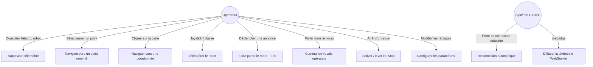
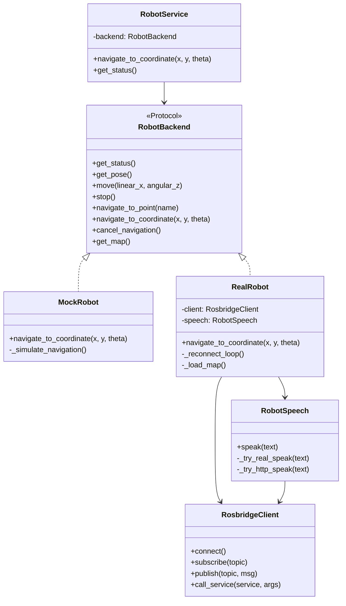
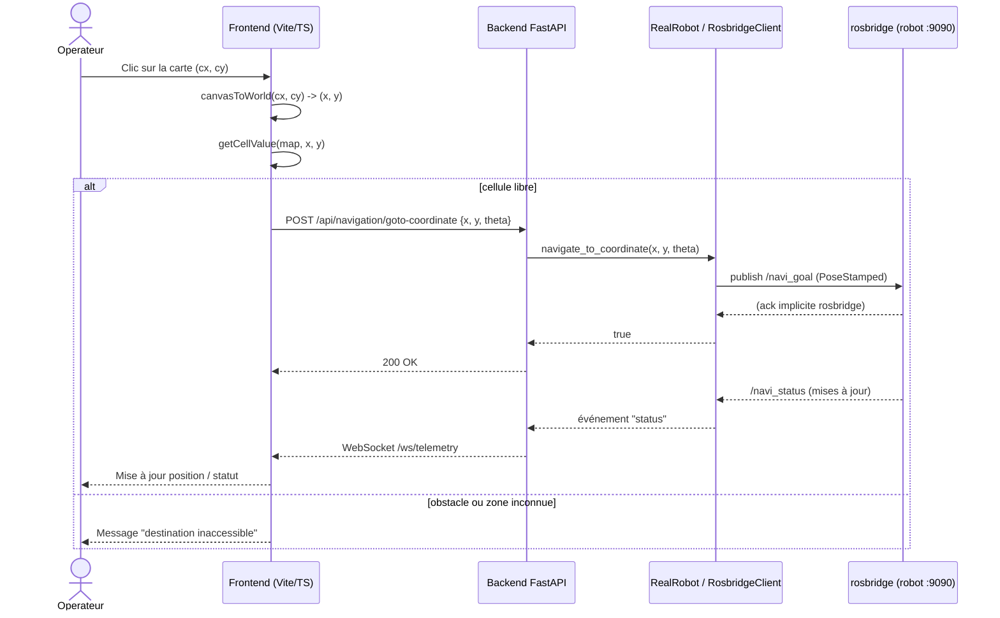
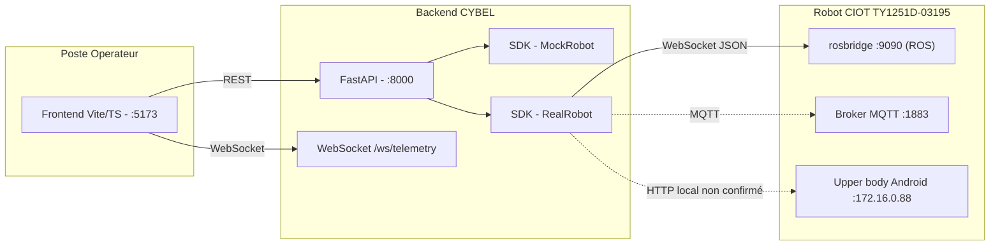

# Conception et développement d'une plateforme de commande et d'interaction autonome pour un robot de service Android

## Cas d'étude : robot de réception mobile CIOT TY1251D-03195 — Projet CYBEL

> Document de travail destiné à servir de base au rapport de stage (PFA, 3ᵉ année — Informatique et Intelligence Artificielle), réalisé dans le cadre du stage proposé par HESTIM Engineering & Business School (encadrant : Dr. Sridath Tula).
>
> Ce document suit le plan académique imposé. Les sections relevant de l'état d'avancement (Implémentation, Résultats, Analyse critique) reflètent l'état réel du projet au **12/06/2026**, soit le tout début du stage : elles décrivent un travail en cours et seront à compléter au fil de l'avancement, sans résultats inventés.

---

## Résumé

Les robots de service mobiles sont généralement livrés avec un écosystème logiciel fermé : application propriétaire, absence de documentation et de protocole de communication publié. Ce constat limite toute personnalisation par l'utilisateur final. Le projet **CYBEL**, mené dans le cadre d'un stage de fin d'année (PFA), vise à concevoir une plateforme de commande et d'interaction indépendante pour un robot de réception mobile **CIOT TY1251D-03195**, composé d'un châssis de navigation sous ROS et d'un « upper body » Android.

La démarche adoptée repose sur une **rétro-ingénierie incrémentale et non destructive** du protocole de communication interne du robot : balayage des services réseau exposés, introspection des topics et services ROS via `rosbridge`/`rosapi`, et vérification systématique de l'effectivité de chaque commande avant de la considérer comme fonctionnelle. Sur cette base, une **architecture en trois couches** a été conçue — un SDK Python proposant une implémentation simulée (*mock*) et une implémentation réelle interchangeables, une API **FastAPI** (REST + WebSocket) et une interface web **Vite/TypeScript**.

À ce stade du stage, la connectivité avec le robot est établie, le protocole de télémétrie, de commande de vitesse et de navigation autonome (par point nommé et par clic sur la carte, avec prise en compte des obstacles) a été reconstruit et intégré, et un mode de simulation complet permet un développement déconnecté du robot physique. La principale difficulté en cours concerne le canal de synthèse vocale (TTS) du robot, non exposé par ROS et nécessitant probablement un accès complémentaire au sous-système Android. Ce rapport présente le contexte, la problématique, l'état de l'art, la conception, la méthodologie, l'implémentation réalisée, les résultats intermédiaires obtenus, ainsi qu'une analyse critique des limites et perspectives du projet.

**Mots-clés** : robotique de service, rétro-ingénierie de protocole, ROS, rosbridge, FastAPI, interface homme-robot, navigation autonome, synthèse vocale.

## Abstract

Mobile service robots are typically delivered with a closed software ecosystem: proprietary application, no documentation, and no published communication protocol — which severely limits end-user customization. The **CYBEL** project, carried out as part of a final-year internship, aims to design an independent control and interaction platform for a **CIOT TY1251D-03195** mobile reception robot, composed of a ROS-based navigation chassis and an Android "upper body".

The approach relies on **incremental, non-destructive reverse engineering** of the robot's internal communication protocol: scanning exposed network services, introspecting ROS topics and services via `rosbridge`/`rosapi`, and systematically verifying that a command has a real effect before considering it functional. Based on this analysis, a **three-layer architecture** was designed — a Python SDK providing interchangeable mock and real implementations, a **FastAPI** API (REST + WebSocket), and a **Vite/TypeScript** web interface.

At this stage of the internship, connectivity with the robot has been established, and the telemetry, velocity control, and autonomous navigation protocols (goal point and map-click navigation, with obstacle awareness) have been reconstructed and integrated; a full simulation mode enables development decoupled from the physical robot. The main remaining difficulty concerns the robot's text-to-speech (TTS) channel, which is not exposed via ROS and likely requires additional access to the Android subsystem. This report presents the context, problem statement, related work, design, methodology, current implementation, intermediate results, and a critical analysis of the project's limitations and outlook.

**Keywords**: service robotics, protocol reverse engineering, ROS, rosbridge, FastAPI, human-robot interaction, autonomous navigation, text-to-speech.

---

## Table des matières

1. [Introduction](#1-introduction)
2. [Contexte](#2-contexte)
3. [Problématique](#3-problématique)
4. [Objectifs](#4-objectifs)
5. [Cahier des charges](#5-cahier-des-charges)
6. [Hypothèses](#6-hypothèses)
7. [État de l'art](#7-état-de-lart)
8. [Analyse et conception](#8-analyse-et-conception)
9. [Méthodologie](#9-méthodologie)
10. [Implémentation](#10-implémentation)
11. [Résultats](#11-résultats)
12. [Analyse critique](#12-analyse-critique)
13. [Conclusion](#13-conclusion)
14. [Bibliographie](#14-bibliographie)

---

## 1. Introduction

Les robots de service autonomes occupent une place croissante dans les environnements professionnels — accueil, guidage, télépresence — grâce à la maturité des technologies de navigation autonome (SLAM, planification de trajectoire) et d'interaction homme-robot (interfaces tactiles, synthèse et reconnaissance vocale). Cependant, ces robots sont généralement livrés avec un écosystème logiciel **fermé** : application propriétaire, protocole de communication non documenté, et absence d'API publique. Cette fermeture limite fortement la capacité des utilisateurs (entreprises, laboratoires, établissements de formation) à adapter le comportement du robot à leurs besoins spécifiques.

Le présent rapport documente le travail réalisé dans le cadre du projet **CYBEL**, qui consiste à concevoir une plateforme logicielle indépendante permettant de superviser, piloter et faire interagir un robot de réception mobile de modèle **CIOT TY1251D-03195**, sans dépendre de l'application Android propriétaire fournie par le constructeur. Le projet s'inscrit dans un stage de fin d'année (PFA) de trois à quatre mois, dont l'objectif déclaré est double : (1) procéder à une **rétro-ingénierie** du protocole de communication interne du robot, et (2) construire, sur la base de cette analyse, une **interface web de commande** dotée de fonctionnalités de navigation, de supervision et d'interaction (vocale et tactile).

Ce rapport présente successivement le contexte du projet, la problématique et les objectifs poursuivis, l'état de l'art des solutions existantes, l'analyse et la conception retenues, la méthodologie de travail, l'implémentation réalisée à ce stade, les résultats obtenus, une analyse critique des limites et difficultés rencontrées, ainsi que les perspectives d'amélioration.

---

## 2. Contexte

### 2.1 Le robot CIOT TY1251D-03195

Le robot étudié est un **robot de réception mobile** commercialisé sous la référence **CIOT TY1251D-03195**. Il est composé de deux sous-systèmes matériels distincts, reliés en interne :

- un **châssis de navigation** fonctionnant sous **Linux embarqué avec ROS** (Robot Operating System, distribution Noetic/Melodic), responsable de la localisation (SLAM), de la planification de trajectoire (`move_base`) et de l'exécution des commandes de mouvement ;
- un **« upper body » Android 7.1** (SoC RK3399, 2 Go de RAM, 16 Go de stockage), équipé d'un écran tactile 15,6" (1920×1080), de caméras (reconnaissance faciale, surveillance) et de haut-parleurs, qui héberge l'application propriétaire d'accueil et l'interface utilisateur standard du robot.

Le robot dispose d'un point d'accès WiFi propre (`TY1251D-03195`) permettant à un poste externe de rejoindre son réseau local et de communiquer avec le châssis (adresse `10.42.0.1`) et l'upper body Android (adresse `172.16.0.88`).

### 2.2 Origine du besoin

L'établissement disposant de ce robot souhaite l'utiliser pour des scénarios d'accueil et de démonstration personnalisés (annonces vocales spécifiques, déplacements vers des points définis par l'utilisateur, supervision à distance). L'application propriétaire installée sur l'upper body ne permet pas ce type de personnalisation : elle constitue une boîte noire, sans documentation, sans API exposée et sans code source disponible. Le constructeur ne fournit par ailleurs aucune documentation technique sur les protocoles de communication internes.

### 2.3 Cadre du stage

Le stage est encadré par HESTIM Engineering & Business School et s'adresse à des étudiants de 3ᵉ ou 4ᵉ année ayant des bases en réseaux, programmation et robotique. Il est prévu sur une durée de trois à quatre mois, structuré en quatre phases : compréhension de l'architecture et établissement de la connectivité réseau, exploration et analyse du protocole, développement de l'interface de commande et des modules d'interaction, puis intégration, tests et validation finale.

---

## 3. Problématique

La problématique centrale du projet peut être formulée ainsi :

> **Comment concevoir une plateforme de commande et d'interaction tierce, fonctionnellement équivalente ou supérieure à l'application propriétaire d'un robot de service Android, en l'absence de toute documentation officielle sur ses interfaces de communication internes ?**

Cette problématique se décline en plusieurs sous-questions :

- Quels sont les **points d'accès réseau** (adresses IP, ports, protocoles) exposés par le robot, et lesquels sont effectivement exploitables sans authentification propriétaire ?
- Quel est le **format des messages** échangés entre l'interface Android et le système de navigation (ROS), et peut-il être reconstruit par observation et introspection plutôt que par décompilation de l'application ?
- Comment **distinguer une commande effectivement traitée par le robot d'une commande silencieusement ignorée**, dans un système où le protocole de transport (ici rosbridge) ne renvoie pas systématiquement d'erreur explicite ?
- Comment concevoir une architecture logicielle qui reste **utilisable et testable sans accès permanent au robot physique** (contraintes de disponibilité du matériel), tout en restant fidèle au comportement réel une fois connectée ?
- Dans quelle mesure les fonctionnalités d'**interaction homme-robot** (synthèse vocale, reconnaissance vocale, retour visuel) peuvent-elles être reconstruites lorsque le canal correspondant n'est pas exposé par le système de navigation (ROS) et nécessite un accès direct au sous-système Android ?

---

## 4. Objectifs

### 4.1 Objectifs généraux

- Concevoir et développer une **plateforme web indépendante** de commande, de supervision et d'interaction pour le robot CIOT TY1251D-03195, ne dépendant pas de l'application Android propriétaire.
- Documenter de façon rigoureuse, au fil du projet, le **protocole de communication** reconstruit (endpoints, topics, services, formats de messages), afin que ce travail puisse être réutilisé ou étendu.

### 4.2 Objectifs spécifiques

1. **Établir la connectivité** avec le robot (réseau WiFi dédié, identification des hôtes et ports actifs).
2. **Identifier les points de communication** exposés : WebSocket `rosbridge` (port 9090), broker `MQTT` (port 1883), services FTP/SSH, interfaces web internes (`:8082`, `:8088`).
3. **Capturer et analyser le trafic réseau** afin de reconstituer les topics et services ROS pertinents (mouvement, navigation, télémétrie, capteurs).
4. **Décoder et reconstruire les commandes de contrôle** du mouvement et de la navigation (vitesse, position cible, annulation de trajectoire).
5. **Développer une interface de commande web** (backend FastAPI + frontend TypeScript) permettant la supervision temps réel et l'envoi de commandes.
6. **Implémenter des fonctionnalités d'interaction homme-robot de base** : navigation par sélection de points/clic sur carte, retour vocal (TTS) et commande vocale opérateur.
7. **Mettre en place un mode de simulation (« mock »)** permettant de développer et tester l'interface sans dépendre de la disponibilité physique du robot.
8. **Intégrer l'ensemble des composants** (SDK Python, API, interface web) dans un système cohérent et démontrable.

---

## 5. Cahier des charges

### 5.1 Présentation synthétique

Le présent cahier des charges formalise le périmètre, les exigences et les contraintes du projet **CYBEL**, à destination de l'établissement d'accueil et de l'encadrant de stage. Il sert de référence pour évaluer, en fin de stage, l'adéquation entre le travail livré et les besoins exprimés.

### 5.2 Périmètre du projet

| Inclus dans le périmètre | Exclu du périmètre |
|---|---|
| Identification et documentation des canaux de communication du robot (`rosbridge`, MQTT, services réseau) | Modification du firmware ou du logiciel embarqué du robot |
| Développement d'un SDK Python d'accès au robot (mode simulé et mode réel) | Développement d'une application Android de remplacement (optionnel, non engagé) |
| Développement d'une API de commande/supervision (FastAPI) | Décompilation ou rétro-ingénierie de l'application Android propriétaire |
| Développement d'une interface web opérateur (Vite/TypeScript) | Déploiement en production / hébergement distant |
| Fonctionnalités de navigation (point nommé, clic sur carte, téléopération) | Comportements autonomes avancés (planification de mission, multi-robot) |
| Interaction de base : synthèse vocale du robot (TTS) et commande vocale opérateur | Vision par caméra, reconnaissance faciale, chatbot (extensions optionnelles) |
| Documentation technique et rapport de stage | Formation des utilisateurs finaux / exploitation au long cours |

### 5.3 Acteurs et parties prenantes

| Acteur | Rôle |
|---|---|
| **Étudiant(e) stagiaire** | Conception, développement, rétro-ingénierie, rédaction du rapport |
| **Encadrant académique** (Dr. Sridath Tula, HESTIM) | Suivi pédagogique, validation des objectifs et du rapport |
| **Établissement d'accueil** | Mise à disposition du robot et de l'environnement de travail |
| **Opérateur final** (utilisateur de l'interface) | Supervision et pilotage du robot via la plateforme CYBEL |
| **Robot CIOT TY1251D-03195** | Système cible, agit comme « serveur » de télémétrie et de commandes via `rosbridge`/MQTT |

### 5.4 Besoins fonctionnels et non fonctionnels

Le recueil détaillé des besoins fonctionnels et non fonctionnels est présenté en §8.1 (Analyse et conception). Il est synthétisé ici sous forme d'exigences numérotées, utilisées comme référentiel pour le suivi d'avancement :

| Réf. | Exigence | Priorité |
|---|---|---|
| EF-01 | Superviser en temps réel l'état du robot (batterie, position, statut, mode de navigation) | Essentielle |
| EF-02 | Afficher la carte SLAM, le LiDAR et les personnes détectées | Essentielle |
| EF-03 | Naviguer vers un point nommé prédéfini | Essentielle |
| EF-04 | Naviguer vers une coordonnée choisie par clic sur la carte, avec prise en compte des obstacles | Essentielle |
| EF-05 | Téléopérer manuellement le robot (vitesse linéaire/angulaire) avec arrêt d'urgence | Essentielle |
| EF-06 | Déclencher une annonce vocale sur le robot (TTS) | Souhaitable |
| EF-07 | Donner des commandes vocales à l'opérateur via le micro du navigateur | Souhaitable |
| EF-08 | Configurer les paramètres de fonctionnement (vitesse, mode de déplacement) | Souhaitable |
| EF-09 | Fonctionner en mode simulation complet sans robot connecté | Essentielle |
| ENF-01 | Latence d'affichage de la télémétrie de l'ordre de quelques centaines de ms maximum | Essentielle |
| ENF-02 | Reconnexion automatique au robot après perte de connexion réseau | Essentielle |
| ENF-03 | Séparation stricte entre couche d'accès robot (SDK), API et présentation | Essentielle |
| ENF-04 | Toute commande de mouvement/navigation doit être annulable à tout moment | Essentielle |
| ENF-05 | Aucune action exploratoire (scripts de rétro-ingénierie) ne doit perturber le fonctionnement normal du robot | Essentielle |

### 5.5 Contraintes

- **Contraintes techniques** : absence de documentation officielle du protocole ; dépendance à un réseau WiFi dédié et potentiellement instable (latence variable, de 7 à 1654 ms observés) ; version Android embarquée obsolète (7.1) limitant les outils de débogage disponibles.
- **Contraintes matérielles** : un seul exemplaire de robot disponible, partagé avec d'autres usages de l'établissement — disponibilité limitée pour les tests.
- **Contraintes organisationnelles** : durée du stage limitée à trois-quatre mois ; étudiant unique sur le projet ; encadrement académique périodique.
- **Contraintes de sécurité et d'éthique** : les canaux `rosbridge` et MQTT du robot étant accessibles sans authentification, toute manipulation doit respecter un principe de **précaution** (vérification en mode simulation avant toute commande réelle, mécanisme d'annulation disponible) ; les tentatives d'accès aux comptes système (SSH/FTP) doivent rester mesurées pour ne pas provoquer de blocage d'accès légitime (limitation anti-bruteforce constatée).
- **Contraintes de propriété intellectuelle** : aucune décompilation du logiciel propriétaire n'est entreprise ; seule l'observation du trafic réseau et l'introspection des interfaces standard (ROS, MQTT) sont utilisées.

### 5.6 Livrables attendus

Conformément au sujet de stage, les livrables attendus en fin de projet sont :

1. Une **interface de communication fonctionnelle** avec le robot (SDK + client `rosbridge`/MQTT).
2. Un **système de contrôle du mouvement** opérationnel (téléopération + navigation).
3. Une **interface utilisateur** web opérateur.
4. Un **module d'interaction de base** (tactile et/ou vocal).
5. Un **rapport technique** incluant l'architecture du système et l'analyse du protocole (le présent document).

### 5.7 Critères de réception / validation

| Critère | Modalité de vérification |
|---|---|
| Connexion au robot établie de manière reproductible | Connexion `rosbridge` réussie depuis le réseau WiFi du robot, vérifiable via `/rosapi/topics` |
| Télémétrie affichée en temps réel | Observation visuelle du tableau de bord (position, batterie, statut) à jour |
| Navigation vers un point/une coordonnée | Envoi d'une commande de navigation suivie d'un changement d'état (`/navi_status`) cohérent |
| Téléopération et arrêt d'urgence | Test en mode simulation puis, si possible, sur robot réel à vitesse réduite |
| Fonctionnement en mode simulation | Lancement de l'interface avec `ROBOT_MOCK=true`, toutes les fonctionnalités principales accessibles |
| Interaction vocale | TTS robot **ou** solution de repli (voix opérateur via navigateur) fonctionnelle |
| Documentation | Présence et cohérence de `README.md`, `docs/INTERFACE.md` et du présent rapport |

---

## 6. Hypothèses

Le travail de rétro-ingénierie et de conception repose sur les hypothèses de travail suivantes, formulées en début de projet et confrontées aux observations au fil de l'avancement :

- **H1 — Exposition d'une passerelle ROS standard.** Le châssis du robot, fonctionnant sous ROS, expose une passerelle `rosbridge` (protocole JSON sur WebSocket) accessible depuis le réseau WiFi du robot sans authentification, ce qui permettrait d'observer et de piloter le système de navigation sans passer par l'application Android.
- **H2 — Stabilité et documentation indirecte du protocole rosbridge.** Le protocole `rosbridge_suite` étant un standard ouvert et documenté (Robot Web Tools), les messages observés sur le réseau peuvent être interprétés à l'aide de cette documentation générique, même si les *topics* et *types de messages* spécifiques au constructeur (préfixés `yutong_assistance`, etc.) restent, eux, propriétaires et à découvrir par introspection (`/rosapi/*`).
- **H3 — Séparation possible entre commande de mouvement bas niveau et navigation haut niveau.** Le robot distingue un canal de téléopération directe (vitesse linéaire/angulaire) et un canal de navigation autonome (objectif de pose géré par une pile `move_base`), tous deux potentiellement accessibles via `rosbridge`.
- **H4 — Le succès apparent d'une publication `rosbridge` ne garantit pas son traitement effectif.** Un message publié sur un topic sans abonné réel sera accepté par `rosbridge` sans erreur, ce qui impose de vérifier l'existence d'abonnés/services réels (via `/rosapi/subscribers`, `/rosapi/services`) avant de considérer une commande comme « exécutée ».
- **H5 — L'interaction vocale (TTS) peut nécessiter un accès hors du périmètre ROS.** Si aucun topic ou service ROS ne correspond à une fonction de synthèse vocale, celle-ci est probablement gérée nativement par le sous-système Android (upper body), nécessitant un accès complémentaire (HTTP local, ADB, ou accès système) pour être déclenchée depuis la plateforme CYBEL.
- **H6 — Une architecture « mock / réel » découplée permet un développement continu.** En isolant la logique métier derrière une interface commune (`RobotBackend`), il est possible de développer et de valider l'essentiel de l'interface utilisateur via un simulateur logiciel, indépendamment des contraintes d'accès physique au robot.

---

## 7. État de l'art

### 7.1 Solutions existantes

| Solution | Description | Accessibilité |
|---|---|---|
| **Application propriétaire (upper body Android)** | Interface tactile fournie par le constructeur (CIOT/Yutong), gère accueil, navigation par points prédéfinis, TTS | Fermée, sans documentation, sans API |
| **Interface de déploiement web (`:8082`, Vue.js)** | Interface web embarquée dédiée au scan/édition de cartes SLAM | Accessible sur le réseau du robot, non documentée, usage limité à la cartographie |
| **Interface de debug CSST (`:8088`)** | Interface de diagnostic interne, en chinois | Accessible mais non documentée, fonction exacte non déterminée |
| **rosbridge_suite + roslibjs / RViz / Foxglove Studio** | Outils génériques de l'écosystème ROS permettant de visualiser topics, services et de publier des messages | Open-source, documentés, mais génériques (pas de logique métier « accueil »bm, pas d'UI orientée opérateur) |
| **SDK/plateformes de robots de réception commerciaux (ex. Temi, OrionStar, Pepper)** | Plateformes propriétaires avec SDK officiel pour développeurs tiers | SDK documenté mais verrouillé à l'écosystème du fabricant, modèle différent (pas de rosbridge) |

### 7.2 Étude bibliographique

La conception de la plateforme s'appuie sur plusieurs corpus de référence :

- **Architecture logicielle robotique** : le modèle de communication par *topics/services/actions* publié par **Quigley et al. (2009)** dans la présentation fondatrice de ROS constitue la base conceptuelle de l'analyse du trafic observé (distinction *publish/subscribe* vs *appel de service synchrone*).
- **Navigation autonome et cartes d'occupation** : les concepts de grille d'occupation (*occupancy grid*) et de planification locale/globale (*costmaps*, DWA) utilisés pour interpréter la pile `move_base` du robot et pour implémenter la pré-vérification d'obstacles côté interface sont décrits dans l'ouvrage de référence **Thrun, Burgard & Fox — *Probabilistic Robotics* (2005)**.
- **Protocole rosbridge** : la spécification du protocole JSON `rosbridge` (opérations `subscribe`, `publish`, `call_service`, `advertise`) ainsi que les services d'introspection `rosapi` (liste des topics, services, types, abonnés) sont documentés par le projet **Robot Web Tools / rosbridge_suite**, utilisé comme référence pour interpréter et reconstruire les échanges observés.
- **Interaction Homme-Robot (HRI)** : les principes de conception d'interfaces de supervision robotique (retour d'état temps réel, primauté de l'arrêt d'urgence, feedback explicite des actions) guident les choix d'ergonomie de l'interface CYBEL.
- **Sécurité des objets connectés** : la problématique des canaux de communication non authentifiés (rosbridge, MQTT sans authentification) observée sur le robot est mise en perspective avec les recommandations générales de l'**OWASP IoT Top 10**, qui seront discutées dans l'analyse critique.

### 7.3 Benchmark concurrentiel

| Critère | Application propriétaire | RViz / Foxglove (générique ROS) | CYBEL (solution développée) |
|---|---|---|---|
| Documentation / code source | Aucune | Open-source, bien documenté | Documenté au fil du projet (ce rapport + `README.md`) |
| Accès distant (web) | Non (écran local uniquement) | Partiel (Foxglove web) | Oui (navigateur, réseau WiFi du robot) |
| Personnalisation des scénarios d'accueil | Non | Non (outil générique) | Oui (objectif du projet) |
| Mode simulation sans robot | Non | Partiel (rejouer des enregistrements) | Oui (mode *mock* dédié) |
| Navigation par clic sur carte | Oui (propriétaire) | Oui (générique, RViz) | Oui (développé, avec pré-vérification d'obstacles) |
| Interaction vocale (TTS/voix opérateur) | Oui (propriétaire, fermé) | Non | Partiel / en cours (TTS robot non encore résolu, voix opérateur via Web Speech API fonctionnelle) |

### 7.4 Limites des solutions actuelles

- L'application propriétaire offre une expérience complète mais **non extensible** : aucun moyen d'ajouter de nouveaux scénarios, de nouveaux points de navigation programmatiques, ou d'intégrer le robot dans un système d'information tiers.
- Les outils génériques ROS (RViz, Foxglove) permettent d'observer et de piloter le robot au niveau **bas niveau** (topics bruts), mais ne fournissent aucune **logique métier** (scénarios d'accueil, gestion d'état applicatif, persistance des points nommés côté opérateur).
- Aucune des solutions existantes ne propose de **mode de développement déconnecté** du robot physique, ce qui constitue un frein important dans un contexte de stage où l'accès au matériel est partagé et limité dans le temps.
- La documentation constructeur étant inexistante, toute évolution nécessite un travail de rétro-ingénierie répété — d'où l'importance de **capitaliser** les découvertes (topics, services, formats) dans une documentation structurée (`README.md`, ce rapport).

---

## 8. Analyse et conception

### 8.1 Recueil des besoins

#### Besoins fonctionnels

- **Supervision temps réel** : afficher l'état du robot (batterie, mode de navigation, vitesse, position, niveau de localisation), la carte SLAM, les obstacles détectés par le LiDAR et les personnes détectées.
- **Navigation** : permettre à l'opérateur de déplacer le robot vers un point nommé prédéfini, ou vers une coordonnée choisie directement sur la carte, avec gestion automatique des obstacles via la pile de navigation du robot.
- **Téléopération manuelle** : permettre un contrôle direct (vitesse linéaire/angulaire) via clavier ou interface tactile, avec arrêt d'urgence.
- **Interaction** : déclencher des annonces vocales (TTS) sur le robot, et permettre à l'opérateur de dicter des commandes via la reconnaissance vocale du navigateur.
- **Configuration** : ajuster les paramètres de fonctionnement (vitesse, mode de déplacement) depuis l'interface.
- **Mode simulation** : pouvoir développer/tester toute l'interface sans robot connecté.

#### Besoins non fonctionnels

- **Faible latence** d'affichage de la télémétrie (ordre de grandeur de quelques centaines de millisecondes maximum).
- **Robustesse à la déconnexion** : reconnexion automatique au robot en cas de perte du WiFi, sans nécessiter de redémarrage manuel du backend.
- **Séparation claire** entre la couche d'accès au robot (SDK) et la couche présentation (API/UI), pour faciliter les tests et l'évolution.
- **Innocuité par défaut** : toute commande de mouvement ou de navigation doit être vérifiable et annulable (`cancel`), et les fonctionnalités exploratoires (scripts de rétro-ingénierie) ne doivent pas interférer avec le fonctionnement normal du robot.

### 8.2 Cas d'utilisation



**Description du principal cas d'utilisation — Naviguer vers une coordonnée cliquée sur la carte :**

1. L'opérateur clique sur un point de la carte SLAM affichée dans l'interface.
2. Le frontend convertit les coordonnées du canevas (pixels) en coordonnées du repère de la carte (mètres), via la transformation inverse de l'affichage (`canvasToWorld`).
3. Le frontend vérifie localement, à partir de la grille d'occupation, que la cellule cible n'est ni un obstacle (valeur ≥ seuil) ni une zone inconnue (valeur = -1) ; si c'est le cas, le clic est rejeté avec un message explicite.
4. Le frontend calcule une orientation cible (`theta`) à partir de la pose courante du robot et du point cliqué.
5. Le frontend appelle l'API `POST /api/navigation/goto-coordinate` avec `{x, y, theta}`.
6. Le backend délègue à la couche SDK (`RealRobot.navigate_to_coordinate`), qui publie un message `geometry_msgs/PoseStamped` sur le topic `/navi_goal`.
7. La pile de navigation du robot (`move_base`) prend en charge la planification de trajectoire et l'évitement d'obstacles dynamiques.
8. La progression est suivie via le topic `/navi_status`, diffusé en temps réel à l'interface par WebSocket.

### 8.3 Diagrammes UML

#### Diagramme de classes (architecture SDK / backend)



#### Diagramme de séquence (navigation par clic sur la carte)



#### Diagramme de composants (vue d'ensemble)



### 8.4 Architecture logicielle

L'architecture retenue est une architecture **en trois couches**, calquée sur la structure du dépôt :

1. **Couche SDK (`sdk/`)** : couche d'abstraction du robot, indépendante de tout framework web. Elle définit :
   - les modèles de données partagés (`models.py`, basés sur Pydantic) ;
   - les constantes du protocole reconstruit (`constants.py` : topics, services, codes d'état) ;
   - le client `rosbridge` générique (`rosbridge.py`) ;
   - deux implémentations interchangeables d'un même contrat (`RobotBackend`) : `MockRobot` (simulateur) et `RealRobot` (adaptateur vers le robot physique).

2. **Couche API (`backend/`)** : application **FastAPI** exposant :
   - des routes REST (`routers/robot.py`, `navigation.py`, `map.py`, `settings.py`, `speech.py`, `reception.py`) pour les actions ponctuelles ;
   - un canal **WebSocket** (`/ws/telemetry`) pour la diffusion continue de l'état du robot ;
   - une façade `RobotService` qui sélectionne `MockRobot` ou `RealRobot` selon la configuration (`ROBOT_MOCK`).

3. **Couche présentation (`frontend/`)** : application **Vite + TypeScript** (sans framework, rendu par templates HTML générés en chaînes de caractères), organisée autour d'un état global (`state.ts`) mis à jour par le flux WebSocket (`telemetry.ts`) et par les réponses REST (`api.ts`), avec des composants dédiés (carte, barre de statut, panneau d'accueil/TTS, contrôles de téléopération, page de paramètres).

Ce découpage permet à la couche présentation et à la couche API d'être développées et testées **sans dépendance au robot physique** (via `MockRobot`), tandis que la couche `RealRobot` encapsule toute la complexité du protocole reconstruit par rétro-ingénierie.

### 8.5 Choix technologiques

| Choix | Alternatives envisagées | Justification |
|---|---|---|
| **FastAPI** (Python, async) | Flask, Django REST Framework | Support natif d'`asyncio` et des WebSockets, indispensable pour relayer en continu la télémétrie `rosbridge` (elle-même asynchrone) sans bloquer le serveur ; validation des données via Pydantic, cohérente avec les modèles du SDK. |
| **rosbridge (WebSocket JSON)** comme canal principal | Pont ROS custom, accès direct aux topics ROS via DDS | `rosbridge` est déjà exposé par le robot (port 9090) sans configuration supplémentaire ; protocole texte (JSON), facilement observable et débogable, documenté par `rosbridge_suite`. |
| **TypeScript + Vite, sans framework UI** | React, Vue (recommandés initialement) | Réduction de la surface technique pour un projet porté par un développeur unique en début de stage ; démarrage à chaud quasi instantané (HMR Vite) ; suffisant pour le volume d'interactions de l'interface actuelle. Réévaluable si la complexité de l'UI augmente. |
| **Architecture Mock/Réel via un `Protocol`** | Tests avec robot physique uniquement | Permet un développement continu indépendamment de la disponibilité du robot (contrainte forte en contexte de stage), et fournit un environnement de démonstration reproductible. |
| **MQTT (paho-mqtt)** comme canal secondaire | Ignorer le broker MQTT | Le broker `:1883` étant déjà actif et non authentifié sur le robot, son observation passive permet de corroborer/enrichir la télémétrie obtenue via `rosbridge`. |

---

## 9. Méthodologie

### 9.1 Méthodes utilisées

La méthodologie de travail combine deux démarches complémentaires :

1. **Rétro-ingénierie incrémentale par introspection et observation**, plutôt que par décompilation de l'application Android (non réalisée, pour des raisons de temps et de licéité). Cette démarche s'appuie sur :
   - un **balayage de ports** (`scan`) sur les hôtes du réseau du robot pour identifier les services actifs ;
   - l'utilisation des **services d'introspection natifs de ROS** (`/rosapi/topics`, `/rosapi/services`, `/rosapi/message_details`, `/rosapi/subscribers`) pour lister exhaustivement les topics et services disponibles, leurs types et leurs abonnés réels — évitant ainsi de devoir capturer du trafic au niveau paquet pour découvrir la structure de l'API ;
   - l'**écoute passive** de tous les topics/canaux (`subscribe '#'` en MQTT, abonnement générique en rosbridge) avant toute tentative de publication, afin de ne risquer aucune interférence avec le fonctionnement du robot ;
   - la **vérification systématique de l'effet réel** d'une commande (existence d'abonnés/services) avant de la considérer comme fonctionnelle — règle directement issue de l'hypothèse H4.

2. **Développement incrémental « mock-first »** : chaque nouvelle fonctionnalité est d'abord implémentée et validée dans `MockRobot` (comportement simulé), puis portée dans `RealRobot` une fois le protocole correspondant identifié, ce qui découple le rythme de développement de l'interface du temps d'accès au robot physique.

### 9.2 Justification des choix techniques, de l'architecture et des outils

- **Choix techniques** : voir tableau §8.5. Le critère commun est la **minimisation de la complexité ajoutée** par rapport au strict nécessaire, dans un contexte où le système distant (le robot) introduit déjà une complexité importante et largement non maîtrisée.
- **Architecture retenue** : la séparation SDK / API / UI (§8.4) répond directement au besoin non-fonctionnel de testabilité et à la contrainte de disponibilité limitée du robot physique.
- **Outils utilisés** :
  - **Git** pour le suivi de version et la traçabilité des découvertes successives (chaque script de rétro-ingénierie et chaque évolution de protocole est versionné) ;
  - **Scripts Python dédiés** (`scripts/`) à chaque étape de découverte (ex. `ros_explore.py`, `mqtt_listen.py`, `robot_status.py`, `introspect.py`), conservés comme **journal de bord exécutable** de la rétro-ingénierie ;
  - **uvicorn** (serveur ASGI) avec rechargement à chaud (`--reload`) pour itérer rapidement sur le backend ;
  - **Assistant de programmation IA (Claude Code)** utilisé en binôme pour accélérer l'exploration du protocole, la rédaction du code d'intégration et la documentation, sous supervision et validation de l'étudiant à chaque étape (en particulier avant toute action ayant un effet sur le robot physique).

### 9.3 Ressources matérielles

| Ressource | Détails |
|---|---|
| Robot | CIOT TY1251D-03195 — châssis Linux/ROS + upper body Android 7.1 (RK3399, 2 Go RAM, 16 Go ROM), écran tactile 15,6" 1920×1080, LiDAR, caméra RGBD, capteurs ultrason, gyroscope 6 axes, batterie 24V/20Ah (~8h d'autonomie) |
| Réseau | Point d'accès WiFi dédié du robot (`TY1251D-03195`) ; latence observée variable (≈7 à 1654 ms) |
| Poste de développement | PC sous Windows 11, connecté au WiFi du robot pour les phases de test en conditions réelles |

### 9.4 Ressources logicielles

| Catégorie | Outils / Bibliothèques |
|---|---|
| Langages | Python 3.13, TypeScript |
| Backend | FastAPI, uvicorn, websockets, pydantic, pydantic-settings, httpx |
| Frontend | Vite, TypeScript (sans framework UI), Web Speech API (navigateur) |
| Communication robot | Protocole `rosbridge` (JSON/WebSocket), `paho-mqtt` |
| Outils de rétro-ingénierie | scripts Python dédiés (sockets, `paramiko` pour diagnostics SSH, `ftplib`) |
| Gestion de projet | Git / dépôt versionné, documentation Markdown (`README.md`, `docs/INTERFACE.md`) |

### 9.5 Planning prévisionnel

Le planning ci-dessous reprend les quatre phases proposées dans le sujet de stage, sur une durée totale indicative de quatre mois (juin → septembre 2026). L'avancement réel à la date de rédaction (12/06/2026) se situe au tout début de la phase 2, certains éléments de la phase 3 ayant déjà été amorcés en parallèle (développement mock-first).

| Phase | Période indicative | Activités prévues | État au 12/06/2026 |
|---|---|---|---|
| **Phase 1 — Connectivité** | Semaines 1–2 | Compréhension de l'architecture matérielle, connexion au réseau WiFi du robot, identification des hôtes et ports actifs | **Réalisée** : connectivité établie, ports 21/22/1883/9090 identifiés sur `10.42.0.1` |
| **Phase 2 — Exploration protocolaire** | Semaines 2–6 | Introspection ROS (`rosapi`), identification des topics/services de mouvement, navigation, télémétrie ; exploration MQTT ; exploration des canaux d'interaction (TTS) | **En cours** : topics de navigation (`/navi_goal`, `/navi_status`), de télémétrie et de commande de vitesse identifiés ; canal TTS non encore localisé |
| **Phase 3 — Développement de l'interface** | Semaines 5–12 | Backend FastAPI (SDK mock + réel), frontend Vite/TS, fonctionnalités de supervision, navigation, téléopération, interaction | **Amorcée en parallèle** : backend, frontend, supervision temps réel, navigation par point et par clic sur carte, mode mock opérationnels |
| **Phase 4 — Intégration, tests, validation** | Semaines 12–16 | Intégration complète, tests sur robot réel, rédaction du rapport final, démonstration | **Non commencée** |

---

## 10. Implémentation

### 10.1 Fonctionnalités développées (état au 12/06/2026)

- **Connexion et reconnexion automatique au robot** via `rosbridge` (`RosbridgeClient`), avec gestion explicite de l'état de connexion et rechargement de la carte lors d'une reconnexion.
- **Tableau de bord opérateur** : barre de statut (batterie, mode, vitesse, niveau de matching de localisation), panneau latéral (liste des points de navigation, journal d'événements), panneau carte.
- **Carte SLAM interactive** : affichage de la grille d'occupation, overlay LiDAR, position du robot en temps réel, et **navigation par clic** :
  - conversion des coordonnées écran → coordonnées monde (`canvasToWorld`) ;
  - lecture de la valeur de la cellule de la grille d'occupation (`getCellValue`) et **rejet préventif** des clics sur obstacle (seuil `OCCUPANCY_OBSTACLE_THRESHOLD = 65`) ou zone inconnue (`-1`) ;
  - calcul automatique de l'orientation cible à partir de la pose courante ;
  - envoi de l'objectif via `POST /api/navigation/goto-coordinate`, publication ROS sur `/navi_goal` (`geometry_msgs/PoseStamped`), prise en charge de l'évitement d'obstacles dynamiques par la pile `move_base` du robot.
- **Navigation par point nommé** (`/api/navigation/goto`) et **annulation de trajectoire** (`/api/navigation/cancel`).
- **Téléopération manuelle** (vitesse linéaire/angulaire) avec gestion de l'arrêt d'urgence.
- **Module de synthèse vocale (TTS) avec vérification d'effectivité** : la couche `RobotSpeech` tente plusieurs topics/services ROS connus, mais **ne les considère valides que s'ils possèdent un abonné ou un service réel** (`/rosapi/subscribers`, `/rosapi/services`), corrigeant un défaut initial où une publication sans effet était signalée comme un succès.
- **Commande vocale opérateur** côté navigateur via la Web Speech API (`voice.ts`).
- **Page de paramètres** (vitesse, mode de déplacement).
- **Mode simulation complet (`MockRobot`)** reproduisant la navigation, la télémétrie et la synthèse vocale pour le développement hors connexion au robot.
- **Outillage de rétro-ingénierie versionné** (`scripts/`) : découverte de ports/services, introspection ROS, écoute MQTT passive, tests de connexion SSH/FTP/ADB pour les canaux non encore résolus (TTS, accès système).

### 10.2 Captures d'écran

> *À insérer dans le rapport final :*
> - capture du tableau de bord en mode simulation (`ROBOT_MOCK=true`) ;
> - capture de la carte SLAM avec un clic de navigation en cours et le tracé vers la destination ;
> - capture du panneau d'accueil / synthèse vocale ;
> - capture de la page de paramètres.
>
> Ces captures seront réalisées au fur et à mesure de la stabilisation de l'interface, en conditions réelles (robot connecté) et simulées.

### 10.3 Architecture finale (état courant)

```
cybel/
├── sdk/                # Couche robot réutilisable (mock + réel + protocole)
├── backend/            # API FastAPI (REST + WebSocket /ws/telemetry)
├── frontend/           # Interface opérateur (Vite + TypeScript)
├── scripts/            # Journal exécutable de rétro-ingénierie
└── docs/               # Documentation (README, guide interface, rapport)
```

Cette architecture correspond à celle décrite en §8.4 ; elle n'a pas connu de remise en cause structurelle depuis le début du projet, seules de nouvelles fonctionnalités (navigation par clic, vérification d'effectivité TTS, reconnexion automatique) ayant été ajoutées dans le cadre existant — ce qui constitue un premier indicateur positif sur la pertinence du découpage initial.

---

## 11. Résultats

> Conformément aux consignes académiques, cette section décrit **uniquement l'état réellement constaté à ce jour** (12/06/2026), sans anticiper de résultats non obtenus. Le projet étant en phase initiale (début de la phase 2 sur 4), les résultats ci-dessous sont des **résultats intermédiaires**.

### 11.1 Fonctionnalités obtenues

- Connectivité réseau établie et caractérisée : 4 services actifs identifiés sur le châssis (`10.42.0.1`) — FTP (21), SSH (22), MQTT (1883), `rosbridge` (9090).
- Protocole `rosbridge` exploité avec succès pour : la télémétrie (position, statut, batterie, LiDAR), la commande de vitesse, et la navigation vers un objectif de pose (`/navi_goal`, confirmé avec un abonné réel `/node_manager` via `/rosapi/subscribers`).
- Pile de navigation `move_base` confirmée présente et fonctionnelle (gestion native de l'évitement d'obstacles), ce qui a permis de **ne pas développer de planificateur de trajectoire custom** côté CYBEL — la responsabilité de l'évitement dynamique reste côté robot, CYBEL se limitant à un filtrage préventif basé sur la carte statique.
- Interface web fonctionnelle en mode simulation et en mode robot réel, avec bascule par variable d'environnement (`ROBOT_MOCK`).
- Identification d'un défaut de conception initial (statut « connecté » non rafraîchi après perte effective de la connexion `rosbridge`) et correction apportée dans la boucle de reconnexion.

### 11.2 Performances

Les valeurs suivantes correspondent à des **observations** ou à des **fréquences configurées** dans le code, et non à des bancs de mesure formels (qui restent à mettre en place en phase 4) :

| Élément | Valeur observée / configurée |
|---|---|
| Latence réseau WiFi robot | Variable, de l'ordre de 7 à 1654 ms selon les observations |
| Fréquence de mise à jour de la pose (`/robot_pose`) | ~10 Hz (throttle configuré) |
| Fréquence de mise à jour du statut (`/robot_status`) | ~2 Hz |
| Fréquence des données LiDAR filtrées (`/scan_filter`) | ~25 Hz |
| Seuil de détection d'obstacle (grille d'occupation) | valeur ≥ 65 (sur une échelle 0–100), ou -1 (zone inconnue) |

### 11.3 Indicateurs mesurables (état courant)

- **Topics/services ROS identifiés et documentés** : une dizaine de topics en lecture, trois topics de commande et plusieurs services `rosapi`/`move_base` recensés dans `README.md`.
- **Endpoints REST développés** : endpoints couvrant le statut robot, la pose, le mouvement, l'arrêt d'urgence, la navigation (par point et par coordonnée), l'annulation, la carte, les paramètres et la synthèse vocale.
- **Couverture mock/réel** : chaque fonctionnalité de navigation dispose d'une implémentation simulée (`MockRobot`) et d'une implémentation réelle (`RealRobot`), vérifiée par compilation (`py_compile`) et vérification de types côté frontend (`tsc --noEmit`).
- **Canal d'interaction vocale (TTS robot)** : non encore identifié — indicateur à 0 sur 1 canal candidat validé à ce stade ; plusieurs voies d'investigation actives (cf. §12).

---

## 12. Analyse critique

### 12.1 Limites

- **Absence persistante de canal TTS confirmé côté robot** : malgré une introspection exhaustive des topics, services et nœuds ROS (recherche de toute occurrence liée à « tts », « voice », « speech », « audio », « sound », « speak », etc.), aucun canal de synthèse vocale n'a été trouvé côté ROS. La fonction de synthèse vocale de l'application propriétaire est donc très probablement gérée **nativement par le sous-système Android**, hors du périmètre `rosbridge`.
- **Accès complémentaire au sous-système Android non résolu** : le port ADB réseau (5555) de l'upper body Android est fermé, et aucun service HTTP n'a été détecté sur les ports usuels. L'accès via débogage USB (ADB filaire) est en cours de mise en place mais nécessite une intervention physique (configuration du mode USB, qui était initialement en mode « hôte » / OTG, incompatible avec une connexion ADB classique).
- **Identifiants d'accès système (SSH/FTP) inconnus** : les tentatives d'authentification avec des couples d'identifiants par défaut courants (constructeur, distribution Linux embarquée, motifs liés au numéro de série) ont toutes échoué, et le service SSH applique une limitation de connexions qui rend toute tentative supplémentaire risquée (blocage prolongé de l'accès légitime).
- **Robot unique disponible** : les tests sont réalisés sur un seul exemplaire physique, partagé avec d'autres usages — ce qui limite la possibilité de tests destructifs ou prolongés et impose une grande prudence dans toute commande envoyée (cf. §12.2).
- **Version Android obsolète (7.1, 2017)** : limite l'écosystème d'outils de débogage modernes directement compatibles (ex. absence de « débogage sans fil » natif, disponible seulement depuis Android 11).

### 12.2 Difficultés rencontrées

- **Distinguer une commande acceptée d'une commande effective.** Le protocole `rosbridge` accepte silencieusement une publication sur un topic sans abonné, ce qui a conduit dans un premier temps à signaler à tort qu'une commande de synthèse vocale avait réussi alors qu'aucun composant ne l'avait traitée. La correction a nécessité l'ajout systématique d'une vérification via les services d'introspection `/rosapi/subscribers` et `/rosapi/services`.
- **Effet de bord d'un test de navigation réel.** Un test de la fonctionnalité « navigation par clic » a entraîné l'envoi d'un objectif réel au robot physique ; bien qu'aucun mouvement visible n'ait été observé, une commande d'annulation a été envoyée par précaution immédiatement après. Cet épisode souligne l'importance de **toujours disposer d'un mécanisme d'annulation immédiatement disponible** avant tout test impliquant une commande de mouvement, et a renforcé la discipline de test en mode simulation en premier lieu.
- **Instabilité de la connexion réseau au robot.** Le poste de développement peut quitter involontairement le réseau WiFi dédié du robot, provoquant une déconnexion silencieuse de `rosbridge`. Le statut affiché par l'interface restait à tort « connecté », ce qui a nécessité une correction de la boucle de reconnexion pour refléter fidèlement l'état réel de la liaison.
- **Environnement de développement multi-processus.** Le script de lancement combiné (backend + frontend) ne surveillait initialement que le répertoire `backend/` pour le rechargement à chaud, alors que la logique métier réside également dans `sdk/` (hors de ce répertoire) — corrigé par l'ajout explicite de répertoires surveillés supplémentaires. Un problème d'encodage de sortie console (caractères Unicode émis par l'outil de build frontend) a également dû être corrigé pour fiabiliser les sessions de développement sous Windows.
- **Tentatives d'accès aux comptes système.** Les tentatives d'authentification par couples d'identifiants courants se sont heurtées à un mécanisme de protection du serveur SSH coupant les connexions après un nombre limité d'essais — la démarche a été interrompue dès ce constat pour éviter un blocage prolongé de l'accès légitime au robot.

### 12.3 Améliorations futures

- **Poursuivre l'investigation du canal TTS** via un accès ADB filaire à l'upper body Android (en cours), ou, à défaut, proposer une **solution de repli** côté opérateur (synthèse vocale exécutée sur le poste de contrôle via la Web Speech API du navigateur).
- **Formaliser un protocole de test non destructif** (checklist pré-commande : mode simulation d'abord, mécanisme d'annulation prêt, vérification d'abonnés réels) pour toute nouvelle fonctionnalité impliquant une commande envoyée au robot physique.
- **Mettre en place des tests automatisés** (unitaires sur le SDK avec `MockRobot`, tests d'intégration sur l'API) afin de fiabiliser les évolutions futures.
- **Étudier la sécurisation des canaux de communication** : `rosbridge` et le broker MQTT du robot sont actuellement accessibles **sans authentification** sur le réseau WiFi du robot ; une analyse de risque (au regard de l'OWASP IoT Top 10) et des recommandations de cloisonnement réseau pourront être proposées en fin de stage.
- **Explorer les extensions optionnelles du sujet de stage** une fois le socle stabilisé : interaction par vision (caméra embarquée), intégration d'un agent conversationnel (chatbot) pour les annonces d'accueil, voire coordination multi-robot si un second exemplaire devient disponible.
- **Conteneurisation** (Docker/docker-compose) du backend et du frontend pour faciliter le déploiement sur un poste de supervision dédié, conformément à l'infrastructure initialement envisagée.

---

## 13. Conclusion

À ce stade initial du stage (phase de connectivité achevée, phase d'exploration protocolaire engagée), le projet CYBEL a permis d'établir une **connectivité fiable** avec le robot CIOT TY1251D-03195, de **reconstruire une partie significative** de son protocole de communication interne (télémétrie, commande de vitesse, navigation autonome vers un point ou une coordonnée), et de poser les **fondations logicielles** d'une plateforme de commande indépendante (SDK mock/réel, API FastAPI, interface web), conformément aux objectifs et aux livrables attendus du sujet de stage.

La principale difficulté restante concerne l'**interaction vocale du robot (TTS)**, dont le canal de contrôle n'est pas exposé par le système de navigation ROS et nécessite probablement un accès complémentaire au sous-système Android, en cours d'investigation par débogage filaire. Cette difficulté illustre bien la nature du travail de rétro-ingénierie mené : itératif, prudent (toute interaction avec le robot physique étant potentiellement irréversible ou perturbatrice), et nécessitant une documentation continue des découvertes — démarche qui sera poursuivie jusqu'à la fin du stage, avec pour objectif final une plateforme intégrée et démontrable, conforme aux livrables annoncés (interface de communication fonctionnelle, système de contrôle du mouvement, interface utilisateur, module d'interaction de base, et rapport technique incluant l'architecture et l'analyse du protocole).

---

## 14. Bibliographie

- Quigley, M., Conley, K., Gerkey, B., Faust, J., Foote, T., Leibs, J., Wheeler, R., & Ng, A. Y. (2009). *ROS: an open-source Robot Operating System*. ICRA Workshop on Open Source Software.
- Thrun, S., Burgard, W., & Fox, D. (2005). *Probabilistic Robotics*. MIT Press.
- Robot Web Tools. *rosbridge_suite — Documentation*. https://github.com/RobotWebTools/rosbridge_suite
- Robot Web Tools. *roslibjs — Documentation*. https://github.com/RobotWebTools/roslibjs
- OASIS. *MQTT Version 3.1.1 — OASIS Standard*. https://docs.oasis-open.org/mqtt/mqtt/v3.1.1/
- OWASP Foundation. *OWASP Internet of Things Top 10*. https://owasp.org/www-project-internet-of-things/
- FastAPI — Documentation officielle. https://fastapi.tiangolo.com
- Vite — Documentation officielle. https://vitejs.dev
- Mozilla Developer Network. *Web Speech API — Documentation*. https://developer.mozilla.org/en-US/docs/Web/API/Web_Speech_API
- HESTIM Engineering & Business School. *Sujet de stage : Development of a Custom Interaction and Control System for an Android-Based Service Robot* (document interne fourni par l'encadrant, Dr. Sridath Tula).
- Documentation interne du projet : `README.md` et `docs/INTERFACE.md` (dépôt CYBEL).
