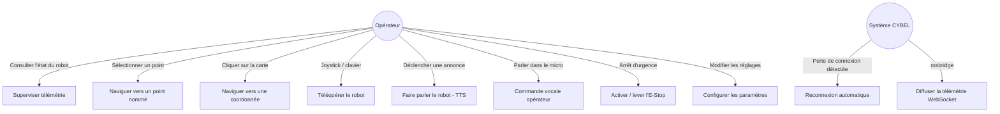
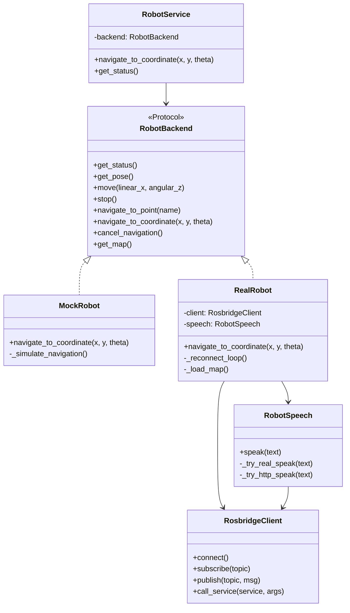
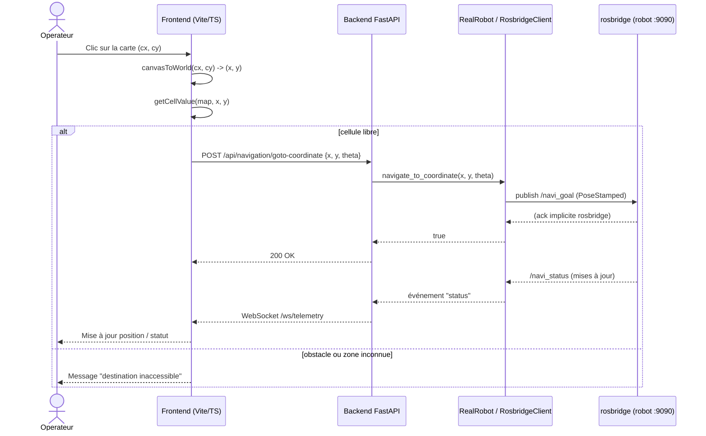
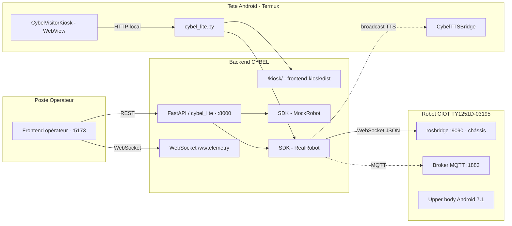

# Conception et développement d'une plateforme de commande et d'interaction autonome pour un robot de service Android

## Cas d'étude : robot de réception mobile CIOT TY1251D-03195 — Projet CYBEL

> Document de travail destiné à servir de base au rapport de stage (PFA, 3ᵉ année — Informatique et Intelligence Artificielle), réalisé dans le cadre du stage proposé par HESTIM Engineering & Business School (encadrant : Dr. Sridath Tula).
>
> Ce document suit le plan académique imposé. Les sections relevant de l'état d'avancement (Implémentation, Résultats, Analyse critique) reflètent l'état réel du projet à la **fin juin 2026** : le kiosque visiteur est opérationnel sur la tablette ; une **validation terrain A/B** compare l'approche navigation par coordonnées (`/navi_goal`) et l'approche hybride **POI Sentrymove** (sync ROS → kiosque), documentée dans [chapitres_5_6_7_conclusion.md](chapitres_5_6_7_conclusion.md), [labo/TERRAIN.md](../labo/TERRAIN.md) et [labo/KIOSK_AB_COMPARISON.md](../labo/KIOSK_AB_COMPARISON.md).

---

## Résumé

Les robots de service mobiles sont généralement livrés avec un écosystème logiciel fermé : application propriétaire, absence de documentation et de protocole de communication publié. Ce constat limite toute personnalisation par l'utilisateur final. Le projet **CYBEL**, mené dans le cadre d'un stage de fin d'année (PFA), vise à concevoir une plateforme de commande et d'interaction indépendante pour un robot de réception mobile **CIOT TY1251D-03195**, composé d'un châssis de navigation sous ROS et d'un « upper body » Android.

La démarche adoptée repose sur une **rétro-ingénierie incrémentale et non destructive** du protocole de communication interne du robot : balayage des services réseau exposés, introspection des topics et services ROS via `rosbridge`/`rosapi`, audit JADX des applications constructeur (`welcomepatrol`, `sentrymove`), et vérification systématique de l'effectivité de chaque commande avant de la considérer comme fonctionnelle. Sur cette base, une **architecture en trois couches** a été conçue — un SDK Python proposant une implémentation simulée (*mock*) et une implémentation réelle interchangeables, une API **FastAPI** (REST + WebSocket) et une interface web **Vite/TypeScript** opérateur — complétée par une **interface visiteur kiosque** (`frontend-kiosk/`) et des applications Android natives (`CybelTTSBridge`, `CybelVisitorKiosk`, variante test `CybelVisitorKioskTest`).

À ce stade du stage, la connectivité avec le robot est établie, le protocole de télémétrie, de commande de vitesse et de navigation autonome a été reconstruit et intégré, la synthèse vocale (TTS) fonctionne via une application Android dédiée, une interface opérateur complète (carte SLAM, LiDAR, visiteurs détectés, gestion du parcours, arrêt d'urgence) est opérationnelle, et un déploiement embarqué sur Termux est **validé sur la tablette**. L'interface visiteur propose une **visite guidée autonome du laboratoire** (huit arrêts). Deux stratégies de navigation sont en cours de comparaison : **(S1)** coordonnées extraites de `knowledgeV2-lab.json` via `/navi_goal` — déployée en production sur le port 8000 ; **(S3)** option hybride **POI Sentrymove** — synchronisation ROS (`sdk/poi_sync.py`), parcours par `target_point` dans `lab_tour.json`, backend test sur le port 8001. Les problèmes terrain observés (robot qui parle sans bouger, mauvaise destination, lenteur au départ) motivent cette comparaison A/B documentée. Ce rapport présente le contexte, la problématique, l'état de l'art, la conception, la méthodologie, l'implémentation, les résultats et une analyse critique.

**Mots-clés** : robotique de service, rétro-ingénierie de protocole, ROS, rosbridge, FastAPI, interface homme-robot, navigation autonome, POI Sentrymove, synthèse vocale, Termux, WebView Android, test A/B kiosque.

## Abstract

Mobile service robots are typically delivered with a closed software ecosystem: proprietary application, no documentation, and no published communication protocol — which severely limits end-user customization. The **CYBEL** project, carried out as part of a final-year internship, aims to design an independent control and interaction platform for a **CIOT TY1251D-03195** mobile reception robot, composed of a ROS-based navigation chassis and an Android "upper body".

The approach relies on **incremental, non-destructive reverse engineering** of the robot's internal communication protocol: scanning exposed network services, introspecting ROS topics and services via `rosbridge`/`rosapi`, JADX audit of manufacturer apps (`welcomepatrol`, `sentrymove`), and systematically verifying that a command has a real effect before considering it functional. Based on this analysis, a **three-layer architecture** was designed — a Python SDK providing interchangeable mock and real implementations, a **FastAPI** API (REST + WebSocket), and an operator **Vite/TypeScript** web interface — extended with a **visitor kiosk interface** (`frontend-kiosk/`) and native Android apps (`CybelTTSBridge`, `CybelVisitorKiosk`, test variant `CybelVisitorKioskTest`).

At this stage of the internship, connectivity with the robot has been established; telemetry, velocity control, and autonomous navigation protocols have been reconstructed and integrated; text-to-speech (TTS) works via a dedicated Android app; a full operator interface (SLAM map, LiDAR, detected visitors, tour management, emergency halt) is operational; and an embedded Termux deployment is **validated on the tablet**. The visitor interface offers an **autonomous laboratory guided tour** (eight stops). Two navigation strategies are being compared: **(S1)** coordinates from `knowledgeV2-lab.json` via `/navi_goal` — production on port 8000; **(S3)** hybrid **Sentrymove POI** approach — ROS sync (`sdk/poi_sync.py`), tour stops by `target_point` in `lab_tour.json`, test backend on port 8001. Field issues (robot speaks without moving, wrong destination, slow departure) motivate this A/B comparison. This report presents context, problem statement, related work, design, methodology, implementation, results, and critical analysis.

**Keywords**: service robotics, protocol reverse engineering, ROS, rosbridge, FastAPI, human-robot interaction, autonomous navigation, Sentrymove POI, text-to-speech, Termux, Android WebView, kiosk A/B testing.

---

## Table des matières

1. [Introduction](#1-introduction)
2. [Contexte](#2-contexte)
3. [Problématique](#3-problématique)
4. [Objectifs](#4-objectifs)
5. [Cahier des charges](#5-cahier-des-charges)
6. [Hypothèses](#6-hypothèses)
7. [État de l'art](#7-état-de-lart)
8. [Analyse et conception](#8-analyse-et-conception)
9. [Méthodologie](#9-méthodologie)
10. [Implémentation](#10-implémentation)
11. [Résultats](#11-résultats)
12. [Analyse critique](#12-analyse-critique)
13. [Conclusion](#13-conclusion)
14. [Bibliographie](#14-bibliographie)

**Chapitres 5–7, conclusion, annexes (format rapport HESTIM)** : voir [chapitres_5_6_7_conclusion.md](chapitres_5_6_7_conclusion.md) — méthodologie, réalisation, validation, Gantt, diagrammes Mermaid, bibliographie et webographie.

---

## 1. Introduction

Les robots de service autonomes occupent une place croissante dans les environnements professionnels — accueil, guidage, télépresence — grâce à la maturité des technologies de navigation autonome (SLAM, planification de trajectoire) et d'interaction homme-robot (interfaces tactiles, synthèse et reconnaissance vocale). Cependant, ces robots sont généralement livrés avec un écosystème logiciel **fermé** : application propriétaire, protocole de communication non documenté, et absence d'API publique. Cette fermeture limite fortement la capacité des utilisateurs (entreprises, laboratoires, établissements de formation) à adapter le comportement du robot à leurs besoins spécifiques.

Le présent rapport documente le travail réalisé dans le cadre du projet **CYBEL**, qui consiste à concevoir une plateforme logicielle indépendante permettant de superviser, piloter et faire interagir un robot de réception mobile de modèle **CIOT TY1251D-03195**, sans dépendre de l'application Android propriétaire fournie par le constructeur. Le projet s'inscrit dans un stage de fin d'année (PFA) de trois à quatre mois, dont l'objectif déclaré est double : (1) procéder à une **rétro-ingénierie** du protocole de communication interne du robot, et (2) construire, sur la base de cette analyse, une **interface web de commande** dotée de fonctionnalités de navigation, de supervision et d'interaction (vocale et tactile).

Ce rapport présente successivement le contexte du projet, la problématique et les objectifs poursuivis, l'état de l'art des solutions existantes, l'analyse et la conception retenues, la méthodologie de travail, l'implémentation réalisée à ce stade, les résultats obtenus, une analyse critique des limites et difficultés rencontrées, ainsi que les perspectives d'amélioration.

---

## 2. Contexte

### 2.1 Le robot CIOT TY1251D-03195

Le robot étudié est un **robot de réception mobile** commercialisé sous la référence **CIOT TY1251D-03195**. Il est composé de deux sous-systèmes matériels distincts, reliés en interne :

- un **châssis de navigation** fonctionnant sous **Linux embarqué avec ROS** (Robot Operating System, distribution Noetic/Melodic), responsable de la localisation (SLAM), de la planification de trajectoire (`move_base`) et de l'exécution des commandes de mouvement ;
- un **« upper body » Android 7.1** (SoC RK3399, 2 Go de RAM, 16 Go de stockage), équipé d'un écran tactile 15,6" (1920×1080), de caméras (reconnaissance faciale, surveillance) et de haut-parleurs, qui héberge l'application propriétaire d'accueil et l'interface utilisateur standard du robot.

Le robot dispose d'un point d'accès WiFi propre (`TY1251D-03195`) permettant à un poste externe de rejoindre son réseau local. La topologie réseau s'est révélée **plus complexe que prévu** : le châssis est joignable sur `10.42.0.1`, la tête Android sur un second segment `172.16.0.0/16` (IP DHCP variable), et un lien eth0 interne `192.168.20.0/24` relie la tête (`192.168.20.1`) au châssis (`192.168.20.22`).

### 2.2 Origine du besoin

L'établissement disposant de ce robot souhaite l'utiliser pour des scénarios d'accueil et de démonstration personnalisés (annonces vocales spécifiques, déplacements vers des points définis par l'utilisateur, supervision à distance). L'application propriétaire installée sur l'upper body ne permet pas ce type de personnalisation : elle constitue une boîte noire, sans documentation, sans API exposée et sans code source disponible. Le constructeur ne fournit par ailleurs aucune documentation technique sur les protocoles de communication internes.

### 2.3 Cadre du stage

Le stage est encadré par HESTIM Engineering & Business School et s'adresse à des étudiants de 3ᵉ ou 4ᵉ année ayant des bases en réseaux, programmation et robotique. Il est prévu sur une durée de trois à quatre mois, structuré en quatre phases : compréhension de l'architecture et établissement de la connectivité réseau, exploration et analyse du protocole, développement de l'interface de commande et des modules d'interaction, puis intégration, tests et validation finale.

---

## 3. Problématique

La problématique centrale du projet peut être formulée ainsi :

> **Comment concevoir une plateforme de commande et d'interaction tierce, fonctionnellement équivalente ou supérieure à l'application propriétaire d'un robot de service Android, en l'absence de toute documentation officielle sur ses interfaces de communication internes ?**

Cette problématique se décline en plusieurs sous-questions :

- Quels sont les **points d'accès réseau** (adresses IP, ports, protocoles) exposés par le robot, et lesquels sont effectivement exploitables sans authentification propriétaire ?
- Quel est le **format des messages** échangés entre l'interface Android et le système de navigation (ROS), et peut-il être reconstruit par observation et introspection plutôt que par décompilation de l'application ?
- Comment **distinguer une commande effectivement traitée par le robot d'une commande silencieusement ignorée**, dans un système où le protocole de transport (ici rosbridge) ne renvoie pas systématiquement d'erreur explicite ?
- Comment concevoir une architecture logicielle qui reste **utilisable et testable sans accès permanent au robot physique** (contraintes de disponibilité du matériel), tout en restant fidèle au comportement réel une fois connectée ?
- Dans quelle mesure les fonctionnalités d'**interaction homme-robot** (synthèse vocale, reconnaissance vocale, retour visuel) peuvent-elles être reconstruites lorsque le canal correspondant n'est pas exposé par le système de navigation (ROS) et nécessite un accès direct au sous-système Android ?

---

## 4. Objectifs

### 4.1 Objectifs généraux

- Concevoir et développer une **plateforme web indépendante** de commande, de supervision et d'interaction pour le robot CIOT TY1251D-03195, ne dépendant pas de l'application Android propriétaire.
- Documenter de façon rigoureuse, au fil du projet, le **protocole de communication** reconstruit (endpoints, topics, services, formats de messages), afin que ce travail puisse être réutilisé ou étendu.

### 4.2 Objectifs spécifiques

1. **Établir la connectivité** avec le robot (réseau WiFi dédié, identification des hôtes et ports actifs).
2. **Identifier les points de communication** exposés : WebSocket `rosbridge` (port 9090), broker `MQTT` (port 1883), services FTP/SSH, interfaces web internes (`:8082`, `:8088`).
3. **Capturer et analyser le trafic réseau** afin de reconstituer les topics et services ROS pertinents (mouvement, navigation, télémétrie, capteurs).
4. **Décoder et reconstruire les commandes de contrôle** du mouvement et de la navigation (vitesse, position cible, annulation de trajectoire).
5. **Développer une interface de commande web** (backend FastAPI + frontend TypeScript) permettant la supervision temps réel et l'envoi de commandes.
6. **Implémenter des fonctionnalités d'interaction homme-robot** : navigation par sélection de points/clic sur carte, retour vocal (TTS via pont Android), commande vocale opérateur, **interface visiteur kiosque** bilingue.
7. **Mettre en place un mode de simulation (« mock »)** permettant de développer et tester l'interface sans dépendre de la disponibilité physique du robot.
8. **Intégrer l'ensemble des composants** (SDK Python, API, interfaces web, apps Android, déploiement Termux) dans un système cohérent et démontrable.

---

## 5. Cahier des charges

### 5.1 Présentation synthétique

Le présent cahier des charges formalise le périmètre, les exigences et les contraintes du projet **CYBEL**, à destination de l'établissement d'accueil et de l'encadrant de stage. Il sert de référence pour évaluer, en fin de stage, l'adéquation entre le travail livré et les besoins exprimés.

### 5.2 Périmètre du projet

| Inclus dans le périmètre | Exclu du périmètre |
|---|---|
| Identification et documentation des canaux de communication du robot (`rosbridge`, MQTT, services réseau) | Modification du firmware ou du logiciel embarqué du robot |
| Développement d'un SDK Python d'accès au robot (mode simulé et mode réel) | Décompilation ou rétro-ingénierie de l'application Android propriétaire |
| Développement d'une API de commande/supervision (FastAPI) | Déploiement en production / hébergement distant |
| Développement d'une interface web opérateur (Vite/TypeScript) | Comportements autonomes avancés (planification de mission, multi-robot) |
| **Interface visiteur kiosque** (`frontend-kiosk/`) + app Android `CybelVisitorKiosk` | Vision par caméra avancée, reconnaissance faciale, chatbot (extensions optionnelles) |
| **Pont TTS Android** (`CybelTTSBridge`) + déploiement Termux embarqué | Formation des utilisateurs finaux / exploitation au long cours |
| Fonctionnalités de navigation (point nommé, clic sur carte, téléopération) | |
| Interaction : TTS robot, commande vocale opérateur, actions d'accueil bilingues | |
| Base de connaissances FAQ (HESTIM) | |
| Documentation technique et rapport de stage | |

### 5.3 Acteurs et parties prenantes

| Acteur | Rôle |
|---|---|
| **Étudiant(e) stagiaire** | Conception, développement, rétro-ingénierie, rédaction du rapport |
| **Encadrant académique** (Dr. Sridath Tula, HESTIM) | Suivi pédagogique, validation des objectifs et du rapport |
| **Établissement d'accueil** | Mise à disposition du robot et de l'environnement de travail |
| **Opérateur final** (utilisateur de l'interface) | Supervision et pilotage du robot via la plateforme CYBEL |
| **Robot CIOT TY1251D-03195** | Système cible, agit comme « serveur » de télémétrie et de commandes via `rosbridge`/MQTT |

### 5.4 Besoins fonctionnels et non fonctionnels

Le recueil détaillé des besoins fonctionnels et non fonctionnels est présenté en §8.1 (Analyse et conception). Il est synthétisé ici sous forme d'exigences numérotées, utilisées comme référentiel pour le suivi d'avancement :

| Réf. | Exigence | Priorité |
|---|---|---|
| EF-01 | Superviser en temps réel l'état du robot (batterie, position, statut, mode de navigation) | Essentielle |
| EF-02 | Afficher la carte SLAM, le LiDAR et les personnes détectées | Essentielle |
| EF-03 | Naviguer vers un point nommé prédéfini | Essentielle |
| EF-04 | Naviguer vers une coordonnée choisie par clic sur la carte, avec prise en compte des obstacles | Essentielle |
| EF-05 | Téléopérer manuellement le robot (vitesse linéaire/angulaire) avec arrêt d'urgence | Essentielle |
| EF-06 | Déclencher une annonce vocale sur le robot (TTS) | Souhaitable |
| EF-07 | Donner des commandes vocales à l'opérateur via le micro du navigateur | Souhaitable |
| EF-08 | Configurer les paramètres de fonctionnement (vitesse, mode de déplacement) | Souhaitable |
| EF-09 | Fonctionner en mode simulation complet sans robot connecté | Essentielle |
| EF-10 | **Interface visiteur** tactile plein écran (actions d'accueil, FAQ, FR/EN) | Essentielle |
| EF-11 | **Déploiement autonome** sur la tablette Android (sans PC développeur) | Essentielle |
| ENF-01 | Latence d'affichage de la télémétrie de l'ordre de quelques centaines de ms maximum | Essentielle |
| ENF-02 | Reconnexion automatique au robot après perte de connexion réseau | Essentielle |
| ENF-03 | Séparation stricte entre couche d'accès robot (SDK), API et présentation | Essentielle |
| ENF-04 | Toute commande de mouvement/navigation doit être annulable à tout moment | Essentielle |
| ENF-05 | Aucune action exploratoire (scripts de rétro-ingénierie) ne doit perturber le fonctionnement normal du robot | Essentielle |

### 5.5 Contraintes

- **Contraintes techniques** : absence de documentation officielle du protocole ; dépendance à un réseau WiFi dédié et potentiellement instable (latence variable, de 7 à 1654 ms observés) ; version Android embarquée obsolète (7.1) limitant les outils de débogage disponibles.
- **Contraintes matérielles** : un seul exemplaire de robot disponible, partagé avec d'autres usages de l'établissement — disponibilité limitée pour les tests.
- **Contraintes organisationnelles** : durée du stage limitée à trois-quatre mois ; étudiant unique sur le projet ; encadrement académique périodique.
- **Contraintes de sécurité et d'éthique** : les canaux `rosbridge` et MQTT du robot étant accessibles sans authentification, toute manipulation doit respecter un principe de **précaution** (vérification en mode simulation avant toute commande réelle, mécanisme d'annulation disponible) ; les tentatives d'accès aux comptes système (SSH/FTP) doivent rester mesurées pour ne pas provoquer de blocage d'accès légitime (limitation anti-bruteforce constatée).
- **Contraintes de propriété intellectuelle** : aucune décompilation du logiciel propriétaire n'est entreprise ; seule l'observation du trafic réseau et l'introspection des interfaces standard (ROS, MQTT) sont utilisées.

### 5.6 Livrables attendus

Conformément au sujet de stage, les livrables attendus en fin de projet sont :

1. Une **interface de communication fonctionnelle** avec le robot (SDK + client `rosbridge`/MQTT). ✅
2. Un **système de contrôle du mouvement** opérationnel (téléopération + navigation). ✅
3. Une **interface utilisateur** web opérateur. ✅
4. Un **module d'interaction de base** (tactile et vocal) : TTS robot ✅, interface visiteur kiosque ⚠️ (en validation).
5. Un **rapport technique** incluant l'architecture du système et l'analyse du protocole (le présent document). 🔄 En cours de rédaction.

### 5.7 Critères de réception / validation

| Critère | Modalité de vérification |
|---|---|
| Connexion au robot établie de manière reproductible | Connexion `rosbridge` réussie depuis le réseau WiFi du robot, vérifiable via `/rosapi/topics` |
| Télémétrie affichée en temps réel | Observation visuelle du tableau de bord (position, batterie, statut) à jour |
| Navigation vers un point/une coordonnée | Envoi d'une commande de navigation suivie d'un changement d'état (`/navi_status`) cohérent |
| Téléopération et arrêt d'urgence | Test en mode simulation puis, si possible, sur robot réel à vitesse réduite |
| Fonctionnement en mode simulation | Lancement de l'interface avec `ROBOT_MOCK=true`, toutes les fonctionnalités principales accessibles |
| Interaction vocale | TTS robot via **CybelTTSBridge** fonctionnel (ADB ou broadcast local Termux) |
| Interface visiteur | App **CYBEL Accueil** affichant `/kiosk/` — **en cours de validation** (écran blanc résiduel) |
| Documentation | Présence et cohérence de `README.md`, `docs/INTERFACE.md`, `docs/VISITOR_KIOSK.md`, `docs/TTS_BRIDGE.md`, `docs/TERMUX_DEPLOY.md` et du présent rapport |

---

## 6. Hypothèses

Le travail de rétro-ingénierie et de conception repose sur les hypothèses de travail suivantes, formulées en début de projet et confrontées aux observations au fil de l'avancement :

- **H1 — Exposition d'une passerelle ROS standard.** Le châssis du robot, fonctionnant sous ROS, expose une passerelle `rosbridge` (protocole JSON sur WebSocket) accessible depuis le réseau WiFi du robot sans authentification, ce qui permettrait d'observer et de piloter le système de navigation sans passer par l'application Android.
- **H2 — Stabilité et documentation indirecte du protocole rosbridge.** Le protocole `rosbridge_suite` étant un standard ouvert et documenté (Robot Web Tools), les messages observés sur le réseau peuvent être interprétés à l'aide de cette documentation générique, même si les *topics* et *types de messages* spécifiques au constructeur (préfixés `yutong_assistance`, etc.) restent, eux, propriétaires et à découvrir par introspection (`/rosapi/*`).
- **H3 — Séparation possible entre commande de mouvement bas niveau et navigation haut niveau.** Le robot distingue un canal de téléopération directe (vitesse linéaire/angulaire) et un canal de navigation autonome (objectif de pose géré par une pile `move_base`), tous deux potentiellement accessibles via `rosbridge`.
- **H4 — Le succès apparent d'une publication `rosbridge` ne garantit pas son traitement effectif.** Un message publié sur un topic sans abonné réel sera accepté par `rosbridge` sans erreur, ce qui impose de vérifier l'existence d'abonnés/services réels (via `/rosapi/subscribers`, `/rosapi/services`) avant de considérer une commande comme « exécutée ».
- **H5 — L'interaction vocale (TTS) nécessite un accès hors du périmètre ROS.** Confirmée : aucun topic/service ROS TTS ; solution retenue via sous-système Android (`CybelTTSBridge` + `TextToSpeech` Google).
- **H6 — Une architecture « mock / réel » découplée permet un développement continu.** Confirmée : développement mock-first puis portage `RealRobot` ; étendue au déploiement Termux (backend lite).
- **H7 — Le déploiement sur la tablette Android est viable via Termux.** Partiellement confirmée : backend lite et TTS local fonctionnels ; affichage WebView kiosque en attente de validation.

---

## 7. État de l'art

### 7.1 Solutions existantes

| Solution | Description | Accessibilité |
|---|---|---|
| **Application propriétaire (upper body Android)** | Interface tactile fournie par le constructeur (CIOT/Yutong), gère accueil, navigation par points prédéfinis, TTS | Fermée, sans documentation, sans API |
| **Interface de déploiement web (`:8082`, Vue.js)** | Interface web embarquée dédiée au scan/édition de cartes SLAM | Accessible sur le réseau du robot, non documentée, usage limité à la cartographie |
| **Interface de debug CSST (`:8088`)** | Interface de diagnostic interne, en chinois | Accessible mais non documentée, fonction exacte non déterminée |
| **rosbridge_suite + roslibjs / RViz / Foxglove Studio** | Outils génériques de l'écosystème ROS permettant de visualiser topics, services et de publier des messages | Open-source, documentés, mais génériques (pas de logique métier « accueil », pas d'UI orientée opérateur) |
| **SDK/plateformes de robots de réception commerciaux (ex. Temi, OrionStar, Pepper)** | Plateformes propriétaires avec SDK officiel pour développeurs tiers | SDK documenté mais verrouillé à l'écosystème du fabricant, modèle différent (pas de rosbridge) |

### 7.2 Étude bibliographique

La conception de la plateforme s'appuie sur plusieurs corpus de référence :

- **Architecture logicielle robotique** : le modèle de communication par *topics/services/actions* publié par **Quigley et al. (2009)** dans la présentation fondatrice de ROS constitue la base conceptuelle de l'analyse du trafic observé (distinction *publish/subscribe* vs *appel de service synchrone*).
- **Navigation autonome et cartes d'occupation** : les concepts de grille d'occupation (*occupancy grid*) et de planification locale/globale (*costmaps*, DWA) utilisés pour interpréter la pile `move_base` du robot et pour implémenter la pré-vérification d'obstacles côté interface sont décrits dans l'ouvrage de référence **Thrun, Burgard & Fox — *Probabilistic Robotics* (2005)**.
- **Protocole rosbridge** : la spécification du protocole JSON `rosbridge` (opérations `subscribe`, `publish`, `call_service`, `advertise`) ainsi que les services d'introspection `rosapi` (liste des topics, services, types, abonnés) sont documentés par le projet **Robot Web Tools / rosbridge_suite**, utilisé comme référence pour interpréter et reconstruire les échanges observés.
- **Interaction Homme-Robot (HRI)** : les principes de conception d'interfaces de supervision robotique (retour d'état temps réel, primauté de l'arrêt d'urgence, feedback explicite des actions) guident les choix d'ergonomie de l'interface CYBEL.
- **Sécurité des objets connectés** : la problématique des canaux de communication non authentifiés (rosbridge, MQTT sans authentification) observée sur le robot est mise en perspective avec les recommandations générales de l'**OWASP IoT Top 10**, qui seront discutées dans l'analyse critique.

### 7.3 Benchmark concurrentiel

| Critère | Application propriétaire | RViz / Foxglove (générique ROS) | CYBEL (solution développée) |
|---|---|---|---|
| Documentation / code source | Aucune | Open-source, bien documenté | Documenté au fil du projet (ce rapport + `README.md`) |
| Accès distant (web) | Non (écran local uniquement) | Partiel (Foxglove web) | Oui (navigateur, réseau WiFi du robot) |
| Personnalisation des scénarios d'accueil | Non | Non (outil générique) | Oui (objectif du projet) |
| Mode simulation sans robot | Non | Partiel (rejouer des enregistrements) | Oui (mode *mock* dédié) |
| Navigation par clic sur carte | Oui (propriétaire) | Oui (générique, RViz) | Oui (développé, avec pré-vérification d'obstacles) |
| Interaction vocale (TTS/voix opérateur) | Oui (propriétaire, fermé) | Non | **Oui** (CybelTTSBridge + Web Speech API opérateur) |
| Interface visiteur autonome | Oui (propriétaire, fermé) | Non | **En cours** (frontend-kiosk + CybelVisitorKiosk) |
| Déploiement sans PC développeur | Oui (natif) | Non | **En cours** (Termux + backend lite) |

### 7.4 Limites des solutions actuelles

- L'application propriétaire offre une expérience complète mais **non extensible** : aucun moyen d'ajouter de nouveaux scénarios, de nouveaux points de navigation programmatiques, ou d'intégrer le robot dans un système d'information tiers.
- Les outils génériques ROS (RViz, Foxglove) permettent d'observer et de piloter le robot au niveau **bas niveau** (topics bruts), mais ne fournissent aucune **logique métier** (scénarios d'accueil, gestion d'état applicatif, persistance des points nommés côté opérateur).
- Aucune des solutions existantes ne propose de **mode de développement déconnecté** du robot physique, ce qui constitue un frein important dans un contexte de stage où l'accès au matériel est partagé et limité dans le temps.
- La documentation constructeur étant inexistante, toute évolution nécessite un travail de rétro-ingénierie répété — d'où l'importance de **capitaliser** les découvertes (topics, services, formats) dans une documentation structurée (`README.md`, ce rapport).

---

## 8. Analyse et conception

### 8.1 Recueil des besoins

#### Besoins fonctionnels

- **Supervision temps réel** : afficher l'état du robot (batterie, mode de navigation, vitesse, position, niveau de localisation), la carte SLAM, les obstacles détectés par le LiDAR et les personnes détectées.
- **Navigation** : permettre à l'opérateur de déplacer le robot vers un point nommé prédéfini, ou vers une coordonnée choisie directement sur la carte, avec gestion automatique des obstacles via la pile de navigation du robot.
- **Téléopération manuelle** : permettre un contrôle direct (vitesse linéaire/angulaire) via clavier ou interface tactile, avec arrêt d'urgence.
- **Interaction** : déclencher des annonces vocales (TTS) sur le robot, et permettre à l'opérateur de dicter des commandes via la reconnaissance vocale du navigateur.
- **Configuration** : ajuster les paramètres de fonctionnement (vitesse, mode de déplacement) depuis l'interface.
- **Mode simulation** : pouvoir développer/tester toute l'interface sans robot connecté.

#### Besoins non fonctionnels

- **Faible latence** d'affichage de la télémétrie (ordre de grandeur de quelques centaines de millisecondes maximum).
- **Robustesse à la déconnexion** : reconnexion automatique au robot en cas de perte du WiFi, sans nécessiter de redémarrage manuel du backend.
- **Séparation claire** entre la couche d'accès au robot (SDK) et la couche présentation (API/UI), pour faciliter les tests et l'évolution.
- **Innocuité par défaut** : toute commande de mouvement ou de navigation doit être vérifiable et annulable (`cancel`), et les fonctionnalités exploratoires (scripts de rétro-ingénierie) ne doivent pas interférer avec le fonctionnement normal du robot.

### 8.2 Cas d'utilisation



**Description du principal cas d'utilisation — Naviguer vers une coordonnée cliquée sur la carte :**

1. L'opérateur clique sur un point de la carte SLAM affichée dans l'interface.
2. Le frontend convertit les coordonnées du canevas (pixels) en coordonnées du repère de la carte (mètres), via la transformation inverse de l'affichage (`canvasToWorld`).
3. Le frontend vérifie localement, à partir de la grille d'occupation, que la cellule cible n'est ni un obstacle (valeur ≥ seuil) ni une zone inconnue (valeur = -1) ; si c'est le cas, le clic est rejeté avec un message explicite.
4. Le frontend calcule une orientation cible (`theta`) à partir de la pose courante du robot et du point cliqué.
5. Le frontend appelle l'API `POST /api/navigation/goto-coordinate` avec `{x, y, theta}`.
6. Le backend délègue à la couche SDK (`RealRobot.navigate_to_coordinate`), qui publie un message `geometry_msgs/PoseStamped` sur le topic `/navi_goal`.
7. La pile de navigation du robot (`move_base`) prend en charge la planification de trajectoire et l'évitement d'obstacles dynamiques.
8. La progression est suivie via le topic `/navi_status`, diffusé en temps réel à l'interface par WebSocket.

### 8.3 Diagrammes UML

#### Diagramme de classes (architecture SDK / backend)



#### Diagramme de séquence (navigation par clic sur la carte)



#### Diagramme de composants (vue d'ensemble)



### 8.4 Architecture logicielle

L'architecture retenue est une architecture **en trois couches**, calquée sur la structure du dépôt :

1. **Couche SDK (`sdk/`)** : couche d'abstraction du robot, indépendante de tout framework web. Elle définit :
   - les modèles de données partagés (`models.py`, basés sur Pydantic) ;
   - les constantes du protocole reconstruit (`constants.py` : topics, services, codes d'état) ;
   - le client `rosbridge` générique (`rosbridge.py`) ;
   - deux implémentations interchangeables d'un même contrat (`RobotBackend`) : `MockRobot` (simulateur) et `RealRobot` (adaptateur vers le robot physique).

2. **Couche API (`backend/`)** : application **FastAPI** exposant :
   - des routes REST (`routers/robot.py`, `navigation.py`, `map.py`, `settings.py`, `speech.py`, `reception.py`) pour les actions ponctuelles ;
   - un canal **WebSocket** (`/ws/telemetry`) pour la diffusion continue de l'état du robot ;
   - une façade `RobotService` qui sélectionne `MockRobot` ou `RealRobot` selon la configuration (`ROBOT_MOCK`).

3. **Couche présentation** — deux interfaces web distinctes :
   - **`frontend/`** : application opérateur **Vite + TypeScript** (port `5173`), avec état global (`state.ts`), télémétrie WebSocket (`telemetry.ts`), composants carte/LiDAR/accueil ;
   - **`frontend-kiosk/`** : application visiteur minimaliste (port `5174` en dev), gros boutons tactiles, FAQ bilingue, servie en production sur `/kiosk/` par le backend.

4. **Couche Android embarquée** (`android/`) — deux APK construits sans Gradle, via les outils CLI du SDK Android :
   - **`CybelTTSBridge`** : `BroadcastReceiver` + `TextToSpeech` (moteur Google TTS) ;
   - **`CybelVisitorKiosk`** : `WebView` plein écran chargeant `/kiosk/`, mode kiosque immersif.

5. **Déploiement Termux** (`scripts/termux/`) — variante **backend lite** (`cybel_lite.py`, Starlette sans pydantic) pour l'exécution sur la tablette Android, avec scripts de bootstrap, démarrage et configuration embarquée (`cybel.env`).

Ce découpage permet à la couche présentation et à la couche API d'être développées et testées **sans dépendance au robot physique** (via `MockRobot`), tandis que la couche `RealRobot` encapsule toute la complexité du protocole reconstruit par rétro-ingénierie. Le déploiement Termux étend cette architecture pour un fonctionnement **autonome sur la tablette**, sans PC développeur.

### 8.5 Choix technologiques

| Choix | Alternatives envisagées | Justification |
|---|---|---|
| **FastAPI** (Python, async) | Flask, Django REST Framework | Support natif d'`asyncio` et des WebSockets, indispensable pour relayer en continu la télémétrie `rosbridge` (elle-même asynchrone) sans bloquer le serveur ; validation des données via Pydantic, cohérente avec les modèles du SDK. |
| **rosbridge (WebSocket JSON)** comme canal principal | Pont ROS custom, accès direct aux topics ROS via DDS | `rosbridge` est déjà exposé par le robot (port 9090) sans configuration supplémentaire ; protocole texte (JSON), facilement observable et débogable, documenté par `rosbridge_suite`. |
| **TypeScript + Vite, sans framework UI** | React, Vue (recommandés initialement) | Réduction de la surface technique pour un projet porté par un développeur unique en début de stage ; démarrage à chaud quasi instantané (HMR Vite) ; suffisant pour le volume d'interactions de l'interface actuelle. Réévaluable si la complexité de l'UI augmente. |
| **Architecture Mock/Réel via un `Protocol`** | Tests avec robot physique uniquement | Permet un développement continu indépendamment de la disponibilité du robot (contrainte forte en contexte de stage), et fournit un environnement de démonstration reproductible. |
| **Backend lite Starlette** (Termux) | FastAPI complet sur tablette | Python 3.13 Termux sans wheel `pydantic-core` ; compilation Rust impossible (espace disque limité) ; Starlette + uvicorn suffisent pour le kiosque |
| **Build Vite legacy** (`@vitejs/plugin-legacy`) | Build ES modules standard | WebView Android 7.1 (Chrome ~51) ignore `type="module"` et la syntaxe ES2020 |
| **Apps Android Java (sans Gradle)** | Kotlin / Android Studio | `kotlinc` indisponible ; `javac` + SDK CLI suffisants pour deux APK légers |
| **TTS via broadcast Android** | Topics ROS ou HTTP | Aucun canal réseau TTS identifié ; `TextToSpeech` natif via `CybelTTSBridge` validé |
| **MQTT (paho-mqtt)** comme canal secondaire | Ignorer le broker MQTT | Broker `:1883` actif ; observation passive pour corroborer la télémétrie |

---

## 9. Méthodologie

### 9.1 Méthodes utilisées

La méthodologie de travail combine deux démarches complémentaires :

1. **Rétro-ingénierie incrémentale par introspection et observation**, plutôt que par décompilation de l'application Android (non réalisée, pour des raisons de temps et de licéité). Cette démarche s'appuie sur :
   - un **balayage de ports** (`scan`) sur les hôtes du réseau du robot pour identifier les services actifs ;
   - l'utilisation des **services d'introspection natifs de ROS** (`/rosapi/topics`, `/rosapi/services`, `/rosapi/message_details`, `/rosapi/subscribers`) pour lister exhaustivement les topics et services disponibles, leurs types et leurs abonnés réels — évitant ainsi de devoir capturer du trafic au niveau paquet pour découvrir la structure de l'API ;
   - l'**écoute passive** de tous les topics/canaux (`subscribe '#'` en MQTT, abonnement générique en rosbridge) avant toute tentative de publication, afin de ne risquer aucune interférence avec le fonctionnement du robot ;
   - la **vérification systématique de l'effet réel** d'une commande (existence d'abonnés/services) avant de la considérer comme fonctionnelle — règle directement issue de l'hypothèse H4.

2. **Développement incrémental « mock-first »** : chaque nouvelle fonctionnalité est d'abord implémentée et validée dans `MockRobot` (comportement simulé), puis portée dans `RealRobot` une fois le protocole correspondant identifié, ce qui découple le rythme de développement de l'interface du temps d'accès au robot physique.

### 9.2 Justification des choix techniques, de l'architecture et des outils

- **Choix techniques** : voir tableau §8.5. Le critère commun est la **minimisation de la complexité ajoutée** par rapport au strict nécessaire, dans un contexte où le système distant (le robot) introduit déjà une complexité importante et largement non maîtrisée.
- **Architecture retenue** : la séparation SDK / API / UI (§8.4) répond directement au besoin non-fonctionnel de testabilité et à la contrainte de disponibilité limitée du robot physique.
- **Outils utilisés** :
  - **Git** pour le suivi de version et la traçabilité des découvertes successives (chaque script de rétro-ingénierie et chaque évolution de protocole est versionné) ;
  - **Scripts Python dédiés** (`scripts/`) à chaque étape de découverte (ex. `ros_explore.py`, `mqtt_listen.py`, `robot_status.py`, `introspect.py`), conservés comme **journal de bord exécutable** de la rétro-ingénierie ;
  - **uvicorn** (serveur ASGI) avec rechargement à chaud (`--reload`) pour itérer rapidement sur le backend ;
  - **Assistant de programmation IA (Claude Code)** utilisé en binôme pour accélérer l'exploration du protocole, la rédaction du code d'intégration et la documentation, sous supervision et validation de l'étudiant à chaque étape (en particulier avant toute action ayant un effet sur le robot physique).

### 9.3 Ressources matérielles

| Ressource | Détails |
|---|---|
| Robot | CIOT TY1251D-03195 — châssis Linux/ROS + upper body Android 7.1 (RK3399, 2 Go RAM, 16 Go ROM), écran tactile 15,6" 1920×1080, LiDAR, caméra RGBD, capteurs ultrason, gyroscope 6 axes, batterie 24V/20Ah (~8h d'autonomie) |
| Réseau | Point d'accès WiFi dédié du robot (`TY1251D-03195`) ; latence observée variable (≈7 à 1654 ms) |
| Poste de développement | PC sous Windows 11, connecté au WiFi du robot pour les phases de test en conditions réelles |

### 9.4 Ressources logicielles

| Catégorie | Outils / Bibliothèques |
|---|---|
| Langages | Python 3.13, TypeScript |
| Backend | FastAPI, uvicorn, websockets, pydantic, pydantic-settings, httpx |
| Frontend | Vite, TypeScript (sans framework UI), Web Speech API (navigateur) |
| Communication robot | Protocole `rosbridge` (JSON/WebSocket), `paho-mqtt` |
| Outils de rétro-ingénierie | scripts Python (sockets, `paramiko`, `ftplib`), exploration ADB |
| Déploiement embarqué | Termux (SSH `:8022`), scripts `deploy_termux.py`, backend lite Starlette |
| Applications Android | SDK Android CLI (`aapt2`, `javac`, `d8`, `apksigner`) — sans Gradle |
| Gestion de projet | Git, documentation Markdown (`docs/` — 6+ guides techniques) |
| Assistance IA | Claude AI / Cursor — exploration protocole, code, documentation (sous validation étudiant) |

### 9.5 Planning prévisionnel

Le planning ci-dessous reprend les quatre phases proposées dans le sujet de stage, sur une durée totale indicative de quatre mois (juin → septembre 2026). L'avancement réel à la date de rédaction (18/06/2026) se situe en **phase 3 avancée**, avec des éléments de la phase 4 déjà amorcés (déploiement Termux, apps Android).

| Phase | Période indicative | Activités prévues | État au 18/06/2026 |
|---|---|---|---|
| **Phase 1 — Connectivité** | Semaines 1–2 | Compréhension de l'architecture matérielle, connexion au réseau WiFi du robot, identification des hôtes et ports actifs | **Réalisée** : connectivité établie, ports identifiés ; topologie dual-stack documentée (`10.42.0.1` châssis, `172.16.0.x` tête Android, `192.168.20.22` lien eth0 interne) |
| **Phase 2 — Exploration protocolaire** | Semaines 2–6 | Introspection ROS, identification topics/services, exploration MQTT, canaux d'interaction (TTS) | **Réalisée** : navigation, télémétrie, commande vitesse documentés ; TTS résolu via accès ADB + `CybelTTSBridge` |
| **Phase 3 — Développement de l'interface** | Semaines 5–12 | Backend FastAPI, frontend opérateur, interface visiteur, supervision, navigation, interaction | **Réalisée** : dashboard opérateur, **visite guidée labo**, panneau gestion parcours, arrêt d'urgence, déploiement Termux validé |
| **Phase 4 — Intégration, tests, validation** | Semaines 12–16 | Intégration complète, tests sur robot réel, rapport final, démonstration | **En cours** : validation terrain navigation multi-arrêts sur carte réelle ; affichage kiosque validé |

---

## 10. Implémentation

### 10.1 Fonctionnalités développées (état fin juin 2026)

#### 10.1.1 Plateforme opérateur (backend + `frontend/`)

- **Connexion et reconnexion automatique au robot** via `rosbridge` (`RosbridgeClient`), avec gestion explicite de l'état de connexion et rechargement de la carte lors d'une reconnexion.
- **Tableau de bord opérateur** : barre de statut (batterie, mode, vitesse, matching de localisation, compteur visiteurs), panneau latéral (points de navigation, **panneau visite guidée**, journal d'événements), panneau carte.
- **Carte SLAM interactive** : grille d'occupation, overlay LiDAR, position robot temps réel, **visiteurs détectés** (`/detected_people_array`), navigation par clic avec rejet préventif des obstacles (seuil `65`) et zones inconnues (`-1`).
- **Navigation** par point nommé, par coordonnée cliquée, annulation de trajectoire.
- **Téléopération manuelle** avec arrêt d'urgence ; **arrêt total** (`POST /api/tour/halt`) interrompant visite, navigation et TTS, y compris sur la tablette (`CYBEL_KIOSK_BACKEND_URL`).
- **Panneau « Visite guidée »** : suivi d'état en temps réel, CRUD des arrêts (`lab_tour.json`), position robot → formulaire, bouton **ARRÊT TOTAL**.
- **Actions d'accueil** (`ReceptionService`, `sdk/reception_actions.py`) : catalogue d'actions bilingues FR/EN (complément au parcours principal).
- **Synthèse vocale (TTS)** via `CybelTTSBridge` : `RobotSpeech` déclenche `am broadcast` vers `com.cybel.ttsbridge.SPEAK`.
- **Commande vocale opérateur** via Web Speech API (`voice.ts`).
- **Page de paramètres** (vitesse, mode de déplacement).
- **Mode simulation complet (`MockRobot`)** avec visiteurs simulés, LiDAR et navigation.
- **Script de lancement unifié** `scripts/dev.py` (backend `:8000`, opérateur `:5173`, kiosque `:5174`).

#### 10.1.2 Interface visiteur (`frontend-kiosk/` + apps Android kiosque)

- **Application web kiosque** orientée **visite autonome du laboratoire** : écran d'accueil, bouton « Démarrer la visite », progression, phases (déplacement / présentation / observation), bouton arrêt visiteur, bascule **FR/EN**.
- **Moteur de visite** (`sdk/lab_tour.py`, `TourEngine`) : enchaînement intro → pour chaque arrêt (approche vocale, navigation, présentation, pause) → conclusion.
- **Données de parcours** : `data/lab_tour.json` (8 arrêts), synthétisé depuis `data/knowledgeV2-lab.json`.
- **Deux stratégies de navigation** (comparaison A/B, voir `docs/labo/KIOSK_AB_COMPARISON.md`) :
  - **S1 — Coords** (production, port 8000) : publication `/navi_goal` (x, y, θ) ; config `kiosk_config.coords.json`.
  - **S3 — POI hybride** (test, port 8001) : arrêts par `target_point`, sync ROS `sdk/poi_sync.py`, POI créés dans Sentrymove ; config `kiosk_config.poi.json`.
- **Sync POI** : `scripts/sync_poi_from_robot.py`, endpoints `POST /api/navigation/sync`, `GET /api/navigation/points`.
- **Badge variante** dans la barre de statut kiosque (`kiosk_variant` dans `kiosk_config.json`).
- **API tour** : `GET/PUT /api/tour/full`, `POST/PUT/DELETE /api/tour/stops`, `GET /api/tour/status`, `POST /api/tour/start|stop|halt`.
- **Build production IIFE** (`vite.config.ts`, cible Chrome 49) monté sur `/kiosk/` — compatible WebView Android 7.1.
- **App Android `CybelVisitorKiosk`** (production) : WebView plein écran, port **8000**, `cybel_kiosk_url.txt`, label « CYBEL Accueil ».
- **App Android `CybelVisitorKioskTest`** (test A/B) : même WebView, package distinct `com.cybel.visitorkiosk.test`, port **8001**, `cybel_kiosk_test_url.txt`, label « CYBEL Accueil POI », écran démarrage orange.

#### 10.1.3 Déploiement embarqué Termux

- **Backend lite** `scripts/termux/cybel_lite.py` (Starlette, uvicorn, websockets) — alternative au FastAPI complet, non viable sur Termux (Python 3.13, pas de wheel `pydantic-core`).
- **Scripts de déploiement** : `deploy_termux.py` (`--target main|test`), `termux_lite_deploy.py`, `install_kiosk_apk.py`.
- **Double instance Termux** : `~/cybel` (8000) + `~/cybel-test` (8001) installables en parallèle ; scripts `start_cybel_test.sh`, `stop_cybel_test.sh`.
- **Configuration embarquée** `cybel.env` : `ROBOT_HOST=192.168.20.22` (eth0 interne), `SPEECH_LOCAL_BROADCAST=true`.
- **`start_cybel.sh` / `start_cybel_test.sh`** : génèrent respectivement `cybel_kiosk_url.txt` et `cybel_kiosk_test_url.txt`.

#### 10.1.4 Outillage de rétro-ingénierie (`scripts/`)

Scripts versionnés conservés comme journal exécutable : `ros_explore.py`, `mqtt_listen.py`, `robot_status.py`, `introspect.py`, exploration SSH/ADB, scripts Termux (`bootstrap_lite.sh`, `free_disk.sh`, etc.).

### 10.2 Captures d'écran

> *À insérer dans le rapport final :*
> - capture du tableau de bord en mode simulation et en mode robot réel ;
> - capture de la carte SLAM avec visiteurs détectés et navigation par clic ;
> - capture du panneau d'accueil / actions d'accueil ;
> - capture de l'interface visiteur kiosque (FR et EN) ;
> - capture de l'app « CYBEL Accueil » sur la tablette (une fois l'écran blanc résolu) ;
> - capture de la page de paramètres.
>
> Ces captures seront réalisées au fur et à mesure de la stabilisation, en conditions réelles et simulées.

### 10.3 Architecture finale (état courant)

```
cybel/
├── sdk/                    # Couche robot (mock + réel + protocole + speech)
├── backend/                # API FastAPI (REST + WebSocket)
├── frontend/               # Interface opérateur (Vite + TypeScript)
├── frontend-kiosk/         # Interface visiteur (Vite + TypeScript, build legacy)
├── android/
│   ├── CybelTTSBridge/         # Pont TTS Android (broadcast + TextToSpeech)
│   ├── CybelVisitorKiosk/      # App kiosque production (port 8000)
│   └── CybelVisitorKioskTest/  # App kiosque test POI (port 8001)
├── data/
│   ├── hestim_knowledge_base.json
│   ├── knowledgeV2-lab.json
│   ├── lab_tour.json           # Parcours (coords ou target_point selon branche)
│   ├── kiosk_config.json
│   ├── kiosk_config.coords.json
│   └── kiosk_config.poi.json
├── sdk/
│   ├── lab_tour.py
│   ├── poi_sync.py             # Sync POI ROS → points.json
│   └── marker_utils.py
├── scripts/
│   ├── dev.py              # Lancement dev (3 processus)
│   ├── deploy_termux.py    # Déploiement SSH/SFTP
│   └── termux/             # Backend lite + bootstrap + config embarquée
└── docs/                   # Documentation technique (INTERFACE, TTS_BRIDGE,
                            # VISITOR_KIOSK, TERMUX_DEPLOY, ROBOT_CONNECTION…)
```

Cette architecture a évolué de manière **incrémentale** depuis le découpage initial SDK/API/UI : ajout de la couche visiteur, des apps Android et du déploiement Termux, sans remise en cause structurelle du cœur logiciel.

---

## 11. Résultats

> Cette section décrit l'état constaté **fin juin 2026**. Le kiosque est affiché sur la tablette ; la priorité est la validation du parcours multi-arrêts sur la carte réelle du laboratoire.

### 11.1 Fonctionnalités obtenues

**Protocole et connectivité**

- Connectivité réseau établie et caractérisée : services actifs sur le châssis (`10.42.0.1`) et topologie dual-stack documentée (Wi-Fi `172.16.0.0/16`, eth0 `192.168.20.0/24`).
- Protocole `rosbridge` exploité pour télémétrie, commande de vitesse et navigation (`/navi_goal`, abonné réel `/node_manager` confirmé).
- Depuis Termux, rosbridge joignable via **`192.168.20.22:9090`** (pas `10.42.0.1`).

**Interface opérateur**

- Dashboard fonctionnel en mode simulation et robot réel (`ROBOT_MOCK`).
- Carte SLAM avec LiDAR, visiteurs détectés, navigation par clic et par point.
- Actions d'accueil bilingues FR/EN, commande vocale opérateur.

**Synthèse vocale (TTS)**

- Canal TTS **résolu** : application `CybelTTSBridge` installée sur la tête Android, déclenchée par `am broadcast` (depuis PC via ADB ou localement depuis Termux avec `su`).
- Tests validés : le robot prononce un texte arbitraire via le moteur Google TTS.

**Interface visiteur et déploiement embarqué**

- Interface kiosque **visite guidée labo** déployée (`frontend-kiosk/dist/` sur Termux).
- Backend lite Termux opérationnel : health 200, API `/api/tour` avec 8 arrêts.
- APK `CybelVisitorKiosk` : affichage validé (build IIFE + URL Wi-Fi + correctifs responsive).
- **Test A/B prévu** : `CybelVisitorKioskTest` + backend `~/cybel-test:8001` (navigation POI Sentrymove).
- **Problèmes terrain documentés (S1 coords)** : robot parle sans bouger, destination incorrecte, lenteur avant départ, blocages localisation — motivation de la stratégie S3 POI.
- **En cours** : validation comparative des huit arrêts en conditions réelles (coords vs POI).

### 11.2 Performances

| Élément | Valeur observée / configurée |
|---|---|
| Latence réseau WiFi robot | Variable, 7 à 1654 ms |
| Fréquence pose (`/robot_pose`) | ~10 Hz |
| Fréquence statut (`/robot_status`) | ~2 Hz |
| Fréquence LiDAR (`/scan_filter`) | ~25 Hz |
| Fréquence visiteurs (`/detected_people_array`) | ~2 Hz (throttle 200 ms) |
| Seuil obstacle (grille d'occupation) | ≥ 65 ou -1 (zone inconnue) |
| Archive déploiement Termux | ~60 KiB (mode lite) |

### 11.3 Indicateurs mesurables (état courant)

| Indicateur | Valeur |
|---|---|
| Topics/services ROS documentés | ~15 topics lecture, 3+ commande, services `rosapi`/`move_base` |
| Endpoints REST développés | Robot, navigation, carte, paramètres, speech, reception, knowledge, **tour** |
| Arrêts de visite configurés | **8** (routeur CNC, LG-10, LG-09, extraction, remplissage, thermoformage, DTF, sérigraphie) |
| Interface visiteur validée sur tablette | **1/1** (affichage kiosque OK ; comparaison navigation coords vs POI en cours) |
| Apps kiosque installables en parallèle | **2** (`CybelVisitorKiosk` + `CybelVisitorKioskTest`) |
| Tests unitaires sync POI / lab_tour | **83+** (branche hybrid) |
| Documentation technique | 6+ fichiers (`INTERFACE`, `TTS_BRIDGE`, `VISITOR_KIOSK`, `TERMUX_DEPLOY`, `ROBOT_CONNECTION`, `PROMPT_CLAUDE_KIOSK_TABLETTE`) |

---

## 12. Analyse critique

### 12.1 Limites

- **Validation navigation multi-arrêts (S1 coords)** : les coordonnées proviennent de `knowledgeV2-lab.json` ; symptômes terrain (parle sans bouger, mauvaise cible) suggèrent un décalage repère SLAM ou une commande `/navi_goal` ignorée partiellement — d'où la stratégie S3 POI alignée sur Sentrymove.
- **Comparaison A/B en cours** : deux backends Termux (8000/8001) et deux APK distincts ; procédure dans `docs/labo/TERRAIN.md` et `scripts/preflight_labo.ps1`.
- **Backend complet non déployable sur Termux** : FastAPI + pydantic nécessite `pydantic-core` (compilation Rust), impossible sur Python 3.13 Termux. Le backend lite (Starlette) couvre le kiosque et l'API tour, mais pas toutes les fonctionnalités opérateur.
- **Contrôle opérateur / visite** : l'arrêt total depuis le PC repose sur `CYBEL_KIOSK_BACKEND_URL` pour interrompre la visite sur la tablette ; si l'IP Wi-Fi change, cette URL doit être mise à jour.
- **Routage réseau asymétrique** : la tête Android ne peut pas initier de connexion vers le PC développeur (`10.42.0.0/24`). Contourné par l'hébergement Termux.
- **IP DHCP instable** : l'adresse Wi-Fi de la tête Android change, nécessitant une régénération de `cybel_kiosk_url.txt` via `start_cybel.sh`.
- **Robot unique disponible** : tests sur un seul exemplaire, partagé — prudence obligatoire pour toute commande physique.
- **Version Android obsolète (7.1)** : impose un build JavaScript IIFE (pas de modules ES) et des correctifs safe-area pour la WebView.

### 12.2 Difficultés rencontrées

**Protocole et commandes**

- **Commande acceptée ≠ commande effective** : `rosbridge` accepte silencieusement une publication sans abonné → correction via `/rosapi/subscribers`.
- **Effet de bord d'un test de navigation réel** : renforce la discipline « simulation d'abord, annulation prête ».
- **Instabilité réseau WiFi** : statut « connecté » erroné après déconnexion → correction de la boucle de reconnexion.

**Synthèse vocale (TTS)**

- **Aucun canal ROS/HTTP/MQTT pour le TTS** : investigation exhaustive sans résultat côté réseau.
- **IP documentée périmée** (`172.16.0.88`) : toutes les sondes HTTP avaient échoué jusqu'à l'obtention d'un accès ADB filaire révélant la vraie IP DHCP.
- **Race condition `TextToSpeech`** : `speak()` appelé avant la liaison au moteur Google TTS → corrigé par drapeau `ttsReady` + `pendingText`.
- **Broadcast ignoré au premier essai** : apps jamais lancées en état *stopped* → correction par ciblage explicite `-n com.cybel.ttsbridge/.SpeakReceiver`.

**Déploiement tablette (kiosque)**

- **Backend PC injoignable** : `ERR_ADDRESS_UNREACHABLE` → pivot Termux (**résolu**).
- **FastAPI/pydantic échoue sur Termux** → backend lite Starlette (**résolu**).
- **Écran blanc WebView** → build IIFE + IP Wi-Fi + safe-area (**résolu**).
- **Import `sdk.lab_tour` sur Termux** → chargement direct du module sans `sdk/__init__.py` (**résolu**).
- **rosbridge via mauvaise IP depuis Termux** : `ROBOT_HOST=192.168.20.22` (**résolu**).

**Environnement de développement**

- Rechargement à chaud ne surveillait pas `sdk/` → corrigé dans `dev.py`.
- Encodage Unicode console Windows → corrigé.
- Tentatives SSH brute-force → limitation fail2ban → démarche interrompue.

### 12.3 Améliorations futures

- **Valider le parcours complet** sur la carte réelle du laboratoire — **comparaison coords (S1) vs POI Sentrymove (S3)** avec fiche terrain par arrêt.
- **Activer le démarrage auto** Termux au boot pour les deux instances si le test POI est retenu.
- **Persistance des waypoints** : sync ROS → `points.json` (`sdk/poi_sync.py`) opérationnelle ; affiner le marquage kiosk (`--mark-kiosk`).
- **Formaliser des tests automatisés** (SDK mock, API tour, build kiosk).
- **Reconnaissance vocale côté visiteur** (micro tablette) — non implémentée dans la v1.
- **Conteneurisation** Docker pour déploiement opérateur sur poste dédié.

---

## 13. Conclusion

À mi-parcours du stage (fin juin 2026), le projet CYBEL a permis d'atteindre des **résultats substantiels** :

1. **Connectivité et protocole** : le robot est accessible, son protocole a été reconstruit par rétro-ingénierie et documenté.
2. **Plateforme opérateur** : SDK mock/réel, API FastAPI, interface web complète avec **gestion du parcours de visite** et **arrêt d'urgence** pendant une visite.
3. **Synthèse vocale** : canal TTS résolu via `CybelTTSBridge`.
4. **Interface visiteur** : kiosque **visite guidée du laboratoire** (8 équipements), déployé sur Termux et **affiché sur la tablette** ; deux variantes Android pour comparer navigation **coords** et **POI Sentrymove**.

La priorité actuelle est la **validation terrain comparative A/B** (navigation entre les huit arrêts). Ce travail démontre qu'une plateforme tierce, riche et documentée, peut être construite sans documentation constructeur, par rétro-ingénierie incrémentale complétée par un accès direct au sous-système Android et une **stratégie hybride** s'appuyant sur l'outil constructeur (Sentrymove) pour la géolocalisation des POI.

---

## 14. Bibliographie

- Quigley, M., Conley, K., Gerkey, B., Faust, J., Foote, T., Leibs, J., Wheeler, R., & Ng, A. Y. (2009). *ROS: an open-source Robot Operating System*. ICRA Workshop on Open Source Software.
- Thrun, S., Burgard, W., & Fox, D. (2005). *Probabilistic Robotics*. MIT Press.
- Robot Web Tools. *rosbridge_suite — Documentation*. https://github.com/RobotWebTools/rosbridge_suite
- Robot Web Tools. *roslibjs — Documentation*. https://github.com/RobotWebTools/roslibjs
- OASIS. *MQTT Version 3.1.1 — OASIS Standard*. https://docs.oasis-open.org/mqtt/mqtt/v3.1.1/
- OWASP Foundation. *OWASP Internet of Things Top 10*. https://owasp.org/www-project-internet-of-things/
- FastAPI — Documentation officielle. https://fastapi.tiangolo.com
- Vite — Documentation officielle. https://vitejs.dev
- Mozilla Developer Network. *Web Speech API — Documentation*. https://developer.mozilla.org/en-US/docs/Web/API/Web_Speech_API
- HESTIM Engineering & Business School. *Sujet de stage : Development of a Custom Interaction and Control System for an Android-Based Service Robot* (document interne fourni par l'encadrant, Dr. Sridath Tula).
- Documentation interne du projet CYBEL :
  - `README.md` — architecture et protocole reconstruit ;
  - `docs/INTERFACE.md` — guide interface opérateur ;
  - `docs/TTS_BRIDGE.md` — résolution TTS et pont CybelTTSBridge ;
  - `docs/VISITOR_KIOSK.md` — interface visiteur et app Android ;
  - `docs/TERMUX_DEPLOY.md` — déploiement embarqué sur Termux ;
  - `docs/ROBOT_CONNECTION.md` — procédures de connexion et reconnexion ;
  - `docs/PROMPT_CLAUDE_KIOSK_TABLETTE.md` — brief technique pour diagnostic écran blanc.
