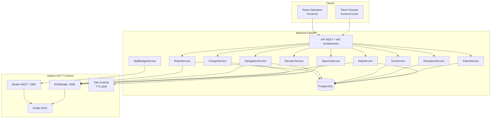
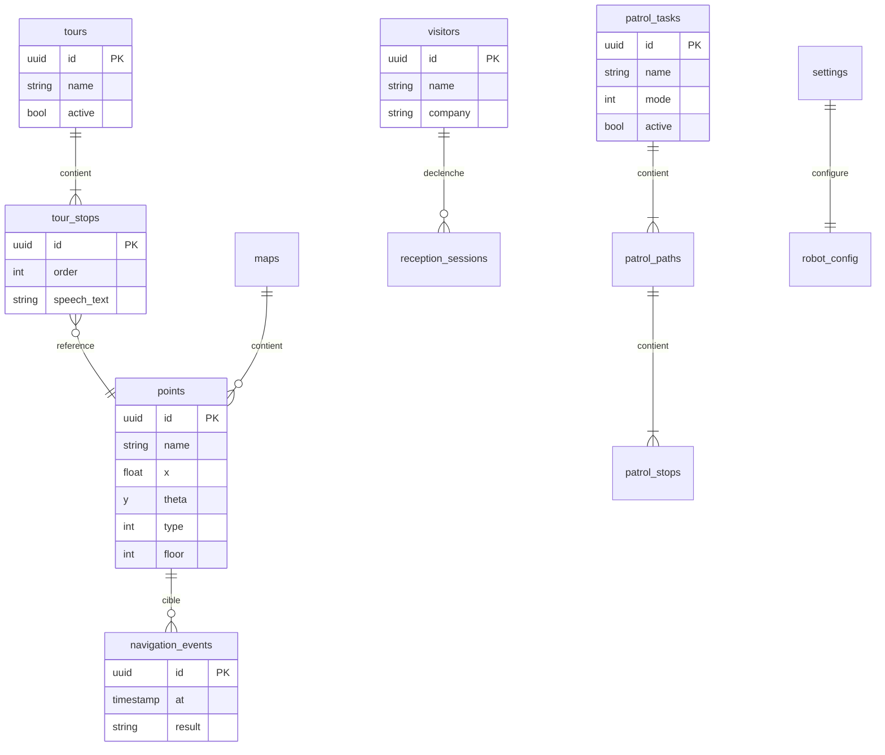

# Architecture cible CYBEL

**Version :** 1.0  
**Date :** juin 2026  
**Référence :** audit `com.ciot.welcomepatrol` + `com.ciot.sentrymove`

---

## 1. Objectif

CYBEL remplace l'écosystème logiciel fermé du constructeur par une plateforme web autonome permettant de **commander**, **superviser** et **faire interagir** le robot CIOT TY1251D, sans dépendre des APK propriétaires.

### Contraintes techniques imposées

| Contrainte | Technologie |
|------------|-------------|
| Interface utilisateur | **React** (opérateur + kiosque visiteur) |
| API et orchestration | **FastAPI** (Python) |
| Communication chassis | **ROSBridge** (WebSocket JSON) |
| Télémétrie / bus événements | **MQTT** |
| Persistance métier | **PostgreSQL** |

---

## 2. Vue d'ensemble



### Répartition des canaux

| Canal | Rôle | Priorité |
|-------|------|----------|
| **ROSBridge** | Commandes temps réel : navigation, téléop, carte, recharge, ascenseur | Primaire |
| **MQTT** | Télémétrie passive, odométrie, multi-robot ; bus interne CYBEL | Secondaire |
| **PostgreSQL** | POI, visites, patrouilles, visiteurs, config, historique | Persistance |
| **ADB** | Synthèse vocale (tête Android, hors ROS) | TTS |

> Les APK constructeur n'utilisent **pas** MQTT directement — le broker est un service du châssis ROS. CYBEL l'exploite en complément de rosbridge pour la télémétrie et l'observabilité.

---

## 3. Backend FastAPI — services cibles

| Service | Fichier actuel | Fichier cible | Responsabilité |
|---------|----------------|---------------|----------------|
| RobotService | `backend/services/robot_service.py` | idem | Connexion robot, façade SDK, télémétrie WS |
| NavigationService | dans RobotService | `navigation_service.py` | Nav POI/coords, annulation, relocalisation |
| SpeechService | `routers/speech.py` | `speech_service.py` | TTS, file d'attente vocale |
| ReceptionService | `services/reception_service.py` | idem | Accueil visiteur, actions kiosk |
| TourService | `services/tour_service.py` | idem | Visites guidées multi-arrêts |
| PatrolService | — | **nouveau** | Patrouilles cycliques |
| MapService | `routers/map.py` | `map_service.py` | Carte SLAM, POI, murs virtuels |
| ChargeService | — | **nouveau** | Retour borne, seuils batterie |
| ElevatorService | — | **nouveau** | Navigation inter-étages |
| MqttBridgeService | — | **nouveau** | Client MQTT, agrégation télémétrie |
| KnowledgeService | `routers/knowledge.py` | idem | FAQ, contenu sémantique |
| SettingsService | `routers/settings.py` | idem | Configuration plateforme |
| PersistenceLayer | — | `db/` SQLAlchemy + Alembic | PostgreSQL |

### Routers API (cible)

| Préfixe | Router actuel | Extensions |
|---------|---------------|------------|
| `/api/robot` | `routers/robot.py` | statut, mode, e-stop |
| `/api/navigation` | `routers/navigation.py` | cancel, relocalize |
| `/api/map` | `routers/map.py` | mapping SLAM |
| `/api/speech` | `routers/speech.py` | file TTS |
| `/api/reception` | `routers/reception.py` | accueil kiosk |
| `/api/tour` | `routers/tour.py` | visites guidées |
| `/api/patrol` | — | **nouveau** |
| `/api/charge` | — | **nouveau** |
| `/api/elevator` | — | **nouveau** |
| `/api/knowledge` | `routers/knowledge.py` | FAQ |
| `/api/settings` | `routers/settings.py` | config |
| `/ws/telemetry` | `main.py` | temps réel |

---

## 4. Frontend React — composants cibles

### Application opérateur (`frontend/`)

| Zone | Composant actuel | Page | Statut |
|------|------------------|------|--------|
| Tableau de bord | `app.ts` | Dashboard | ✅ |
| Barre d'état | `statusBar.ts` | Dashboard | ✅ |
| Carte interactive | `mapView.ts` | Dashboard | ✅ |
| Téléopération | `controls.ts` | Dashboard | ✅ |
| Liste POI | `pointsList.ts` | Dashboard | ✅ |
| Réception | `receptionPanel.ts` | Dashboard | ✅ |
| Visite guidée | `tourPanel.ts`, `pages/tour.ts` | Tour | ✅ |
| Paramètres | `pages/settings.ts` | Settings | ✅ |
| Voix navigateur | `voice.ts` | Dashboard | ✅ |
| Patrouille | — | Patrol | 🔲 à créer |
| Diagnostic | — | Settings | 🔲 à créer |
| Cartographie SLAM | — | Mapping | 🔲 à créer |

### Kiosque visiteur (`frontend-kiosk/`)

| Composant | Rôle | Statut |
|-----------|------|--------|
| `api.ts` | Appels backend | ✅ |
| Écrans accueil | Sélection destination, visite | ✅ partiel |

---

## 5. Mapping fonctionnalités APK → CYBEL

### 5.1 Navigation et contrôle

| Fonction APK | Référence constructeur | Frontend | Backend | MQTT | ROS | PostgreSQL |
|--------------|------------------------|----------|---------|------|-----|------------|
| Connexion chassis | `SelfChassis.connectSelfChassis` | `telemetry.ts` | `RobotService` | — | WS `:9090` | `robot_connections` |
| Téléopération | `MsgManager.velocityMsg` | `controls.ts` | `RobotService.move` | — | `/cmd_vel_mux/input/teleop` | — |
| Nav coordonnées | `MsgManager.sendGoalMsg` | `mapView.ts` | `NavigationService` | — | `/navi_goal` | `navigation_events` |
| Nav par POI | `sendMoveByMarkerName` | `pointsList.ts` | `NavigationService` | — | `/tag_manager/navi` | `points`, `navigation_events` |
| Annulation | `sendCancelMove` | `controls.ts` | `NavigationService` | — | `/move_base/cancel` | `navigation_events` |
| E-stop | `sendEStop` | `controls.ts` | `RobotService` | — | `/soft_stop` | `safety_events` |
| Relocalisation | `/global_locate` | `controls.ts` | `RobotService` | — | service `/global_locate` | `localization_sessions` |
| État navigation | `/navi_status` | `statusBar.ts` | `RobotService` | — | `/navi_status`, `/robot_status` | — |
| Position temps réel | `/robot_pose` | `mapView.ts` | WS telemetry | `test_mul` | `/robot_pose` | — |

### 5.2 POI et destinations

| Fonction APK | Frontend | Backend | MQTT | ROS | PostgreSQL |
|--------------|----------|---------|------|-----|------------|
| Liste marqueurs | `pointsList.ts` | `MapService` | — | `/marker_operation/get_markers` | `points` |
| Ajout POI | `pointsList.ts` | `MapService` | — | `/tag_manager/control` | `points` |
| Suppression POI | settings | `MapService` | — | `/marker_operation/delete_markers` | `points` |
| Types (charge, ascenseur…) | `pointsList.ts` | `MapService` | — | — | `points.type` |

Types POI (`DeploymentToolConstant`) :

| Code | Type | Usage |
|------|------|-------|
| 0 | Commun | Destination standard |
| 3 | Sortie ascenseur | Multi-étages |
| 4 | Entrée ascenseur | Multi-étages |
| 5 | Attente | Point d'attente |
| 11 | Charge | Borne de recharge |
| -65535 | Trajectoire | Patrouille |

### 5.3 Cartographie (SentryMove)

| Fonction APK | Frontend | Backend | MQTT | ROS | PostgreSQL |
|--------------|----------|---------|------|-----|------------|
| Affichage carte | `mapView.ts` | `MapService` | — | `/map` | `maps` |
| Carte courante | `mapView.ts` | `MapService` | — | `/get_current_map` | `maps` |
| Scan SLAM | `mappingPanel` (nouveau) | `MapService` | — | `/bag_record` | `mapping_sessions` |
| Sync cartes | settings | `MapService` | — | `/upload_maps`, `/download_maps` | `maps` |
| Murs virtuels | nouveau | `MapService` | — | `/virtual_wall_manager/control` | `virtual_walls` |

### 5.4 Recharge

| Fonction APK | Frontend | Backend | MQTT | ROS | PostgreSQL |
|--------------|----------|---------|------|-----|------------|
| Retour borne | `statusBar.ts` | `ChargeService` | — | `/charge_server/home_pose`, `/start_recharge` | `charge_events` |
| Seuil batterie | settings | `ChargeService` | — | `/charge_server/result` | `settings` |
| Alerte batterie | `statusBar.ts` | `RobotService` | — | `/robot_status` | `telemetry_snapshots` |

### 5.5 Patrouille

| Fonction APK | Frontend | Backend | MQTT | ROS | PostgreSQL |
|--------------|----------|---------|------|-----|------------|
| Tâche patrouille | `patrolPanel` (nouveau) | `PatrolService` | — | `/set_waypoints`, `/waypoint_state` | `patrol_tasks`, `patrol_paths` |
| Modes cycle/aléatoire | patrol UI | `PatrolService` | — | `/poi_patrol` | `patrol_tasks.mode` |
| Annonce sur point | réutiliser tour | `PatrolService` + `SpeechService` | — | — | `patrol_stops.speech_text` |

### 5.6 Accueil et visite guidée

| Fonction APK | Frontend | Backend | MQTT | ROS | PostgreSQL |
|--------------|----------|---------|------|-----|------------|
| Accueil visiteur | `receptionPanel`, kiosk | `ReceptionService` | — | — | `reception_sessions` |
| Guidage destination | `tourPanel.ts` | `TourService` | — | `/tag_manager/navi` | `tours`, `tour_stops` |
| Enregistrement visiteur | kiosk | `ReceptionService` | — | — | `visitors` |
| Annuaire | kiosk | `KnowledgeService` | — | — | `companies` |
| Salutation vocale | kiosk | `SpeechService` | — | — | `speech_log` |

### 5.7 Voix

| Fonction APK | Frontend | Backend | MQTT | ROS | PostgreSQL |
|--------------|----------|---------|------|-----|------------|
| Synthèse vocale | `receptionPanel` | `SpeechService` → ADB | — | — (pas ROS) | `speech_log` |
| Commandes vocales | `voice.ts` | `KnowledgeService` | — | — | `voice_commands` |

### 5.8 Ascenseur / multi-étages

| Fonction APK | Frontend | Backend | MQTT | ROS | PostgreSQL |
|--------------|----------|---------|------|-----|------------|
| Nav inter-étages | nouveau | `ElevatorService` | — | `/cross_floor_navi` | `floors`, `elevator_configs` |
| Config ascenseur | settings | `ElevatorService` | — | `/lift_control/configure` | `elevator_configs` |
| État ascenseur | `statusBar.ts` | `ElevatorService` | — | `/lift_control/status` | `elevator_events` |

### 5.9 MQTT

| Usage | Frontend | Backend | Topics MQTT | ROS | PostgreSQL |
|-------|----------|---------|-------------|-----|------------|
| Odométrie passive | — | `MqttBridgeService` | `test_mul` (observé) | — | `telemetry_raw` |
| Config broker | settings | `MqttBridgeService` | — | `/config_mqtt_server` | `mqtt_config` |
| Multi-robot | futur | `MqttBridgeService` | `mqtt_msg/RobotList` | `/robot_list` | `robots` |
| Bus interne CYBEL | — | publish/subscribe | `cybel/telemetry`, `cybel/events` | — | via consumers |

### 5.10 Hors scope v1

| Fonction APK constructeur | Décision CYBEL |
|---------------------------|----------------|
| CMS cloud (`WuhanApiService`) | Remplacé par PostgreSQL + JSON |
| TCP SROS :28888 | Non requis |
| Reconnaissance faciale Iflytek | Phase ultérieure |
| Appel vidéo LinPhone | Hors scope |
| Publicité plein écran | Optionnel |

---

## 6. Schéma PostgreSQL cible



| Table | Contenu |
|-------|---------|
| `points` | POI synchronisés avec le robot |
| `maps` | Métadonnées cartes SLAM |
| `tours` / `tour_stops` | Parcours de visite guidée |
| `patrol_tasks` / `patrol_paths` / `patrol_stops` | Patrouilles |
| `visitors` | Visiteurs enregistrés |
| `reception_sessions` | Sessions d'accueil |
| `navigation_events` | Historique navigation |
| `charge_events` | Historique recharges |
| `elevator_configs` | Configuration ascenseurs |
| `settings` | Configuration plateforme |
| `speech_log` | Historique TTS |
| `telemetry_snapshots` | Snapshots batterie/pose |
| `knowledge_entries` | FAQ et contenu |

---

## 7. SDK Python (couche robot)

Le SDK (`sdk/`) reste la couche bas niveau ; les services FastAPI l'encapsulent.

| Module actuel | Rôle | Extensions cibles |
|---------------|------|-------------------|
| `rosbridge.py` | Client WebSocket ROS | services ascenseur, patrouille |
| `real_robot.py` | Implémentation robot réel | charge, MQTT |
| `mock_robot.py` | Simulation | parité avec real_robot |
| `speech.py` | TTS multi-canal | — |
| `constants.py` | Topics ROS | aligner sur `TopicContent.java` |
| `mqtt_client.py` | — | **nouveau** client MQTT |

---

## 8. Flux de données cibles

### Navigation opérateur

```
Opérateur → clic POI (pointsList.ts)
  → POST /api/navigation/go { point_name }
  → NavigationService
  → sdk/real_robot.py → ROSBridge publish /navi_goal ou call /tag_manager/navi
  → Robot se déplace
  → /navi_status → RobotService → WS /ws/telemetry → mapView.ts + statusBar.ts
  → navigation_events → PostgreSQL
```

### Accueil visiteur (kiosk)

```
Visiteur → sélection destination (frontend-kiosk)
  → POST /api/reception/action
  → ReceptionService → TourService
  → SpeechService.speak("Bienvenue…") → ADB → CybelTTSBridge
  → NavigationService → robot guide vers destination
  → reception_sessions → PostgreSQL
```

### Télémétrie parallèle MQTT

```
Broker MQTT :1883
  → MqttBridgeService (subscribe # ou topics connus)
  → agrégation avec télémétrie ROSBridge
  → WS /ws/telemetry → dashboard
  → telemetry_snapshots → PostgreSQL (optionnel)
```
