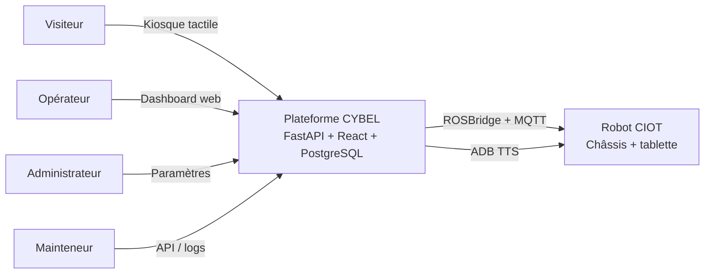
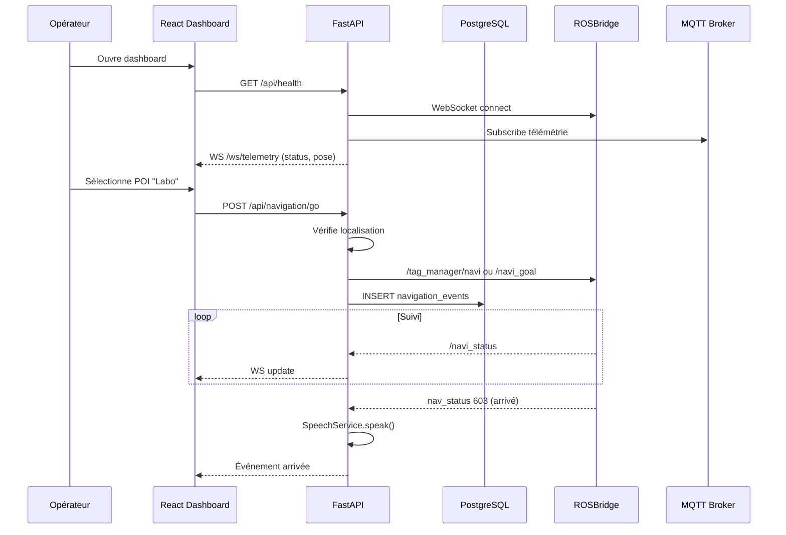
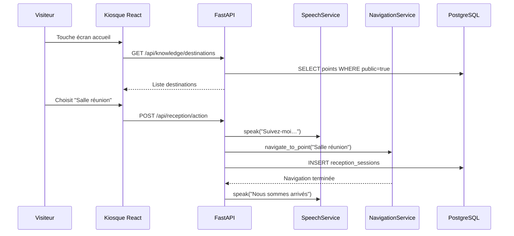
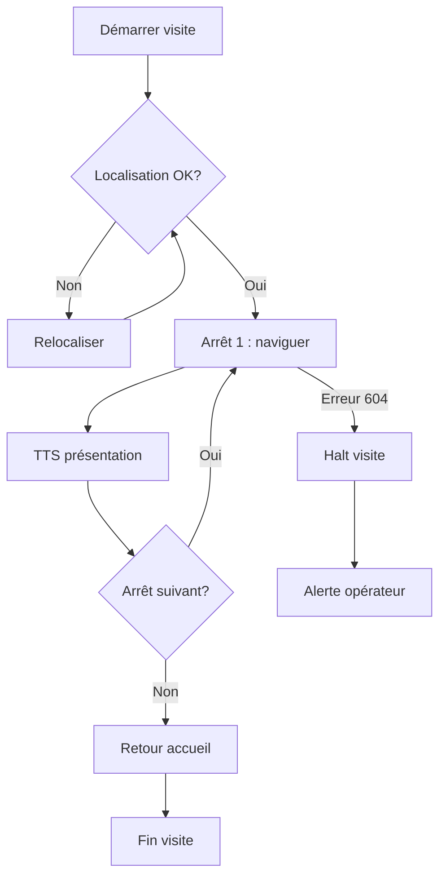
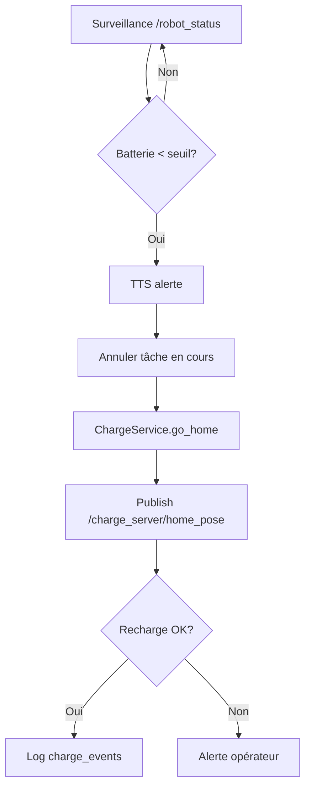

# Cahier des charges fonctionnel — CYBEL

**Version :** 1.0  
**Date :** juin 2026  
**Produit :** CYBEL — Plateforme de commande et d'interaction robot CIOT TY1251D  
**Client :** HESTIM / laboratoire robotique  
**Document :** spécification fonctionnelle dérivée de l'audit des APK constructeur

---

## 1. Présentation du produit

### 1.1 Contexte

Le robot CIOT TY1251D-03195 est livré avec des applications Android propriétaires (`welcomepatrol`, `sentrymove`) sans documentation ni API publique. Le client souhaite une **plateforme web indépendante** pour piloter le robot dans un contexte de réception et de visite guidée en laboratoire, sans dépendre du constructeur.

### 1.2 Objectif du produit

**CYBEL** est une plateforme web permettant :

- la **commande** du robot (déplacement, navigation autonome) ;
- la **supervision** en temps réel (position, batterie, état navigation) ;
- l'**accueil des visiteurs** (kiosque tactile, annonces vocales) ;
- la **visite guidée** vers des destinations prédéfinies ;
- la **consultation de l'état** du robot et l'historique des actions ;
- le **suivi de la batterie** et le retour automatique en charge ;
- les **déplacements autonomes** vers des points d'intérêt (POI).

### 1.3 Périmètre

| Dans le périmètre v1 | Hors périmètre v1 |
|----------------------|-------------------|
| Interface opérateur web | Modification firmware robot |
| Kiosque visiteur sur tablette | CMS cloud constructeur (Wuhan) |
| Navigation mono-robot | Multi-robot simultané |
| Visite guidée + patrouille simple | Cartographie SLAM complète (outil technicien) |
| TTS via tablette Android | Reconnaissance faciale Iflytek |
| Persistance PostgreSQL | Appel vidéo / LinPhone |
| MQTT + ROSBridge | Protocole SROS cloud :28888 |

### 1.4 Utilisateurs cibles

- **Opérateur / technicien** : supervise et pilote le robot depuis un PC connecté au Wi-Fi robot.
- **Visiteur** : interagit avec le kiosque sur la tablette du robot.
- **Administrateur** : configure POI, parcours, paramètres réseau et seuils batterie.
- **Développeur / mainteneur** : exploite l'API, consulte les logs, mode mock.

---

## 2. Acteurs

| Acteur | Description | Interface |
|--------|-------------|-----------|
| **Visiteur** | Personne accueillie par le robot en réception | Kiosque React (`frontend-kiosk/`) |
| **Opérateur** | Personnel labo supervisant le robot en session | Dashboard React (`frontend/`) |
| **Administrateur** | Configure POI, visites, patrouilles, réseau | Page Paramètres |
| **Mainteneur** | Développeur, debug, mode mock, scripts | API REST, logs, `.env` |
| **Robot CIOT** | Système physique : châssis ROS + tablette Android | ROSBridge, MQTT, ADB |
| **Plateforme CYBEL** | Produit logiciel (backend + frontends + BDD) | — |

---

## 3. Cas d'utilisation

### 3.1 Vue d'ensemble

| ID | Cas d'utilisation | Acteur principal | Priorité |
|----|-------------------|------------------|----------|
| UC-01 | Se connecter au robot | Opérateur | Critique |
| UC-02 | Superviser l'état du robot | Opérateur | Critique |
| UC-03 | Piloter manuellement (téléop) | Opérateur | Critique |
| UC-04 | Naviguer vers un POI | Opérateur | Critique |
| UC-05 | Naviguer vers des coordonnées | Opérateur | Importante |
| UC-06 | Annuler une navigation | Opérateur | Critique |
| UC-07 | Relocaliser le robot | Opérateur | Critique |
| UC-08 | Faire parler le robot | Opérateur / Visiteur | Critique |
| UC-09 | Accueillir un visiteur | Visiteur | Critique |
| UC-10 | Lancer une visite guidée | Opérateur / Visiteur | Critique |
| UC-11 | Gérer les POI | Administrateur | Importante |
| UC-12 | Consulter la carte | Opérateur | Importante |
| UC-13 | Retour automatique en charge | Système | Importante |
| UC-14 | Lancer une patrouille | Administrateur | Importante |
| UC-15 | Configurer la plateforme | Administrateur | Importante |
| UC-16 | Enregistrer un visiteur | Visiteur | Optionnelle |
| UC-17 | Naviguer entre étages | Opérateur | Optionnelle |
| UC-18 | Cartographier (SLAM) | Administrateur | Optionnelle |
| UC-19 | Consulter l'historique | Administrateur | Optionnelle |
| UC-20 | Mode simulation (mock) | Mainteneur | Importante |

### 3.2 Détail des cas d'utilisation prioritaires

#### UC-01 — Se connecter au robot

| Élément | Description |
|---------|-------------|
| **Acteur** | Opérateur |
| **Précondition** | PC connecté au Wi-Fi du robot (`10.42.0.x`) |
| **Déclencheur** | Démarrage backend ou clic « Reconnecter » |
| **Scénario nominal** | 1. Backend ouvre WebSocket vers `10.42.0.1:9090`. 2. Abonnements ROS (`/robot_status`, `/robot_pose`). 3. Connexion MQTT passive. 4. Dashboard affiche « Connecté ». |
| **Scénario alternatif** | Robot injoignable → mode dégradé, message d'erreur, retry automatique. |
| **Postcondition** | Télémétrie temps réel disponible via `/ws/telemetry` |
| **Référence APK** | `SelfChassis.connectSelfChassis`, `ConnectedDialog` |

#### UC-04 — Naviguer vers un POI

| Élément | Description |
|---------|-------------|
| **Acteur** | Opérateur |
| **Précondition** | Robot connecté, localisé (confiance ≥ 60 %), `nav_status` = 601 |
| **Déclencheur** | Clic sur un POI dans la liste ou commande vocale |
| **Scénario nominal** | 1. Vérification localisation. 2. Appel `/tag_manager/navi` ou publish `/navi_goal`. 3. Suivi `/navi_status` jusqu'à 603 (arrivé). 4. Annonce vocale optionnelle. 5. Enregistrement en BDD. |
| **Scénario alternatif** | `nav_status` = 604 → message d'erreur, procédure relocalisation. |
| **Postcondition** | Robot à destination ou erreur documentée |
| **Référence APK** | `NavigationHelper.setTargetPosition`, `NaviLeadTheWayFragment` |

#### UC-09 — Accueillir un visiteur

| Élément | Description |
|---------|-------------|
| **Acteur** | Visiteur |
| **Précondition** | Kiosque actif, robot en poste d'accueil |
| **Déclencheur** | Visiteur touche l'écran ou approche du robot |
| **Scénario nominal** | 1. Affichage menu destinations. 2. Visiteur choisit une destination. 3. Robot annonce l'accueil (TTS). 4. Lancement navigation guidée. 5. Session enregistrée. |
| **Postcondition** | Visite guidée en cours ou terminée |
| **Référence APK** | `WelcomeManager`, `VisitorFragment` |

#### UC-10 — Lancer une visite guidée

| Élément | Description |
|---------|-------------|
| **Acteur** | Opérateur |
| **Précondition** | Parcours configuré en BDD, robot prêt |
| **Déclencheur** | Clic « Démarrer la visite » |
| **Scénario nominal** | Pour chaque arrêt : navigation → TTS → pause → arrêt suivant. Gestion halt/reprise. |
| **Postcondition** | Tous les arrêts visités ou visite interrompue |
| **Référence APK** | `NavGuideFragment`, `PatrolTask` (logique similaire) |

#### UC-13 — Retour automatique en charge

| Élément | Description |
|---------|-------------|
| **Acteur** | Système |
| **Précondition** | Seuil batterie configuré, borne de charge définie |
| **Déclencheur** | Batterie < seuil (`/robot_status`) |
| **Scénario nominal** | 1. Annonce vocale. 2. Annulation tâche en cours. 3. `sendGoHome` → `/charge_server/home_pose`. 4. Log en BDD. |
| **Référence APK** | `WelcomeManager.lowPowerBack2ChargePile` |

---

## 4. Fonctionnalités

### 4.1 Module Supervision

| ID | Fonctionnalité | Description | Acteur |
|----|----------------|-------------|--------|
| F-SUP-01 | Connexion robot | Établir et maintenir la liaison ROSBridge + MQTT | Opérateur |
| F-SUP-02 | Tableau de bord temps réel | Position, batterie, nav_status, localisation | Opérateur |
| F-SUP-03 | Carte SLAM | Affichage carte + pose robot + POI | Opérateur |
| F-SUP-04 | Journal d'événements | Log des actions et erreurs en session | Opérateur |
| F-SUP-05 | Indicateur WebSocket | État connexion frontend ↔ backend | Opérateur |
| F-SUP-06 | Mode mock | Simulation sans robot physique | Mainteneur |

### 4.2 Module Commande

| ID | Fonctionnalité | Description | Acteur |
|----|----------------|-------------|--------|
| F-CMD-01 | Téléopération | Joystick clavier/souris, vitesses configurables | Opérateur |
| F-CMD-02 | Navigation POI | Aller vers un point nommé | Opérateur |
| F-CMD-03 | Navigation coordonnées | Clic sur carte → objectif | Opérateur |
| F-CMD-04 | Annulation navigation | Stop propre ou forcé | Opérateur |
| F-CMD-05 | Arrêt d'urgence logiciel | Soft e-stop | Opérateur |
| F-CMD-06 | Relocalisation | Global locate avant navigation | Opérateur |
| F-CMD-07 | Mode manuel / auto | Bascule mode navigation | Opérateur |

### 4.3 Module Voix

| ID | Fonctionnalité | Description | Acteur |
|----|----------------|-------------|--------|
| F-VOX-01 | Synthèse vocale (TTS) | Faire parler le robot via ADB | Opérateur |
| F-VOX-02 | TTS sur événement | Annonce à l'arrivée, accueil, batterie basse | Système |
| F-VOX-03 | File d'attente vocale | Priorisation et interruption | Système |
| F-VOX-04 | Commande vocale navigateur | Web Speech API → action (expérimental) | Opérateur |

### 4.4 Module Réception et visite

| ID | Fonctionnalité | Description | Acteur |
|----|----------------|-------------|--------|
| F-REC-01 | Kiosque visiteur | Interface tactile destinations | Visiteur |
| F-REC-02 | Actions réception | Déclencher scénarios prédéfinis | Opérateur |
| F-REC-03 | Visite guidée | Parcours multi-arrêts avec TTS | Opérateur |
| F-REC-04 | Halt / reprise visite | Pause et continuation | Opérateur |
| F-REC-05 | Contenu knowledge | FAQ / réponses sémantiques locales | Visiteur |
| F-REC-06 | Enregistrement visiteur | Formulaire nom/société (optionnel) | Visiteur |

### 4.5 Module POI et carte

| ID | Fonctionnalité | Description | Acteur |
|----|----------------|-------------|--------|
| F-MAP-01 | Liste POI | Affichage, sélection, filtrage par type | Opérateur |
| F-MAP-02 | Synchronisation POI | Import depuis robot ROS | Administrateur |
| F-MAP-03 | Création / suppression POI | CRUD persisté PostgreSQL + sync ROS | Administrateur |
| F-MAP-04 | Types POI | charge, ascenseur, attente, commun | Administrateur |
| F-MAP-05 | Cartographie SLAM | Scan et édition (phase ultérieure) | Administrateur |

### 4.6 Module Patrouille

| ID | Fonctionnalité | Description | Acteur |
|----|----------------|-------------|--------|
| F-PAT-01 | Créer tâche patrouille | Chemin + points + annonces | Administrateur |
| F-PAT-02 | Lancer / arrêter patrouille | Exécution autonome cyclique | Opérateur |
| F-PAT-03 | Modes patrouille | Cycle, aller-retour (v1 : cycle) | Administrateur |

### 4.7 Module Énergie

| ID | Fonctionnalité | Description | Acteur |
|----|----------------|-------------|--------|
| F-ENR-01 | Affichage batterie | Pourcentage, état charge | Opérateur |
| F-ENR-02 | Seuil batterie basse | Configuration + alerte | Administrateur |
| F-ENR-03 | Retour borne | Manuel ou automatique | Opérateur / Système |

### 4.8 Module Configuration

| ID | Fonctionnalité | Description | Acteur |
|----|----------------|-------------|--------|
| F-CFG-01 | Paramètres réseau | IP robot, port WS, ADB serial | Administrateur |
| F-CFG-02 | Point d'accueil | Nom POI réception, étage | Administrateur |
| F-CFG-03 | Seuils navigation | Timeout, confiance localisation min | Administrateur |
| F-CFG-04 | Paramètres TTS | Canal ADB, voix | Administrateur |
| F-CFG-05 | Persistance PostgreSQL | URL connexion BDD | Mainteneur |

### 4.9 Module Ascenseur (optionnel)

| ID | Fonctionnalité | Description | Acteur |
|----|----------------|-------------|--------|
| F-ASC-01 | Navigation inter-étages | Cross-floor nav | Opérateur |
| F-ASC-02 | Configuration ascenseur | Paramètres lift_control | Administrateur |

---

## 5. Contraintes

### 5.1 Contraintes techniques

| ID | Contrainte | Justification |
|----|------------|---------------|
| CT-01 | Frontend en **React** (Vite) | Stack imposée, déjà en place |
| CT-02 | Backend en **FastAPI** | Stack imposée, async, WebSocket natif |
| CT-03 | Communication robot via **ROSBridge** `:9090` | Canal primaire confirmé par audit APK |
| CT-04 | Télémétrie complémentaire via **MQTT** `:1883` | Broker actif sur robot, observé en labo |
| CT-05 | Persistance **PostgreSQL** | Données métier, historique, config |
| CT-06 | TTS via **ADB** vers tablette Android | Aucun topic ROS TTS dans APK constructeur |
| CT-07 | Pas de modification firmware / APK constructeur | Périmètre projet |
| CT-08 | Mode **mock** obligatoire | Développement sans robot physique |

### 5.2 Contraintes réseau

| ID | Contrainte | Détail |
|----|------------|--------|
| CN-01 | Wi-Fi robot requis | PC sur réseau `10.42.0.x` |
| CN-02 | Deux IP distinctes | Châssis `10.42.0.1` ≠ tablette `172.16.0.194` (DHCP) |
| CN-03 | ROSBridge sans authentification | Précaution : vérifier avant commande réelle |
| CN-04 | MQTT sans authentification | Écoute passive recommandée avant publish |
| CN-05 | ADB Wi-Fi port 5555 | Reconnexion après chaque reboot robot |

### 5.3 Contraintes métier

| ID | Contrainte | Détail |
|----|------------|--------|
| CM-01 | Localisation préalable | `nav_status` 601 + confiance ≥ 60 % avant navigation |
| CM-02 | Procédure échec navigation | Relocaliser → attendre 601 → relancer |
| CM-03 | Orientation paysage | Interface adaptée écran robot 15,6" |
| CM-04 | Français prioritaire | i18n secondaire |
| CM-05 | Autonomie ~8 h | Gestion batterie critique en usage réel |

### 5.4 Contraintes réglementaires et éthiques

| ID | Contrainte | Détail |
|----|------------|--------|
| CE-01 | Pas de décompilation en production | Audit à des fins de conception uniquement |
| CE-02 | Données visiteurs minimales | RGPD : stocker le strict nécessaire |
| CE-03 | Principe de précaution robot | E-stop accessible, annulation toujours possible |

---

## 6. Flux fonctionnels

### 6.1 Flux principal — Session opérateur

### 6.2 Flux — Accueil visiteur (kiosk)

### 6.3 Flux — Visite guidée

### 6.4 Flux — Batterie basse

### 6.5 Flux — Données et persistance

| Événement | Écriture PostgreSQL | Lecture |
|-----------|---------------------|---------|
| Démarrage session | `robot_connections` | — |
| Navigation lancée | `navigation_events` | `points` |
| Visite démarrée | `reception_sessions` | `tours`, `tour_stops` |
| TTS joué | `speech_log` | — |
| POI modifié | `points` | sync ROS |
| Config changée | `settings` | au démarrage |
| Patrouille | `patrol_tasks` | `patrol_paths` |

### 6.6 Flux — MQTT (complément ROSBridge)

| Direction | Topic | Contenu | Usage CYBEL |
|-----------|-------|---------|-------------|
| Subscribe | `test_mul` | Odométrie châssis | Corrélation télémétrie |
| Subscribe | `#` (passif) | Découverte topics | Observabilité |
| Subscribe | `cybel/#` (interne) | Événements plateforme | Bus interne futur |
| Publish | — (v1 minimal) | — | Pas de commande MQTT v1 |
| ROS service | `/config_mqtt_server` | Config broker | Via ROSBridge si besoin |

---

## 7. Exigences non fonctionnelles

| ID | Exigence | Cible |
|----|----------|-------|
| ENF-01 | Latence télémétrie | < 500 ms affichage pose |
| ENF-02 | Reconnexion auto | ROSBridge retry 3×, backoff |
| ENF-03 | Disponibilité session | Reconnexion WS frontend transparente |
| ENF-04 | Temps réponse API | < 200 ms (hors navigation) |
| ENF-05 | Timeout navigation | Configurable, défaut 300 s |
| ENF-06 | Sauvegarde BDD | PostgreSQL persistant, migrations Alembic |
| ENF-07 | Sécurité CORS | Origines configurées |
| ENF-08 | Logs structurés | Actions robot + erreurs |

---

## 8. Interfaces externes

| Système | Protocole | Endpoint | Données échangées |
|---------|-----------|----------|-------------------|
| Châssis ROS | WebSocket JSON | `ws://10.42.0.1:9090` | Topics/services ROS |
| Broker MQTT | MQTT 3.1.1 | `10.42.0.1:1883` | Télémétrie passive |
| Tablette Android | ADB TCP | `172.16.0.194:5555` | Broadcast TTS |
| PostgreSQL | TCP | configurable | Données métier |
| Navigateur opérateur | HTTP/WS | `:8000` / `:5173` | API REST + telemetry |

---

## 9. Glossaire

| Terme | Définition |
|-------|------------|
| **POI** | Point d'intérêt — destination nommée sur la carte |
| **ROSBridge** | Pont WebSocket traduisant JSON ↔ ROS |
| **nav_status** | Code état navigation (600 init, 601 prêt, 602 en cours, 603 arrivé, 604 erreur) |
| **Téléop** | Pilotage manuel par vitesses linéaire/angulaire |
| **Kiosque** | Interface visiteur sur tablette du robot |
| **Patrouille** | Déplacement autonome cyclique entre POI |
| **Visite guidée** | Parcours ordonné avec annonces vocales |
| **Soft e-stop** | Arrêt logiciel réversible |
| **Mock** | Mode simulation sans robot physique |

---

## 10. Traçabilité audit APK → fonctionnalités CYBEL

| Fonction constructeur | Module CYBEL | Cas d'usage |
|-----------------------|--------------|-------------|
| `WelcomeManager` | F-REC-01, F-REC-02 | UC-09 |
| `NaviLeadTheWayFragment` | F-REC-03 | UC-10 |
| `NavigationHelper` | F-CMD-02, F-CMD-03 | UC-04, UC-05 |
| `PatrolTask` | F-PAT-01, F-PAT-02 | UC-14 |
| `RobotSpeechManager` | F-VOX-01, F-VOX-02 | UC-08 |
| `SelfChassis` + `MsgManager` | F-SUP-01, F-CMD-* | UC-01 à UC-07 |
| `MapFragment` (SentryMove) | F-MAP-05 | UC-18 |
| `ElevatorDialog` | F-ASC-* | UC-17 |
| `ChargeService` équivalent | F-ENR-* | UC-13 |

---

*Document suivant prévu : [03-diagrammes.md](03-diagrammes.md) — sur validation client.*
