# Diagrammes CYBEL

**Version :** 1.0  
**Date :** juin 2026  
**Références :** [01-architecture-cible.md](01-architecture-cible.md) · [02-cahier-des-charges-fonctionnel.md](02-cahier-des-charges-fonctionnel.md)

Ce document regroupe les diagrammes de conception du produit CYBEL. Tous les diagrammes utilisent la syntaxe **Mermaid** (rendu natif dans GitHub, Cursor, VS Code).

---

## 1. Diagramme de cas d'utilisation

### 1.1 Vue globale

```mermaid
flowchart TB
    subgraph Acteurs
        VIS((Visiteur))
        OP((Opérateur))
        ADM((Administrateur))
        DEV((Mainteneur))
        SYS((Système))
    end

    subgraph CYBEL["Plateforme CYBEL"]
        subgraph Supervision["Supervision"]
            UC01[UC-01 Connexion robot]
            UC02[UC-02 Superviser état]
            UC12[UC-12 Consulter carte]
        end
        subgraph Commande["Commande"]
            UC03[UC-03 Téléopération]
            UC04[UC-04 Naviguer POI]
            UC05[UC-05 Naviguer coords]
            UC06[UC-06 Annuler navigation]
            UC07[UC-07 Relocaliser]
        end
        subgraph Voix["Voix"]
            UC08[UC-08 Faire parler]
        end
        subgraph Reception["Réception & visite"]
            UC09[UC-09 Accueillir visiteur]
            UC10[UC-10 Visite guidée]
            UC16[UC-16 Enregistrer visiteur]
        end
        subgraph Gestion["Gestion & config"]
            UC11[UC-11 Gérer POI]
            UC14[UC-14 Patrouille]
            UC15[UC-15 Configurer]
            UC19[UC-19 Historique]
        end
        subgraph Energie["Énergie"]
            UC13[UC-13 Retour charge]
        end
        subgraph Avance["Fonctions avancées"]
            UC17[UC-17 Multi-étages]
            UC18[UC-18 Cartographier]
            UC20[UC-20 Mode mock]
        end
    end

    OP --> UC01 & UC02 & UC03 & UC04 & UC05 & UC06 & UC07 & UC08 & UC10 & UC12
    VIS --> UC09 & UC16
    VIS -.-> UC10
    ADM --> UC11 & UC14 & UC15 & UC17 & UC18 & UC19
    DEV --> UC20 & UC15
    SYS --> UC13

    UC09 --> UC08
    UC10 --> UC04 & UC08
    UC14 --> UC04 & UC08
    UC13 --> UC04 & UC08
```

### 1.2 Cas d'utilisation — Réception visiteur (détail)

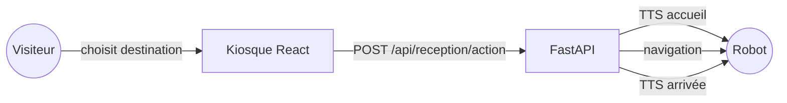

### 1.3 Matrice acteur × cas d'utilisation

| Cas d'usage | Visiteur | Opérateur | Admin | Mainteneur | Système |
|-------------|:--------:|:---------:|:-----:|:----------:|:-------:|
| UC-01 Connexion | | ✓ | | ✓ | |
| UC-02 Supervision | | ✓ | | ✓ | |
| UC-03 Téléop | | ✓ | | | |
| UC-04 Nav POI | | ✓ | | | ✓ |
| UC-08 TTS | | ✓ | | | ✓ |
| UC-09 Accueil | ✓ | | | | |
| UC-10 Visite guidée | ✓ | ✓ | | | |
| UC-11 Gérer POI | | | ✓ | | |
| UC-13 Retour charge | | | | | ✓ |
| UC-14 Patrouille | | ✓ | ✓ | | |
| UC-15 Config | | | ✓ | ✓ | |
| UC-17 Multi-étages | | ✓ | ✓ | | |
| UC-20 Mock | | | | ✓ | |

---

## 2. Diagrammes de séquence

### 2.1 Connexion et supervision (UC-01, UC-02)

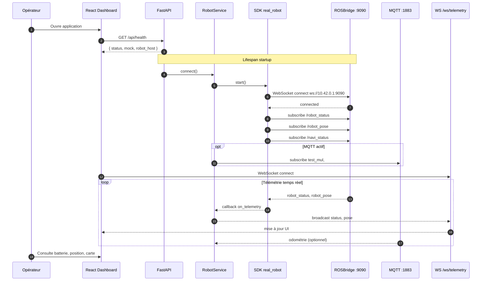

### 2.2 Navigation vers un POI (UC-04)

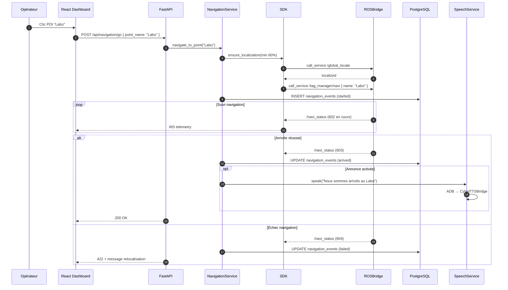

### 2.3 Accueil visiteur via kiosque (UC-09)

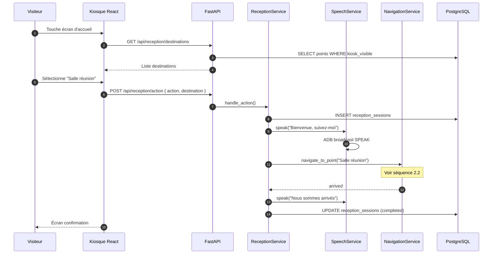

### 2.4 Visite guidée multi-arrêts (UC-10)

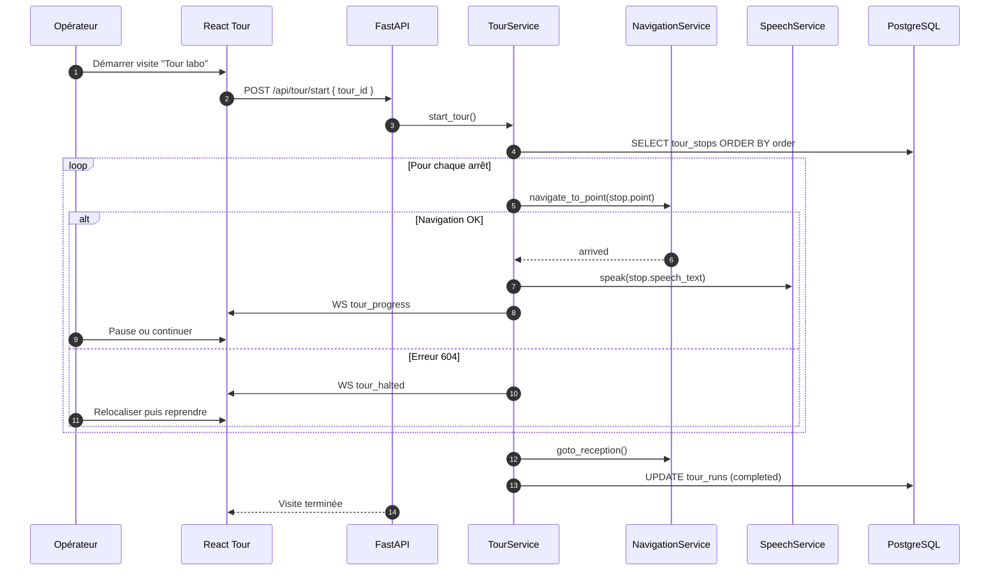

### 2.5 Synthèse vocale TTS (UC-08)

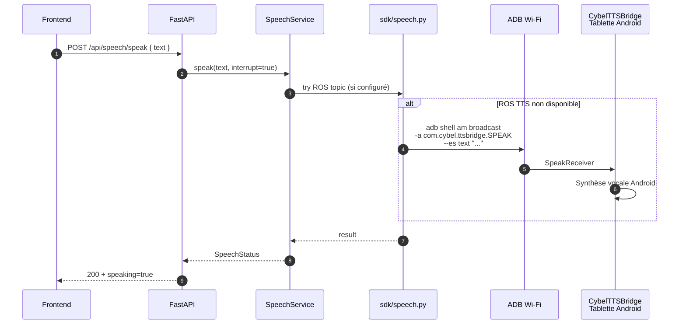

### 2.6 Retour charge batterie basse (UC-13)

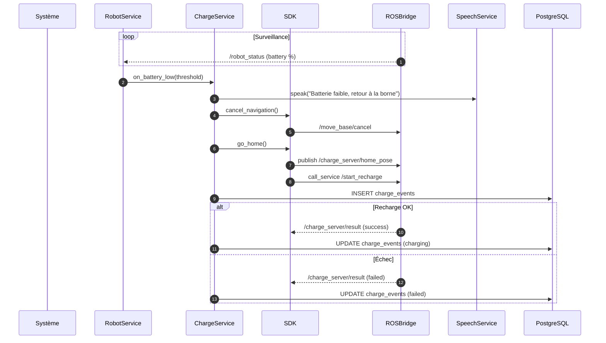

### 2.7 Téléopération manuelle (UC-03)

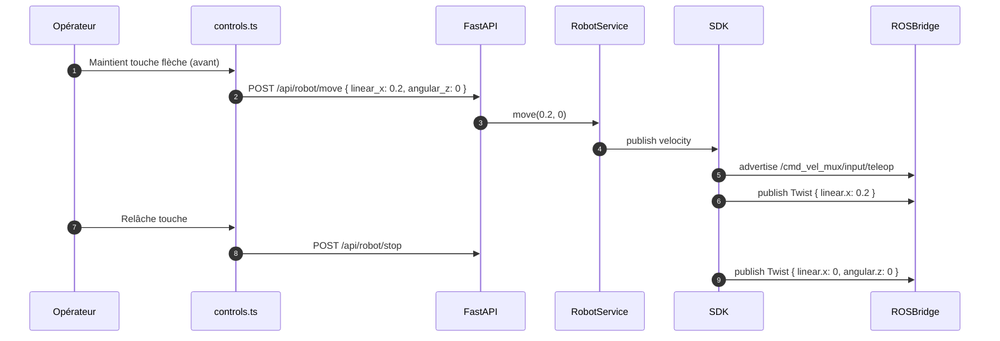

---

## 3. Diagramme de composants

### 3.1 Composants logiciels CYBEL

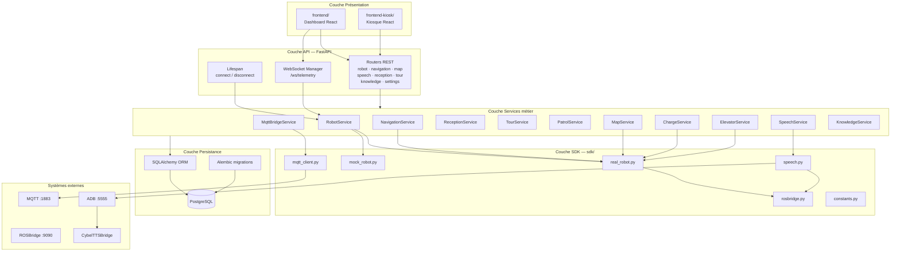

### 3.2 Composants frontend (détail)

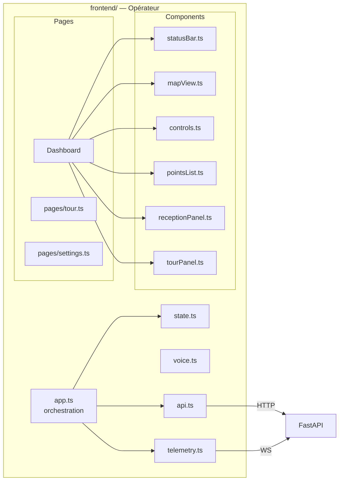

### 3.3 Interfaces entre composants

| Composant source | Composant cible | Interface | Protocole |
|------------------|-----------------|-----------|-----------|
| `frontend/api.ts` | Routers FastAPI | REST JSON | HTTP |
| `frontend/telemetry.ts` | `ws_manager` | Événements temps réel | WebSocket |
| `RobotService` | `real_robot.py` | Méthodes async | Python |
| `real_robot.py` | `rosbridge.py` | Messages ROS | WebSocket JSON |
| `MqttBridgeService` | Broker robot | Pub/Sub | MQTT 3.1.1 |
| `SpeechService` | `speech.py` | speak(), stop() | Python + ADB |
| Services métier | SQLAlchemy ORM | CRUD | SQL / PostgreSQL |
| `frontend-kiosk/api.ts` | `reception.router` | Actions kiosk | HTTP |

---

## 4. Diagramme d'architecture

### 4.1 Architecture physique (déploiement)

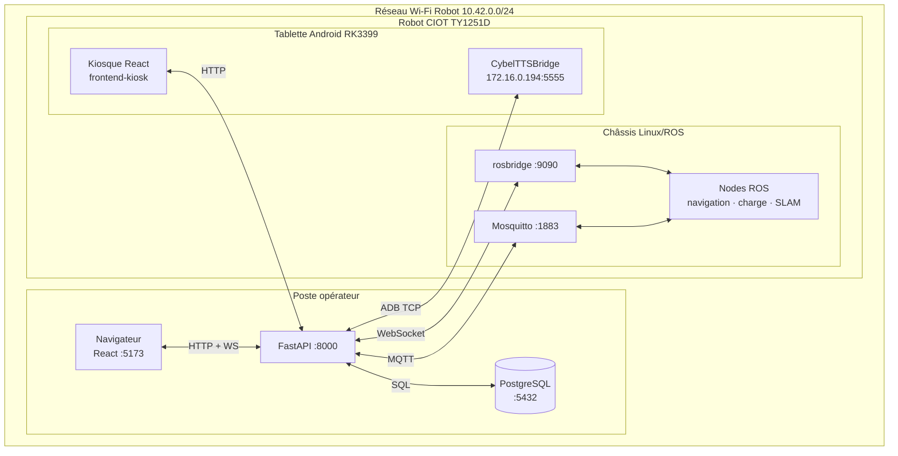

### 4.2 Architecture logique (couches)

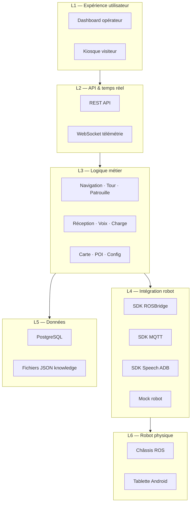

### 4.3 Architecture flux de données

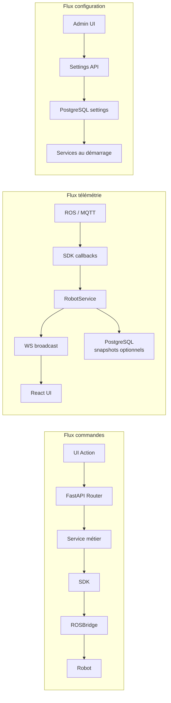

### 4.4 Comparaison architecture constructeur vs CYBEL

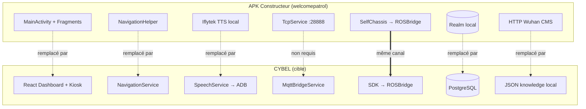

### 4.5 Topologie réseau

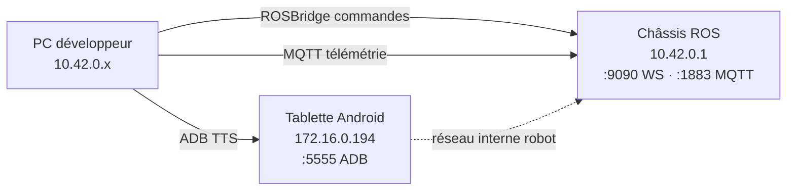

| Hôte | IP | Ports | Rôle |
|------|-----|-------|------|
| Châssis | `10.42.0.1` | 9090, 1883 | ROSBridge, MQTT |
| Tablette | `172.16.0.194` (DHCP) | 5555 | ADB, TTS, kiosque |
| PC / serveur CYBEL | `10.42.0.x` | 8000, 5432 | Backend, PostgreSQL |
| Frontend dev | localhost | 5173 | Vite dev server |

---

## 5. Diagramme d'états — Navigation

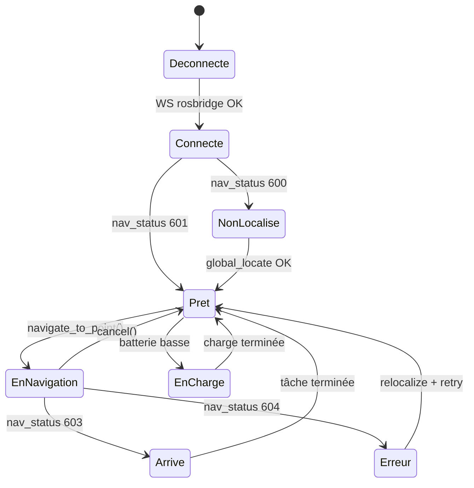

---

## 6. Diagramme d'états — Visite guidée

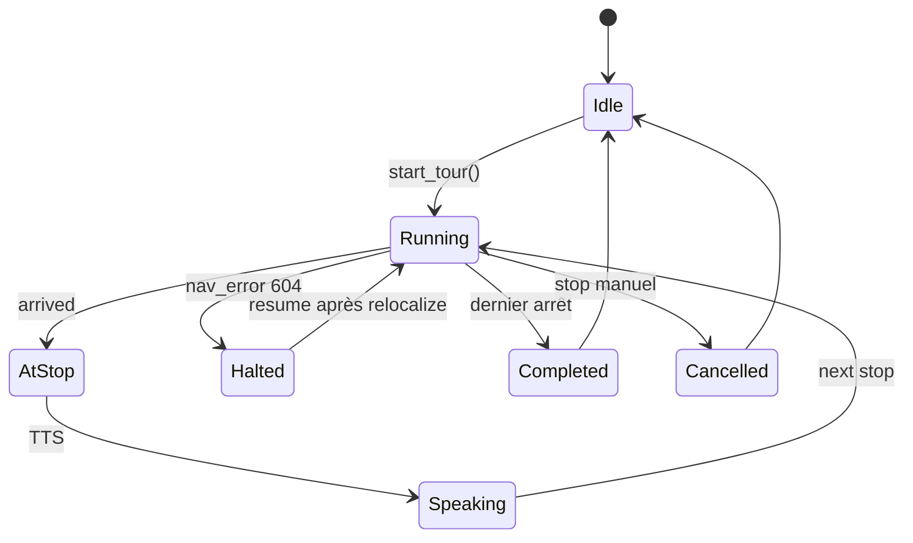

---

## 7. Légende et conventions

| Symbole | Signification |
|---------|---------------|
| Flèche pleine | Appel / flux de données actif |
| Flèche pointillée | Relation optionnelle ou remplacement |
| `==>` | Même canal technique conservé |
| Rectangle | Composant logiciel |
| Cylindre `(())` | Base de données |
| Acteur `((...))` | Utilisateur ou système externe |

---

*Document suivant prévu : [04-ecart-etat-actuel.md](04-ecart-etat-actuel.md) — sur validation client.*
