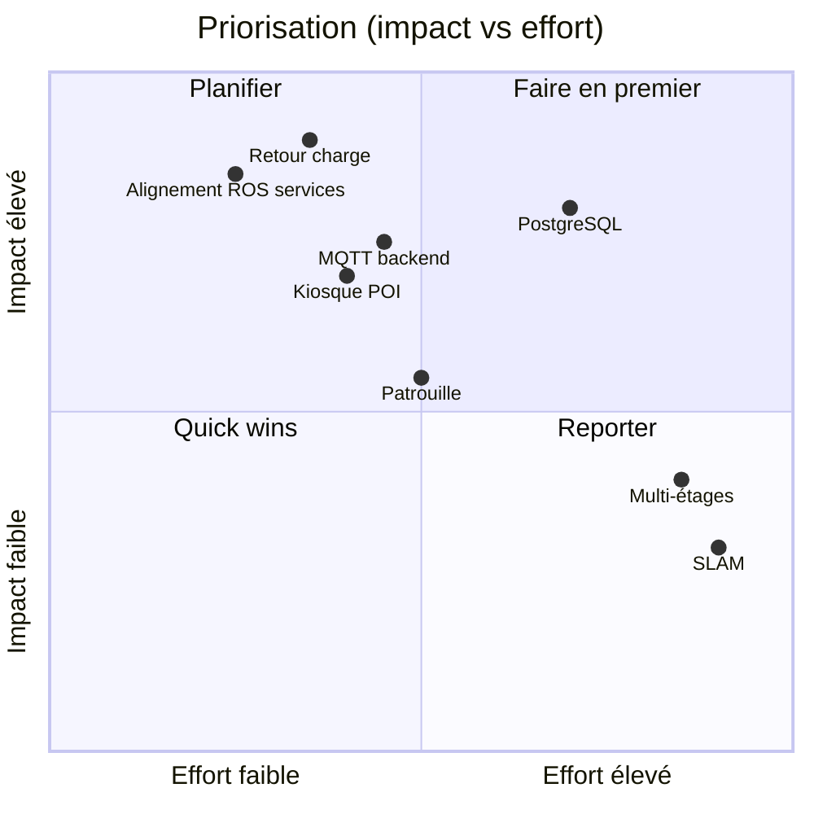

# Écart d'état — CYBEL actuel vs constructeur

**Version :** 1.1  
**Date :** juin 2026 (mise à jour post Phase 0)  
**Références :** [AUDIT_APK_CONSTRUCTEUR.md](AUDIT_APK_CONSTRUCTEUR.md) · [02-cahier-des-charges-fonctionnel.md](02-cahier-des-charges-fonctionnel.md) · [05-backlog.md](05-backlog.md) · [PHASE0_DEMARRAGE.md](../PHASE0_DEMARRAGE.md)

Ce document compare l'**état réel du dépôt CYBEL** (juin 2026) avec les fonctionnalités identifiées dans les APK constructeur `welcomepatrol` et `sentrymove`.

**Dernière évolution code :** Phase 0 (CYB-001 → CYB-006) implémentée dans le SDK — alignement `TopicContent` / `ServiceContent` APK, fallbacks ROS, smoke test CLI. **Validation terrain robot en attente.**

---

## 1. Synthèse exécutive

| Indicateur | Valeur |
|------------|--------|
| **Couverture fonctionnelle estimée** | ~**50 %** du périmètre v1 cible (+5 pts après Phase 0 code) |
| **Phase 0 SDK (CYB-001→006)** | ✅ **Codée** · ⚠️ **Non validée** sur robot réel |
| **Canal ROSBridge** | ✅ Opérationnel (navigation, téléop aligné APK, carte, TTS ADB) |
| **Canal MQTT backend** | ❌ Scripts seulement (`scripts/mqtt_*.py`) |
| **PostgreSQL** | ❌ Données en fichiers JSON (`data/`) |
| **Frontend cible React** | ⚠️ Implémenté en **TypeScript/Vite vanilla** (pas encore React) |
| **Kiosque visiteur** | ⚠️ Partiel (visite labo uniquement) |
| **Tests automatisés** | ✅ 37 tests unitaires (`pytest tests/unit`) |
| **Smoke test robot** | ✅ `scripts/phase0_robot_check.py` |

### Ce que CYBEL sait déjà faire (confirmé dans le code)

| Capacité | Implémentation | Fichiers clés |
|----------|----------------|---------------|
| **Parler** | ✅ ADB → CybelTTSBridge (+ tentatives ROS/HTTP) | `sdk/speech.py`, `routers/speech.py` |
| **Se déplacer** | ✅ Téléop APK + nav POI (fallback) + nav coordonnées | `sdk/real_robot.py`, `sdk/ros_ops.py`, `sdk/constants.py` |
| **ROSBridge** | ✅ Client WebSocket complet | `sdk/rosbridge.py`, `sdk/real_robot.py` |
| **MQTT** | ⚠️ Scripts d'exploration uniquement | `scripts/mqtt_listen_passive.py`, `scripts/mqtt_explore.py` |

---

## 2. Matrice de comparaison détaillée

Légende : ✅ Implémenté · ⚠️ Partiel · ❌ Absent · 🔲 Hors scope v1

### 2.1 Supervision et connexion

| Fonction constructeur | APK | CYBEL actuel | Écart |
|----------------------|-----|--------------|-------|
| Connexion ROSBridge | `SelfChassis.connectSelfChassis` | ✅ `RealRobot.start()`, reconnexion auto | Aligné |
| Affichage batterie | `/robot_status` | ✅ `statusBar.ts`, `_handle_status` | Aligné |
| État charge (charger) | `/robot_status` | ✅ Parsé (`charger` bool) | Affichage seulement |
| Position temps réel | `/robot_pose` | ✅ WS `/ws/telemetry` | Aligné |
| Carte SLAM | `/map` | ✅ `mapView.ts`, `get_current_map` | Aligné |
| LiDAR overlay | `/laser_data` | ✅ `/scan_filter` subscribe | Aligné |
| Détection personnes | — | ✅ `/detected_people_array` (bonus CYBEL) | Au-delà constructeur |
| Confiance localisation | `/localization_confidence` | ✅ Barre + seuil 60 % | Aligné |
| nav_status | `/navi_status` ou dans status | ✅ Subscribe `/navi_status` + `/robot_status` | Aligné (validation robot) |
| Mode mock | — | ✅ `MockRobot` | Bonus CYBEL |
| MQTT télémétrie intégrée | Indirect (châssis) | ❌ Pas dans backend | **Gap majeur** |
| Multi-robot | `/robot_list` | ❌ | Absent |
| Diagnostic auto | `/self_diagnosis` | ❌ | Absent |

### 2.2 Commande et navigation

| Fonction constructeur | APK | CYBEL actuel | Écart |
|----------------------|-----|--------------|-------|
| Téléopération | `/cmd_vel_mux/input/teleop` | ✅ `controls.ts`, `move()` + `advertise` Twist | Aligné APK (validation robot) |
| Nav par nom POI | `/tag_manager/navi` | ✅ `/tag_manager/navi` puis fallback `/poi` | Aligné avec fallback |
| Nav par coordonnées | `/navi_goal` publish | ✅ `navigate_to_coordinate` | Aligné |
| Annulation navigation | `/move_base/cancel` | ✅ Multi-canal : publish + services + legacy | Aligné avec fallback |
| Soft e-stop | `/soft_stop` | ✅ `emergency_stop()` publish `/soft_stop` | À valider sur robot |
| Relocalisation | `/global_locate` | ✅ `/global_locate` puis fallback `/global_localization` | Aligné avec fallback |
| Mode manuel / auto | `NavigationHelper` | ✅ `set_manual_mode` | Aligné |
| Attente arrivée | `wait_for_navigation` | ✅ `wait_for_navigation_arrival` | Aligné |
| Vérif carte avant nav | — | ✅ `is_coordinate_navigable` | Bonus CYBEL |
| Nav inter-étages | `/cross_floor_navi` | ❌ | **Gap** |
| Ascenseur | `/lift_control/*` | ❌ | **Gap** |

### 2.3 POI et carte

| Fonction constructeur | APK | CYBEL actuel | Écart |
|----------------------|-----|--------------|-------|
| Liste marqueurs | `get_markers` | ✅ `/marker_manager/get_markers_details` | Aligné |
| CRUD POI | Realm + ROS | ⚠️ API add/delete, sync ROS partielle | Pas de PostgreSQL |
| Types POI (charge, ascenseur…) | `DeploymentToolConstant` | ⚠️ `MARKER_TYPE_CODES` dans constants.py | Codes APK documentés, UI partielle |
| Import USB `ServiceRobot/` | `NavigationConfig` | ❌ | Absent |
| Scan SLAM | `/bag_record` | ❌ | Absent (SentryMove) |
| Édition carte | `/layered_map_manager/pencil_op` | ❌ | Absent |
| Murs virtuels | `/virtual_wall_manager` | ❌ | Absent |
| Upload/download cartes | `/upload_maps` | ❌ | Absent |

### 2.4 Voix

| Fonction constructeur | APK | CYBEL actuel | Écart |
|----------------------|-----|--------------|-------|
| TTS local Iflytek | `RobotSpeechManager` | ⚠️ ADB CybelTTSBridge (autre stack) | Fonctionnel mais différent |
| TTS sur événements | `WelcomeManager` | ⚠️ Tour + réception partiels | Pas d'accueil automatique visage |
| Reconnaissance vocale | `IflytekAnalyzeManager` | ⚠️ Web Speech API navigateur | Expérimental, pas Iflytek |
| Sémantique → navigation | `SpeechNavigationManager` | ⚠️ `knowledge.py` + `voice_command` | JSON local, pas cloud |
| Commandes vocales grammaires | `TC_MOVE`, etc. | ❌ | Absent |
| Broadcast MCU `com.sunbo.McuCommand` | `startSpeakFromBrodcast` | ❌ | Non exploré |
| SROS `CONTROL_VOICE_BROADCAST` | TCP 28888 | ❌ | Non requis |

### 2.5 Accueil, réception, visite

| Fonction constructeur | APK | CYBEL actuel | Écart |
|----------------------|-----|--------------|-------|
| Écran accueil visiteur | `HomeFragment`, kiosk | ⚠️ `frontend-kiosk` visite labo | Périmètre réduit |
| Menu destinations | `CompanyListFragment` | ⚠️ Arrêts tour labo | Pas d'annuaire entreprises |
| Enregistrement visiteur | `RegisterVisitorFragment` | ❌ | Absent |
| Accueil automatique visage | `WelcomeManager.onFindFace` | ❌ | Absent |
| Visite guidée multi-arrêts | `NavGuideFragment`, `PatrolTask` | ✅ `TourEngine`, `tour_service.py` | **Bien couvert** |
| Halt / reprise visite | — | ✅ `halt_tour`, relocalisation | Bonus CYBEL |
| Trace JSON visite | — | ✅ `tour_trace.py` | Bonus CYBEL |
| Actions réception prédéfinies | `WelcomeManager` | ⚠️ `reception_service.py` (5 actions) | Partiel |
| FAQ / knowledge | `WuhanApiService` | ✅ `knowledgeV2-lab.json` | Local, pas cloud |
| Contenu CMS dynamique | HTTP cloud | ❌ JSON statique | Remplacement acceptable |

### 2.6 Patrouille

| Fonction constructeur | APK | CYBEL actuel | Écart |
|----------------------|-----|--------------|-------|
| Tâche patrouille | `PatrolTask`, Realm | ❌ | Absent — réutilisable via tour |
| Modes cycle / aléatoire | `PatrolMode` | ❌ | Absent |
| Annonces sur points patrouille | `BroadcastTask` | ⚠️ Tour stops avec speech | Modèle proche, pas dédié |
| Sync patrouille cloud | SROS + HTTP | ❌ | Non requis |

### 2.7 Énergie et recharge

| Fonction constructeur | APK | CYBEL actuel | Écart |
|----------------------|-----|--------------|-------|
| Affichage batterie % | `/robot_status` | ✅ | Aligné |
| Seuil batterie basse | `SP_LOW_BATTERY_CHARGE` | ❌ Pas de logique auto | **Gap** |
| Retour borne automatique | `lowPowerBack2ChargePile` | ❌ | **Gap critique** |
| Retour borne manuel | `sendGoHome` | ❌ | **Gap** |
| Service recharge | `/start_recharge` | ⚠️ Constante définie, pas de `go_home()` | Phase 1 (CYB-010) |
| Topics charge | `/charge_server/*` | ⚠️ Constantes définies, pas de subscribe | Phase 1 (CYB-010) |

### 2.8 Configuration et persistance

| Fonction constructeur | APK | CYBEL actuel | Écart |
|----------------------|-----|--------------|-------|
| SharedPreferences | `MySpUtils` | ⚠️ `RobotSettings` en mémoire + `.env` | Pas persisté en BDD |
| Realm local | `RobotControlService.realm` | ❌ Fichiers JSON | **Gap architecture** |
| PostgreSQL | — | ❌ Cible non implémentée | **Gap majeur** |
| Config URL WebSocket | `NAVIGATION_X86_URL` | ✅ `.env` `ROBOT_HOST` | Aligné |
| Config ADB TTS | — | ✅ `.env` `SPEECH_ADB_SERIAL` | Aligné |
| Boot auto | `BootBroadcastReceiver` | ❌ | Hors scope web |

### 2.9 Cloud constructeur (SROS / HTTP)

| Fonction | APK | CYBEL | Décision |
|----------|-----|-------|----------|
| TCP SROS :28888 | `TcpService` | ❌ | Non requis v1 |
| HTTP Wuhan CMS | `RetrofitManager` | ❌ | Remplacé par JSON local |
| Sync employés / visiteurs cloud | SROS messages | ❌ | Non requis v1 |

### 2.10 Stack technique cible vs réel

| Composant cible | État réel juin 2026 | Écart |
|-----------------|---------------------|-------|
| React frontend | TypeScript/Vite **vanilla DOM** | Migration React à planifier |
| FastAPI backend | ✅ v0.2.0 | Conforme |
| ROSBridge | ✅ SDK complet | Conforme |
| MQTT backend | Scripts seulement | Intégration à faire |
| PostgreSQL | Absent (`data/*.json`) | Migration à faire |

---

## 3. Fonctionnalités déjà implémentées

### 3.1 Liste validée (avec preuves code)

| # | Fonctionnalité | Module CYBEL | Référence constructeur couverte |
|---|----------------|--------------|-------------------------------|
| 1 | Connexion ROSBridge + reconnexion auto | `sdk/real_robot.py` | `SelfChassis` |
| 2 | Télémétrie temps réel (WS) | `backend/main.py`, `telemetry.ts` | `SelfChassisListener` |
| 3 | Affichage carte + pose robot | `mapView.ts` | `MapRlView` (SentryMove) |
| 4 | Overlay LiDAR | `real_robot.py` | `/laser_data` |
| 5 | Téléopération clavier | `controls.ts` → `/cmd_vel_mux/input/teleop` | `MsgManager.velocityMsg` |
| 6 | Navigation vers POI | `navigate_to_point` → `/tag_manager/navi` + fallback `/poi` | `sendMoveByMarkerName` |
| 7 | Navigation coordonnées | `navigate_to_coordinate` → `/navi_goal` | `sendGoalMsg` |
| 8 | Annulation navigation | `_cancel_navigation` multi-canal | `sendCancelMove` |
| 9 | E-stop logiciel | `emergency_stop` + `/soft_stop` | `sendEStop` |
| 10 | Relocalisation globale | `global_localization` → `/global_locate` + fallback | `global_locate` |
| 11 | Liste / ajout / suppression POI | `routers/navigation.py` | `insertMarker`, `deleteMarker` |
| 12 | Synthèse vocale (ADB) | `sdk/speech.py` | `RobotSpeechManager` |
| 13 | Visite guidée complète | `sdk/lab_tour.py`, `tour_service.py` | `PatrolTask`, `NavGuideFragment` |
| 14 | Halt / reprise visite | `tour_service.halt` | — (bonus) |
| 15 | Trace diagnostic visite | `sdk/tour_trace.py` | — (bonus) |
| 16 | Actions réception | `reception_service.py` | `WelcomeManager` (partiel) |
| 17 | FAQ sémantique locale | `knowledge.py`, JSON | `SemanticHelper` (partiel) |
| 18 | Kiosque visite labo | `frontend-kiosk/` | `HomeFragment` (partiel) |
| 19 | Mode mock développement | `sdk/mock_robot.py` | — (bonus) |
| 20 | Détection personnes | `/detected_people_array` | — (bonus) |
| 21 | Vérification navigabilité carte | `map_utils.is_coordinate_navigable` | — (bonus) |
| 22 | Tests unitaires SDK | `tests/unit/` (14 fichiers, 37 tests) | — (bonus) |
| 23 | Alignement protocole APK Phase 0 | `sdk/constants.py`, `sdk/ros_ops.py` | `TopicContent`, `ServiceContent`, `MsgManager` |
| 24 | Smoke test pré-UI | `scripts/phase0_robot_check.py` | — (bonus) |

### 3.2 APIs REST exposées aujourd'hui

| Endpoint | Fonction |
|----------|----------|
| `GET /api/health` | Santé backend |
| `GET /api/robot/status` | État robot |
| `GET /api/robot/pose` | Position |
| `POST /api/robot/move` | Téléop |
| `POST /api/robot/stop` | Arrêt mouvement |
| `POST /api/robot/emergency-stop` | E-stop |
| `POST /api/robot/relocalize` | Relocalisation |
| `GET/POST/DELETE /api/navigation/points` | CRUD POI |
| `POST /api/navigation/goto` | Nav POI |
| `POST /api/navigation/goto-coordinate` | Nav coords |
| `POST /api/navigation/cancel` | Annulation |
| `GET /api/map` | Carte courante |
| `POST /api/speech/say` | TTS |
| `GET/POST /api/tour/*` | Visite guidée |
| `GET/POST /api/reception/*` | Réception |
| `GET /api/knowledge/faq` | FAQ |
| `WS /ws/telemetry` | Temps réel |

### 3.3 Topics ROS utilisés aujourd'hui

| Topic / Service | Usage CYBEL | Usage APK | Statut |
|---------------|-------------|-----------|--------|
| `/robot_pose` | Subscribe | Subscribe | ✅ |
| `/robot_status` | Subscribe | Subscribe | ✅ |
| `/navi_status` | Subscribe dédié | Subscribe | ✅ (validation robot) |
| `/localization_confidence` | Subscribe | Subscribe | ✅ |
| `/get_current_map` | Subscribe | Subscribe | ✅ |
| `/scan_filter`, `/scan` | Subscribe LiDAR | `/laser_data` | ✅ |
| `/detected_people_array` | Subscribe | — | Bonus |
| `/navi_goal` | Publish (nav coords) | Publish | ✅ |
| `/tag_manager/navi` | Call service (nav POI, prioritaire) | Call service | ✅ + fallback |
| `/poi` | Call service (fallback nav POI) | Legacy / alternatif | Fallback |
| `/marker_manager/get_markers_details` | Call service | `/marker_operation/get_markers` | ✅ |
| `/marker_manager/control` | Stop nav, add point | `tag_manager/control` | ✅ |
| `/global_locate` | Relocalisation (prioritaire) | Service APK | ✅ + fallback |
| `/global_localization` | Relocalisation (fallback) | Alternatif | Fallback |
| `/move_base/cancel` | Publish + service annulation | Annulation | ✅ + fallback |
| `/path_follower/cancel` | Publish + service (legacy) | Alternatif | Fallback |
| `/cmd_vel_mux/input/teleop` | Téléop + `advertise` Twist | Téléop APK | ✅ (validation robot) |
| `/soft_stop` | E-stop publish | E-stop | ⚠️ à valider |
| `/charge_server/home_pose` | — (constante) | Retour borne | Phase 1 |
| `/start_recharge` | — (constante) | Recharge | Phase 1 |
| `/cross_floor_navi` | — (constante) | Multi-étages | Non implémenté |

---

## 4. Fonctionnalités manquantes

### 4.1 Manques critiques (bloquent parité usage réel)

| # | Fonctionnalité | Référence APK | Impact | Statut |
|---|----------------|---------------|--------|--------|
| M-00 | **Validation terrain Phase 0** | Robot TY1251D | Confirmer fallbacks ROS | ⚠️ **En attente** — `phase0_robot_check.py` |
| M-01 | **Retour automatique en charge** | `WelcomeManager.lowPowerBack2ChargePile` | Robot peut s'éteindre en session | ❌ Phase 1 |
| M-02 | **Retour borne manuel** | `SelfChassis.sendGoHome` | Pas de fin de journée autonome | ❌ Phase 1 |
| M-03 | **Intégration MQTT backend** | Broker `:1883` | Télémétrie incomplète, bus événements absent | ❌ Phase 2 |
| M-04 | **PostgreSQL** | Realm → PG | Pas de persistance métier durable | ❌ Phase 3 |
| ~~M-05~~ | ~~Alignement services ROS~~ | `/tag_manager/navi`, `/global_locate` | — | ✅ **Codé** (CYB-001→006) |
| ~~M-06~~ | ~~Téléop topic~~ | `/cmd_vel_mux/input/teleop` | — | ✅ **Codé** (CYB-004) |

### 4.2 Manques importantes (parité fonctionnelle)

| # | Fonctionnalité | Référence APK |
|---|----------------|---------------|
| M-07 | Patrouille dédiée (hors tour) | `PatrolTask`, `SetPatrolFragment` |
| M-08 | Kiosque accueil générique (destinations POI) | `VisitorFragment`, `CompanyListFragment` |
| M-09 | Accueil automatique (proximité / visage) | `WelcomeManager.onFindFace` |
| M-10 | Navigation inter-étages | `crossFloorNavi` |
| M-11 | Ascenseur | `ElevatorDialog`, `/lift_control/*` |
| M-12 | Historique navigation / sessions | Realm stats |
| M-13 | Seuils et alertes batterie configurables | `SP_LOW_BATTERY_CHARGE` |
| M-14 | Migration frontend → React | Architecture cible |
| M-15 | Types POI complets (charge=11, ascenseur=4…) | `DeploymentToolConstant` | Codes dans constants.py ; UI métier à enrichir |
| ~~M-16~~ | ~~Subscribe `/navi_status` dédié~~ | `NavigationManager` | ✅ **Codé** (CYB-006) |

### 4.3 Manques optionnelles (hors labo / v2)

| # | Fonctionnalité | Référence APK |
|---|----------------|---------------|
| M-17 | Cartographie SLAM | `MainPresenter.createMap` (SentryMove) |
| M-18 | Édition carte / murs virtuels | `SetEditMap`, `/virtual_wall_manager` |
| M-19 | Reconnaissance faciale | `FaceResultFragment` |
| M-20 | Reconnaissance vocale Iflytek | `IflytekAnalyzeManager` |
| M-21 | Enregistrement visiteur | `RegisterVisitorFragment` |
| M-22 | Multi-robot | `ScheduleFragment`, `/robot_list` |
| M-23 | Appel vidéo | LinPhone |
| M-24 | Publicité plein écran | `com.ciot.ads` |
| M-25 | Sync cloud SROS/HTTP | `TcpService`, `WuhanApiService` |
| M-26 | Import USB `ServiceRobot/` | `NavigationConfig.IMPPORT_DATA_DIR` |
| M-27 | Diagnostic matériel auto | `DiagnosisFragment` |

---

## 5. Fonctionnalités critiques à développer en priorité

Classement basé sur : risque opérationnel, effort/coût, dépendances, valeur pour le labo HESTIM.

### Priorité P0 — Critique (sprint immédiat)

| Rang | Fonctionnalité | Justification | Effort estimé | Statut |
|------|----------------|---------------|---------------|--------|
| **P0-0** | Valider Phase 0 sur robot réel | Confirmer quels services/fallbacks répondent | 0,5 j | ⚠️ En attente |
| ~~**P0-1**~~ | ~~Aligner services ROS~~ | Écarts constants vs APK | 2–3 j | ✅ Codé (CYB-001→006) |
| **P0-2** | Retour borne + `/start_recharge` | Autonomie robot ~8 h, risque panne batterie | 3–5 j | ❌ À faire |
| **P0-3** | Alerte batterie basse + seuil configurable | Prérequis recharge auto | 1–2 j | ❌ À faire |

### Priorité P1 — Importante (sprint suivant)

| Rang | Fonctionnalité | Justification | Effort estimé |
|------|----------------|---------------|---------------|
| **P1-1** | `MqttBridgeService` intégré au backend | Contrainte architecture + télémétrie complémentaire | 3–5 j |
| **P1-2** | PostgreSQL + migration données JSON | Contrainte architecture, base pour tout le métier | 5–8 j |
| **P1-3** | Kiosque : sélection destination depuis POI BDD | Parité accueil visiteur WelcomePatrol | 3–5 j |
| **P1-4** | Module patrouille (réutiliser TourEngine) | Patrouille = cas d'usage constructeur clé | 3–5 j |
| **P1-5** | Historique `navigation_events` + `speech_log` | Supervision et debug sessions | 2–3 j |

### Priorité P2 — Amélioration (backlog)

| Rang | Fonctionnalité | Effort estimé |
|------|----------------|---------------|
| P2-1 | Migration frontend vanilla TS → React | 8–15 j |
| P2-2 | Navigation inter-étages + ascenseur | 10–15 j |
| P2-3 | Accueil automatique (capteur présence / caméra) | 8–12 j |
| P2-4 | Cartographie SLAM (outil technicien) | 15–20 j |
| P2-5 | Reconnaissance vocale avancée | 10+ j |

---

## 6. Tableau de couverture par module

| Module | Constructeur | CYBEL | Couverture |
|--------|--------------|-------|------------|
| Supervision | 10 fonctions | 8 | **80 %** |
| Commande / navigation | 10 fonctions | 9 | **90 %** (code ; validation terrain) |
| Voix | 6 fonctions | 2 | **33 %** |
| Accueil / visite | 8 fonctions | 4 | **50 %** |
| POI / carte | 8 fonctions | 4 | **50 %** |
| Patrouille | 4 fonctions | 1 | **25 %** |
| Énergie | 5 fonctions | 1 | **20 %** |
| Configuration | 5 fonctions | 2 | **40 %** |
| Persistance | Realm + SP | JSON fichiers | **15 %** |
| MQTT | Indirect chassis | Scripts only | **10 %** |
| Cloud constructeur | 5 fonctions | 0 | **0 %** (volontaire) |

**Couverture globale pondérée (périmètre v1 labo) : ~50 %**

---

## 7. Écarts techniques précis à corriger

### 7.1 `sdk/constants.py` vs APK `TopicContent` / `ServiceContent`

| Constante CYBEL | Valeur avant Phase 0 | Valeur APK / actuelle | Action | Statut |
|-----------------|----------------------|------------------------|--------|--------|
| Nav POI | `/poi` seul | `/tag_manager/navi` + fallback `/poi` | Chaîne `POI_NAV_SERVICE_CHAIN` | ✅ Codé |
| Relocalisation | `/global_localization` seul | `/global_locate` + fallback | Chaîne `GLOBAL_LOCATE_SERVICE_CHAIN` | ✅ Codé |
| Téléop | `/mobile_base/commands/velocity` | `/cmd_vel_mux/input/teleop` | `advertise` + publish | ✅ Codé |
| Annulation | `/path_follower/cancel` seul | `/move_base/cancel` + fallbacks | `CANCEL_NAV_*` | ✅ Codé |
| `/navi_status` | Absent | Subscribe dédié | `_subscribe_topics` | ✅ Codé |
| `/charge_server/*`, `/start_recharge` | Absent | Constantes + Phase 1 | `go_home()`, subscribe result | ❌ CYB-010 |
| `/cross_floor_navi` | Absent | Constante seule | Implémenter si multi-étages | ❌ CYB-070 |

**Prochaine action :** exécuter `python scripts/phase0_robot_check.py` sur le robot et noter le champ `method` des événements pour affiner l'ordre des fallbacks si nécessaire.

### 7.2 Persistance actuelle (à migrer vers PostgreSQL)

| Fichier actuel | Contenu | Table PG cible |
|----------------|---------|----------------|
| `data/lab_tour.json` | Visite guidée | `tours`, `tour_stops` |
| `data/knowledgeV2-lab.json` | FAQ sémantique | `knowledge_entries` |
| `data/hestim_knowledge_base.json` | Base connaissance | `knowledge_entries` |
| POI en mémoire robot | Marqueurs ROS | `points` |
| `.env` / `RobotSettings` | Config | `settings` |
| `tour_trace` logs | Traces JSON | `navigation_events` |

---

## 8. Forces compétitives CYBEL (au-delà du constructeur)

Fonctionnalités que CYBEL possède **sans équivalent direct** dans l'APK accueil :

| Force CYBEL | Description |
|-------------|-------------|
| Interface web distante | Opérateur sur PC, pas lié à la tablette |
| Mode mock | Développement sans robot |
| Trace visite JSON | Diagnostic post-mortem navigation |
| Halt / reprise visite | Gestion erreur 604 structurée |
| Vérification navigabilité | Refus nav vers obstacle/hors carte |
| Détection personnes | Affichage présence sur carte |
| Stack ouverte | SDK Python, API REST documentée |
| Indépendance cloud | Pas de compte CIOT requis |
| Protocole aligné APK | `TopicContent` / `MsgManager` → `constants.py` + fallbacks |
| Smoke test pré-production | `phase0_robot_check.py` avant chaque session |

---

## 9. Faisabilité — reproduire ou dépasser l'application constructeur ?

### 9.1 Verdict synthétique

**Oui, sur le périmètre « robot d'accueil en labo »**, CYBEL peut atteindre une **parité fonctionnelle élevée** (estimation **75–85 %** des usages quotidiens) et **dépasser** l'app constructeur sur la supervision distante, le debug et l'indépendance cloud — **à condition** de ne pas viser une copie pixel-par-pixel des deux APK Android.

**Non, en reproduction intégrale « tous aspects »** : certaines briques sont propriétaires, matérielles ou cloud-locked sans équivalent open source direct.

### 9.2 Ce que les fichiers APK permettent de reproduire fidèlement

Les sources décompilées (`welcomepatrol`, `sentrymove`) et surtout **`selfchassislibrary`** fournissent une spec ROS exploitable :

| Domaine | Faisabilité | Base documentaire | État CYBEL |
|---------|-------------|-------------------|------------|
| Connexion + télémétrie rosbridge | ✅ Élevée | `SelfChassis`, `TopicContent` | Fait |
| Navigation POI / coordonnées / annulation | ✅ Élevée | `MsgManager`, `NavigationHelper` | Phase 0 codée |
| Téléopération | ✅ Élevée | `velocityMsg` → `cmd_vel_mux` | Phase 0 codée |
| Relocalisation | ✅ Élevée | `ServiceContent.GLOBAL_LOCATE` | Phase 0 codée |
| Carte + LiDAR + pose | ✅ Élevée | Topics `/map`, `/robot_pose` | Fait |
| Retour borne / recharge | ✅ Élevée | `sendGoHome`, `/start_recharge` | Spec connue — Phase 1 |
| Visite multi-arrêts / patrouille | ✅ Moyenne-élevée | `PatrolTask`, waypoints | TourEngine proche ; module dédié à faire |
| CRUD POI + persistance | ✅ Moyenne | Realm schéma + services ROS | PostgreSQL à faire |
| TTS | ✅ Élevée (équivalent) | Iflytek local APK | CybelTTSBridge ADB — autre stack, même rôle |
| FAQ / contenu accueil | ✅ Élevée | `WuhanApiService` | JSON local — remplacement acceptable |

### 9.3 Ce qui est reproductible avec une autre technologie (pas clone 1:1)

| Domaine constructeur | Approche CYBEL réaliste | Effort |
|---------------------|---------------------------|--------|
| Iflytek ASR + grammaires `TC_MOVE` | Web Speech API, Whisper, ou API cloud | Moyen |
| Accueil visage `onFindFace` | Caméra + modèle présence/face (MediaPipe, etc.) | Moyen-élevé |
| CMS cloud Wuhan | PostgreSQL + admin web | Moyen |
| Persistance Realm | PostgreSQL | Moyen |
| Kiosk Android natif | `frontend-kiosk` + CybelVisitorKiosk | Déjà entamé |
| MQTT télémétrie | `sdk/mqtt_client.py` + observation `mqtt_listen_passive` | Moyen |

### 9.4 Ce qui est difficile ou hors scope raisonnable

| Domaine | Raison | Décision CYBEL |
|---------|--------|----------------|
| Protocole **SROS TCP :28888** | Binaire propriétaire, peu documenté | Non requis v1 |
| Sync cloud employés / visiteurs CIOT | Dépendance compte constructeur | Remplacé par données locales |
| **LinPhone** / appel vidéo | Module tiers intégré APK | Hors scope labo |
| Publicité `com.ciot.ads` | Monétisation constructeur | Ignoré |
| **SentryMove** SLAM complet | Outil technicien lourd (`/bag_record`, édition carte) | Optionnel v2 ; le robot a déjà une carte |
| IPC Messenger / MCU `com.sunbo.McuCommand` | Couche bas niveau tête ↔ châssis | TTS résolu via ADB ; reste non critique |
| Multi-robot / ascenseur | Complexité déploiement + formats partiels | v1.1+ si bâtiment multi-étages |
| Clone UI Material des 40+ fragments | Coût UX sans gain robotique | CYBEL peut faire **mieux** (web responsive) |

### 9.5 Où CYBEL peut dépasser le constructeur

| Axe | Avantage CYBEL |
|-----|----------------|
| Architecture | Backend/API ouvert, mock-first, tests automatisés |
| Opération | Interface opérateur sur PC, trace visite, halt/reprise structuré |
| Déploiement | Pas de dépendance cloud CIOT ni Realm embarqué |
| Robustesse | Chaînes de fallback ROS (un firmware ne casse pas toute la nav) |
| Évolutivité | PostgreSQL, MQTT, React planifiés — stack moderne |

### 9.6 Recommandation de périmètre

Viser **« équivalent métier + meilleure opérabilité »** plutôt que **« clone APK »** :

1. **v1 labo** — navigation, visite, TTS, recharge, kiosque POI, persistance PG (~backlog Phases 1–4).
2. **v1.1** — patrouille dédiée, MQTT, commandes vocales enrichies.
3. **v2** — multi-étages, SLAM technicien, reconnaissance faciale — seulement si le site l'exige.

Les fichiers APK + scripts d'exploration (`scripts/ros_explore.py`, `mqtt_listen_passive.py`, `poi_introspect.py`) + sessions robot restent la boucle de validation : **reverse engineering informe, le runtime confirme**.

---

## 10. Recommandation stratégique

### Court terme (avant mise en production labo)

1. **Valider Phase 0** sur robot (`phase0_robot_check.py`) — confirmer fallbacks.
2. Implémenter **recharge** (P0-2, P0-3) — risque matériel.
3. Ne pas bloquer sur React : le frontend vanilla TS est **fonctionnel** ; migration React en P2.

### Moyen terme (parité accueil)

4. PostgreSQL + kiosque POI (P1-2, P1-3).
5. MQTT backend (P1-1).
6. Patrouille (P1-4).

### Long terme (si déploiement multi-étages)

7. Ascenseur / cross-floor (P2-2).
8. SLAM technicien (P2-4) — seulement si CYBEL remplace aussi SentryMove.

---

*Document lié : [05-backlog.md](05-backlog.md) — tâches CYB-001 à CYB-074.*
