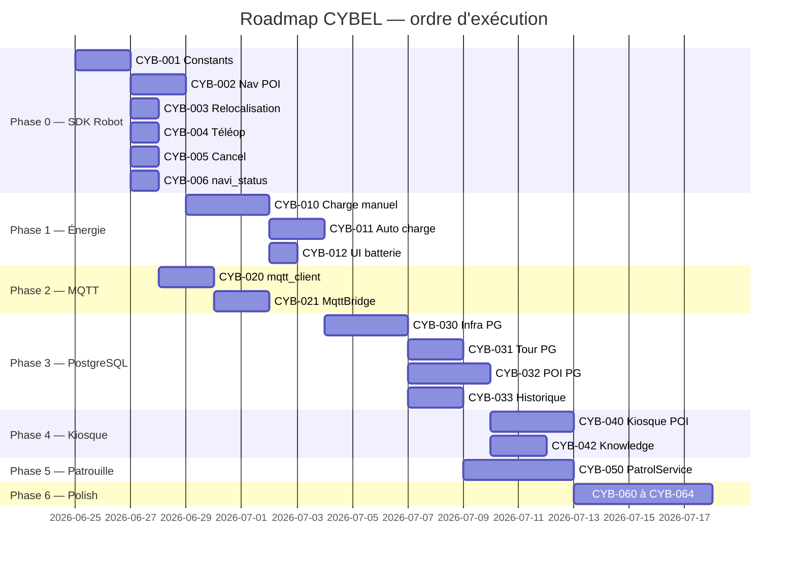

# Backlog CYBEL — Guide d'implémentation agent IA

**Version :** 1.0  
**Date :** juin 2026  
**Usage :** document **autonome** pour qu'un agent IA (ou développeur) puisse reconstruire, compléter et améliorer les interactions robot CYBEL sans relire l'intégralité du dépôt constructeur.

**Documents complémentaires :** [AUDIT_APK_CONSTRUCTEUR.md](AUDIT_APK_CONSTRUCTEUR.md) · [01-architecture-cible.md](01-architecture-cible.md) · [04-ecart-etat-actuel.md](04-ecart-etat-actuel.md)

---

## 0. Instructions pour agent IA

### 0.1 Mission

Implémenter les tâches ci-dessous **dans l'ordre des phases**, en respectant :

1. **Ne pas modifier** les APK constructeur (`welcomepatrol/`, `sentrymove/`).
2. **Réutiliser** le SDK existant (`sdk/`) et l'étendre avant de dupliquer.
3. **Tester** en mode `ROBOT_MOCK=true` puis valider sur robot réel (`10.42.0.1`).
4. **Documenter** chaque nouveau endpoint dans ce fichier (section 8) après implémentation.
5. **Prioriser** la fiabilité navigation + TTS + batterie avant les features cosmétiques.

### 0.2 Structure du dépôt CYBEL

```
cybel/
├── backend/           # FastAPI — routers/, services/, config.py
├── sdk/               # Couche robot — rosbridge.py, real_robot.py, speech.py, constants.py
├── frontend/          # Dashboard opérateur (TS/Vite, cible React)
├── frontend-kiosk/    # Kiosque visiteur
├── android/           # CybelTTSBridge, CybelVisitorKiosk
├── data/              # JSON legacy (à migrer PostgreSQL)
├── scripts/           # Exploration robot (mqtt_*, ros_*)
└── tests/unit/        # pytest
```

### 0.3 Démarrage local

```bash
# Backend mock
cd backend && ROBOT_MOCK=true uvicorn main:app --reload --port 8000

# Frontend
cd frontend && npm run dev

# Tests
pytest tests/unit -q
```

### 0.4 Réseau robot (TY1251D)

| Cible | Adresse | Port | Protocole |
|-------|---------|------|-----------|
| Châssis ROS | `10.42.0.1` | 9090 | WebSocket rosbridge |
| Broker MQTT | `10.42.0.1` | 1883 | MQTT 3.1.1 |
| Tablette Android TTS | `172.16.0.194` | 5555 | ADB TCP |
| Backend CYBEL | PC sur `10.42.0.x` | 8000 | HTTP + WS |

### 0.5 Référence protocole rosbridge (constructeur)

Format JSON envoyé sur WebSocket (`mc.csst.com.selfchassislibrary.utils.MsgManager`) :

**Publish navigation :**
```json
{
  "op": "publish",
  "topic": "/navi_goal",
  "msg": {
    "header": { "frame_id": "map" },
    "pose": {
      "position": { "x": 1.0, "y": 2.0, "z": 0.0 },
      "orientation": { "x": 0, "y": 0, "z": 0.0, "w": 1.0 }
    }
  }
}
```

**Téléopération :**
```json
{
  "op": "publish",
  "topic": "/cmd_vel_mux/input/teleop",
  "msg": {
    "linear": { "x": 0.2, "y": 0, "z": 0 },
    "angular": { "x": 0, "y": 0, "z": 0.0 }
  }
}
```

**Call service (ex. nav POI) :**
```json
{
  "op": "call_service",
  "id": "navi_to_tag",
  "service": "/tag_manager/navi",
  "args": { "name": "Labo", "tag_name": "Labo" }
}
```

**Subscribe :**
```json
{ "op": "subscribe", "topic": "/robot_status", "type": "yutong_assistance/RobotStatus" }
```

### 0.6 Codes nav_status (robot)

| Code | Signification | Action CYBEL |
|------|---------------|--------------|
| 600 | Non localisé | Bloquer nav, proposer relocaliser |
| 601 | Prêt | Navigation autorisée |
| 602 | En navigation | Attendre 603 |
| 603 | Arrivé | TTS optionnel, étape suivante |
| 604 | Erreur | Halt tour, message recovery |

### 0.7 Types POI constructeur (`DeploymentToolConstant`)

| Code | Type | Usage |
|------|------|-------|
| 0 | Commun | Destination standard |
| 3 | Sortie ascenseur | Multi-étages |
| 4 | Entrée ascenseur | Multi-étages |
| 5 | Attente | Point d'attente |
| 11 | Charge | Borne recharge |
| -65535 | Trajectoire | Patrouille |

---

## 1. Légende backlog

| Champ | Signification |
|-------|---------------|
| **ID** | Identifiant unique `CYB-XXX` |
| **Priorité** | 🔴 Critique · 🟠 Importante · 🟢 Optionnelle |
| **Difficulté** | 1 (facile) → 5 (très difficile) |
| **Effort** | Jours développeur (estimation) |
| **Dépendances** | IDs bloquants |
| **Fichiers** | Chemins à créer/modifier |
| **Critères d'acceptation** | Definition of Done testable |

---

## 2. Phase 0 — Fondations robot (🔴 Critique)

> **Objectif :** aligner le SDK sur le protocole APK constructeur. **Sans cette phase, les phases suivantes sont fragiles.**

### CYB-001 — Aligner `sdk/constants.py` sur TopicContent/ServiceContent APK

| | |
|---|---|
| **Priorité** | 🔴 Critique |
| **Difficulté** | 2 |
| **Effort** | 2 j |
| **Dépendances** | — |
| **Fichiers** | `sdk/constants.py`, `tests/unit/test_rosbridge.py` |

**Actions :**
1. Ajouter tous les topics de `TopicContent.java` (audit) dans `ROS_TOPICS`.
2. Corriger :
   - `velocity_cmd` → `/cmd_vel_mux/input/teleop`
   - Ajouter service `tag_manager_navi` → `/tag_manager/navi`
   - Ajouter `global_locate` → `/global_locate` (garder `/global_localization` en fallback)
   - Ajouter `move_base_cancel` → `/move_base/cancel`
   - Ajouter topics charge : `/charge_server/home_pose`, `/charge_server/result`
   - Ajouter `/navi_status`, `/cross_floor_navi`, `/soft_stop`
3. Créer `ROS_SERVICES_FALLBACK` pour essayer plusieurs noms si le premier échoue.

**Critères d'acceptation :**
- [ ] `constants.py` documente chaque entrée avec commentaire source APK
- [ ] Tests unitaires vérifient présence des clés
- [ ] Aucune régression `pytest tests/unit`

**Référence APK :** `sentrymove/.../TopicContent.java`, `ServiceContent.java`

---

### CYB-002 — Navigation POI via `/tag_manager/navi` avec fallback `/poi`

| | |
|---|---|
| **Priorité** | 🔴 Critique |
| **Difficulté** | 3 |
| **Effort** | 2 j |
| **Dépendances** | CYB-001 |
| **Fichiers** | `sdk/real_robot.py` (`navigate_to_point`), `sdk/mock_robot.py` |

**Actions :**
1. Dans `navigate_to_point()` : tenter `call_service("/tag_manager/navi", {name, tag_name})`.
2. Si échec (service absent), fallback `call_service("/poi", {command: "go", name})`.
3. Logger la méthode utilisée dans événement telemetry `event`.
4. S'inspirer de `SelfChassis.sendMoveByMarkerName()` (APK).

**Critères d'acceptation :**
- [ ] Nav vers POI existant réussit sur robot labo
- [ ] Mock simule les deux chemins
- [ ] Log indique `method: tag_manager_navi` ou `method: poi`

---

### CYB-003 — Relocalisation via `/global_locate` + fallback

| | |
|---|---|
| **Priorité** | 🔴 Critique |
| **Difficulté** | 2 |
| **Effort** | 1 j |
| **Dépendances** | CYB-001 |
| **Fichiers** | `sdk/real_robot.py` (`global_localization`) |

**Actions :**
1. Appeler `/global_locate` en priorité (APK `ServiceContent.GLOBAL_LOCATE`).
2. Fallback `/global_localization` si service absent.
3. Conserver `wait_for_localization(min_percent=60)`.

**Critères d'acceptation :**
- [ ] `POST /api/robot/relocalize` lance la procédure sur robot réel
- [ ] `localization_percent` remonte via `/localization_confidence`

---

### CYB-004 — Téléopération sur `/cmd_vel_mux/input/teleop`

| | |
|---|---|
| **Priorité** | 🔴 Critique |
| **Difficulté** | 2 |
| **Effort** | 1 j |
| **Dépendances** | CYB-001 |
| **Fichiers** | `sdk/real_robot.py` (`_publish_velocity`, `move`) |

**Actions :**
1. Au premier `move()` : `advertise` topic `/cmd_vel_mux/input/teleop`, type `geometry_msgs/Twist`.
2. Publier `linear.x` et `angular.z` (voir MsgManager.velocityMsg APK).
3. Au `stop()` : publier vitesses nulles.
4. Retirer ou fallback `/mobile_base/commands/velocity` si teleop échoue.

**Critères d'acceptation :**
- [ ] Robot se déplace au clavier via dashboard
- [ ] Vitesses nulles à l'arrêt

**Référence APK :** `MsgManager.initVelocityMsg()`, `velocityMsg()`, `stopVelocityMsg()`

---

### CYB-005 — Annulation navigation multi-canal

| | |
|---|---|
| **Priorité** | 🔴 Critique |
| **Difficulté** | 2 |
| **Effort** | 1 j |
| **Dépendances** | CYB-001 |
| **Fichiers** | `sdk/real_robot.py` (`_cancel_navigation`) |

**Actions :**
1. Tenter dans l'ordre : `/move_base/cancel`, `/path_follower/cancel`, publish cancel goal.
2. Réinitialiser `navigating_to`, `current_goal`.
3. Attendre `nav_status` 601 ou 603 (`_wait_nav_ready_after_cancel`).

**Critères d'acceptation :**
- [ ] `POST /api/navigation/cancel` stoppe le robot en navigation
- [ ] Tour halt fonctionne après cancel

---

### CYB-006 — Subscribe `/navi_status` dédié

| | |
|---|---|
| **Priorité** | 🔴 Critique |
| **Difficulté** | 2 |
| **Effort** | 1 j |
| **Dépendances** | CYB-001 |
| **Fichiers** | `sdk/real_robot.py` (`_subscribe_topics`, `_on_ros_message`) |

**Actions :**
1. Subscribe `/navi_status` en plus de `/robot_status`.
2. Fusionner ou prioriser pour `wait_for_navigation_arrival`.
3. Émettre événement WS distinct si changement nav_status.

**Critères d'acceptation :**
- [ ] Arrivée détectée plus rapidement qu'via status seul
- [ ] Tests mock couvrent transitions 602→603 et 602→604

---

## 3. Phase 1 — Énergie et autonomie (🔴 Critique)

### CYB-010 — Service `ChargeService` + retour borne manuel

| | |
|---|---|
| **Priorité** | 🔴 Critique |
| **Difficulté** | 3 |
| **Effort** | 3 j |
| **Dépendances** | CYB-001, CYB-002 |
| **Fichiers** | `backend/services/charge_service.py`, `backend/routers/charge.py`, `sdk/real_robot.py` |

**Actions :**
1. Méthode `go_home()` dans `RealRobot` :
   - Publish `/charge_server/home_pose` (voir `SelfChassis.sendGoHome()` APK)
   - `call_service("/start_recharge", {})`
2. Router `POST /api/charge/go-home`.
3. Bouton dashboard « Retour borne » dans `controls.ts` ou `statusBar.ts`.

**Messages ROS (APK) :**
- Topic : `/charge_server/home_pose`
- Service : `/start_recharge`
- Subscribe : `/charge_server/result`

**Critères d'acceptation :**
- [ ] Robot part vers borne charge sur commande manuelle
- [ ] État charge visible (`charger=true` dans status)
- [ ] Mock simule le flux

**Référence APK :** `WelcomeManager.lowPowerBack2ChargePile`, `NavigationHelper.sendLowPowerBackChargePile`

---

### CYB-011 — Alerte batterie basse + retour automatique

| | |
|---|---|
| **Priorité** | 🔴 Critique |
| **Difficulté** | 3 |
| **Effort** | 2 j |
| **Dépendances** | CYB-010 |
| **Fichiers** | `backend/services/charge_service.py`, `sdk/real_robot.py`, `backend/config.py`, `frontend/pages/settings.ts` |

**Actions :**
1. Config : `low_battery_threshold` (défaut 20 %), `auto_return_charge` (bool).
2. Dans `_handle_status` : si `battery < threshold` et pas `charger` → déclencher `ChargeService.auto_return()`.
3. Annuler tour/patrouille en cours avant retour.
4. TTS : « Batterie faible, je retourne à la borne de recharge. »
5. UI : alerte visuelle barre status orange/rouge.

**Critères d'acceptation :**
- [ ] Seuil configurable via settings
- [ ] Pas de boucle infinie si déjà en charge
- [ ] Tour interrompu proprement

**Référence APK :** `SpConstant.SP_LOW_BATTERY_CHARGE`, `WelcomeManager.recharge()`

---

### CYB-012 — UI batterie et état charge enrichi

| | |
|---|---|
| **Priorité** | 🟠 Importante |
| **Difficulté** | 1 |
| **Effort** | 0.5 j |
| **Dépendances** | CYB-010 |
| **Fichiers** | `frontend/components/statusBar.ts`, `sdk/models.py` |

**Actions :**
1. Afficher : % batterie, icône charge, temps estimé (si dispo dans status).
2. États : `CHARGE_STATE_CHARGING`, `DISCONNECT`, `FAILED` (mapping APK `NavigationConfig`).

**Critères d'acceptation :**
- [ ] Opérateur voit clairement si robot charge

---

## 4. Phase 2 — MQTT intégré (🟠 Importante)

### CYB-020 — Client MQTT SDK `sdk/mqtt_client.py`

| | |
|---|---|
| **Priorité** | 🟠 Importante |
| **Difficulté** | 3 |
| **Effort** | 2 j |
| **Dépendances** | — |
| **Fichiers** | `sdk/mqtt_client.py`, `backend/requirements.txt` (+ `paho-mqtt`) |

**Actions :**
1. Client asyncio-compatible (thread + queue ou `aiomqtt`).
2. Config : `MQTT_HOST`, `MQTT_PORT` dans `backend/config.py`.
3. Méthodes : `connect()`, `subscribe(topics)`, `on_message(callback)`, `disconnect()`.
4. Reprendre logique de `scripts/mqtt_listen_passive.py`.

**Topics connus (labo) :**
- `test_mul` — odométrie `TY1251D-03195,x,y,...`
- Découverte passive `#` au premier connect

**Critères d'acceptation :**
- [ ] Connexion broker `10.42.0.1:1883` sans auth
- [ ] Messages parsés et loggés
- [ ] Tests mock broker (optionnel)

---

### CYB-021 — `MqttBridgeService` dans backend

| | |
|---|---|
| **Priorité** | 🟠 Importante |
| **Difficulté** | 3 |
| **Effort** | 2 j |
| **Dépendances** | CYB-020 |
| **Fichiers** | `backend/services/mqtt_bridge_service.py`, `backend/main.py` (lifespan) |

**Actions :**
1. Démarrer client MQTT au lifespan FastAPI (si `ROBOT_MOCK=false`).
2. Fusionner télémétrie MQTT avec ROS dans `robot_service.on_telemetry`.
3. Émettre WS event type `mqtt` pour debug opérateur.
4. **Ne pas publier** sur MQTT sans analyse préalable (précaution sécurité).

**Critères d'acceptation :**
- [ ] Dashboard reçoit événements MQTT via WS (mode debug)
- [ ] Pas d'interférence avec commandes ROS

---

### CYB-022 — Config MQTT chassis via ROS (optionnel)

| | |
|---|---|
| **Priorité** | 🟢 Optionnelle |
| **Difficulté** | 2 |
| **Effort** | 1 j |
| **Dépendances** | CYB-020, CYB-001 |
| **Fichiers** | `sdk/real_robot.py` |

**Actions :**
1. Implémenter `MsgManager.configStationServer` équivalent :
   - `call_service("/config_mqtt_server", {cmd, host, switch_on})`
2. Exposer `POST /api/settings/mqtt-config` (admin only).

**Référence APK :** `ServiceContent.CONFIG_STATION_SERVER`, `MsgManager.configStationServer`

---

## 5. Phase 3 — PostgreSQL (🟠 Importante)

### CYB-030 — Infrastructure PostgreSQL + SQLAlchemy

| | |
|---|---|
| **Priorité** | 🟠 Importante |
| **Difficulté** | 3 |
| **Effort** | 3 j |
| **Dépendances** | — |
| **Fichiers** | `backend/db/`, `backend/requirements.txt` (+ sqlalchemy, asyncpg, alembic), `backend/config.py` |

**Actions :**
1. `DATABASE_URL=postgresql+asyncpg://...` dans `.env`.
2. Modèles : `Point`, `Tour`, `TourStop`, `PatrolTask`, `PatrolStop`, `Visitor`, `NavigationEvent`, `SpeechLog`, `Setting`, `ChargeEvent`.
3. Alembic init + première migration.
4. Session async dans FastAPI dependency.

**Schéma minimal — table `points` :**
```sql
CREATE TABLE points (
  id UUID PRIMARY KEY,
  name VARCHAR(128) UNIQUE NOT NULL,
  type INTEGER DEFAULT 0,
  x FLOAT, y FLOAT, theta FLOAT,
  floor VARCHAR(32) DEFAULT '0',
  kiosk_visible BOOLEAN DEFAULT true,
  ros_synced_at TIMESTAMPTZ
);
```

**Critères d'acceptation :**
- [ ] `alembic upgrade head` crée les tables
- [ ] Backend démarre avec ou sans DATABASE_URL (fallback JSON si absent)

---

### CYB-031 — Migration `data/lab_tour.json` → PostgreSQL

| | |
|---|---|
| **Priorité** | 🟠 Importante |
| **Difficulté** | 2 |
| **Effort** | 2 j |
| **Dépendances** | CYB-030 |
| **Fichiers** | `backend/services/tour_service.py`, `sdk/lab_tour.py`, script `scripts/migrate_json_to_pg.py` |

**Actions :**
1. `TourService` lit/écrit BDD en priorité, fallback JSON.
2. Script migration one-shot des données existantes.
3. API tour inchangée côté frontend.

**Critères d'acceptation :**
- [ ] Visite labo fonctionne depuis PostgreSQL
- [ ] `data/lab_tour.json` reste export backup

---

### CYB-032 — POI persistés PostgreSQL + sync ROS

| | |
|---|---|
| **Priorité** | 🟠 Importante |
| **Difficulté** | 4 |
| **Effort** | 3 j |
| **Dépendances** | CYB-030, CYB-002 |
| **Fichiers** | `backend/services/map_service.py`, `sdk/real_robot.py` |

**Actions :**
1. Au connect : import marqueurs ROS → upsert `points`.
2. `add_point` / `delete_point` : ROS d'abord, puis BDD.
3. Types POI complets (codes 0, 3, 4, 5, 11).

**Critères d'acceptation :**
- [ ] POI survivent au redémarrage backend
- [ ] Sync bidirectionnelle documentée

---

### CYB-033 — Historique navigation et TTS

| | |
|---|---|
| **Priorité** | 🟠 Importante |
| **Difficulté** | 2 |
| **Effort** | 2 j |
| **Dépendances** | CYB-030 |
| **Fichiers** | `backend/services/audit_service.py`, hooks dans navigation + speech |

**Actions :**
1. `navigation_events` : timestamp, point/coords, nav_status final, durée.
2. `speech_log` : texte, méthode (adb/ros), succès.
3. `GET /api/history/navigation?limit=50` (admin).

**Critères d'acceptation :**
- [ ] Chaque nav laisse une trace en BDD
- [ ] Consultable via API

---

## 6. Phase 4 — Accueil et kiosque (🟠 Importante)

### CYB-040 — Kiosque : sélection destination depuis POI

| | |
|---|---|
| **Priorité** | 🟠 Importante |
| **Difficulté** | 3 |
| **Effort** | 3 j |
| **Dépendances** | CYB-032, CYB-002 |
| **Fichiers** | `frontend-kiosk/src/app.ts`, `backend/routers/reception.py` |

**Actions :**
1. `GET /api/reception/destinations` → POI `kiosk_visible=true`.
2. Écran kiosque : grille destinations avec icônes par type.
3. `POST /api/reception/go` : TTS accueil + `navigate_to_point`.
4. i18n FR/EN (existant `i18n.ts`).

**Critères d'acceptation :**
- [ ] Visiteur choisit destination sans opérateur
- [ ] Flow complet accueil → nav → TTS arrivée

**Référence APK :** `VisitorFragment`, `NaviLeadTheWayFragment`

---

### CYB-041 — Enregistrement visiteur (optionnel v1.1)

| | |
|---|---|
| **Priorité** | 🟢 Optionnelle |
| **Difficulté** | 2 |
| **Effort** | 2 j |
| **Dépendances** | CYB-030, CYB-040 |
| **Fichiers** | `backend/routers/visitors.py`, `frontend-kiosk/` |

**Actions :**
1. Formulaire nom + société + personne visitée.
2. Table `visitors`, `reception_sessions`.
3. Pas de sync cloud SROS (`CONTROL_RECEIVE_VISITOR` ignoré).

---

### CYB-042 — Améliorer commandes vocales knowledge

| | |
|---|---|
| **Priorité** | 🟠 Importante |
| **Difficulté** | 3 |
| **Effort** | 2 j |
| **Dépendances** | CYB-032 |
| **Fichiers** | `backend/routers/knowledge.py`, `sdk/reception_actions.py`, `data/` → BDD |

**Actions :**
1. Migrer `knowledgeV2-lab.json` → `knowledge_entries` PostgreSQL.
2. `voice_command` : match mot-clé → coordonnées ou POI → nav + TTS réponse.
3. Admin CRUD knowledge via API.

**Amélioration vs constructeur :** pas de dépendance cloud Iflytek — 100 % local.

---

## 7. Phase 5 — Patrouille (🟠 Importante)

### CYB-050 — Module `PatrolService` (réutiliser TourEngine)

| | |
|---|---|
| **Priorité** | 🟠 Importante |
| **Difficulté** | 3 |
| **Effort** | 4 j |
| **Dépendances** | CYB-031, CYB-002 |
| **Fichiers** | `backend/services/patrol_service.py`, `backend/routers/patrol.py`, `sdk/patrol.py` |

**Actions :**
1. Modèle `PatrolTask` : nom, mode (`cycle`, `round_trip`), liste stops (point + speech).
2. Exécution = boucle sur stops (comme tour sans retour accueil final optionnel).
3. ROS : `/set_waypoints` ou nav séquentielle POI (comme APK `PatrolTask`).
4. API : CRUD `/api/patrol`, `POST /api/patrol/start`, `POST /api/patrol/stop`.
5. UI : `frontend/components/patrolPanel.ts` (nouveau).

**Modes APK (`PatrolMode`) :**
- `TYPE_CYCLE = 2`
- `TYPE_ROUND_TRIP = 3`
- `TYPE_RANDOM = 1`

**Critères d'acceptation :**
- [ ] Patrouille 3 POI en boucle avec TTS à chaque arrêt
- [ ] Arrêt propre via cancel

**Référence APK :** `com.ciot.navigation.navigation.task.PatrolTask`

---

## 8. Phase 6 — Améliorations interactions (🟠 / 🟢)

### CYB-060 — E-stop sur `/soft_stop` (validation)

| | |
|---|---|
| **Priorité** | 🟠 Importante |
| **Difficulté** | 2 |
| **Effort** | 1 j |
| **Dépendances** | CYB-001 |
| **Fichiers** | `sdk/real_robot.py` (`emergency_stop`) |

**Actions :**
1. Publier sur `/soft_stop` (type `std_msgs/Bool`).
2. Conserver comportement actuel en fallback.

---

### CYB-061 — Amélioration `wait_for_navigation_arrival`

| | |
|---|---|
| **Priorité** | 🟠 Importante |
| **Difficulté** | 3 |
| **Effort** | 2 j |
| **Dépendances** | CYB-006 |
| **Fichiers** | `sdk/real_robot.py`, `sdk/tour_navigation.py` |

**Actions :**
1. Combiner : nav_status 603, distance au goal < 0.45 m (`_pose_near_goal`), timeout.
2. Détecter 604 plus tôt → message `navigation_failure_message`.
3. **Amélioration vs APK :** recovery hint automatique dans UI.

---

### CYB-062 — File d'attente TTS prioritaire

| | |
|---|---|
| **Priorité** | 🟠 Importante |
| **Difficulté** | 3 |
| **Effort** | 2 j |
| **Dépendances** | — |
| **Fichiers** | `sdk/speech.py`, `backend/services/speech_service.py` |

**Actions :**
1. Queue asyncio : priorité `urgent` (batterie) > `normal` > `background`.
2. `interrupt=true` vide la queue (comportement APK `RobotSpeechManager` niveaux).
3. Éviter chevauchement ADB commands.

**Référence APK :** `RobotSpeechManager.startSpeak(txt, level)`

---

### CYB-063 — Reconnexion ADB TTS automatique

| | |
|---|---|
| **Priorité** | 🟠 Importante |
| **Difficulté** | 2 |
| **Effort** | 1 j |
| **Dépendances** | — |
| **Fichiers** | `sdk/speech.py`, `backend/config.py` |

**Actions :**
1. Avant `adb shell am broadcast` : `adb connect SPEECH_ADB_SERIAL` si déconnecté.
2. Health check périodique dans lifespan.
3. Documenter procédure dans `docs/ROBOT_CONNECTION.md`.

---

### CYB-064 — Diagnostic connexion API

| | |
|---|---|
| **Priorité** | 🟠 Importante |
| **Difficulté** | 2 |
| **Effort** | 1 j |
| **Dépendances** | CYB-021 |
| **Fichiers** | `backend/routers/diagnostics.py` |

**Actions :**
1. `GET /api/diagnostics` : rosbridge OK, mqtt OK, adb OK, pg OK, dernier message ROS timestamp.
2. Page settings : affichage diagnostic.

**Référence APK :** `DiagnosisFragment`, `/self_diagnosis` (optionnel call)

---

## 9. Phase 7 — Fonctionnalités avancées (🟢 Optionnelles)

### CYB-070 — Navigation inter-étages

| | |
|---|---|
| **Priorité** | 🟢 Optionnelle |
| **Difficulté** | 5 |
| **Effort** | 8 j |
| **Dépendances** | CYB-001, CYB-032 |
| **Fichiers** | `backend/services/elevator_service.py`, `sdk/real_robot.py` |

**Actions :**
1. Publish `/cross_floor_navi` type `yutong_assistance/CrossFloorNavi` avec floor + tag.
2. Subscribe `/lift_control/status`.
3. POI types 3 et 4 obligatoires sur chaque étage.

**Référence APK :** `SelfChassis.crossFloorNavi`, `ElevatorDialog`

---

### CYB-071 — Cartographie SLAM (outil technicien)

| | |
|---|---|
| **Priorité** | 🟢 Optionnelle |
| **Difficulté** | 5 |
| **Effort** | 10 j |
| **Dépendances** | CYB-001 |
| **Fichiers** | `frontend/components/mappingPanel.ts`, `sdk/mapping.py` |

**Actions :**
1. `call_service("/bag_record", {type: "mapping"})` start/stop.
2. UI séparée « mode technicien » (équivalent SentryMove `MainPresenter.createMap`).

---

### CYB-072 — Migration frontend → React

| | |
|---|---|
| **Priorité** | 🟢 Optionnelle |
| **Difficulté** | 4 |
| **Effort** | 12 j |
| **Dépendances** | Phases 0–5 stables |
| **Fichiers** | `frontend/` réécriture |

**Actions :**
1. React 18 + Vite + même API.
2. Composants : StatusBar, MapView, Controls, PointsList, TourPanel, PatrolPanel.
3. Conserver `telemetry.ts` logique en hook `useTelemetry`.

---

### CYB-073 — Reconnaissance faciale / présence

| | |
|---|---|
| **Priorité** | 🟢 Optionnelle |
| **Difficulté** | 5 |
| **Effort** | 10 j |
| **Dépendances** | CYB-040 |

**Actions :**
1. Détection présence via `/detected_people_array` (déjà subscribe) → déclencher accueil.
2. Ou caméra tablette + API locale.

**Référence APK :** `WelcomeManager.onFindFace`

---

### CYB-074 — Multi-robot MQTT

| | |
|---|---|
| **Priorité** | 🟢 Optionnelle |
| **Difficulté** | 4 |
| **Effort** | 5 j |
| **Dépendances** | CYB-021 |

**Actions :**
1. Subscribe type `mqtt_msg/RobotList` via ROS.
2. UI liste robots (SentryMove `ScheduleFragment`).

---

## 10. Ordre de développement recommandé



### Sprint recommandés (2 semaines chacun)

| Sprint | Tâches | Livrable |
|--------|--------|----------|
| **S1** | CYB-001 → CYB-006 | SDK aligné APK, nav fiable |
| **S2** | CYB-010 → CYB-012 | Recharge manuelle + auto |
| **S3** | CYB-020, CYB-021, CYB-030 | MQTT + PostgreSQL init |
| **S4** | CYB-031 → CYB-033 | Données persistées |
| **S5** | CYB-040, CYB-042, CYB-050 | Kiosque + patrouille |
| **S6** | CYB-060 → CYB-064 | Robustesse + diagnostic |

---

## 11. Tableau récapitulatif complet

| ID | Titre | Priorité | Diff. | Effort | Dépendances |
|----|-------|----------|-------|--------|-------------|
| CYB-001 | Aligner constants.py | 🔴 | 2 | 2j | — |
| CYB-002 | Nav POI tag_manager | 🔴 | 3 | 2j | 001 |
| CYB-003 | Relocalisation global_locate | 🔴 | 2 | 1j | 001 |
| CYB-004 | Téléop cmd_vel_mux | 🔴 | 2 | 1j | 001 |
| CYB-005 | Cancel multi-canal | 🔴 | 2 | 1j | 001 |
| CYB-006 | Subscribe navi_status | 🔴 | 2 | 1j | 001 |
| CYB-010 | Charge manuel go_home | 🔴 | 3 | 3j | 001,002 |
| CYB-011 | Auto retour charge | 🔴 | 3 | 2j | 010 |
| CYB-012 | UI batterie | 🟠 | 1 | 0.5j | 010 |
| CYB-020 | mqtt_client SDK | 🟠 | 3 | 2j | — |
| CYB-021 | MqttBridgeService | 🟠 | 3 | 2j | 020 |
| CYB-022 | Config MQTT via ROS | 🟢 | 2 | 1j | 020,001 |
| CYB-030 | Infra PostgreSQL | 🟠 | 3 | 3j | — |
| CYB-031 | Tour → PostgreSQL | 🟠 | 2 | 2j | 030 |
| CYB-032 | POI PostgreSQL | 🟠 | 4 | 3j | 030,002 |
| CYB-033 | Historique nav/TTS | 🟠 | 2 | 2j | 030 |
| CYB-040 | Kiosque destinations | 🟠 | 3 | 3j | 032,002 |
| CYB-041 | Enregistrement visiteur | 🟢 | 2 | 2j | 030,040 |
| CYB-042 | Knowledge amélioré | 🟠 | 3 | 2j | 032 |
| CYB-050 | PatrolService | 🟠 | 3 | 4j | 031,002 |
| CYB-060 | soft_stop validation | 🟠 | 2 | 1j | 001 |
| CYB-061 | wait_for_navigation | 🟠 | 3 | 2j | 006 |
| CYB-062 | Queue TTS | 🟠 | 3 | 2j | — |
| CYB-063 | Reconnexion ADB auto | 🟠 | 2 | 1j | — |
| CYB-064 | API diagnostics | 🟠 | 2 | 1j | 021 |
| CYB-070 | Multi-étages | 🟢 | 5 | 8j | 001,032 |
| CYB-071 | SLAM mapping | 🟢 | 5 | 10j | 001 |
| CYB-072 | Migration React | 🟢 | 4 | 12j | S1-S5 |
| CYB-073 | Accueil présence | 🟢 | 5 | 10j | 040 |
| CYB-074 | Multi-robot | 🟢 | 4 | 5j | 021 |

**Total estimé v1 (S1–S6) :** ~35 jours développeur  
**Total avec optionnelles :** ~70 jours

---

## 12. Registre API cible (post-implémentation)

### Existants (ne pas casser)

| Méthode | Route | Description |
|---------|-------|-------------|
| GET | `/api/health` | Santé |
| GET | `/api/robot/status` | État robot |
| GET | `/api/robot/pose` | Position |
| POST | `/api/robot/move` | Téléop |
| POST | `/api/robot/stop` | Arrêt |
| POST | `/api/robot/emergency-stop` | E-stop |
| POST | `/api/robot/relocalize` | Relocalisation |
| GET/POST/DELETE | `/api/navigation/points` | POI |
| POST | `/api/navigation/goto` | Nav POI |
| POST | `/api/navigation/goto-coordinate` | Nav coords |
| POST | `/api/navigation/cancel` | Annulation |
| GET | `/api/map` | Carte |
| POST | `/api/speech/say` | TTS |
| GET/POST | `/api/tour/*` | Visite guidée |
| GET/POST | `/api/reception/*` | Réception |
| WS | `/ws/telemetry` | Temps réel |

### À créer

| Méthode | Route | Tâche |
|---------|-------|-------|
| POST | `/api/charge/go-home` | CYB-010 |
| GET | `/api/charge/status` | CYB-010 |
| GET | `/api/reception/destinations` | CYB-040 |
| POST | `/api/reception/go` | CYB-040 |
| GET/POST | `/api/patrol/*` | CYB-050 |
| GET | `/api/history/navigation` | CYB-033 |
| GET | `/api/diagnostics` | CYB-064 |
| GET/POST | `/api/knowledge/*` | CYB-042 |
| POST | `/api/settings/mqtt-config` | CYB-022 |

---

## 13. Registre ROS complet (référence agent)

### Topics — subscribe (télémétrie)

| Topic | Type ROS | Priorité impl. |
|-------|----------|----------------|
| `/robot_pose` | `geometry_msgs/Pose2D` | ✅ fait |
| `/robot_status` | `yutong_assistance/RobotStatus` | ✅ fait |
| `/localization_confidence` | `std_msgs/Float32` | ✅ fait |
| `/get_current_map` | `nav_msgs/OccupancyGrid` | ✅ fait |
| `/navi_status` | — | CYB-006 |
| `/scan_filter` | LaserScan | ✅ fait |
| `/detected_people_array` | — | ✅ fait |
| `/charge_server/result` | — | CYB-010 |
| `/lift_control/status` | — | CYB-070 |

### Topics — publish (commandes)

| Topic | Usage | Priorité |
|-------|-------|----------|
| `/navi_goal` | Nav coordonnées | ✅ fait |
| `/cmd_vel_mux/input/teleop` | Téléop | CYB-004 |
| `/soft_stop` | E-stop | CYB-060 |
| `/charge_server/home_pose` | Retour borne | CYB-010 |
| `/cross_floor_navi` | Multi-étages | CYB-070 |
| `/move_base/cancel` | Annulation | CYB-005 |

### Services — call

| Service | Usage | Priorité |
|---------|-------|----------|
| `/tag_manager/navi` | Nav POI | CYB-002 |
| `/poi` | Nav POI fallback | ✅ fait |
| `/global_locate` | Relocalisation | CYB-003 |
| `/marker_manager/get_markers_details` | Liste POI | ✅ fait |
| `/marker_manager/control` | CRUD POI | ✅ fait |
| `/start_recharge` | Recharge | CYB-010 |
| `/static_map` | Carte | ✅ fait |
| `/self_diagnosis` | Diagnostic | CYB-064 |
| `/config_mqtt_server` | Config MQTT | CYB-022 |
| `/bag_record` | SLAM | CYB-071 |

---

## 14. Tests obligatoires par phase

| Phase | Tests à ajouter/maintenir |
|-------|---------------------------|
| 0 | `test_rosbridge.py`, `test_navigation_wait.py`, nouveau `test_nav_poi_fallback.py` |
| 1 | `test_charge.py` (mock) |
| 2 | `test_mqtt_client.py` |
| 3 | `test_db_models.py`, `test_tour_pg.py` |
| 4 | `test_reception_destinations.py` |
| 5 | `test_patrol.py` |

**Commande CI locale :**
```bash
ROBOT_MOCK=true pytest tests/unit -v --tb=short
```

**Smoke test robot (avant l'UI) :** `python scripts/phase0_robot_check.py` — voir [PHASE0_DEMARRAGE.md](../PHASE0_DEMARRAGE.md).

---

## 15. Améliorations CYBEL vs constructeur (à implémenter volontairement)

Ces points **dépassent** l'APK — à intégrer dans les tâches ci-dessus :

| Amélioration | Tâche | Description |
|--------------|-------|-------------|
| Vérification navigabilité avant nav | ✅ existant | `is_coordinate_navigable` — conserver |
| Recovery hint navigation 604 | CYB-061 | Message procédure dans UI |
| Trace JSON visite | ✅ existant | `tour_trace.py` — étendre à patrouille |
| API REST documentée | Continu | OpenAPI FastAPI `/docs` |
| Mode mock complet | Continu | Parité mock/real dans chaque nouvelle feature |
| Indépendance cloud | Continu | Jamais appeler WuhanApiService |
| Dashboard PC distant | ✅ existant | Opérateur hors tablette robot |
| Historique actions PostgreSQL | CYB-033 | Audit constructeur inexistant |
| Diagnostic unifié | CYB-064 | Vue santé tous canaux |

---

## 16. Checklist agent — avant de marquer une tâche DONE

- [ ] Code implémenté dans les fichiers listés
- [ ] `pytest tests/unit` passe en mode mock
- [ ] Test manuel documenté si robot requis
- [ ] Pas de régression endpoints existants
- [ ] OpenAPI `/docs` à jour si nouveau route
- [ ] Section 12 de ce fichier mise à jour (route ajoutée)
- [ ] MockRobot et RealRobot ont parité fonctionnelle

---

## 17. Références fichiers APK (lecture seule)

| Besoin | Chemin dans `welcomepatrol/` ou `sentrymove/` |
|--------|-----------------------------------------------|
| Topics ROS | `app/src/main/java/mc/csst/com/selfchassislibrary/content/TopicContent.java` |
| Services ROS | `.../ServiceContent.java` |
| Messages JSON | `.../utils/MsgManager.java` |
| Navigation | `app/src/main/java/com/ciot/navigation/navigation/NavigationHelper.java` |
| Accueil | `welcomepatrol/.../WelcomeManager.java` |
| Patrouille | `.../task/PatrolTask.java` |
| TTS | `welcomepatrol/.../RobotSpeechManager.java` |
| Config réseau | `sentrymove/.../DeploymentToolConstant.java` |
| Charge | `SelfChassis.sendGoHome()` dans `SelfChassis.java` |

---

*Fin du backlog. Mettre à jour la colonne Statut dans [README.md](README.md) après chaque sprint.*
