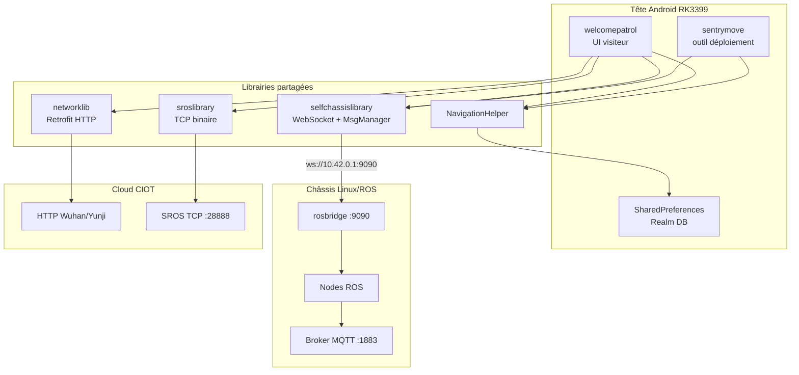

# Rapport d'audit technique — Applications constructeur CIOT

**Date :** juin 2026  
**Projet :** CYBEL — Robot CIOT TY1251D-03195  
**Sources analysées :**
- `welcomepatrol/` → `com.ciot.welcomepatrol` V3.0.1 (accueil / réception / patrouille)
- `sentrymove/` → `com.ciot.sentrymove` V2.1.5 (outil de déploiement / cartographie)

Les deux projets partagent une **stack logicielle commune** (librairies CIOT) et communiquent avec le même châssis ROS via **WebSocket rosbridge**.

> Analyse en lecture seule — aucune modification des APK décompilés.

---

## Table des matières

1. [Vue d'ensemble de l'architecture](#1-vue-densemble-de-larchitecture)
2. [Fonctionnement général de l'application](#2-fonctionnement-général-de-lapplication)
3. [Flux de communication](#3-flux-de-communication)
4. [Topics ROS identifiés](#4-topics-ros-identifiés)
5. [APIs identifiées](#5-apis-identifiées)
6. [Services Android identifiés](#6-services-android-identifiés)
7. [Écrans identifiés](#7-écrans-identifiés)
8. [Données manipulées](#8-données-manipulées)
9. [Fonctionnalités reproduisibles dans CYBEL](#9-fonctionnalités-reproductibles-dans-cybel)
10. [Fonctionnalités encore non comprises](#10-fonctionnalités-encore-non-comprises)

---

## 1. Vue d'ensemble de l'architecture

### Rôle des deux applications

| Application | Package | Rôle principal | Point d'entrée |
|-------------|---------|----------------|----------------|
| **Welcome Patrol** | `com.ciot.welcomepatrol` | Interface visiteur : accueil, guidage, voix, visage, patrouille, contenu CMS | `com.ciotrobot.main.MyApplication` → `MainActivity` |
| **Sentry Move** | `com.ciot.sentrymove` | Outil technicien : cartographie SLAM, POI, patrouille, diagnostic, multi-robot | `mc.csst.com.selfchassis.App` → `MainActivity` |

### Architecture en couches



### Modules principaux (packages)

| Package | Fichier racine typique | Rôle | Importance CYBEL |
|---------|------------------------|------|------------------|
| `mc.csst.com.selfchassislibrary` | `SelfChassis.java`, `MsgManager.java`, `TopicContent.java` | **SDK chassis** : protocole rosbridge JSON | **Critique** — spec ROS de CYBEL |
| `com.ciot.navigation` | `NavigationHelper.java` | Orchestration navigation, charge, patrouille | Haute — logique métier à reproduire |
| `com.example.sroslibrary` | `TcpService.java`, `SrosConstants.java` | Protocole TCP propriétaire vers cloud | Moyenne — sync cloud, pas navigation locale |
| `com.ciot.networklib` | `RetrofitManager.java`, `WuhanApiService.java` | Backend CMS CIOT | Basse — optionnel si CYBEL autonome |
| `com.ciot.realm` | `RealmHelper.java` | Persistance locale | Référence schéma données |
| `com.ciotrobot.speechlirary` | `RobotSpeechManager.java`, `SpeechNavigationManager.java` | Voix Iflytek + commandes vocales | Haute pour TTS/ASR |
| `com.ciotrobot.main` | `MainActivity.java`, `WelcomeManager.java` | UI accueil | Référence UX métier |

### Pattern architectural

- **MVP** : `MainActivity` ↔ `MainPresenter` ↔ `MainModel`
- **Singletons** : `SelfChassis.getInstance()`, `NavigationHelper.getInstance()`
- **Bus d'événements** : EventBus + LiveData (`LiveDatabus`)
- **Navigation UI** : `FragmentFactory.changeFragment()` — cache de fragments par type entier

---

## 2. Fonctionnement général de l'application

### Bootstrap (`welcomepatrol`)

**Fichier :** `welcomepatrol/app/src/main/java/com/ciotrobot/main/MyApplication.java`

Au démarrage : Realm, ARouter, `RetrofitManager`, `NavigationHelper`, `SpeechManager`, crash reporting (Bugly/XCrash), WebView Tencent X5, diagnostic.

### Cycle de vie principal (`MainActivity`)

**Fichier :** `welcomepatrol/app/src/main/java/com/ciotrobot/main/ui/activity/MainActivity.java`

Initialise dans l'ordre :

1. `initNavigationListener()` — écoute état chassis
2. `initWelcomeFunction()` — `WelcomeManager`
3. `initSrosListener()` — messages cloud SROS
4. `initVoiceListener()` — `SpeechManager.init()` / `open()`
5. Connexion WebSocket via `SelfChassis.connectSelfChassis(url)`

### `sentrymove` — outil de déploiement

**Fichier :** `sentrymove/app/src/main/java/mc/csst/com/selfchassis/ui/activity/main/MainActivity.java`

Hub technique : carte SLAM temps réel, joystick téléop, création/édition carte, gestion POI, patrouille, navigation inter-étages, connexion WiFi/chassis.

---

## 3. Flux de communication

### 3.1 WebSocket / ROSBridge (canal principal chassis)

| Paramètre | Valeur | Fichier |
|-----------|--------|---------|
| IP hotspot robot | `10.42.0.1` | `DeploymentToolConstant.CHASSIS_IP` |
| IP directe LAN | `192.168.20.22` | `DeploymentToolConstant.CHASSIS_DIRECT_IP` |
| Port | `9090` | `DeploymentToolConstant.CHASSIS_PORT` |
| URL par défaut | `ws://192.168.20.22:9090` | `NavigationConfig.Self_NAV_URL` |
| Clé SP | `NAVIGATION_X86_URL` | `NavigationConfig.java` |

**Stack :**

- `WebSocketClientManager.java` — client OkHttp WebSocket, reconnexion auto
- `SelfChassis.java` — façade haut niveau
- `MsgManager.java` — construction JSON rosbridge
- `SelfChassisMsgCallBack.java` — parsing réponses

**Protocole rosbridge** (`OpContent`) : `advertise`, `publish`, `subscribe`, `unsubscribe`, `call_service`, `service_response`

**Exemple navigation par coordonnées** — `MsgManager.sendGoalMsg(x, y, theta)` :

```json
{
  "op": "publish",
  "topic": "/navi_goal",
  "msg": {
    "header": { "frame_id": "map" },
    "pose": {
      "position": { "x": 1.0, "y": 2.0 },
      "orientation": { "w": "...", "x": 0, "y": 0, "z": "..." }
    }
  }
}
```

**Téléopération** — `MsgManager.velocityMsg(angularZ, linearX)` → topic `/cmd_vel_mux/input/teleop`, type `geometry_msgs/Twist`.

### 3.2 MQTT

**Constat majeur : aucun client MQTT (Paho, etc.) dans les deux APK.**

MQTT est géré **côté châssis ROS**, configuré via :

| Élément | Valeur | Fichier |
|---------|--------|---------|
| Service ROS | `/config_mqtt_server` | `ServiceContent.CONFIG_STATION_SERVER` |
| ID requête | `set_mqtt_server` | `IDContent.CONFIG_STATION_SERVER` |
| Type message liste robots | `mqtt_msg/RobotList` | `TypeContent.MQTTCLIENT_ROBOT_LIST` |
| Construction message | `MsgManager.configStationServer(cmd, host, switch)` | `MsgManager.java:1884` |

Commandes `configStationServer` :

- `cmd=1` → définir `host` (broker)
- `cmd=2` → `switch_on` (activer/désactiver)
- `cmd=3` → `wan_switch`

Le broker `10.42.0.1:1883` observé par CYBEL est donc **un service du châssis**, pas consommé directement par l'app Android constructeur.

### 3.3 TCP SROS (plateforme cloud CIOT)

| Paramètre | Valeur | Fichier |
|-----------|--------|---------|
| Port client | **28888** | `TcpService.java`, `NetConstant.PORT` |
| Port serveur entrant | **28889** | `NetConstant.TCP_SERVER_PORT` |
| IP | `AppSpUtil.getTcpIp()` (dynamique) | `SpConstant.TCP_IP` |
| Legacy | `192.168.1.20:30001` | `SrosConstants.SROS_TCP_IP` |

**Classes :** `TcpService`, `SrosManager`, `SrosSendMsgUtil`, `SrosHandlerCallback`

**Commandes SROS notables** (`SrosConstants.java`) :

| Code | Constante | Usage |
|------|-----------|-------|
| 513 | `CONTROL_NAVIGATION` | Navigation |
| 777 | `CONTROL_POSITION_NAME_NAVIGATION` | Nav par nom de POI |
| 775 | `CONTROL_COORDINATE_NAVIGATION` | Nav par coordonnées |
| 1030 | `CONTROL_VOICE_BROADCAST` | Annonce vocale via cloud |
| 1281 | `CONTROL_SCAN_MAP_START` | Démarrer scan carte |
| 1537 | `CONTROL_SET_TASK` | Définir tâche patrouille |
| -30463 | `CONTROL_RECEIVE_VISITOR` | Réception visiteur |
| -32513 | `CONTROL_STATUS_ALLSTATUS` | Télémétrie globale |

### 3.4 HTTP (cloud CMS)

**Fichier :** `com/ciot/networklib/api/WuhanApiService.java`

URLs par défaut (`NetConstant.java`) :

- Prod : `http://ai.csstrobot.com`
- Dev : `http://113.107.244.10:8000`
- YunJi sémantique : `https://jhai-zz.yunjiai.cn`

Endpoints représentatifs : `api/patrols/task/findbypublish`, `api/Maps/download`, `api/Guides/route/findbypublish`, `api/areas/lift/findbyrobot`, `api/Knowledge/query`, `api/Visitors/findVisitorsByProject`.

### 3.5 UDP / TCP secondaires

| Cible | IP:Port | Usage |
|-------|---------|-------|
| Water chassis | `192.168.10.10:31001` | Châssis alternatif « Water » |
| Caméra Hikvision | `192.168.10.156` | Surveillance |
| SIM info | `192.168.10.10:9001` | Info routeur |

### 3.6 IPC inter-applications

Les deux APK exposent un service Messenger Blankj Utilcode :

- `com.ciot.welcomepatrol.messenger`
- `com.ciot.sentrymove.messenger`

Format binaire non documenté dans le code décompilé — CYBEL contourne via `CybelTTSBridge` (broadcast ADB).

---

## 4. Topics ROS identifiés

**Fichier source de vérité :** `sentrymove/app/src/main/java/mc/csst/com/selfchassislibrary/content/TopicContent.java` (identique dans welcomepatrol)

### Navigation et état

| Topic | Type ROS | Usage |
|-------|----------|-------|
| `/robot_pose` | `geometry_msgs/Pose2D` | Position |
| `/robot_status` | `yutong_assistance/RobotStatus` | État global (batterie, nav…) |
| `/navi_goal` | `geometry_msgs/PoseStamped` | Objectif navigation |
| `/navi_goal_id` | `move_base_msgs/MoveBaseActionGoal` | Nav avec ID |
| `/navi_status` | — | Statut navigation (600–604) |
| `/global_path` | — | Plan global |
| `/move_base/cancel` | `actionlib_msgs/GoalID` | Annulation |
| `/cross_floor_navi` | `yutong_assistance/CrossFloorNavi` | Navigation inter-étages |
| `/soft_stop` | — | Arrêt logiciel |
| `/cmd_vel_mux/input/teleop` | `geometry_msgs/Twist` | Téléopération |

### Recharge

| Topic | Usage |
|-------|-------|
| `/charge_server/home_pose` | Publish pose borne |
| `/charge_server/result` | Résultat recharge |

### Cartographie

| Topic | Usage |
|-------|-------|
| `/map`, `/map_chart/mapdata` | Carte occupancy grid |
| `/get_current_map` | Carte courante |
| `/layered_map_manager/pencil_op` | Édition carte |
| `/set_virtual_walls`, `/append_virtual_walls` | Murs virtuels |

### Patrouille / POI

| Topic | Usage |
|-------|-------|
| `/set_waypoints`, `/append_waypoints` | Définir waypoints |
| `/waypoint_state` | État patrouille |
| `/current_tag` | Tag courant |

### Ascenseur

| Topic | Usage |
|-------|-------|
| `/lift_control/status` | État ascenseur |
| `/lift_control/force_cancel` | Annulation forcée |

### Capteurs

| Topic | Usage |
|-------|-------|
| `/laser_data` | LiDAR |
| `/localization_confidence` | Confiance localisation |
| `/robot_list` | Multi-robot (via MQTT bridge) |

### Services ROS clés

**Fichier :** `ServiceContent.java`

| Service | Usage |
|---------|-------|
| `/tag_manager/navi` | Navigation vers tag nommé |
| `/start_recharge` | Démarrer recharge |
| `/marker_operation/get_markers` | Liste marqueurs |
| `/global_locate` | Relocalisation |
| `/lift_control/command`, `/lift_control/configure` | Ascenseur |
| `/upload_maps`, `/download_maps` | Sync cartes |
| `/bag_record` | Enregistrement SLAM |
| `/navi_setting` | Paramètres navigation |
| `/config_mqtt_server` | Config broker MQTT |

---

## 5. APIs identifiées

### ROS (via rosbridge) — priorité CYBEL

Méthodes `SelfChassis` à reproduire :

| Méthode | Action robot |
|---------|--------------|
| `connectSelfChassis(url)` | Connexion WebSocket |
| `sendMoveByMarkerName(tag)` | Nav vers POI |
| `sendMoveByLocation(x,y,θ)` | Nav coordonnées |
| `sendGoHome()` | Retour borne charge |
| `crossFloorNavi(floor, tag)` | Nav multi-étages |
| `sendEStop(bool)` | Arrêt d'urgence |
| `sendGetRobotStatus()` | Télémétrie |
| `sendGetMarkerList()` | POI |
| `initVelocity()` + `velocityMsg()` | Téléop |

### HTTP cloud (optionnel)

Géré par `RetrofitManager` — sync contenu CMS, patrouilles, visiteurs, ascenseurs. Non requis si CYBEL gère ses propres données (`data/knowledgeV2-lab.json`).

### TTS — trois chemins identifiés

1. **Iflytek local** (principal) : `RobotSpeechManager.startSpeak()` → `SpeechManager` → `IflytekAIUIManager.startSpeak()`
2. **Broadcast MCU** : `RobotSpeechManager.startSpeakFromBrodcast()` → intent `com.sunbo.McuCommand`, `command=103`
3. **SROS TCP** : `SrosConstants.CONTROL_VOICE_BROADCAST` (1030)

CYBEL utilise déjà un 4ᵉ chemin : **ADB broadcast** vers `CybelTTSBridge` — cohérent avec l'absence de topic ROS TTS confirmé dans l'APK.

---

## 6. Services Android identifiés

### `welcomepatrol` (AndroidManifest.xml)

| Service | Classe | Rôle |
|---------|--------|------|
| Musique fond | `MusicPlayerService` | Audio ambiant |
| TCP SROS | `TcpService` | Connexion cloud (démarrage programmatique) |
| IPC | `MessengerUtils.ServerService` | `com.ciot.welcomepatrol.messenger` |

**Receivers :** `BootBroadcastReceiver` (auto-start), `NetReceiver` (WiFi), `UpdateReceiver` (MAJ APK), `LocaleChangeReceiver`

### `sentrymove`

| Service | Classe | Rôle |
|---------|--------|------|
| IPC | `MessengerUtils.ServerService` | `com.ciot.sentrymove.messenger` |
| TCP SROS | `TcpService` | Non déclaré manifeste, démarré en code |

**Receiver dynamique :** `WifiSwitchBroadcastReceiver` — reconnexion chassis au changement WiFi.

---

## 7. Écrans identifiés

### Activities

| App | Activity | Rôle |
|-----|----------|------|
| WP | `MainActivity` | Hub principal visiteur (LAUNCHER) |
| WP | `SettingActivity` (×2) | Paramètres, URL WebSocket |
| WP | `SetWifiActivity` | Config WiFi |
| WP | `FragmentContainerActivity` | Conteneur fragments secondaire |
| SM | `MainActivity` | Carte + outils déploiement (LAUNCHER) |
| SM | `SetActivity` | Paramètres techniques |
| SM | `AdbActivity` | Utilitaires ADB |

### Fragments `welcomepatrol` (écrans métier)

| Fragment | Rôle | Lien robot |
|----------|------|------------|
| `home/HomeFragment` | Page d'accueil | Contenu CMS |
| `standby/StandByFragment` | Veille | — |
| `visitor/VisitorFragment` | Accueil visiteur | SROS `CONTROL_RECEIVE_VISITOR` |
| `visitor/register/RegisterVisitorFragment` | Enregistrement | Cloud + Realm |
| `faceresult/FaceResultFragment` | Résultat reconnaissance | Nav via sémantique |
| `guide/NavGuideFragment` | Guidage | `NavigationHelper` |
| `navigation/NaviLeadTheWayFragment` | Guidage actif | `SelfChassis.sendMoveByMarkerName` |
| `navigation/NavGuideDetailFragment` | Détail parcours | TTS + nav |
| `askway/AskWayFragment` | Orientation | POI |
| `companylist/CompanyListFragmentNew` | Annuaire entreprises | HTTP + nav |
| `facilities/PublicFacilitiesFragment` | Services publics | POI multi-étages |
| `introduce/IntroduceFragment` | Présentation | TTS |
| `set/patrol/*` | Config patrouille | Realm + SROS sync |
| `set/navigation/SetNavigationFragment` | Param navi | SP `NAVIGATION_*` |
| `set/diagnosis/*` | Diagnostic | Ping, WebSocket test |
| `VideoFragment`, `MusicPlayerFragment` | Média | — |
| `WeatherFragment`, `WebFragment` | Infos | HTTP |

Navigation entre écrans : `FragmentFactory.changeFragment()` + identifiants page `NetConstant.PAGE_ID_*` (ex. `PAGE_ID_HOME`, `PAGE_ID_VISITOR`, `PAGE_ID_NAV_GUIDE_INTRODUCE`).

### Fragments / dialogs `sentrymove`

| Écran | Rôle |
|-------|------|
| `MainActivity` + `MapRlView` | Carte SLAM interactive |
| `ConnectedDialog` | Saisie IP + URL `ws://IP:9090` |
| `BuildMapDialog` | Création carte (modes scan/édition) |
| `AddMarkDialog` / `ChooseMarkerDialog` | Gestion POI |
| `ElevatorDialog` | Config ascenseur |
| `SetActivity` → `ConfigFragment` | Capteurs, vitesse, MQTT |
| `MapFragment` / `MapUploadFragment` | Gestion cartes |
| `ScheduleFragment` | Multi-robot + config MQTT |

---

## 8. Données manipulées

### Realm (principal — pas Room/SQLite métier)

**Fichier :** `com/ciot/realm/util/RealmHelper.java`  
**DB :** `RobotControlService.realm`, schema version **7**

| Entité | Usage |
|--------|-------|
| `PatrolTaskBean`, `PathBean`, `WaterPathBean` | Tâches patrouille |
| `MarkerPoint` | POI locaux |
| `VisitorBean`, `EmployeeBean` | Visiteurs / employés |
| `Task`, `ChildTask` | Tâches planifiées |
| `TimerReceptionTaskBean` | Accueil programmé |
| `AdvertisementsBean` | Publicité |
| `StatsRecord` | Statistiques |

### SharedPreferences

| Classe | Fichier SP | Clés importantes |
|--------|------------|------------------|
| `MySpUtils` | `CIOT_SP_DATA` | Config globale |
| `AppSpUtil` | wrapper | `TcpIp`, type chassis |
| `NavigationConfig` | — | `NAVIGATION_X86_URL`, `NAVIGATION_RECEPTION_NAME`, `NAVIGATION_RECEPTION_FLOOR` |
| `SpConstant` | — | `SP_LOW_BATTERY_CHARGE`, `SP_CHASSIS_TYPE`, `SP_CONFIG_WUHAN_BASEURL` |

### Fichiers JSON / USB

- Import : répertoire `ServiceRobot/` (`NavigationConfig.IMPPORT_DATA_DIR`)
- Sérialisation Gson pour messages WebSocket et config

### Types de POI (`DeploymentToolConstant`)

| Type | Code | Signification |
|------|------|---------------|
| Commun | 0 | POI standard |
| Ascenseur entrée | 4 | `POINT_ELEVATOR_IN` |
| Ascenseur sortie | 3 | `POINT_ELEVATOR_OUT` |
| Attente | 5 | `POINT_WAIT` |
| Charge | 11 | `POINT_CHARGE` |
| Trajectoire | -65535 | `POINT_TRAJECTORY` |

---

## 9. Fonctionnalités reproduisibles dans CYBEL

| Fonctionnalité | Statut CYBEL | Classes constructeur de référence |
|----------------|--------------|-----------------------------------|
| Connexion rosbridge | ✅ Fait (`sdk/rosbridge.py`) | `SelfChassis.connectSelfChassis` |
| Navigation POI/coords | ✅ Partiel | `NavigationHelper.setTargetPosition`, `MsgManager.sendGoalMsg` |
| Téléopération | ✅ Fait | `MsgManager.velocityMsg` |
| Télémétrie batterie/état | ✅ Fait | subscribe `/robot_status` |
| TTS | ✅ Via CybelTTSBridge | `RobotSpeechManager.startSpeak` |
| Annulation navigation | ✅ | `/move_base/cancel` ou `/path_follower/cancel` |
| Relocalisation | ⚠️ Partiel (voir note) | `/global_locate` service |
| Retour charge | ✅ Via navigation POI (voir note) | `SelfChassis.sendGoHome`, `/start_recharge` |
| Patrouille multi-points | ⚠️ Partiel | `PatrolTask`, `/set_waypoints` |
| Navigation inter-étages | ❌ Non fait | `crossFloorNavi`, `/cross_floor_navi` |
| Ascenseur | ❌ Non fait | `ElevatorDialog`, `/lift_control/*` |
| Cartographie SLAM | ❌ Non fait (hors scope web) | `MainPresenter.createMap`, `/bag_record` |
| Accueil visiteur + visage | ❌ Partiel (kiosk CYBEL) | `WelcomeManager.onFindFace` |
| Reconnaissance vocale Iflytek | ❌ Non fait | `SpeechNavigationManager`, `IflytekAnalyzeManager` |
| Sync cloud CIOT | ❌ Non nécessaire | `RetrofitManager`, `TcpService` |
| Contenu CMS cloud | ❌ Remplacé par JSON local | `WuhanApiService` |

> **Découverte 2026-07-23 — type de message générique `yutong_assistance/cmd`.**
> `/global_locate`, `/change_location_mode` et `/start_recharge` partagent tous
> le même type ROS générique `yutong_assistance/cmd` (champs `cmd`:int32,
> `str`:string ; constantes `Start=1`, `Stop=2`, `Pause=3`,
> `Delete=Load=Resume=Save=4`), avec un sens **propre à chaque service** — ce
> n'est pas une énumération universelle "démarrer/arrêter". Découvert via
> `/rosapi/service_request_details` (triangulation, méthodologie de
> l'article). Un appel avec `args={}` est parfois accepté sans erreur mais
> ne déclenche rien de réel (`/global_locate`) ou déclenche l'inverse de
> l'effet voulu (`/start_recharge` avec `cmd=Start` fait *quitter* la borne
> plutôt que d'y retourner, testé en direct). Le retour borne fiable passe
> par la navigation POI standard vers `return_point`
> (`data/lab_tour.json`), pas par ce service. À valider : le bon jeu
> d'arguments pour que `/global_locate` déclenche un vrai scan de
> relocalisation (piste : le service semble tolérer/attendre plusieurs
> appels successifs, cf. `"info": "last operation is running"` observé en
> test).

### Chaînes d'appel critiques pour CYBEL

**Navigation vers un POI :**

```
UI → NavigationHelper.setTargetPosition(name)
  → SelfNavigationHelper
  → SelfChassis.sendMoveByMarkerName(name)
  → MsgManager (call_service /tag_manager/navi ou publish)
  → WebSocket → rosbridge → ROS
```

**Accueil visiteur :**

```
WelcomeManager.onFindFace()
  → detectFaceThanBroadcast()
  → SpeechNavigationManager.startSpeak(text)
  → RobotSpeechManager.startSpeak()
  → IflytekAIUIManager (synthèse locale)
```

**Retour charge batterie basse :**

```
WelcomeManager.lowPowerBack2ChargePile()
  → NavigationHelper.sendLowPowerBackChargePile()
  → SelfChassis.sendGoHome()  // topic /charge_server/home_pose
```

---

## 10. Fonctionnalités encore non comprises

| Zone | Ce qui manque | Piste d'investigation |
|------|---------------|----------------------|
| **Protocole SROS binaire** | Format trames TCP 28888 non documenté | `SrosHandlerAdapter`, capture réseau |
| **IPC Messenger** | Format messages `*.messenger` | Décompiler handlers Blankj ou sniffer Binder |
| **Topics MQTT exacts** | Apps Android ne les utilisent pas directement | Écoute passive broker (`scripts/mqtt_listen_passive.py`) |
| **Topic ROS TTS** | Non trouvé dans APK — TTS = Iflytek local | `RobotSpeechManager.startSpeakFromBrodcast` (`com.sunbo.McuCommand`) |
| **FragmentFactory** | Switch des types fragment corrompu (JADX) | Analyse smali ou runtime |
| **Sémantique voix → nav** | Grammaires Iflytek (`TC_MOVE`, etc.) | `IflytekAnalyzeManager`, `SemanticHelper` |
| **Sync patrouille cloud** | Flux SROS ↔ HTTP | `MSG_SROS_PATROL_TASK_REFRESH`, `RetrofitManager.loadPatrolTaskFromServer` |
| **Châssis Water vs Self** | Deux stacks parallèles | `chassisType` dans SP, `WaterNavigationHelper` |
| **Codes nav_status détaillés** | Mapping complet erreurs | Messages `/navi_status`, `NavigationConfig.CHARGE_STATE_*` |
| **Format `yutong_assistance/CrossFloorNavi`** | Structure JSON exacte | `CrossFloorNaviReqBean`, logs `MsgManager` ligne 1305 |

---

## Synthèse pour la reconstruction CYBEL

1. **L'app constructeur ne parle pas MQTT directement** — CYBEL a raison d'utiliser **rosbridge WebSocket** (`10.42.0.1:9090`) comme canal principal, confirmé par `DeploymentToolConstant.CHASSIS_IP = "10.42.0.1"`.

2. **`welcomepatrol`** = couche métier visiteur ; **`sentrymove`** = couche technique cartographie. Les deux s'appuient sur **`selfchassislibrary`** — ce package est la **spécification ROS** la plus précieuse du reverse engineering.

3. **Les fichiers `TopicContent.java`, `ServiceContent.java` et `MsgManager.java`** constituent la documentation de référence pour étendre le SDK Python CYBEL.

4. **TTS** : l'APK constructeur utilise Iflytek en local, pas ROS. L'approche CYBEL (ADB → `CybelTTSBridge`) est architecturalement justifiée.

5. **MQTT :1883** reste un canal chassis secondaire (télémétrie/multi-robot), distinct du flux de commande principal — à documenter par observation runtime, pas par l'APK.

6. **Priorités d'extension CYBEL** suggérées par l'audit :
   - `/tag_manager/navi` pour navigation par nom de POI
   - `/start_recharge` + `/charge_server/*` pour retour station
   - `/cross_floor_navi` si multi-étages requis
   - Aligner `sdk/constants.py` sur `TopicContent.java` (plusieurs topics CYBEL déjà présents, d'autres manquants)

---

## Références fichiers clés

| Fichier | Chemin relatif (depuis racine APK) |
|---------|-------------------------------------|
| Topics ROS | `app/src/main/java/mc/csst/com/selfchassislibrary/content/TopicContent.java` |
| Services ROS | `app/src/main/java/mc/csst/com/selfchassislibrary/content/ServiceContent.java` |
| Messages JSON | `app/src/main/java/mc/csst/com/selfchassislibrary/utils/MsgManager.java` |
| Façade chassis | `app/src/main/java/mc/csst/com/selfchassislibrary/chassis/SelfChassis.java` |
| Config réseau | `app/src/main/java/mc/csst/com/selfchassis/utils/constant/DeploymentToolConstant.java` |
| Navigation | `app/src/main/java/com/ciot/navigation/navigation/NavigationHelper.java` |
| Protocole SROS | `app/src/main/java/com/example/sroslibrary/contents/SrosConstants.java` |
| Accueil visiteur | `welcomepatrol/.../com/ciotrobot/main/function/welcome/WelcomeManager.java` |
| TTS | `welcomepatrol/.../com/ciotrobot/speechlirary/speech/logic/RobotSpeechManager.java` |
| Constantes CYBEL | `sdk/constants.py` |
