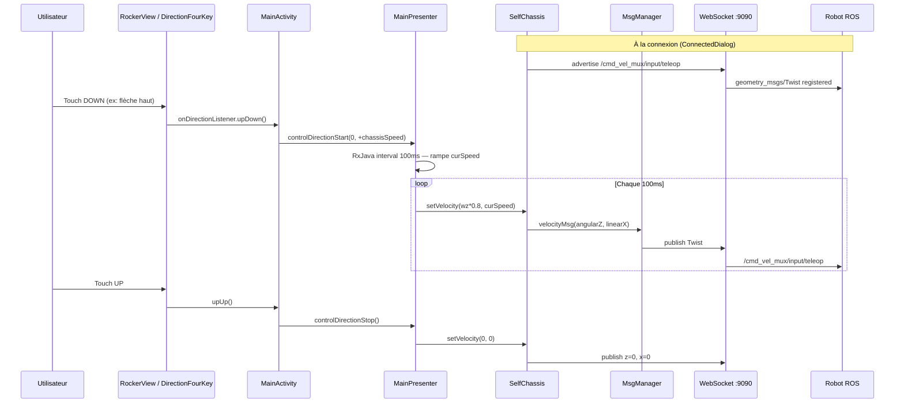

# Flux joystick — Deployment Tool (SentryMove)

> De l’événement tactile à la commande moteur, étape par étape.

---

## 1. Schéma séquentiel



---

## 2. Entrées UI — deux widgets

### A. `DirectionFourKey` (4 boutons)

| Fichier | `utils/view/DirectionFourKey.java` |
|---------|-------------------------------------|
| Listener | `MainActivity` implémente callbacks direction |

| Événement | Appel `MainPresenter` | Paramètres |
|-----------|----------------------|------------|
| `upDown` | `controlDirectionStart(0, +chassisSpeed)` | pas de rotation |
| `downDown` | `controlDirectionStart(0, -chassisSpeed)` | marche arrière |
| `leftDown` | `controlDirectionStart(0.8, 0)` | rotation gauche |
| `rightDown` | `controlDirectionStart(-0.8, 0)` | rotation droite |
| `*Up` | `controlDirectionStop()` | arrêt |

`chassisSpeed` = `App.getChassisSpeed()` → **0.3 / 0.5 / 0.8** selon `speedLevel`.

### B. `RockerView` (joystick analogique)

| Fichier | `utils/view/RockerView.java` |
|---------|------------------------------|
| Callback | `onAngleChangeListener.angle(angleDeg, ratio)` |

**Traitement dans `MainActivity` :**

1. Snap aux cardinaux (0°, 90°, 180°, 270°, 360°)
2. Trigonométrie : `fCos`, `fSin` depuis angle et ratio
3. `controlDirectionStart(fCos, chassisSpeed * fSin)`

Valeurs **continues** (pas seulement 4 directions).

---

## 3. `MainPresenter.controlDirectionStart(wzSpeed, targetVx)`

| Étape | Détail |
|-------|--------|
| 1 | Dispose timer précédent si actif |
| 2 | `Observable.interval(100, MILLISECONDS)` — **10 Hz** |
| 3 | Si `App.isScram` → `curSpeed = 0` (E-stop matériel) |
| 4 | Rampe : `curSpeed` ±0.025 vers `targetVx` chaque tick |
| 5 | Chaque tick : `SelfChassis.setVelocity(wzSpeed * 0.8, curSpeed)` |

### Mapping paramètres → Twist

`MsgManager.velocityMsg(f, f2)` :

- **1er param `f`** → `msg.angular.z`
- **2e param `f2`** → `msg.linear.x`

Donc `setVelocity(wz, vx)` publie :

```json
{
  "angular": { "z": <wz> },
  "linear":  { "x": <vx> }
}
```

avec `wz` déjà multiplié par **0.8** dans l’appel.

---

## 4. `MainPresenter.controlDirectionStop()`

1. Dispose le timer RxJava
2. `SelfChassis.setVelocity(0, 0)`
3. Publish immédiat `{linear.x:0, angular.z:0}`

**Pas de `unadvertise`** en usage normal.

---

## 5. Conditions d’exécution (garde-fous UI)

| Condition | Effet | Où |
|-----------|-------|-----|
| WebSocket déconnecté | `sendMessage` échoue | `SelfChassis` |
| `initVelocity()` non fait | Pas d’`advertise` → publish peut échouer | Post-connexion |
| `App.isScram == true` | Rampe linéaire forcée à 0 | `controlDirectionStart` |
| `bottomLock == true` | Joystick grisé, touch consumé | `ShowSelfChassisBean` |
| `softStop` UI | Toggle `/soft_stop` Bool | `MainPresenter.softStop()` |

### Ce qui n’est PAS requis (différence majeure vs CYBEL)

| Prérequis | Deployment Tool | CYBEL |
|-----------|-----------------|-------|
| `/change_location_mode` mode 0 | **Non** avant joystick | **Oui** si `control_state==30` |
| Localisation ≥ 60 % | **Non** pour téléop | Non pour téléop, oui pour nav auto |
| `nav_status` 601 | **Non** pour téléop | Bloque nav auto seulement |

---

## 6. Analyse par direction — payloads finaux

Vitesse niveau 1 (0.5 m/s), 4 touches :

### Avancer

```json
{
  "op": "publish",
  "topic": "/cmd_vel_mux/input/teleop",
  "msg": {
    "angular": { "x": 0, "y": 0, "z": 0 },
    "linear":  { "x": 0.5, "y": 0, "z": 0 }
  }
}
```

### Reculer

`linear.x: -0.5`, `angular.z: 0`

### Tourner gauche

`angular.z: 0.64`, `linear.x: 0`

### Tourner droite

`angular.z: -0.64`, `linear.x: 0`

### Arrêt

`angular.z: 0`, `linear.x: 0`

---

## 7. Flux parallèle : navigation carte (hors joystick)

`MapRlView` clic → coordonnées carte → `SelfChassis.sendGoalMsg(x,y,θ)` ou POI → publish `/navi_goal` ou service `/poi`.

**Prérequis :** localisation OK, pas d’E-stop — mais **pas de mode manuel** explicite.

---

## 8. Fichiers à lire dans l’APK décompilé

| Fichier | Méthodes clés |
|---------|---------------|
| `MainActivity.java` | Listeners `RockerView`, `DirectionFourKey` |
| `MainPresenter.java` | `controlDirectionStart`, `controlDirectionStop`, `contend`, `softStop` |
| `SelfChassis.java` | `setVelocity`, `initVelocity`, `connectSelfChassis` |
| `MsgManager.java` | `velocityMsg`, `initVelocityMsg` |
| `TopicContent.java` | `CMD_VEL_MUX_NPUT_TELEOP` |
| `RockerView.java` | `onTouchEvent`, callback angle |
| `DirectionFourKey.java` | Listeners 4 directions |

---

## 9. Reproduire dans CYBEL (checklist)

1. ✅ Topic `/cmd_vel_mux/input/teleop` + `advertise` Twist — `RealRobot._publish_velocity`
2. ⚠️ Activer téléop **sans** exiger mode manuel si `control_state==30` (option constructeur)
3. ⚠️ Rampe ±0.025 / 100 ms et `angular × 0.8`
4. ⚠️ Vitesses 0.3/0.5/0.8 via `/velocity_control` (optionnel)
5. ✅ Publish `{x:0, z:0}` à l’arrêt
