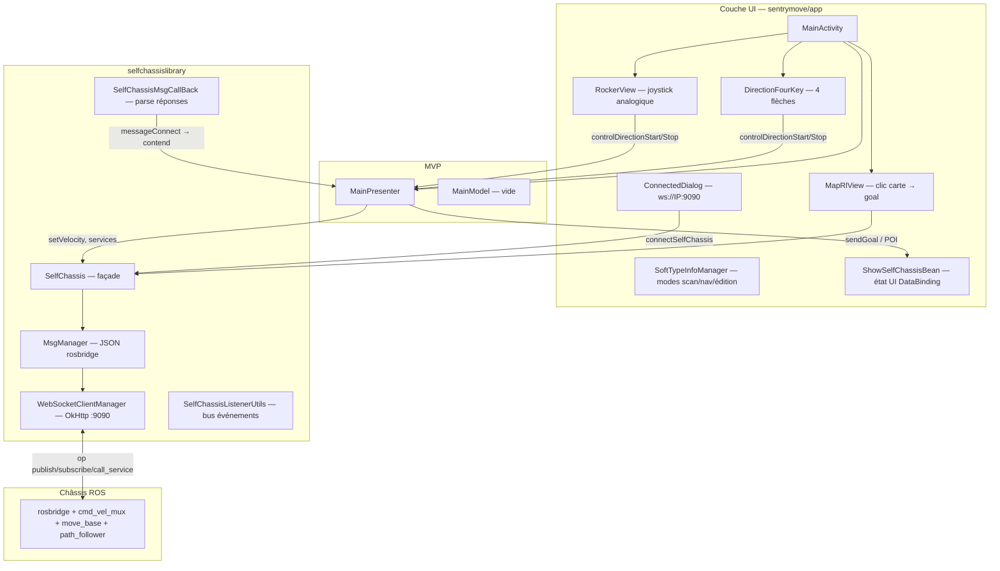

# Architecture mouvement — SentryMove (Deployment Tool)

> Audit reconstruit depuis `com.ciot.sentrymove` / `mc.csst.com.selfchassis`  
> Point d’entrée : `MainActivity` → `MainPresenter` → `SelfChassis` (lib `selfchassislibrary`)

## Vue d’ensemble

Le déplacement du robot CIOT TY1251D dans Deployment Tool repose sur **deux canaux distincts**, tous deux via **rosbridge WebSocket** (`ws://<IP>:9090`) — **pas de MQTT pour le mouvement**.

| Mode | Mécanisme | Prérequis typiques |
|------|-----------|-------------------|
| **Téléopération (joystick)** | Publish `geometry_msgs/Twist` sur `/cmd_vel_mux/input/teleop` | WebSocket connecté, `advertise` fait, pas d’E-stop |
| **Navigation autonome** | Publish `/navi_goal` ou services `/poi`, `/tag_manager/navi` | Carte chargée, localisation OK, `nav_status` 601/603 |

MQTT ne transporte **aucune** commande de vitesse : il sert à configurer le broker châssis (`/config_mqtt_server`) et à recevoir la liste multi-robots (`/robot_list`).

---

## Graphe des composants (MainActivity)



---

## Classes chargées depuis `MainActivity`

### Activités et dialogs (pas de Fragment de navigation dans MainActivity)

| Composant | Rôle mouvement |
|-----------|----------------|
| `ConnectedDialog` | Saisie IP, connexion `ws://<IP>:9090` |
| `SetActivity` | Paramètres (vitesse via `/velocity_control`, URL rosbridge) |
| `ConfirmDialog`, `LoadingDialog`, … | UX — pas de commande robot directe |

### Widgets de pilotage

| Widget | Fichier | Rôle |
|--------|---------|------|
| `RockerView` | `utils/view/RockerView.java` | Joystick analogique → angle + ratio |
| `DirectionFourKey` | `utils/view/DirectionFourKey.java` | 4 boutons cardinaux |
| `MapRlView` | `utils/view/map/MapRlView.java` | Navigation par clic sur carte |

### Managers et état

| Classe | Rôle |
|--------|------|
| `MainPresenter` | Timer téléop 100 ms, rampe vitesse, `contend()` post-connexion |
| `SelfChassis` | Singleton : WebSocket, `setVelocity`, `sendGoalMsg`, services ROS |
| `MsgManager` | Construction de tous les payloads JSON rosbridge |
| `WebSocketClientManager` | Transport WebSocket port **9090** |
| `SelfChassisMsgCallBack` | Callback connexion → déclenche `contend(true)` |
| `ShowSelfChassisBean` | `bottomLock`, `softStop`, pose, batterie |
| `SoftTypeInfoManager` | Modes UI (scan 20, nav 30, édition…) |
| `App` | `isScram`, `speedLevel` → 0.3 / 0.5 / 0.8 m/s |
| `WifiSwitchBroadcastReceiver` | Déconnexion si WiFi change |

### Pas de ViewModel Android

Architecture **MVP** classique : pas de `ViewModel` / LiveData pour le mouvement (sauf `LiveDatabus` pour certains événements UI).

### Services Android

Aucun `Service` Android pour le mouvement — tout est **in-process** via WebSocket.

---

## Flux global

```
Utilisateur (joystick / carte / POI)
        ↓
MainActivity (input UI, verrous bottomLock / isScram)
        ↓
MainPresenter (logique timer, rampe, modes)
        ↓
SelfChassis + MsgManager (sérialisation JSON)
        ↓
WebSocketClientManager → ws://<robot_ip>:9090
        ↓
rosbridge sur le châssis
        ↓
Topics ROS (/cmd_vel_mux/input/teleop, /navi_goal, services /poi…)
        ↓
Base mobile / navigation stack
```

---

## Séquence à la connexion (`contend(true)`)

Après `ConnectedDialog` → `SelfChassis.connectSelfChassis(url)` :

1. `initVelocity()` → `advertise` `/cmd_vel_mux/input/teleop` type `geometry_msgs/Twist`
2. `subscribe` : `/robot_pose`, `/robot_status`, `/navi_status`, `/localization_confidence`, …
3. `serviceGetVelocity()` → `/velocity_control` cmd **99** (lit profil vitesse robot)
4. `configStationServer(0, …)` → `/config_mqtt_server` cmd **0** (init station — **sans impact téléop**)
5. Joystick **immédiatement utilisable** (pas d’appel `/change_location_mode` mode 0 avant téléop)

---

## Paramètres réseau

| Paramètre | Valeur | Source |
|-----------|--------|--------|
| IP hotspot | `10.42.0.1` | `DeploymentToolConstant.CHASSIS_IP` |
| IP LAN | `192.168.20.22` | `DeploymentToolConstant.CHASSIS_DIRECT_IP` |
| Port rosbridge | `9090` | `DeploymentToolConstant.CHASSIS_PORT` |
| URL SP | `ws://192.168.20.22:9090` | `NavigationConfig.Self_NAV_URL` |

---

## Fichiers sources de vérité (APK décompilé)

| Fichier | Contenu |
|---------|---------|
| `selfchassislibrary/content/TopicContent.java` | Noms de topics ROS |
| `selfchassislibrary/content/ServiceContent.java` | Noms de services ROS |
| `selfchassislibrary/content/OpContent.java` | Ops rosbridge |
| `selfchassislibrary/content/TypeContent.java` | Types ROS (`geometry_msgs/Twist`, …) |
| `selfchassislibrary/chassis/SelfChassis.java` | Façade mouvement |
| `selfchassislibrary/chassis/MsgManager.java` | Payloads JSON |
| `selfchassis/ui/activity/main/MainPresenter.java` | Téléop timer + rampe |
| `utils/constant/DeploymentToolConstant.java` | IP / port |

Voir aussi : `docs/cybel-conception/AUDIT_APK_CONSTRUCTEUR.md` (audit APK global).
