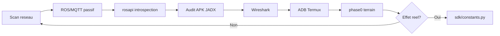

# Rétro-conception d'un robot de service Android fermé : intégration rosbridge et couche conversationnelle ouverte sans support constructeur

**Auteurs :** [Nom], [Co-auteur] — HESTIM Engineering & Business School  
**Projet :** CYBEL — Cas d'étude CIOT TY1251D-03195  
**Version :** juin 2026 · branche `feature/face-presence`

---

## Résumé

Les robots de service mobiles sont souvent livrés avec un écosystème logiciel propriétaire, sans documentation de protocole ni API publique. Cet article présente la **rétro-conception non destructive** d'un robot de réception **CIOT TY1251D-03195**, architecture dual-processeur associant un châssis **ROS** et une tête **Android 7.1**, et la construction de la plateforme ouverte **CYBEL** en l'absence de tout support du fournisseur.

Notre démarche combine cartographie réseau, introspection **rosbridge**/**rosapi**, analyse statique d'APK constructeur (JADX), observation MQTT passive et validation empirique terrain (règle **H4** : une commande acceptée par le transport n'implique pas son exécution moteur). Sur cette base, nous proposons une architecture en trois couches — SDK Python (`MockRobot`/`RealRobot`), API **FastAPI**/**Starlette** edge, interfaces web et kiosque Android — capable de remplacer l'application d'accueil propriétaire.

Nous décrivons la reconstruction des flux de **téléopération** (`/cmd_vel_mux/input/teleop`), de **navigation autonome** (coordonnées `/navi_goal` et POI `/tag_manager/navi`), et l'intégration d'une **couche conversationnelle** edge : moteur de connaissances local, synthèse vocale via pont Android **CybelTTSBridge**, et orchestration visite guidée — sans recours au cloud constructeur. Une stratégie **hybride** réutilisant les POI créés dans l'outil Deployment Tool (Sentrymove) améliore la fiabilité navigation par rapport à la seule navigation par coordonnées.

Les résultats montrent une latence API locale inférieure à 100 ms, une fiabilité rosbridge d'environ 90 % (dépendante du Wi-Fi), et un kiosque visiteur autonome déployé sur **Termux**. Nous discutons les limites (SSH châssis fermé, variabilité DHCP, absence de canal TTS ROS natif) et les perspectives d'intégration **LLM** sur l'architecture ouverte.

**Mots-clés :** robotique de service, rétro-ingénierie, ROS, rosbridge, Android embarqué, interaction homme-robot, navigation autonome, edge computing, synthèse vocale, boîte noire constructeur.

---

## Abstract

Mobile service robots are typically shipped with closed software stacks and no published communication protocols. This paper presents the **non-destructive reverse engineering** of a **CIOT TY1251D-03195** reception robot — a dual-processor platform combining a **ROS** navigation chassis and an **Android 7.1** head — and the design of the open **CYBEL** platform without vendor support.

Our methodology combines network mapping, **rosbridge**/**rosapi** introspection, static APK analysis (JADX), passive MQTT observation, and field validation (rule **H4**: transport-level success does not guarantee motor execution). We introduce a three-layer architecture — Python SDK, edge **FastAPI**/**Starlette** API, web and Android kiosk UIs — replacing the proprietary welcome application.

We document teleoperation (`/cmd_vel_mux/input/teleop`), autonomous navigation (`/navi_goal` vs named POI `/tag_manager/navi`), and an edge **conversational layer**: local knowledge engine, **CybelTTSBridge** Android TTS, and guided tour orchestration without vendor cloud. A **hybrid strategy** reusing POIs from the manufacturer Deployment Tool (Sentrymove) improves navigation reliability over coordinate-only goals.

Results include sub-100 ms local API latency, ~90% rosbridge session reliability (Wi-Fi dependent), and an autonomous visitor kiosk on **Termux**. We discuss limitations and LLM integration prospects on the open stack.

**Keywords:** service robotics, reverse engineering, ROS, rosbridge, embedded Android, human-robot interaction, autonomous navigation, edge computing, text-to-speech, closed vendor ecosystem.

---

## 1. Introduction

### 1.1 Contexte

Les robots de service autonomes — accueil, guidage, patrouille — s'appuient sur des briques matures (SLAM, planification `move_base`, interfaces tactiles et vocales). Pourtant, sur le marché des robots de réception **Android + ROS**, le logiciel applicatif reste en général une **boîte noire** : pas de SDK public, pas de schéma de messages documenté, dépendance à un compte cloud constructeur.

Pour un laboratoire ou un établissement de formation, cette fermeture empêche toute personnalisation : parcours de visite, base de connaissances métier, branding, intégration d'un **assistant conversationnel** (chatbot) adapté au contexte local.

### 1.2 Problématique

> Comment reconstruire une plateforme de commande et d'interaction tierce, fonctionnellement équivalente ou supérieure à l'application propriétaire d'un robot Android–ROS, **sans documentation officielle** et **sans support du fournisseur** ?

Cette question soulève des défis techniques distincts :

1. **Découverte protocolaire** — identifier les points d'accès réseau et le format des messages entre la tête Android et le châssis ROS ;
2. **Validation causale** — distinguer une commande transportée d'une commande exécutée ;
3. **Interaction multimodale** — reconstruire parole, navigation et dialogue lorsque le canal TTS n'est pas exposé via ROS ;
4. **Déploiement edge** — fonctionner sans Internet garanti (Wi-Fi robot fermé).

### 1.3 Contributions

Cet article, fondé sur le projet **CYBEL** (HESTIM, 2026), apporte :

| # | Contribution |
|---|--------------|
| C1 | Méthodologie de rétro-ingénierie **non destructive** en sept phases, reproductible sur robots fermés similaires |
| C2 | Reconstruction documentée du protocole **rosbridge v2** pour téléop, navigation POI/coordonnées et télémétrie |
| C3 | Architecture **edge-first** : SDK mock/réel interchangeable, dual backend PC/Termux, kiosque WebView autonome |
| C4 | Résolution empirique du **TTS** via pont Android natif lorsque ROS et HTTP échouent |
| C5 | Couche **conversationnelle ouverte** (FAQ locale + actions robot) extensible vers LLM, remplaçant le chatbot cloud constructeur |
| C6 | Stratégie **hybride Sentrymove** : réutilisation des POI constructeur sans fork de l'APK |

### 1.4 Organisation

La section 2 décrit la plateforme matérielle et réseau. La section 3 présente la méthodologie de rétro-ingénierie. La section 4 détaille la reconstruction rosbridge. La section 5 expose l'architecture CYBEL. La section 6 traite de l'intégration conversationnelle. La section 7 analyse la navigation hybride. La section 8 présente l'évaluation. Les sections 9–10 discutent limites et conclusion.

---

## 2. Plateforme robot et topologie réseau

### 2.1 Architecture matérielle dual-processeur

Le robot **CIOT TY1251D-03195** combine deux ordinateurs embarqués :

| Sous-système | OS | Rôle |
|--------------|-----|------|
| **Châssis** | Linux + ROS (Noetic/Melodic) | SLAM, planification, moteurs, LiDAR, rosbridge, MQTT |
| **Tête (upper body)** | Android 7.1, SoC RK3399 | Écran 15,6" tactile, caméras, haut-parleurs, apps constructeur |

**Spécifications clés :** 2 Go RAM, 16 Go ROM, autonomie ~8 h, vitesse max 0,8 m/s, précision ±5 cm, LiDAR + RGBD + ultrasons.

CYBEL n'accède **jamais** au shell du châssis (SSH verrouillé, brute-force bloquée). Les seuls canaux exploitables sont **rosbridge WebSocket** (port 9090) et **MQTT** (port 1883, observation uniquement).

### 2.2 Topologie réseau — triple segment

La cartographie réseau a révélé une complexité non documentée par le constructeur :

```
┌─────────────────────────────────────────────────────────────┐
│  Wi-Fi robot (SSID TY1251D-03195)                           │
│    Châssis ── 10.42.0.1 :9090 rosbridge, :1883 MQTT         │
├─────────────────────────────────────────────────────────────┤
│  Lien interne eth0 (tête ↔ châssis)                        │
│    Tête 192.168.20.1  ──►  Châssis 192.168.20.22:9090       │
├─────────────────────────────────────────────────────────────┤
│  Wi-Fi laboratoire (DHCP)                                   │
│    Tête wlan0 : 172.16.0.x (variable)                       │
│    PC développeur : même segment · ADB USB/Wi-Fi              │
└─────────────────────────────────────────────────────────────┘
```

**Implication critique :** l'adresse `172.16.0.x` désigne la **tête Android**, pas le châssis. Depuis **Termux** sur la tablette, rosbridge est joignable via **`192.168.20.22`**, indépendamment du DHCP labo. Confondre ces adresses provoque des échecs silencieux (TTS HTTP, sync POI).

### 2.3 Logiciel constructeur identifié

| Package | Version | Rôle |
|---------|---------|------|
| `com.ciot.welcomepatrol` | V3.0.1 | Accueil visiteur propriétaire (boîte noire) |
| `com.ciot.sentrymove` | V2.1.5 | Deployment Tool — SLAM, POI, diagnostics |
| `mc.csst.com.selfchassislibrary` | — | Bibliothèque partagée = **spécification de facto** du protocole ROS |

L'audit JADX de `sentrymove` et `welcomepatrol` a permis d'extraire les topics, services et séquences d'appel confirmés par l'introspection rosapi.

---

## 3. Méthodologie de rétro-ingénierie

### 3.1 Principes directeurs

1. **Observer avant d'agir** — écoute passive MQTT et rosbridge avant toute publication ;
2. **Vérifier l'effet réel** — règle **H4** : après publish téléop, `/robot_pose` doit changer ;
3. **Triangulation** — croiser réseau, ROS, APK décompilé, journaux terrain ;
4. **Non-destructif** — pas de flash, pas de root châssis, pas de modification firmware ;
5. **Mock-first** — chaque fonctionnalité validée dans `MockRobot` avant `RealRobot`.

### 3.2 Pipeline en sept phases

| Phase | Action | Outils | Livrable |
|-------|--------|--------|----------|
| 1 | Cartographie réseau | `nmap`, `api_discover.py`, ping | Schéma dual-IP |
| 2 | Observation ROS | `introspect.py`, `ros_explore.py`, rosapi | Inventaire topics/services |
| 3 | Observation MQTT | `mqtt_listen_passive.py` | Confirmation : pas de contrôle mouvement |
| 4 | Analyse APK | JADX, `AUDIT_APK_CONSTRUCTEUR.md` | Parité Sentrymove ↔ SDK |
| 5 | Capture réseau | Wireshark (TCP 9090, 1883) | Validation framing WebSocket |
| 6 | Sous-système Android | ADB, `dumpsys window`, Termux | TTS, déploiement edge |
| 7 | Validation terrain | `phase0_robot_check.py`, traces visite | Acceptation/rejet hypothèses |



### 3.3 Cycle hypothèse–validation

Chaque commande candidate suit :

```
Hypothèse (topic/service/message)
    → Test isolé (script Python)
    → Observation télémétrie (nav_status, robot_pose)
    → Intégration SDK si effet confirmé
    → Rejet documenté sinon
```

Ce cycle a permis d'écarter notamment : le topic téléop legacy `/mobile_base/commands/velocity`, les topics TTS ROS candidats (`/play_tts`, `/robot_tts`), et le contrôle mouvement via MQTT.

---

## 4. Reconstruction du protocole rosbridge

### 4.1 Transport

- **Protocole :** rosbridge **v2** sur WebSocket TCP **9090**
- **Format :** JSON (`subscribe`, `publish`, `advertise`, `call_service`, `service_response`)
- **Client CYBEL :** `sdk/rosbridge.py` — 3 tentatives de connexion, timeout 20 s, ping 20 s, reconnexion automatique

### 4.2 Téléopération

**Topic constructeur (confirmé JADX + terrain) :**

```
/cmd_vel_mux/input/teleop  (geometry_msgs/Twist)
```

**Séquence :** `advertise` → `publish` à 10 Hz (Sentrymove : rampe linéaire ±0,025/100 ms, `angular.z = wz × 0,8`).

**Écart identifié (E1) :** CYBEL imposait initialement le mode manuel (`control_state == 30`) avant téléop, contrairement à Sentrymove. **Correction :** activation automatique du mode manuel au premier `move()`.

### 4.3 Navigation autonome

Deux modes coexistent sur le châssis :

| Mode | Mécanisme | Prérequis |
|------|-----------|-----------|
| **Coordonnées** | publish `/navi_goal` (`frame_id: "map"`) | Localisation ≥ 60 %, `nav_status` 601 |
| **POI nommé** | `call_service /tag_manager/navi` → `/poi` | POI existant dans `marker_manager` |

**Codes `nav_status` (gating CYBEL) :**

| Code | Signification | Blocage navigation |
|------|---------------|-------------------|
| 600 | Non localisé | Oui |
| 601 | Prêt | Non |
| 602 | En navigation | Oui (nouvel objectif) |
| 603 | Arrivée | Non |
| 604 | Erreur | Oui |

**Chaîne d'annulation :** `/move_base/cancel` + `/path_follower/cancel` + `/poi {command:"stop"}` + vélocité nulle sur `cmd_vel_mux`.

### 4.4 Télémétrie

| Topic | Fréquence brute | Throttle CYBEL |
|-------|-----------------|----------------|
| `/robot_pose` | ~10 Hz | 200 ms (~5 Hz) |
| `/navi_status` | ~2 Hz | 500 ms |
| `/scan_filter` (LiDAR) | ~25 Hz | 100 ms (~10 Hz) |
| `/detected_people_array` | variable | pour réveil kiosque |

### 4.5 MQTT — rôle observationnel

Broker `10.42.0.1:1883`, topic actif `test_mul` (odométrie châssis). **Aucun topic de commande mouvement** identifié — confirmé par écoute passive `#`.

---

## 5. Architecture logicielle CYBEL

### 5.1 Vue en trois couches

| Couche | Composants | Rôle |
|--------|------------|------|
| **Présentation** | `frontend/` (opérateur), `frontend-kiosk/` (visiteur), `CybelVisitorKiosk` (WebView), `CybelTTSBridge` | UI, parole |
| **Application** | FastAPI `:8000` (PC), Starlette `cybel_lite.py` `:8000/8001` (Termux) | REST + WebSocket |
| **Domaine** | SDK : `RealRobot`, `MockRobot`, `RosbridgeClient`, `TourEngine`, `poi_sync` | Intégration robot |

**Principe edge :** aucune dépendance cloud pour navigation, TTS, visite guidée, sync POI.

### 5.2 Abstraction robot — Protocol mock/réel

```python
class RobotBackend(Protocol):
    async def move(self, linear_x: float, angular_z: float) -> None: ...
    async def navigate_to_point(self, point_name: str) -> bool: ...
    async def speak(self, text: str, interrupt: bool = True) -> dict: ...
```

`RobotService` sélectionne `MockRobot` ou `RealRobot` via `ROBOT_MOCK`. **Intérêt :** développement et tests (83 tests unitaires, juin 2026) sans robot physique ; parité API garantie.

### 5.3 Dual backend — PC vs Termux

| Instance | Hôte | Port | Stack | Usage |
|----------|------|------|-------|-------|
| Backend PC | Poste dev | 8000 | FastAPI + pydantic | Supervision, dev |
| Backend edge | Termux tablette | 8001 (test POI) | Starlette lite | Kiosque autonome sans PC |

`cybel_lite.py` charge les modules SDK à la demande (sans pydantic lourd), se connecte directement à rosbridge via `192.168.20.22`, et diffuse TTS par `am broadcast` local.

### 5.4 Déploiement kiosque autonome

```
Tablette Android
  ├── Termux (Python, uvicorn/starlette)
  ├── cybel_lite.py :8001
  ├── WebView ← CybelVisitorKioskTest.apk
  ├── rosbridge → 192.168.20.22:9090
  └── CybelTTSBridge ← broadcast SPEAK
```

Le visiteur interagit via écran tactile ; le PC n'est requis qu'au déploiement (`deploy_termux.py` ou ADB).

---

## 6. Intégration d'une couche conversationnelle sans support constructeur

### 6.1 Contexte — remplacer le chatbot propriétaire

L'application `welcomepatrol` intègre un dialogue d'accueil couplé à un moteur TTS **Iflytek** via IPC opaque (`MessengerUtils`). Le cloud constructeur (`WuhanApiService`, `api/Knowledge/query`) n'est ni documenté ni requis pour CYBEL.

**Objectif CYBEL :** fournir une **couche conversationnelle ouverte**, personnalisable, exécutable en edge, connectée aux capacités robot (parole + navigation).

### 6.2 Architecture conversationnelle

```
Entrée utilisateur (texte / voix navigateur / kiosque)
        │
        ▼
┌───────────────────┐
│ KnowledgeEngine   │  ← JSON local (lab + FAQ HESTIM)
│ (score mots-clés) │
└─────────┬─────────┘
          │ match ≥ seuil
          ▼
┌───────────────────┐     ┌─────────────────┐
│ ReceptionService  │────►│ RobotSpeech     │──► CybelTTSBridge
│ (action + nav)    │     │ (chaine fallback)│
└─────────┬─────────┘     └─────────────────┘
          │
          ▼
   RealRobot.navigate_to_point(POI)
   ou navigate_to_coordinate(x, y, θ)
```

**API exposées :** `POST /api/knowledge/ask`, `GET /api/knowledge/faq`, `POST /api/reception/voice-command`.

### 6.3 Moteur de connaissances local (phase 1)

`KnowledgeEngine` (`sdk/knowledge_engine.py`) :

- Sources : `knowledgeV2-labV2.json` (zones labo + coordonnées/POI), `hestim_knowledge_base.json` (FAQ)
- Matching : normalisation texte, score par recouvrement de mots-clés (seuil ≥ 2,0)
- Sortie : réponse textuelle + action optionnelle (navigation vers POI ou coordonnées)

**Ce n'est pas un LLM**, mais une **brique conversationnelle déterministe**, testable offline, sans latence cloud — adaptée au Wi-Fi robot fermé.

### 6.4 Synthèse vocale — rétro-ingénierie du canal parole

**Constat :** aucun canal ROS, HTTP ni MQTT ne expose le TTS sur TY1251D.

| Piste testée | Résultat |
|--------------|----------|
| Topics ROS (`/play_tts`, `/robot_tts`, …) | Aucun abonné |
| Services ROS (`/speak`, `/tts`, …) | Absents (rosapi) |
| HTTP tête Android (ports 80, 8080, 8888) | Fermés |
| MQTT | Pas de payload TTS |
| SSH châssis | Verrouillé |

**Solution retenue — CybelTTSBridge :**

```bash
am broadcast -n com.cybel.ttsbridge/.SpeakReceiver \
  -a com.cybel.ttsbridge.SPEAK --es text "Bonjour, bienvenue au laboratoire."
```

APK minimal (~50 Ko) : `BroadcastReceiver` → `TextToSpeech` (Google TTS, locale FR).

**Chaîne de fallback `RobotSpeech` :** ROS topics → ROS services → HTTP → ADB broadcast (PC) → broadcast local Termux.

### 6.5 Visite guidée — orchestration parole / navigation

`TourEngine` + `tour_navigation.py` enchaînent arrêts du parcours `lab_tour.json` :

1. Sync POI depuis ROS (carte active laboV2)
2. Relocalisation si nécessaire (`/global_localization`, seuil 60 %)
3. TTS présentation **puis** navigation (correction **E9** : éviter « parle sans bouger »)
4. Trace JSON (`tour_trace`) pour corréler `nav_status`, timestamps parole/mouvement

### 6.6 Extensibilité vers un chatbot LLM

L'architecture ouvre une **interface de remplacement** du `KnowledgeEngine` :

| Composant actuel | Extension LLM |
|------------------|---------------|
| `KnowledgeEngine.match()` | Appel local Ollama / API avec RAG sur JSON labo |
| `POST /api/knowledge/ask` | Même contrat REST — swap backend |
| `ReceptionService` | Function calling → `navigate_to_point`, `speak` |
| Edge Termux | Modèle quantifié ou proxy réseau labo |

**Avantage de la rétro-conception préalable :** le LLM n'a pas à découvrir le protocole ROS — il appelle l'API CYBEL déjà validée terrain.

---

## 7. Stratégie de navigation hybride (étude de cas)

### 7.1 Échec de la navigation par coordonnées seules (S1)

Navigation via `/navi_goal` et coordonnées extraites de `knowledgeV2-lab.json`. **Symptômes terrain :**

- Robot **parle sans bouger** (`nav_status` reste 601)
- Destination incorrecte (décalage carte / SLAM)
- Lenteur au départ (relocalisation tardive)

**Trace analysée (`tour_20260623_142601`) :** objectif publié, jamais transition 601→602 — le planificateur n'a pas démarré.

### 7.2 Option hybride Sentrymove (S3)

**Observation clé :** Sentrymove (Deployment Tool) navigue de façon fiable via POI nommés — même rosbridge, même topics.

**Stratégie retenue :**

1. Créer/maintenir POI dans Deployment Tool (carte **laboV2**, noms `MAJUSCULES-TIRETS`)
2. Sync ROS → `data/points.json` (`sdk/poi_sync.py`, `sync_poi_from_robot.py`)
3. Parcours visite : `target_point` dans `lab_tour.json`
4. Kiosque : `GET /api/reception/destinations` déclenche sync auto

**Test A/B documenté :** port **8000** (coords) vs **8001** (POI) — `CybelVisitorKiosk` vs `CybelVisitorKioskTest`.

### 7.3 Analyse des écarts Sentrymove ↔ CYBEL

Synthèse `CYBEL_GAP_ANALYSIS.md` :

| Écart | Sévérité | Résolution |
|-------|----------|------------|
| E1 Mode manuel téléop | Bloquant | Auto-activation |
| E2 Topic legacy | Bloquant | Migration `cmd_vel_mux` |
| E5 Seuil localisation 60 % | Bloquant | Relocalisation explicite avant visite |
| E7 Chaîne POI lite | Majeur | `/tag_manager/navi` + fallback `/poi` |
| E9 Ordre TTS/nav | UX | Relocaliser avant TTS |

---

## 8. Évaluation

### 8.1 Métriques observées (juin 2026)

| Indicateur | Valeur | Conditions |
|------------|--------|------------|
| Latence API REST locale | < 100 ms | localhost, hors rosbridge |
| Connexion rosbridge | 2–60 s | 3× retry 20 s |
| Fiabilité session rosbridge | ~90 % | Variable Wi-Fi |
| Latence ping Wi-Fi robot | 89–1654 ms | Très variable |
| Seuil localisation | 60 % `matching_degree` | Bloque démarrage visite |
| Attente relocalisation | jusqu'à 45 s | `/global_localization` |
| Tests unitaires | 83/83 passés | Mock + POI + tour |
| Fiabilité nav coordonnées | Faible | Motive pivot POI |
| Kiosque Termux autonome | Validé | Tablette sans PC |

### 8.2 Protocole de validation (`phase0_robot_check.py`)

```bash
python scripts/phase0_robot_check.py --host 192.168.20.22 \
  --teleop --nav-poi "CNC ROUTEUR" --tts
```

Critères : handshake WS, mises à jour `/robot_pose`, transition `nav_status` 602→603, audio TTS audible.

### 8.3 Limites

- **Châssis fermé** — pas de SSH, pas de modification nodes ROS
- **Wi-Fi non garanti** — pas d'Internet sur hotspot robot → edge obligatoire
- **WebView Android 7.1** — Chrome 49, contraintes JS/CSS kiosque
- **DHCP tablette** — IP labo variable ; rosbridge interne stable (`192.168.20.22`)
- **Pas de canal TTS ROS natif** — dépendance pont Android
- **Reconnaissance vocale** — Web Speech API navigateur PC uniquement, pas ASR embarqué robot

---

## 9. Discussion

### 9.1 Leçons pour la rétro-ingénierie de robots fermés

1. **Le transport ment** — rosbridge accepte des publishes sans effet moteur ; la télémétrie est le ground truth.
2. **L'APK constructeur est une spec** — JADX de Sentrymove a accéléré la découverte de `/cmd_vel_mux/input/teleop` vs documentation ROS générique obsolète.
3. **Dual-IP est la norme** — Android head + ROS chassis = segments réseau distincts ; documenter impérativement.
4. **Réutiliser plutôt que réimplémenter** — la stratégie hybride POI Sentrymove évite de reproduire le `marker_manager` constructeur.
5. **Edge d'abord** — cloud constructeur et LLM distant incompatibles avec Wi-Fi robot fermé ; architecture ouverte locale prête pour LLM embarqué ultérieur.

### 9.2 Positionnement scientifique

| Travail existant | CYBEL |
|------------------|-------|
| ROS/rosbridge (Quigley et al., 2009 ; rosbridge_suite) | Reconstruction empirique sur robot commercial fermé |
| HRI kiosques propriétaires | Stack open source remplaçante, documentée |
| SLAM/nav open source | Réutilisation châssis constructeur via API découverte |
| Chatbots cloud robotiques | Couche FAQ edge + pont TTS ; extensible LLM |

### 9.3 Considérations éthiques

- Décompilation APK **à des fins d'interopérabilité** (spec protocolaire), sans redistribution du code constructeur
- Aucune modification firmware, pas de contournement de sécurité moteur
- Robot utilisé en environnement laboratoire supervisé

---

## 10. Conclusion et perspectives

Nous avons présenté la **rétro-conception non destructive** du robot de service **CIOT TY1251D-03195** et la plateforme **CYBEL**, permettant de remplacer l'écosystème propriétaire par une stack ouverte : SDK Python, API edge, kiosque visiteur autonome, couche conversationnelle locale et synthèse vocale via pont Android.

**Apports principaux :** méthodologie reproductible en sept phases, reconstruction rosbridge validée terrain, architecture mock/réel, résolution TTS multi-canal, stratégie navigation hybride POI Sentrymove.

**Perspectives :**

- Intégration **LLM** (Ollama edge ou RAG) derrière `POST /api/knowledge/ask`
- **ASR** embarqué Android (Whisper Termux ou API native)
- Détection présence (`/detected_people_array` → réveil kiosque) — phase 1 implémentée
- Publication des scripts et diagrammes comme **artefacts reproductibles** (repo CYBEL)

---

## Bibliographie

1. Quigley, M., et al. (2009). *ROS: an open-source Robot Operating System.* ICRA Workshop on Open Source Software.
2. Crick, B., et al. (2012). *Rosbridge: ROS for Non-ROS Users.* International Symposium on Experimental Robotics.
3. Kohlbrecher, S., et al. (2011). *Hector SLAM.* Proc. SSRR.
4. ROS Wiki — *rosbridge_suite*, *move_base*, *geometry_msgs/Twist*. http://wiki.ros.org
5. Android Developers — *TextToSpeech*, *WebView*, *BroadcastReceiver*.
6. Documentation projet CYBEL — `docs/ARCHITECTURE_LOGICIELLE.md`, `docs/TTS_BRIDGE.md`, `docs/movement-audit/CYBEL_GAP_ANALYSIS.md`, `docs/SENTRYMOVE_POI_SYNC.md`.

---

## Annexe A — Commandes rosbridge de référence

**Téléop :**
```json
{"op":"advertise","topic":"/cmd_vel_mux/input/teleop","type":"geometry_msgs/Twist"}
{"op":"publish","topic":"/cmd_vel_mux/input/teleop","msg":{"linear":{"x":0.3},"angular":{"z":0.0}}}
```

**Navigation POI :**
```json
{"op":"call_service","service":"/tag_manager/navi","args":{"name":"CNC ROUTEUR"}}
```

**Objectif coordonnées :**
```json
{"op":"publish","topic":"/navi_goal","msg":{"header":{"frame_id":"map"},"pose":{"position":{"x":1.2,"y":3.4},"orientation":{"w":1.0}}}}
```

## Annexe B — Artefacts logiciels

| Artefact | Chemin |
|----------|--------|
| SDK rosbridge | `sdk/rosbridge.py`, `sdk/constants.py` |
| Robot réel / mock | `sdk/real_robot.py`, `sdk/mock_robot.py` |
| Parole | `sdk/speech.py`, `android/CybelTTSBridge/` |
| Connaissances | `sdk/knowledge_engine.py`, `data/knowledgeV2-labV2.json` |
| Backend edge | `scripts/termux/cybel_lite.py` |
| Validation | `scripts/phase0_robot_check.py` |
| Sync POI | `sdk/poi_sync.py`, `scripts/sync_poi_from_robot.py` |

---

*Document généré à partir du dépôt CYBEL (HESTIM, juin 2026). Pour citation académique, adapter auteurs et affiliation.*
